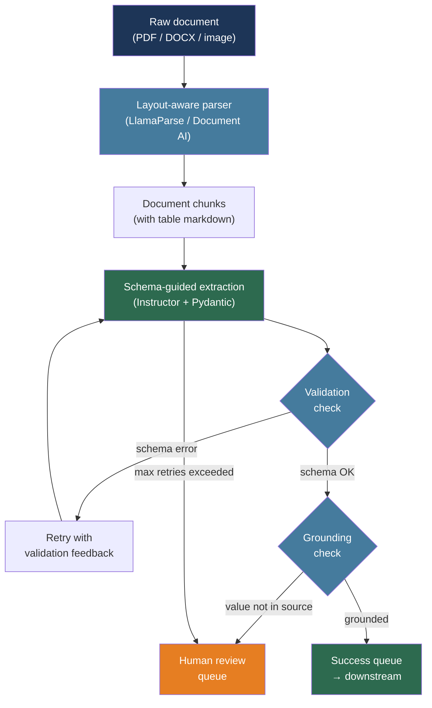

# [BEE-30030] LLM-Powered Document Processing and Information Extraction

:::info
LLM-powered information extraction turns unstructured documents — invoices, contracts, forms, research papers — into structured records; the critical engineering decisions are how to define output schemas, how to validate and correct extracted fields, and how to pipeline the work at the volume that production workloads require.
:::

## Context

Traditional document processing relied on rigid rule-based parsers, regular expressions, and template matching. These approaches break whenever a new vendor uses a slightly different invoice layout or a contract clause is reworded. LLMs change the unit of work from "write a parser per template" to "define a schema once and let the model handle layout variation."

Li et al. (arXiv:2312.17617, 2023) surveyed this shift in a comprehensive review of LLMs for generative information extraction. The key insight is that LLMs do not merely apply rules — they perform semantic reasoning over document content, inferring field values even when formatting is inconsistent, fields are implicit, or values span multiple sentences.

Two extraction failure modes dominate production deployments. First, hallucination: the model confidently returns a field value that does not appear in the document. Second, schema drift: the model returns a value in the right field but in the wrong format (a date as "January 3" instead of "2026-01-03"), causing downstream parse failures. Both require explicit mitigation at the schema definition and validation layers.

Xu et al. (arXiv:2309.10952, EMNLP 2023) introduced LMDX — Language Model-based Document Information Extraction and Localization — which demonstrated that grounding model outputs to document segments (forcing the model to cite the span it extracted from) dramatically reduces hallucination relative to free-form generation.

## Design Thinking

A production document extraction pipeline has four stages:

1. **Document parsing** — convert raw bytes (PDF, DOCX, image) into a processable text or token stream, preserving layout metadata (bounding boxes, page numbers, table structure)
2. **Chunking and context management** — split the parsed document into segments that fit the LLM's context window while preserving semantic boundaries
3. **Schema-guided extraction** — invoke the LLM with the chunk and an explicit output schema, using function calling or structured output to constrain the response format
4. **Validation and correction** — parse the model output against the schema, score confidence, retry or escalate failed extractions

The critical tradeoff is between extraction pass at the document level versus chunk level. Document-level extraction with long-context models is simpler but introduces positional bias — LLMs attend unevenly across long inputs, performing better at the start and end of context. Chunk-level extraction avoids this but requires merging results across chunks and resolving conflicts when the same field appears in multiple chunks.

## Best Practices

### Define Pydantic Schemas Before Writing Prompts

**MUST** define the extraction schema as a typed Pydantic model before writing any prompt. The schema is the contract between the document processing system and downstream consumers. Use the Instructor library to bind the schema directly to the LLM call:

```python
from pydantic import BaseModel, Field
from datetime import date
from typing import Optional
import instructor
import anthropic

class LineItem(BaseModel):
    description: str
    quantity: float
    unit_price: float
    total: float

class Invoice(BaseModel):
    invoice_number: str = Field(description="Unique invoice identifier, e.g. INV-2024-001")
    invoice_date: date = Field(description="Invoice issue date in ISO 8601 format")
    vendor_name: str
    vendor_address: Optional[str] = None
    total_amount: float = Field(description="Total amount due including tax")
    currency: str = Field(default="USD", description="ISO 4217 currency code")
    line_items: list[LineItem] = Field(default_factory=list)

# Instructor patches the Anthropic client to enforce schema compliance
client = instructor.from_anthropic(anthropic.Anthropic())

def extract_invoice(document_text: str) -> Invoice:
    return client.messages.create(
        model="claude-sonnet-4-6",
        max_tokens=1024,
        messages=[{
            "role": "user",
            "content": (
                "Extract the invoice information from the following document. "
                "Return only fields that are explicitly present in the document.\n\n"
                f"<document>\n{document_text}\n</document>"
            ),
        }],
        response_model=Invoice,
    )
```

**SHOULD** add `description` annotations to fields whose names are ambiguous or whose format must be constrained (dates, currency codes, identifiers). Models use field descriptions as extraction guidance.

**MUST NOT** use free-form JSON string parsing as the primary extraction path. `json.loads(response.content)` fails silently on malformed output; Pydantic validation raises structured exceptions that can drive retry logic.

### Build a Two-Stage Validation Loop

**SHOULD** implement a validation loop that catches the two dominant failure modes — hallucination and format drift — before results reach downstream consumers:

```python
from pydantic import ValidationError
import instructor
from instructor.exceptions import InstructorRetryException

def extract_with_retry(document_text: str, schema: type, max_retries: int = 3):
    """
    Instructor automatically retries on validation failure, feeding the
    validation error back to the model as context for correction.
    """
    client = instructor.from_anthropic(
        anthropic.Anthropic(),
        mode=instructor.Mode.ANTHROPIC_TOOLS,
    )
    try:
        return client.messages.create(
            model="claude-sonnet-4-6",
            max_tokens=1024,
            max_retries=max_retries,  # Instructor manages retry-with-feedback
            messages=[{
                "role": "user",
                "content": f"Extract structured data:\n\n{document_text}",
            }],
            response_model=schema,
        )
    except InstructorRetryException as e:
        # All retries exhausted: log for human review
        raise ExtractionError(
            f"Extraction failed after {max_retries} attempts",
            last_error=str(e),
            document_preview=document_text[:200],
        ) from e
```

**SHOULD** add a grounding check for high-stakes fields. After extraction, verify that the extracted value appears verbatim (or as a normalized form) in the source document:

```python
def grounding_check(extracted_value: str, source_text: str) -> bool:
    """
    Verify the extracted value is grounded in the source document.
    Prevents hallucinated values from reaching downstream systems.
    """
    normalized_source = source_text.lower().replace(",", "").replace("$", "")
    normalized_value = str(extracted_value).lower().replace(",", "").replace("$", "")
    return normalized_value in normalized_source

def validate_extraction(invoice: Invoice, source_text: str) -> list[str]:
    warnings = []
    if not grounding_check(invoice.invoice_number, source_text):
        warnings.append(f"invoice_number '{invoice.invoice_number}' not found in source")
    if not grounding_check(str(invoice.total_amount), source_text):
        warnings.append(f"total_amount '{invoice.total_amount}' not found in source")
    return warnings
```

### Chunk Long Documents to Avoid Positional Bias

**SHOULD** split documents longer than ~4,000 tokens into overlapping chunks and extract field values per chunk rather than feeding the entire document at once. LLMs attend unevenly across long inputs — values near the middle of long contexts are missed at higher rates:

```python
def chunk_document(text: str, chunk_size: int = 3000, overlap: int = 300) -> list[str]:
    """
    Split document text into overlapping chunks.
    Overlap preserves context across chunk boundaries (e.g., a table header
    that appears on one page and data on the next).
    """
    words = text.split()
    chunks = []
    start = 0
    while start < len(words):
        end = min(start + chunk_size, len(words))
        chunks.append(" ".join(words[start:end]))
        if end == len(words):
            break
        start += chunk_size - overlap
    return chunks

def extract_from_long_document(text: str, schema: type) -> dict:
    """
    Extract fields from each chunk, then merge by taking the first
    non-null value per field. For list fields (line items), concatenate.
    """
    chunks = chunk_document(text)
    results = []
    for chunk in chunks:
        try:
            result = extract_with_retry(chunk, schema)
            results.append(result.model_dump())
        except ExtractionError:
            continue  # Skip failed chunks; log for review

    # Merge: first non-None value wins for scalar fields
    merged = {}
    for key in schema.model_fields:
        field_info = schema.model_fields[key]
        is_list = hasattr(field_info.annotation, "__origin__") and field_info.annotation.__origin__ is list
        if is_list:
            merged[key] = [item for r in results for item in (r.get(key) or [])]
        else:
            merged[key] = next((r[key] for r in results if r.get(key) is not None), None)
    return merged
```

**SHOULD** use a layout-aware parser (LlamaParse, Google Document AI, Azure Document Intelligence) for PDFs and scanned documents before chunking. Raw PDF text extraction loses table structure and reading order; layout-aware parsers preserve these as markdown or structured JSON.

### Preserve Table Structure During Extraction

**SHOULD** convert tables to a text format that preserves cell relationships before passing to the LLM. Raw text extraction from PDFs collapses table cells into a flat stream, causing the model to misassign values:

```python
def table_to_markdown(headers: list[str], rows: list[list[str]]) -> str:
    """
    Convert a parsed table (e.g., from pdfplumber or Document AI) to
    markdown format. LLMs reliably parse pipe-delimited markdown tables.
    """
    separator = "| " + " | ".join(["---"] * len(headers)) + " |"
    header_row = "| " + " | ".join(headers) + " |"
    data_rows = ["| " + " | ".join(str(cell) for cell in row) + " |" for row in rows]
    return "\n".join([header_row, separator] + data_rows)

# After parsing a PDF with pdfplumber:
# table = page.extract_table()
# headers, *rows = table
# markdown_table = table_to_markdown(headers, rows)
# Pass markdown_table to the extraction prompt instead of raw text
```

For complex multi-page tables where headers appear only on the first page, prepend the header row to each subsequent chunk that continues the table.

### Route to Human Review on Low Confidence

**MUST** route extraction results to human review when validation fails or confidence is low, rather than silently passing bad data downstream:

```python
from enum import Enum
from dataclasses import dataclass

class ExtractionStatus(Enum):
    SUCCESS = "success"
    LOW_CONFIDENCE = "low_confidence"
    FAILED = "failed"

@dataclass
class ExtractionResult:
    status: ExtractionStatus
    data: dict | None
    warnings: list[str]
    document_id: str

def process_document(document_id: str, text: str, schema: type) -> ExtractionResult:
    try:
        extracted = extract_with_retry(text, schema)
        warnings = validate_extraction(extracted, text)

        if warnings:
            return ExtractionResult(
                status=ExtractionStatus.LOW_CONFIDENCE,
                data=extracted.model_dump(),
                warnings=warnings,
                document_id=document_id,
            )
        return ExtractionResult(
            status=ExtractionStatus.SUCCESS,
            data=extracted.model_dump(),
            warnings=[],
            document_id=document_id,
        )
    except ExtractionError as e:
        return ExtractionResult(
            status=ExtractionStatus.FAILED,
            data=None,
            warnings=[str(e)],
            document_id=document_id,
        )

def dispatch_result(result: ExtractionResult, queue_client):
    if result.status == ExtractionStatus.SUCCESS:
        queue_client.send("extraction.success", result.data)
    else:
        # Route to human review queue with context for the reviewer
        queue_client.send("extraction.review", {
            "document_id": result.document_id,
            "status": result.status.value,
            "partial_data": result.data,
            "warnings": result.warnings,
        })
```

## Visual



## Extraction Pattern Comparison

| Pattern | Hallucination risk | Layout handling | Best for |
|---|---|---|---|
| Direct LLM (free-form JSON) | High | Poor | Prototyping only |
| Schema-guided (Instructor) | Medium | Poor | Well-structured text documents |
| Schema + grounding check | Low | Poor | High-stakes scalar fields |
| Layout parser + schema | Low | Good | PDFs with tables and columns |
| Chunk + merge + grounding | Low | Good | Long multi-page documents |

## Related BEEs

- [BEE-30006](structured-output-and-constrained-decoding.md) -- Structured Output and Constrained Decoding: the decoding-level mechanisms (grammar constraints, function calling) that enforce schema compliance at the token level
- [BEE-30007](rag-pipeline-architecture.md) -- RAG Pipeline Architecture: document parsing and chunking in this article feed directly into the indexing stage of a RAG pipeline
- [BEE-30025](llm-batch-processing-patterns.md) -- LLM Batch Processing Patterns: the OpenAI and Anthropic batch APIs described there apply directly to high-volume document extraction workloads
- [BEE-30022](human-in-the-loop-ai-patterns.md) -- Human-in-the-Loop AI Patterns: the human review routing pattern here is an instance of the confidence-gated human review pattern from BEE-30022

## References

- [Li et al. Large Language Models for Generative Information Extraction: A Survey — arXiv:2312.17617, 2023](https://arxiv.org/abs/2312.17617)
- [Xu et al. LMDX: Language Model-based Document Information Extraction and Localization — arXiv:2309.10952, EMNLP 2023](https://arxiv.org/abs/2309.10952)
- [Instructor. Structured outputs for LLMs — python.useinstructor.com](https://python.useinstructor.com/)
- [LlamaIndex. LlamaParse — llamaindex.ai/llamaparse](https://www.llamaindex.ai/llamaparse)
- [Google Cloud. Document AI — cloud.google.com/document-ai](https://cloud.google.com/document-ai)
- [Azure. Document Intelligence — azure.microsoft.com](https://azure.microsoft.com/en-us/products/ai-foundry/tools/document-intelligence)
