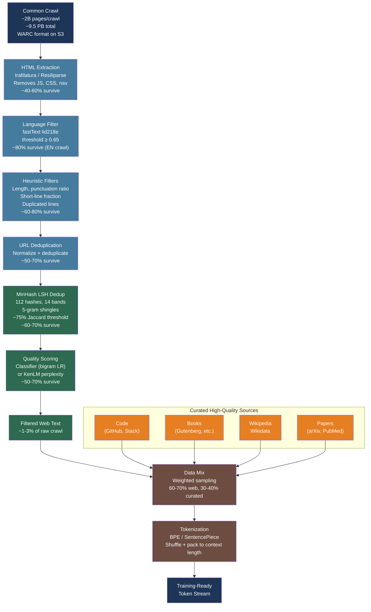

# [BEE-575] LLM Pretraining Data Pipelines and Web-Scale Corpus Curation

:::info
The quality of the pretraining corpus determines the ceiling of what any LLM can learn — more so than model architecture or even compute budget. Processing a petabyte-scale web crawl into a training-ready token stream requires a multi-stage pipeline: HTML extraction, language identification, heuristic filtering, fuzzy deduplication, and quality-based selection, each capable of eliminating 50–90% of the raw input.
:::

## Context

Every large language model is trained on a corpus assembled from web crawls, curated book collections, code repositories, and academic papers. The raw material for almost all public LLMs is **Common Crawl** — a nonprofit that has continuously crawled the web since 2008 and publishes monthly snapshots totaling over 9.5 petabytes. Each monthly crawl captures approximately 2–2.5 billion pages stored in roughly 60,000 WARC (Web ARChive) files, each ~1 GB compressed, available for free from `s3://commoncrawl/` (AWS `us-east-1`, no authentication required).

The raw web is not usable for training. A typical crawl contains duplicated content across domains, non-English text, spam, boilerplate, and low-information pages (navigation menus, cookie banners, auto-generated text). GPT-3 (Brown et al., arXiv:2005.14165, 2020) established the first public baseline: filter Common Crawl using a classifier trained to distinguish curated text (WebText, Wikipedia, Books) from random crawl content, then deduplicate with MinHash LSH. From an initial 45 TB compressed crawl, GPT-3's pipeline yielded 570 GB of high-quality text — roughly 1.3% of the raw input.

HuggingFace's **FineWeb** (Penedo et al., arXiv:2406.17557, NeurIPS 2024) refined this approach across 96 crawl snapshots, producing 15 trillion tokens (~44 TB) with a carefully ablated filtering pipeline. FineWeb is currently the most documented open pretraining corpus and serves as the practical reference implementation for the field. EleutherAI's **The Pile** (Gao et al., arXiv:2101.00027) pioneered combining Common Crawl with 21 curated domains — Wikipedia, GitHub, arXiv, legal documents, and others — producing 825 GB of diverse text and establishing the principle that domain diversity improves downstream generalization.

## The Pretraining Data Pipeline

A production pretraining pipeline has six sequential stages. Each stage applies in order; later stages assume earlier stages have run:

```
Raw WARC files (Common Crawl)
    ↓  1. Text extraction      (HTML → clean text, ~40–60% of pages survive)
    ↓  2. Language filtering   (keep target language, ~80% for EN-focused crawls)
    ↓  3. Heuristic filtering  (document length, punctuation, repetition, ~60–80% survive)
    ↓  4. URL deduplication    (one document per canonical URL, ~30–50% survive)
    ↓  5. Fuzzy deduplication  (MinHash LSH near-duplicate removal, ~60–70% survive)
    ↓  6. Quality scoring      (classifier or perplexity-based, ~50–70% survive)
    ↓
Curated corpus (typically 1–3% of raw crawl)
    ↓  Mix with high-quality sources (Wikipedia, code, books, papers)
    ↓
Final training dataset  →  Tokenization  →  Training
```

### Stage 1: HTML Extraction

Raw WARC files contain full HTTP responses including headers, JavaScript, CSS, and navigation. Common Crawl also provides WET (WARC Encapsulated Text) files with pre-extracted text, but these retain too much boilerplate and are not recommended for high-quality pipelines.

**trafilatura** is the current best-practice HTML extractor: it consistently outperforms jusText and other alternatives on benchmark precision/recall for main content extraction and is integrated into HuggingFace's `datatrove` pipeline library:

```python
import trafilatura
from datatrove.executor import LocalPipelineExecutor
from datatrove.pipeline.readers import WarcReader
from datatrove.pipeline.extractors import Trafilatura
from datatrove.pipeline.writers import JsonlWriter

# datatrove pipeline: WARC → extracted text → JSONL
pipeline = [
    WarcReader(
        data_folder="s3://commoncrawl/crawl-data/CC-MAIN-2024-10/segments/",
        compression="gz",
        glob_pattern="warc/*.warc.gz",
        default_metadata={"source": "CC-MAIN-2024-10"},
    ),
    Trafilatura(
        favour_precision=True,    # prefer less text with higher quality
        timeout=0.1,              # per-document timeout (seconds)
        deduplicate=False,        # deduplication handled separately
    ),
    JsonlWriter(output_folder="s3://my-bucket/extracted/"),
]

executor = LocalPipelineExecutor(pipeline=pipeline, workers=64)
executor.run()
```

**Resiliparse** with **FastWARC** is the faster alternative when throughput matters more than extraction quality. Its C++/Cython WARC parser is substantially faster than Python-based warcio, and its HTML extractor handles tables and code blocks better than jusText.

### Stage 2: Language Identification

Filter to the target language using **fastText's language identification model** (217 languages, lid218e). The model assigns a per-document confidence score; documents below threshold are dropped:

```python
import fasttext

# Download from https://huggingface.co/facebook/fasttext-language-identification
lid_model = fasttext.load_model("lid.218e.bin")

def is_english(text: str, threshold: float = 0.65) -> bool:
    # fasttext expects single-line input
    predictions = lid_model.predict(text.replace("\n", " "), k=1)
    lang, confidence = predictions[0][0].replace("__label__", ""), predictions[1][0]
    return lang == "en" and confidence >= threshold

# FineWeb uses 0.65; Dolma uses 0.50 — higher threshold = more precision, less recall
```

### Stage 3: Heuristic Filtering

Apply cheap document-level heuristics before expensive operations. FineWeb's ablations identified these as most effective:

```python
def passes_heuristics(text: str) -> bool:
    lines = [l for l in text.split("\n") if l.strip()]
    if len(lines) < 5:
        return False    # too short

    # Fraction of lines ending with terminal punctuation
    punct_endings = sum(1 for l in lines if l.rstrip()[-1:] in ".!?\"'")
    if punct_endings / len(lines) < 0.12:
        return False    # navigation/link-dump page

    # Fraction of characters in duplicated lines (detects templated content)
    from collections import Counter
    line_counts = Counter(lines)
    dup_chars = sum(len(l) * (c - 1) for l, c in line_counts.items() if c > 1)
    total_chars = sum(len(l) for l in lines)
    if total_chars > 0 and dup_chars / total_chars >= 0.10:
        return False    # repeated boilerplate

    # Fraction of short lines (< 30 chars) — catches menus, lists, link farms
    short_lines = sum(1 for l in lines if len(l.strip()) < 30)
    if short_lines / len(lines) >= 0.67:
        return False

    return True
```

### Stage 4 & 5: Deduplication

Deduplication is the most computationally expensive stage and must happen before quality filtering to avoid quality classifiers selecting from redundant near-copies.

**URL deduplication** (fast, cheap): normalize URLs (lowercase, strip tracking parameters), keep one document per canonical URL. Eliminates syndicated content.

**MinHash LSH fuzzy deduplication** (Lee et al., arXiv:2107.06499, ACL 2022): captures near-duplicate documents that appear at different URLs with minor text differences (cross-posted articles, scraped mirrors). After deduplication, LMs emit memorized training text 10× less frequently and reach the same validation loss with fewer steps:

```python
from datasketch import MinHash, MinHashLSH

def compute_minhash(text: str, num_perm: int = 112) -> MinHash:
    m = MinHash(num_perm=num_perm)
    # 5-gram word shingles (FineWeb configuration)
    words = text.lower().split()
    for i in range(len(words) - 4):
        shingle = " ".join(words[i:i+5])
        m.update(shingle.encode("utf-8"))
    return m

# LSH: 14 bands × 8 rows = 112 hashes → ~75% Jaccard similarity threshold
# Documents sharing at least one full band are candidate near-duplicates
lsh = MinHashLSH(threshold=0.75, num_perm=112)

# Index: insert each document's MinHash
for doc_id, text in corpus.items():
    mh = compute_minhash(text)
    lsh.insert(doc_id, mh)

# Query: find near-duplicates for a candidate document
def find_duplicates(doc_id: str, text: str) -> list[str]:
    mh = compute_minhash(text)
    return lsh.query(mh)
```

For large crawls, MinHash computation is embarrassingly parallel per document; LSH insertion and querying require a shared index. In practice: (1) compute MinHashes in parallel across workers, (2) build LSH index via a distributed union-find to cluster near-duplicates, (3) keep one representative per cluster (typically the longest document).

### Stage 6: Quality Scoring

**Classifier-based filtering** (most effective per DCLM, arXiv:2406.11794): train a fast text classifier with high-quality sources as positives (Wikipedia, curated books, academic papers) and random web text as negatives. GPT-3 used Spark's `HashingTF` + logistic regression. DCLM found a simple **bigram classifier** outperforms more complex alternatives:

```python
from sklearn.linear_model import LogisticRegression
from sklearn.feature_extraction.text import HashingVectorizer

# Positives: high-quality reference text (Wikipedia, books, etc.)
# Negatives: random Common Crawl sample
vectorizer = HashingVectorizer(
    analyzer="word",
    ngram_range=(1, 2),     # unigrams + bigrams
    n_features=2**18,
    norm="l2",
    alternate_sign=False,
)

classifier = LogisticRegression(max_iter=1000)
classifier.fit(vectorizer.transform(texts_train), labels_train)

def quality_score(text: str) -> float:
    features = vectorizer.transform([text])
    return classifier.predict_proba(features)[0][1]  # probability of "high quality"
```

**KenLM perplexity filtering** (Wenzek et al., CCNet, arXiv:1911.00359) is computationally cheaper. Train a 5-gram language model on Wikipedia for the target language, score documents by perplexity, and retain only the middle band. Very high perplexity → spam/gibberish; very low perplexity → repetitive boilerplate.

## Best Practices

### Process WARC files directly; do not rely on WET files

**SHOULD** download and process raw WARC files using trafilatura or Resiliparse rather than using Common Crawl's pre-extracted WET files. WET files retain navigation text, boilerplate, and cookie notices that degrade model quality. FineWeb's ablations showed that trafilatura-extracted text produces meaningfully better downstream evaluation scores than WET-derived text at the same token count.

### Run deduplication before quality filtering

**MUST** apply deduplication before classifier-based quality filtering. Duplicate documents inflate the classifier's confidence on repeated content and distort the quality distribution. Running deduplication first ensures the quality classifier selects among genuinely distinct documents. MinHash deduplication alone reduces a typical crawl by 30–40%; combined with URL deduplication, 50% or more of tokens are removed as duplicates.

### Apply heuristic filters before expensive classifier scoring

**SHOULD** run all heuristic document filters (language ID, length, punctuation fraction, short-line fraction) before invoking a trained quality classifier. Heuristics run in microseconds per document; a trained classifier requires vectorization and inference. On a 10-billion-document crawl, a 50% heuristic rejection rate saves 5 billion classifier inferences.

### Mix web-crawl data with curated high-quality sources

**SHOULD** blend filtered Common Crawl text with smaller, curated corpora at higher sampling rates. Dolma (arXiv:2402.00159) upsamples Wikipedia, academic papers (peS2o), and code (The Stack) relative to their raw token volume. The Pile (arXiv:2101.00027) demonstrated that exposure to diverse registers — legal text, mathematics, code, science — improves generalization significantly beyond what web text alone provides. A practical mix for a general-purpose model:

| Source | Approximate token share |
|---|---|
| Filtered Common Crawl | 60–70% |
| Code (GitHub, The Stack) | 10–15% |
| Books and literature | 5–10% |
| Wikipedia and Wikidata | 3–5% |
| Scientific papers (arXiv, PubMed) | 3–5% |
| Other curated (legal, math, etc.) | 2–5% |

### Validate filtering aggressively with held-out benchmarks

**MUST** evaluate each filtering decision against a small language model trained on a sample corpus, not just on corpus statistics. DCLM's benchmark infrastructure (arXiv:2406.11794) provides 53 downstream evaluations and standardized training recipes for this purpose. A filter that increases average token perplexity or reduces punctuation fraction may or may not improve model quality — only downstream task performance is ground truth.

## Visual



## Common Mistakes

**Using WET files instead of processing WARC files directly.** Common Crawl's pre-extracted WET files are convenient but retain navigation menus, cookie banners, and page-chrome boilerplate that trafilatura would filter. FineWeb's ablations showed that WET-based pipelines produce measurably worse models than WARC-based pipelines at the same token count. The extra processing cost of WARC extraction is justified.

**Applying MinHash deduplication globally across all crawls at once.** At 96 crawl snapshots, global deduplication requires building an LSH index over tens of billions of documents simultaneously — impractical in memory. FineWeb applies deduplication per crawl snapshot independently, then performs a separate cross-snapshot URL deduplication. This is computationally tractable and captures most of the benefit (content that appears in multiple crawls shares URLs and is caught by URL deduplication).

**Setting the language identification threshold too low.** A fastText confidence threshold of 0.50 admits many multilingual pages and documents in closely related languages (e.g., Scots English, Afrikaans) into an English-targeted corpus. FineWeb's threshold of 0.65 provides a better precision-recall balance. For non-English corpora, higher thresholds (0.7–0.8) are often needed because the web is less uniformly monolingual in non-English languages.

**Skipping evaluation and relying on corpus statistics alone.** Metrics like "average document length" or "punctuation fraction" are useful as sanity checks but are not ground truth for model quality. A filtering step that improves corpus statistics can still degrade downstream performance if it removes a specific domain (e.g., removing all documents shorter than 200 tokens eliminates many high-quality Wikipedia stubs). Always validate on a small model trained for 1–2B tokens with standard benchmarks before applying a filter at full scale.

**Not upsampling high-quality curated sources.** Web-crawl text is cheap and plentiful but noisier than curated sources. Including Wikipedia at its natural proportion (~0.01% of the web) underrepresents factual, well-structured text relative to its value for downstream task performance. All major published corpora (GPT-3, LLaMA 2, Dolma, The Pile) apply explicit upsampling — typically 3–10× — to high-quality sources like Wikipedia, academic papers, and curated books.

## Related BEEs

- [BEE-30070](distributed-training-infrastructure-for-large-language-models.md) -- Distributed Training Infrastructure for Large Language Models: pretraining data pipelines feed into distributed training — ZeRO sharding, gradient checkpointing, and mixed precision are the training-side counterpart to corpus curation
- [BEE-30048](llm-knowledge-distillation-and-model-compression.md) -- LLM Knowledge Distillation and Model Compression: pretraining a smaller student model on a curated subset of the teacher's training data is one form of data-efficient distillation
- [BEE-30032](synthetic-data-generation-for-ai-systems.md) -- Synthetic Data Generation for AI Systems: synthetic data augments curated pretraining corpora — particularly for mathematical reasoning, code, and low-resource languages where natural web data is sparse

## References

- [Penedo et al. The FineWeb Datasets: Decanting the Web for the Finest Text Data at Scale — arXiv:2406.17557, NeurIPS 2024](https://arxiv.org/abs/2406.17557)
- [Gao et al. The Pile: An 800GB Dataset of Diverse Text for Language Modeling — arXiv:2101.00027, EleutherAI 2021](https://arxiv.org/abs/2101.00027)
- [Lee et al. Deduplicating Training Data Makes Language Models Better — arXiv:2107.06499, ACL 2022](https://arxiv.org/abs/2107.06499)
- [Soldaini et al. Dolma: An Open Corpus of Three Trillion Tokens — arXiv:2402.00159, ACL 2024](https://arxiv.org/abs/2402.00159)
- [Li et al. DataComp-LM: In Search of the Next Generation of Training Sets for Language Models — arXiv:2406.11794, 2024](https://arxiv.org/abs/2406.11794)
- [Wenzek et al. CCNet: Extracting High Quality Monolingual Datasets from Web Crawl Data — arXiv:1911.00359, 2020](https://arxiv.org/abs/1911.00359)
- [Brown et al. Language Models are Few-Shot Learners (GPT-3) — arXiv:2005.14165, NeurIPS 2020](https://arxiv.org/abs/2005.14165)
- [Tirumala et al. D4: Improving LLM Pretraining via Document Deduplication and Diversification — arXiv:2308.12284, NeurIPS 2023](https://arxiv.org/abs/2308.12284)
- [HuggingFace. datatrove: large-scale data processing library — github.com/huggingface/datatrove](https://github.com/huggingface/datatrove)
- [Common Crawl. Navigating the WARC File Format — commoncrawl.org](https://commoncrawl.org/blog/navigating-the-warc-file-format)
- [Barbaresi. trafilatura: A Web Scraping Library and Command-Line Tool — trafilatura.readthedocs.io](https://trafilatura.readthedocs.io/)
- [Heafield. KenLM: Faster and Smaller Language Model Queries — aclanthology.org/W11-2123](https://aclanthology.org/W11-2123.pdf)
