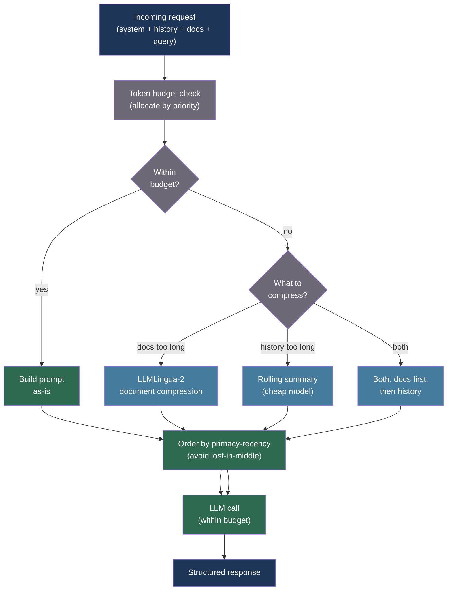

# [BEE-549] LLM Prompt Compression and Token Efficiency

:::info
Context windows are finite, expensive, and attention is not uniform across positions — prompt compression reduces token count while preserving the semantic content the model needs, using techniques from perplexity-guided token selection to learned compression embeddings, with compression ratios from 2× to 20× depending on acceptable accuracy trade-off.
:::

## Context

A language model charges for every token in the context window — input tokens on every request, including system prompts, retrieved documents, and conversation history that does not change between turns. As applications scale from prototypes to production, the token bill grows faster than the feature list: a RAG system retrieving five 500-token documents, a system prompt of 800 tokens, and a 1,200-token conversation history costs 4,500 input tokens per turn before the user has typed a word.

Beyond cost, context length affects latency (prefill time scales linearly with input length) and, counterintuitively, quality. Liu et al. (2023) documented the "lost-in-the-middle" effect: models perform significantly worse when the relevant information sits in the middle of a long context, with retrieval accuracy dropping by 20 percentage points between 1-document and 20-document settings even when the answer is present. Longer is not always better.

Jiang et al. (2023) at Microsoft Research introduced LLMLingua (EMNLP 2023), a coarse-to-fine compression pipeline. A small LM (GPT-2 level) assigns perplexity scores to each token in the original prompt; tokens with low perplexity — those the model considers predictable — are candidates for removal. A budget controller allocates the overall compression ratio across the prompt's structural components (instructions, demonstrations, query) and an iterative token-level compressor removes the lowest-information tokens while preserving grammatical validity. The method achieves up to 20× compression on in-context learning benchmarks with less than 5% accuracy loss on most tasks.

LLMLingua-2 (Jiang et al., Findings of ACL 2024, arXiv:2403.12968) reframed compression as a token classification task via data distillation from GPT-4: train a small bidirectional encoder to label each token as "keep" or "discard" based on distilled annotations, then apply the classifier at inference time without the iterative refinement pass. This achieves 3–6× speedup over LLMLingua at similar compression ratios (2–5×), making it practical for latency-sensitive pipelines.

Mu et al. (2023, NeurIPS 2023, arXiv:2304.08467) introduced Gist tokens: special learnable embeddings trained via modified attention masks to act as compressed representations of a prompt. A 26× compression ratio with 40% FLOPs reduction is achievable for task-specific deployments, but requires fine-tuning — a constraint that limits applicability to teams with self-hosted models and training infrastructure.

## Best Practices

### Enforce Token Budgets Before Calling the Model

**MUST** track token consumption across all context components — system prompt, retrieved context, conversation history, and output reserve — before building the request. Uncontrolled context growth is the root cause of both runaway costs and silent quality degradation:

```python
import tiktoken
from dataclasses import dataclass, field

MODEL_CONTEXT_LIMITS = {
    "claude-sonnet-4-20250514": 200_000,
    "claude-haiku-4-5-20251001": 200_000,
    "gpt-4o": 128_000,
}

OUTPUT_RESERVE = {
    "default": 2_048,
    "long_generation": 8_192,
}

@dataclass
class TokenBudget:
    model: str
    output_reserve: int = 2_048
    _components: dict[str, int] = field(default_factory=dict)

    @property
    def context_limit(self) -> int:
        return MODEL_CONTEXT_LIMITS.get(self.model, 128_000)

    @property
    def input_budget(self) -> int:
        return self.context_limit - self.output_reserve

    @property
    def used(self) -> int:
        return sum(self._components.values())

    @property
    def remaining(self) -> int:
        return self.input_budget - self.used

    def count(self, text: str) -> int:
        enc = tiktoken.get_encoding("cl100k_base")
        return len(enc.encode(text))

    def allocate(self, name: str, text: str) -> bool:
        """
        Attempt to allocate tokens for a named component.
        Returns False if this would exceed the input budget.
        """
        tokens = self.count(text)
        if self.used + tokens > self.input_budget:
            return False
        self._components[name] = tokens
        return True

    def summary(self) -> dict:
        return {
            "model": self.model,
            "context_limit": self.context_limit,
            "output_reserve": self.output_reserve,
            "input_budget": self.input_budget,
            "used": self.used,
            "remaining": self.remaining,
            "components": dict(self._components),
        }

def build_prompt_with_budget(
    system: str,
    history: list[dict],
    documents: list[str],
    query: str,
    model: str = "claude-sonnet-4-20250514",
) -> tuple[str, list[dict]]:
    """
    Assemble prompt components in priority order.
    Lower-priority components (older history, excess documents) are dropped
    when the budget is exhausted rather than silently truncating mid-content.
    """
    budget = TokenBudget(model=model)

    # Priority 1: system prompt (must always fit)
    if not budget.allocate("system", system):
        raise ValueError("System prompt exceeds input budget — reduce system prompt")

    # Priority 2: current query (must always fit)
    if not budget.allocate("query", query):
        raise ValueError("Query exceeds remaining budget")

    # Priority 3: documents (most relevant first, drop tail if needed)
    included_docs = []
    for i, doc in enumerate(documents):
        if budget.allocate(f"doc_{i}", doc):
            included_docs.append(doc)
        # else: silently drop this document and log the drop

    # Priority 4: history (newest first, drop oldest if needed)
    included_history = []
    for msg in reversed(history):
        text = msg.get("content", "")
        if budget.allocate(f"history_{len(included_history)}", text):
            included_history.insert(0, msg)
        # else: stop adding history

    return "\n\n".join(included_docs), included_history
```

**MUST NOT** silently truncate strings at a character or token count without considering structure — a truncated JSON object or mid-sentence document causes the model to reason over broken context.

### Use LLMLingua for Retrieved Document Compression

**SHOULD** apply LLMLingua or LLMLingua-2 to retrieved documents before including them in the context. Retrieved documents typically contain redundant background text, formatting, and boilerplate that contributes tokens without information. Compression ratios of 2–5× are achievable with less than 3% accuracy loss on retrieval-augmented QA tasks:

```python
# Requires: pip install llmlingua
from llmlingua import PromptCompressor

# Initialize once at application startup — loads a small compression LM
compressor = PromptCompressor(
    model_name="microsoft/llmlingua-2-xlm-roberta-large-meetingbank",
    use_llmlingua2=True,   # LLMLingua-2 is faster at similar ratios
    device_map="cpu",      # CPU is sufficient for the compression model
)

def compress_retrieved_documents(
    documents: list[str],
    query: str,
    target_ratio: float = 0.4,   # Retain 40% of tokens
    target_token: int = -1,       # Or specify absolute target token count
) -> list[str]:
    """
    Compress a list of retrieved documents relative to the query.
    The compressor retains tokens most relevant to the query.
    target_ratio=0.4 gives ~2.5x compression with ~97% accuracy on NQ datasets.
    """
    compressed = []
    for doc in documents:
        result = compressor.compress_prompt(
            context=[doc],
            question=query,
            target_token=target_token if target_token > 0 else -1,
            rate=target_ratio,
            force_tokens=["\n", ".", "!", "?"],   # Preserve sentence boundaries
        )
        compressed.append(result["compressed_prompt"])
    return compressed

def compress_rag_context(
    documents: list[str],
    query: str,
    budget_tokens: int,
) -> str:
    """
    Compress and join documents to fit within a token budget.
    Applies dynamic ratio based on total document length vs budget.
    """
    enc = tiktoken.get_encoding("cl100k_base")
    total_tokens = sum(len(enc.encode(d)) for d in documents)

    if total_tokens <= budget_tokens:
        return "\n\n".join(documents)   # No compression needed

    target_ratio = budget_tokens / total_tokens
    # Clamp: below 0.2 risks semantic collapse
    target_ratio = max(0.2, min(target_ratio, 1.0))

    compressed = compress_retrieved_documents(documents, query, target_ratio)
    return "\n\n".join(compressed)
```

**SHOULD** apply compression only to the context components, not to the instruction or the query itself. Compressing instructions degrades task adherence significantly; compressing the query loses the intent the model needs.

### Compress Conversation History with Summarization

**SHOULD** replace the oldest turns of a long conversation with a running summary rather than dropping them entirely. Dropping context is lossless only when the dropped turns are truly irrelevant — but in most applications the model needs awareness of what was discussed earlier to avoid contradicting itself or repeating information:

```python
import anthropic

SUMMARY_SYSTEM = """You are a conversation summarizer. Given a conversation transcript,
produce a concise summary that preserves:
- All decisions made and commitments given
- Key facts established
- Unresolved questions
- The user's stated goals

Be terse. Omit pleasantries and repetition. Output only the summary paragraph."""

async def rolling_summary_compression(
    history: list[dict],
    *,
    model: str = "claude-haiku-4-5-20251001",   # Use cheap model for summarization
    keep_recent_turns: int = 6,
    summary_token_budget: int = 300,
) -> list[dict]:
    """
    Compress old conversation turns into a summary message.
    Keeps the most recent keep_recent_turns turns verbatim.
    Replaces older turns with a single summary message.
    """
    if len(history) <= keep_recent_turns:
        return history

    to_summarize = history[:-keep_recent_turns]
    to_keep = history[-keep_recent_turns:]

    # Only summarize if there is content to summarize
    transcript = "\n".join(
        f"{m['role'].upper()}: {m['content']}"
        for m in to_summarize
    )

    client = anthropic.AsyncAnthropic()
    resp = await client.messages.create(
        model=model,
        max_tokens=summary_token_budget,
        system=SUMMARY_SYSTEM,
        messages=[{"role": "user", "content": f"Conversation to summarize:\n{transcript}"}],
    )
    summary_text = resp.content[0].text

    # Prepend the summary as a synthetic user turn so the model sees the context
    summary_message = {
        "role": "user",
        "content": f"[Earlier conversation summary]: {summary_text}",
    }
    # Pair it with an assistant acknowledgment to keep role alternation valid
    summary_ack = {
        "role": "assistant",
        "content": "Understood. I have the context from our earlier discussion.",
    }

    return [summary_message, summary_ack] + to_keep
```

**SHOULD** use a cheaper, smaller model for summarization — the compression step does not require the same capability as the primary model, and summarization latency adds to end-user perceived latency. Claude Haiku or GPT-4o-mini are appropriate.

### Place High-Priority Content at Context Boundaries

**SHOULD** structure context so that the most critical information appears at the beginning or end of the prompt, not in the middle. The "lost-in-the-middle" effect (Liu et al., 2023) is strongest when relevant content is buried in a long flat list of documents:

```python
def order_documents_for_attention(
    documents: list[dict],   # Each has "text" and "relevance_score"
    strategy: str = "primacy_recency",
) -> list[str]:
    """
    Order documents to mitigate the lost-in-the-middle effect.
    
    primacy_recency: most relevant first and last, least relevant in the middle
    primacy: most relevant first (best for tasks where the answer is near the top)
    """
    sorted_docs = sorted(documents, key=lambda d: d["relevance_score"], reverse=True)

    if strategy == "primacy":
        return [d["text"] for d in sorted_docs]

    if strategy == "primacy_recency":
        if len(sorted_docs) <= 2:
            return [d["text"] for d in sorted_docs]
        # Interleave: high-relevance at start and end, low-relevance in middle
        result = []
        top = sorted_docs[:len(sorted_docs) // 2]
        bottom = sorted_docs[len(sorted_docs) // 2:]
        result.extend(d["text"] for d in top)
        result.extend(d["text"] for d in reversed(bottom))
        return result

    return [d["text"] for d in sorted_docs]
```

## Visual



## Compression Method Comparison

| Method | Compression ratio | Quality retention | Requires fine-tuning | Latency overhead | Best for |
|---|---|---|---|---|---|
| Token budget enforcement | N/A (selection) | Depends on priority | No | Negligible | All applications |
| LLMLingua | 2–20× | ~95% at 5× | No | Medium (iterative) | In-context learning, large system prompts |
| LLMLingua-2 | 2–5× | ~98% at 2× | No | Low (classifier) | Production RAG, latency-sensitive |
| GIST tokens | 26× | ~95% | Yes (fine-tuning) | Low at inference | Self-hosted, task-specific |
| Rolling summary | ~5–10× of history | High (semantic) | No | Low (cheap model) | Multi-turn conversational agents |
| Primacy-recency ordering | N/A (placement) | Improves by ~10% | No | Negligible | Long document RAG |

## Common Mistakes

**Compressing instructions or the query.** LLMLingua is designed for context compression, not instruction compression. Applying it to system instructions causes task adherence to degrade sharply because the instruction tokens carry disproportionate semantic weight.

**Setting compression ratios below 0.2 (5× or higher).** At ratios above 5× on factual QA tasks, accuracy loss becomes measurable and progressive. The 500xCompressor paper documents 27–38% capability loss at extreme ratios. Apply maximum compression only to low-stakes background context, never to the supporting evidence for a factual claim.

**Dropping context without logging.** Silently dropping documents or history turns when the budget is exceeded makes debugging nearly impossible. Always log which components were dropped and at what token count.

**Using the primary model for summarization.** Rolling history summarization with the primary model doubles the call cost. A cheap, small model is sufficient for extracting commitments and facts from conversation history.

**Not accounting for output tokens in the budget.** Reserving no output budget forces the model to truncate responses. The output reserve must be set based on the expected response length, not the context limit minus zero.

## Related BEEs

- [BEE-30010](llm-context-window-management.md) -- LLM Context Window Management: context window strategies and sliding window approaches that complement compression
- [BEE-30024](llm-caching-strategies.md) -- LLM Caching Strategies: prompt caching at the provider level eliminates token costs for repeated identical prefixes — the first line of defense before compression
- [BEE-30017](ai-memory-systems-for-long-running-agents.md) -- AI Memory Systems for Long-Running Agents: episodic and semantic memory architectures that reduce what needs to go in context at all
- [BEE-30029](advanced-rag-and-agentic-retrieval-patterns.md) -- Advanced RAG and Agentic Retrieval Patterns: selective retrieval that reduces document count before compression is applied

## References

- [Jiang et al. LLMLingua: Compressing Prompts for Accelerated Inference of Large Language Models — arXiv:2310.05736, EMNLP 2023](https://arxiv.org/abs/2310.05736)
- [Jiang et al. LLMLingua-2: Data Distillation for Efficient and Faithful Task-Agnostic Prompt Compression — arXiv:2403.12968, ACL 2024](https://arxiv.org/abs/2403.12968)
- [Mu et al. Learning to Compress Prompts with Gist Tokens — arXiv:2304.08467, NeurIPS 2023](https://arxiv.org/abs/2304.08467)
- [Li et al. 500xCompressor: Generalized Prompt Compression for Large Language Models — arXiv:2408.03094, ACL 2025](https://arxiv.org/abs/2408.03094)
- [Li et al. Prompt Compression for Large Language Models: A Survey — arXiv:2410.12388, NAACL 2025](https://arxiv.org/abs/2410.12388)
- [Liu et al. Lost in the Middle: How Language Models Use Long Contexts — arXiv:2307.03172, 2023](https://arxiv.org/abs/2307.03172)
- [Microsoft LLMLingua GitHub Repository — github.com/microsoft/LLMLingua](https://github.com/microsoft/LLMLingua)
- [Anthropic Engineering. Effective Context Engineering for AI Agents — anthropic.com](https://www.anthropic.com/engineering/effective-context-engineering-for-ai-agents)
