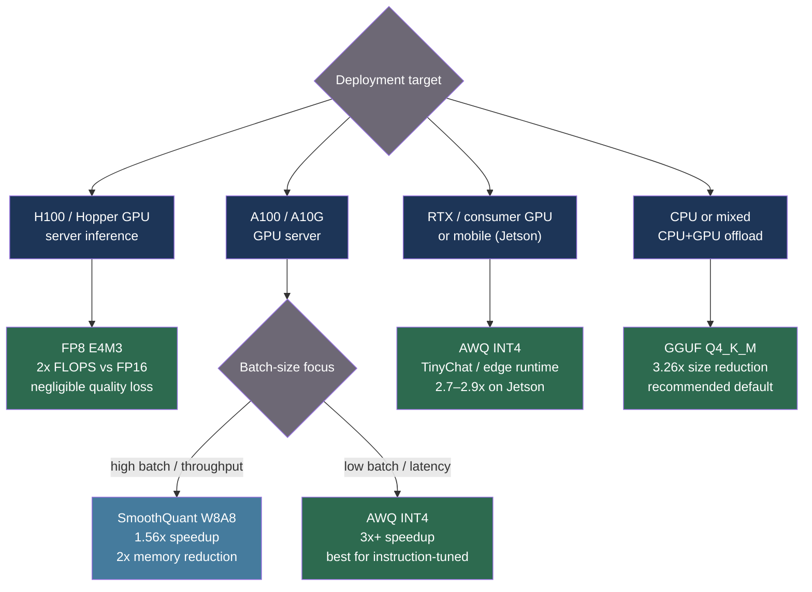

# [BEE-563] LLM Quantization for Inference

:::info
Quantization reduces model weight precision from 16-bit floats to 4–8 bits, cutting memory footprint 2–4x and inference latency up to 4.5x on GPU — with perplexity degradation of less than one unit on most Llama-scale models. Choosing the right quantization method depends on hardware, whether activations are quantized alongside weights, and whether the deployment target is a GPU server or consumer CPU.
:::

## Context

A Llama-3.1-70B model in BF16 occupies 140 GB of GPU VRAM and requires two H100 80 GB GPUs to serve. Standard autoregressive decoding is memory-bandwidth-bound (see BEE-561): the GPU spends most of each forward pass loading weights from HBM, not computing. Reducing weight precision directly reduces the bytes loaded per token and therefore the time per token.

Quantization research accelerated in 2022–2024 as models grew past single-GPU capacity. Three distinct families emerged, each solving a different constraint:

**Weight-only quantization (W4A16):** Weights are stored in INT4; activations remain in FP16. Dequantization happens in fused CUDA kernels on the fly. Speedup comes entirely from reduced memory bandwidth. GPTQ (Frantar et al., arXiv:2210.17323, ICLR 2023) applied second-order Hessian information from the Optimal Brain Quantization framework to compress a 175B model to INT4 in four GPU-hours on a single A100, with 3.25x inference speedup. AWQ (Lin et al., arXiv:2306.00978, MLSys 2024 Best Paper) observed that only ~1% of weights are "salient" — determined by input activation magnitude, not weight magnitude — and developed an activation-aware per-channel scaling that protects those weights without requiring gradient computation. AWQ generalizes better than GPTQ across instruction-tuned and multimodal models.

**Weight-and-activation quantization (W8A8):** Both weights and activations are quantized to INT8, enabling use of hardware INT8 GEMM units that are faster than FP16 units. The challenge is that LLM activations contain large outliers in specific channels that overflow INT8 range. SmoothQuant (Xiao et al., arXiv:2211.10438, ICML 2023) resolved this with a mathematically equivalent offline transformation: divide each activation channel by a smoothing factor s, multiply the corresponding weight channel by s. The outlier magnitude migrates from activations (hard to quantize) to weights (easy to quantize). SmoothQuant achieves W8A8 with a perplexity delta of +0.04 on Llama-2-7B and delivers up to 1.56x speedup with 2x memory reduction.

**FP8:** The NVIDIA H100 Tensor Core supports FP8 matrix multiplication natively (Micikevicius et al., arXiv:2209.05433, 2022). The E4M3 format (4 exponent bits, 3 mantissa bits, max ±448) is used for weights and activations in forward passes; E5M2 (wider dynamic range) for training gradients. FP8 delivers exactly 2x theoretical FLOPS over FP16/BF16 on H100. Unlike INT8, FP8 retains floating-point dynamic range, making per-tensor calibration simpler.

**CPU and edge (GGUF):** llama.cpp (Gerganov et al., github.com/ggml-org/llama.cpp) introduced k-quants — a super-block structure where each group of weights has its own higher-precision scale and minimum, stored at 6-bit precision. The Q4_K_M format stores 4-bit weights with 6-bit scales in a container called GGUF, achieving a 3.26x size reduction for Llama-3.1-8B (4.58 GiB vs 14.96 GiB in FP16) with near-original perplexity. llama.cpp CPU inference enables deployment on consumer hardware without a CUDA GPU.

## Comparison

| Method | Bits (W/A) | Memory vs FP16 | Typical speedup | Perplexity delta (Llama-2-7B, WikiText-2) | Best for |
|---|---|---|---|---|---|
| FP16 (baseline) | 16/16 | 1x | 1x | 0 (baseline: 5.474) | Default |
| SmoothQuant W8A8 | 8/8 | 2x reduction | 1.56x | +0.04 | GPU server, actual INT8 GEMM |
| FP8 E4M3 | 8/8 | 2x reduction | up to 2x | negligible | H100 production |
| GPTQ INT4 | 4/16 | 4x reduction | 3.25x (A100) | small (varies) | GPU, latency-sensitive |
| AWQ INT4 | 4/16 | 4x reduction | 3x+ | slightly lower than GPTQ | GPU, instruction-tuned models |
| GGUF Q4_K_M | 4.89/FP32 | 3.26x reduction | CPU-optimized | small | CPU/edge |
| GGUF Q8_0 | 8.5/FP32 | 1.9x reduction | moderate | minimal | CPU, high quality |

GPTQ and AWQ are weight-only: activations stay in FP16, weights are dequantized on the fly. Speedup comes from halving memory bandwidth. SmoothQuant and FP8 are true W8A8: both operands are quantized, enabling use of faster hardware units. GGUF formats use FP32 compute with quantized storage, optimized for CPU throughput, not GPU FLOPS.

## Best Practices

### Choose quantization method by deployment target

**SHOULD** follow this decision tree before choosing a quantization format:

1. **H100 GPU server (production):** Use FP8. 2x FLOPS over FP16, negligible quality loss, native hardware support. vLLM's `--quantization fp8` with `--kv-cache-dtype fp8` on H100.
2. **A100/A10G GPU server (older hardware):** Use AWQ INT4 or GPTQ INT4 for memory-bound single-user latency. Use SmoothQuant W8A8 when serving large batches where INT8 GEMM throughput matters more than individual request speed.
3. **Consumer GPU (RTX series) or mobile GPU:** Use AWQ INT4. AWQ's 3x+ speedup over HF FP16 on RTX 4090 and support for edge deployment (NVIDIA Jetson Orin) makes it the preferred choice.
4. **CPU or mixed CPU+GPU offload:** Use GGUF Q4_K_M (recommended default). Use Q5_K_M or Q6_K when quality is the priority. Q8_0 for near-lossless CPU inference when VRAM allows.

**MUST NOT** apply FP8 quantization to non-H100 hardware and expect a speedup — FP8 requires software emulation on pre-Hopper GPUs, which is slower than INT8.

### Quantize and load with vLLM for GPU serving

**SHOULD** use vLLM for all GPU serving with quantized models. vLLM supports AWQ, GPTQ, FP8, and bitsandbytes natively:

```python
from vllm import LLM, SamplingParams

# AWQ INT4 — weight-only, good for A100/A10G and consumer GPUs
llm = LLM(
    model="meta-llama/Llama-3.1-8B-Instruct-AWQ",  # or local AWQ checkpoint
    quantization="awq",
    dtype="auto",
)

# GPTQ INT4 via GPTQModel backend
llm = LLM(
    model="meta-llama/Llama-3.1-8B-Instruct-GPTQ-4bit",
    quantization="gptq",
    dtype="auto",
)

# FP8 on H100 — weights and KV cache both in FP8
llm = LLM(
    model="meta-llama/Llama-3.1-8B-Instruct",
    quantization="fp8",
    kv_cache_dtype="fp8",          # FP8 KV cache halves KV memory too
    dtype="bfloat16",              # non-quantized ops remain in BF16
)

params = SamplingParams(temperature=0.0, max_tokens=256)
outputs = llm.generate(["Explain quantization in one paragraph."], params)
```

### Quantize models locally with AutoAWQ or GPTQModel

**SHOULD** use GPTQModel (successor to AutoGPTQ) for GPTQ quantization and AutoAWQ for AWQ quantization when working with models not yet available pre-quantized:

```python
# AWQ quantization with AutoAWQ
from awq import AutoAWQForCausalLM
from transformers import AutoTokenizer

model_path = "meta-llama/Llama-3.1-8B-Instruct"
quant_path = "./Llama-3.1-8B-Instruct-AWQ"

tokenizer = AutoTokenizer.from_pretrained(model_path)
model = AutoAWQForCausalLM.from_pretrained(model_path, device_map="auto")

quant_config = {
    "zero_point": True,       # asymmetric quantization — better quality
    "q_group_size": 128,      # weights per quantization group; smaller = better quality, more overhead
    "w_bit": 4,               # weight bits
    "version": "GEMM",        # GEMM kernel (for batch inference) vs GEMV (single token decode)
}

# Calibration uses 128 random samples from Pile — no labels needed
model.quantize(tokenizer, quant_config=quant_config)
model.save_quantized(quant_path)
tokenizer.save_pretrained(quant_path)
```

```python
# GPTQ quantization with GPTQModel
from gptqmodel import GPTQModel, QuantizeConfig

model_path = "meta-llama/Llama-3.1-8B-Instruct"
quant_path = "./Llama-3.1-8B-Instruct-GPTQ-4bit"

quantize_config = QuantizeConfig(
    bits=4,
    group_size=128,     # smaller group size = better quality; 32 or 64 for 70B+ models
    desc_act=False,     # activation order; True improves quality but slows quantization
)

model = GPTQModel.load(model_path, quantize_config=quantize_config)
# Calibration dataset: WikiText-2, C4, or your domain data (128–512 samples)
model.quantize(calibration_dataset)
model.save(quant_path)
```

**Group size guidance:** `group_size=128` is the standard default. For 70B+ models where memory is tight, `group_size=64` or `group_size=32` improves quality at the cost of ~5–10% more weight storage. For models ≤13B, `group_size=128` is sufficient.

### Deploy GGUF models for CPU and edge inference

**SHOULD** use llama.cpp or Ollama for CPU and mixed-device deployments. Q4_K_M is the recommended default; increase to Q5_K_M or Q6_K only if perplexity testing shows meaningful degradation on your task:

```bash
# Download GGUF from HuggingFace and run with llama.cpp
./llama-cli \
  -m ./Llama-3.1-8B-Instruct-Q4_K_M.gguf \
  -n 256 \
  -ngl 99 \        # offload 99 layers to GPU if available
  --temp 0.0 \
  -p "Explain quantization in one paragraph."

# Quantize a local FP16 GGUF to Q4_K_M yourself
./llama-quantize ./Llama-3.1-8B-Instruct-F16.gguf \
                 ./Llama-3.1-8B-Instruct-Q4_K_M.gguf \
                 Q4_K_M
```

**SHOULD** evaluate perplexity before choosing a GGUF quantization level for a new task domain:

```bash
# llama.cpp built-in perplexity evaluation (WikiText-2)
./llama-perplexity \
  -m ./Llama-3.1-8B-Instruct-Q4_K_M.gguf \
  -f wikitext-2-raw/wiki.test.raw \
  --ctx-size 512 \
  --chunks 50

# Compare against Q5_K_M and Q6_K to decide if the quality improvement is worth the size increase
```

### Validate quantized model quality on your task before deploying

**MUST** evaluate the quantized model on a representative sample of production queries, not just WikiText-2 perplexity. Perplexity measures general language modeling; instruction-following, code generation, and domain-specific tasks can degrade disproportionately.

```python
import json
from anthropic import Anthropic  # or any LLM client

def evaluate_quantization_quality(
    full_model_outputs: list[str],
    quantized_model_outputs: list[str],
    prompts: list[str],
) -> dict:
    """
    Compare full-precision vs quantized outputs on task-specific prompts.
    Use LLM-as-judge or exact-match depending on task type.
    """
    exact_matches = sum(
        f.strip() == q.strip()
        for f, q in zip(full_model_outputs, quantized_model_outputs)
    )
    return {
        "exact_match_rate": exact_matches / len(prompts),
        "n_prompts": len(prompts),
    }

# Rule of thumb: if exact_match_rate drops below 0.85 relative to full-precision,
# consider a higher bit-width or larger group size before deploying.
```

## Visual



## Common Mistakes

**Assuming all INT4 methods are equivalent.** GPTQ is Hessian-based and calibrates per-layer reconstruction error; it can be more accurate on base models with sufficient calibration data. AWQ is activation-based and generalizes better to instruction-tuned models because it does not overfit calibration-set token distributions. Neither dominates in all settings; benchmark both for your specific model and task.

**Applying FP8 quantization on A100 or older GPUs.** A100 does not have native FP8 GEMM hardware. vLLM will fall back to FP16 compute with FP8 storage on pre-Hopper GPUs, providing memory savings but no speedup. Use INT4 (GPTQ or AWQ) instead.

**Using AutoGPTQ for new work.** AutoGPTQ was archived April 2025. Its successor, GPTQModel (github.com/ModelCloud/GPTQModel), is the actively maintained tool compatible with HuggingFace Transformers as of 2025. Similarly, AutoAWQ was deprecated May 2025 with maintenance transferred to the vLLM project.

**Skipping calibration entirely and using random data.** Both GPTQ and AWQ need a small calibration set (128–512 samples) to determine quantization parameters. Using random noise as calibration data produces quantization that minimizes error on random distributions, not on your actual input distribution. Use samples representative of production queries, or at minimum WikiText-2 / C4.

**Setting `group_size=128` for all model sizes.** Group size is a quality-storage tradeoff: larger groups (fewer scales) save memory but accumulate more quantization error. For 70B+ models where the model is already large, `group_size=32` or `group_size=64` can meaningfully improve perplexity at the cost of a few percent more storage. For 7–13B models, `group_size=128` is generally sufficient.

**Combining quantization with speculative decoding without testing.** EAGLE-based speculative decoding (BEE-561) uses a draft head trained on the base model's hidden states. If the target model is quantized (especially with AWQ or GPTQ), the hidden state distribution shifts. Always benchmark acceptance rate (BEE-561's `SpecDecMetrics`) after enabling quantization; an acceptance rate drop below 0.6 may require retraining the draft head on the quantized model.

## Related BEEs

- [BEE-30021](llm-inference-optimization-and-self-hosting.md) -- LLM Inference Optimization and Self-Hosting: the broader optimization landscape that quantization fits into
- [BEE-30059](speculative-decoding-for-llm-inference.md) -- Speculative Decoding for LLM Inference: interacts with quantized hidden states; validate acceptance rate after quantizing
- [BEE-30060](multi-lora-serving-and-adapter-management.md) -- Multi-LoRA Serving and Adapter Management: LoRA adapters trained in FP16 must be dequantized to match the adapter's original precision; vLLM handles this automatically

## References

- [Frantar et al. GPTQ: Accurate Post-Training Quantization for Generative Pre-trained Transformers — arXiv:2210.17323, ICLR 2023](https://arxiv.org/abs/2210.17323)
- [Lin et al. AWQ: Activation-aware Weight Quantization for LLM Compression and Acceleration — arXiv:2306.00978, MLSys 2024](https://arxiv.org/abs/2306.00978)
- [Xiao et al. SmoothQuant: Accurate and Efficient Post-Training Quantization for Large Language Models — arXiv:2211.10438, ICML 2023](https://arxiv.org/abs/2211.10438)
- [Micikevicius et al. FP8 Formats for Deep Learning — arXiv:2209.05433, 2022](https://arxiv.org/abs/2209.05433)
- [Gerganov et al. llama.cpp — github.com/ggml-org/llama.cpp](https://github.com/ggml-org/llama.cpp)
- [casper-hansen. AutoAWQ — github.com/casper-hansen/AutoAWQ](https://github.com/casper-hansen/AutoAWQ)
- [ModelCloud. GPTQModel (AutoGPTQ successor) — github.com/ModelCloud/GPTQModel](https://github.com/ModelCloud/GPTQModel)
- [HuggingFace. GGUF Format Documentation — huggingface.co/docs/hub/en/gguf](https://huggingface.co/docs/hub/en/gguf)
