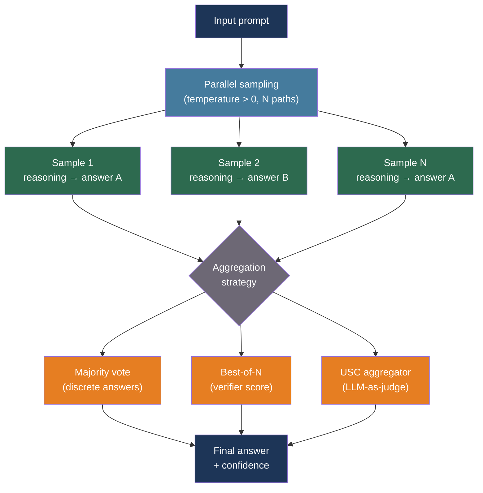

# [BEE-543] LLM Self-Consistency and Ensemble Sampling

:::info
Sampling the same prompt multiple times and aggregating results — through majority voting, a verifier model, or an ensemble of diverse LLMs — trades compute for accuracy on reasoning tasks, achieving 6–18% gains over single-pass greedy decoding at the cost of N× token consumption and latency.
:::

## Context

A language model at inference time is stochastic: for the same input, different random samples of the output distribution produce different reasoning chains and sometimes different answers. Most production systems suppress this variance by setting temperature to 0 (greedy decoding) and accepting the first answer as authoritative. This is fast and cheap — and often wrong on tasks that require multi-step reasoning.

Wang et al. (2022) introduced self-consistency at ICLR 2023: instead of one reasoning chain, sample a diverse set of chains at temperature > 0, then take the majority vote across their final answers. On GSM8K (grade-school math), self-consistency with 40 samples improved accuracy by +17.9% over chain-of-thought with greedy decoding; on commonsense reasoning benchmarks the gain was +3.9% to +12.2%. The key insight is that correct reasoning paths are internally consistent — they converge on the same answer from different angles — while incorrect paths are more likely to diverge.

Best-of-N (BoN) sampling is a related but distinct technique: generate N candidate outputs, score each with a separate verifier or reward model, and return the highest-scoring output. Where self-consistency selects by majority vote among N LLM outputs, BoN selects by a trained quality signal. BoN is the approach underlying many reinforcement-learning-from-human-feedback (RLHF) pipelines during test-time compute scaling.

Chen et al. (2023) extended self-consistency to open-ended tasks (code generation, summarization) where answer extraction and exact-match voting is impractical. Their Universal Self-Consistency (USC) uses the LLM itself to assess which among the N outputs is most consistent with the others — replacing exact-match voting with an LLM-as-judge aggregation step.

Wang et al. (2024) at Together AI introduced Mixture-of-Agents (MoA): rather than sampling the same model N times, route the prompt to a diverse set of LLMs, collect all outputs, then pass them to an aggregator model that synthesizes a final answer. MoA achieved 65.1% on AlpacaEval 2.0, surpassing GPT-4o's 57.5%, by exploiting the complementary strengths of different model families.

## Best Practices

### Use Self-Consistency for Reasoning Tasks Where Ground Truth Is Extractable

**SHOULD** apply self-consistency when the task produces a discrete, extractable answer (a number, a category label, a yes/no, a code output that either passes tests or does not). Majority voting is only meaningful when answers can be compared for equality:

```python
import asyncio
import anthropic
from collections import Counter

async def self_consistent_answer(
    prompt: str,
    *,
    n: int = 9,
    temperature: float = 0.7,
    model: str = "claude-sonnet-4-20250514",
    max_tokens: int = 1024,
    extract_answer,  # Callable[[str], str | None] — extracts the final answer from a completion
) -> tuple[str | None, float]:
    """
    Sample `n` completions and return the majority-vote answer with its vote fraction.

    extract_answer must parse the answer from the full completion text.
    Returns (answer, confidence) where confidence = votes_for_winner / n.
    Returns (None, 0.0) if no extractable answer appears in the majority.
    """
    client = anthropic.AsyncAnthropic()

    async def sample_once() -> str:
        response = await client.messages.create(
            model=model,
            max_tokens=max_tokens,
            temperature=temperature,
            messages=[{"role": "user", "content": prompt}],
        )
        return response.content[0].text

    completions = await asyncio.gather(*[sample_once() for _ in range(n)])

    # Extract final answers from each completion
    answers = [extract_answer(c) for c in completions]
    valid_answers = [a for a in answers if a is not None]

    if not valid_answers:
        return None, 0.0

    counter = Counter(valid_answers)
    majority_answer, majority_count = counter.most_common(1)[0]
    confidence = majority_count / n

    return majority_answer, confidence
```

**MUST** set temperature above 0 when sampling for self-consistency. Greedy decoding (temperature=0) produces identical outputs — you would pay N× cost for the same answer N times. A temperature of 0.5–0.8 produces sufficient diversity without sacrificing coherence.

**SHOULD** use an odd N (7, 9, 11) to prevent ties in majority voting. For classification tasks with binary outcomes, N=5 is sufficient; for complex reasoning, N=9–11 provides a reliable signal with manageable cost.

### Prompt the Model to Show Reasoning Before the Final Answer

Self-consistency depends on each sample producing an extractable final answer after a reasoning chain. The reasoning path is not the signal — the answer is. Structure the prompt to elicit chain-of-thought reasoning followed by a clearly demarcated answer:

```python
MATH_COT_PROMPT = """Solve the following problem step by step. After your reasoning,
write your final answer on its own line in the format:
ANSWER: <number>

Problem: {problem}"""

import re

def extract_numeric_answer(completion: str) -> str | None:
    """Extract the number after 'ANSWER:' from a chain-of-thought completion."""
    match = re.search(r"ANSWER:\s*(-?\d+(?:\.\d+)?)", completion, re.IGNORECASE)
    return match.group(1) if match else None
```

### Apply Best-of-N When You Have a Quality Signal

**SHOULD** use Best-of-N when a verifier, test suite, or reward model can score outputs. Code generation is the clearest case: run each of the N generated programs against a test suite and return the first that passes all tests. This is the "pass@k" evaluation paradigm formalized in the Codex paper (Chen et al., 2021):

```python
async def best_of_n_with_tests(
    code_prompt: str,
    test_cases: list[str],
    *,
    n: int = 5,
    temperature: float = 0.8,
    model: str = "claude-sonnet-4-20250514",
) -> str | None:
    """
    Generate N code completions and return the first that passes all test cases.
    Short-circuits as soon as a passing solution is found.
    """
    client = anthropic.AsyncAnthropic()

    async def generate_one() -> str:
        response = await client.messages.create(
            model=model,
            max_tokens=2048,
            temperature=temperature,
            messages=[{"role": "user", "content": code_prompt}],
        )
        return response.content[0].text

    candidates = await asyncio.gather(*[generate_one() for _ in range(n)])

    for candidate in candidates:
        code = extract_code_block(candidate)
        if code and passes_all_tests(code, test_cases):
            return code

    return None  # No candidate passed; caller can fall back or return the best partial
```

**MUST NOT** use majority voting in Best-of-N when outputs are open-ended prose. Majority voting is undefined for free-form text. For prose tasks, use either a reward model scorer or Universal Self-Consistency.

### Use Universal Self-Consistency for Open-Ended Tasks

For tasks without an extractable discrete answer (summarization, translation quality, open-ended Q&A), **SHOULD** use the LLM itself as an aggregator. Universal Self-Consistency samples N outputs, then instructs a separate LLM call to identify which output is most consistent with the consensus across all samples:

```python
USC_AGGREGATION_PROMPT = """You are given {n} candidate responses to the following question.
Identify which response is most consistent with the majority, and return it verbatim.

Question:
{question}

Candidate responses:
{candidates}

Return only the selected response, with no additional commentary."""

async def universal_self_consistency(
    question: str,
    *,
    n: int = 7,
    temperature: float = 0.7,
    model: str = "claude-sonnet-4-20250514",
    aggregator_model: str = "claude-haiku-4-5-20251001",  # Cheaper model for aggregation
) -> str:
    """
    Sample n responses, then use an LLM aggregator to select the most consistent one.
    Uses a cheaper model for the aggregation step to control cost.
    """
    client = anthropic.AsyncAnthropic()

    async def sample_once() -> str:
        r = await client.messages.create(
            model=model, max_tokens=1024, temperature=temperature,
            messages=[{"role": "user", "content": question}],
        )
        return r.content[0].text

    candidates = await asyncio.gather(*[sample_once() for _ in range(n)])
    candidates_block = "\n\n".join(
        f"[Response {i+1}]\n{c}" for i, c in enumerate(candidates)
    )

    agg_response = await client.messages.create(
        model=aggregator_model,
        max_tokens=1024,
        temperature=0,   # Deterministic aggregation
        messages=[{"role": "user", "content": USC_AGGREGATION_PROMPT.format(
            n=n, question=question, candidates=candidates_block,
        )}],
    )
    return agg_response.content[0].text
```

### Stop Early When Confidence Is Sufficient

**SHOULD** implement adaptive sampling: start with a small batch, check whether the leading answer already has a dominant majority, and stop before reaching the maximum N. Research on adaptive self-consistency shows up to 7.9× sample reduction with less than 0.1% accuracy drop:

```python
async def adaptive_self_consistent_answer(
    prompt: str,
    *,
    min_samples: int = 3,
    max_samples: int = 15,
    confidence_threshold: float = 0.70,
    temperature: float = 0.7,
    model: str = "claude-sonnet-4-20250514",
    extract_answer,
) -> tuple[str | None, float, int]:
    """
    Sample until confidence >= threshold or max_samples is reached.
    Returns (answer, confidence, samples_used).
    """
    client = anthropic.AsyncAnthropic()
    answers: list[str] = []

    async def sample_once() -> str:
        r = await client.messages.create(
            model=model, max_tokens=1024, temperature=temperature,
            messages=[{"role": "user", "content": prompt}],
        )
        return r.content[0].text

    # First batch: sample min_samples in parallel
    first_batch = await asyncio.gather(*[sample_once() for _ in range(min_samples)])
    answers = [extract_answer(c) for c in first_batch]
    answers = [a for a in answers if a is not None]

    for _ in range(max_samples - min_samples):
        if answers:
            counter = Counter(answers)
            leader, leader_count = counter.most_common(1)[0]
            confidence = leader_count / len(answers)
            if confidence >= confidence_threshold:
                return leader, confidence, len(answers)

        # Sample one more and check again
        completion = await sample_once()
        answer = extract_answer(completion)
        if answer:
            answers.append(answer)

    if not answers:
        return None, 0.0, max_samples

    counter = Counter(answers)
    leader, leader_count = counter.most_common(1)[0]
    return leader, leader_count / len(answers), len(answers)
```

### Know When Not to Sample Ensembles

**MUST NOT** apply self-consistency to factual lookup tasks (retrieval-augmented Q&A where the answer is in the retrieved document, or direct fact recall). Stochastic sampling introduces hallucination variance; majority voting cannot correct for systematic hallucination shared across samples.

**MUST NOT** apply self-consistency in streaming UX contexts. Generating N complete responses before showing any output adds latency that is perceptible and disruptive in chat interfaces. Self-consistency is appropriate for background processing, async job queues, and batch pipelines.

**SHOULD NOT** apply self-consistency to tasks where the cost multiplier (N×) is not justified by the accuracy gain. Confidence classification, intent detection, and routing decisions are typically stable across samples — greedy decoding is sufficient.

## Visual



## Sampling Strategy Comparison

| Strategy | Aggregation | Best for | Cost | Latency |
|---|---|---|---|---|
| Self-consistency | Majority vote | Math, classification, structured extraction | N× input + N× output | N calls in parallel |
| Best-of-N | Verifier/test suite | Code generation, verifiable tasks | N× generation + verifier | N calls + verification |
| Universal Self-Consistency | LLM-as-judge | Open-ended prose, summarization | N× generation + 1 aggregation call | N calls + 1 serial step |
| Mixture-of-Agents | LLM synthesis | Tasks benefiting from model diversity | N different-model calls + 1 synthesis | N calls + 1 serial step |

## Mixture-of-Agents

Mixture-of-Agents (MoA, Wang et al. 2024) extends ensemble sampling across model diversity rather than stochastic repetition. Each agent in layer 1 processes the prompt independently; the aggregator in layer 2 receives all outputs as context and synthesizes a final answer. The performance gain comes from different model families having complementary strengths and blind spots:

```python
async def mixture_of_agents(
    prompt: str,
    *,
    proposer_models: list[str],
    aggregator_model: str,
) -> str:
    """
    Layer 1: All proposer models generate independently.
    Layer 2: Aggregator synthesizes the best final answer.
    """
    client = anthropic.AsyncAnthropic()

    async def call_model(model: str) -> str:
        r = await client.messages.create(
            model=model, max_tokens=1024, temperature=0.7,
            messages=[{"role": "user", "content": prompt}],
        )
        return r.content[0].text

    # Layer 1: parallel fan-out to diverse models
    proposals = await asyncio.gather(*[call_model(m) for m in proposer_models])

    proposals_block = "\n\n".join(
        f"[Model {i+1} response]\n{p}" for i, p in enumerate(proposals)
    )
    synthesis_prompt = (
        f"You have been provided with a set of responses from various models.\n"
        f"Synthesize these into a single, high-quality response:\n\n"
        f"{proposals_block}\n\n"
        f"Original question: {prompt}"
    )

    # Layer 2: aggregator synthesizes
    r = await client.messages.create(
        model=aggregator_model, max_tokens=2048, temperature=0,
        messages=[{"role": "user", "content": synthesis_prompt}],
    )
    return r.content[0].text
```

## Related BEEs

- [BEE-30023](chain-of-thought-and-extended-thinking-patterns.md) -- Chain-of-Thought and Extended Thinking Patterns: self-consistency builds on chain-of-thought prompting; extended thinking is an alternative path to improved reasoning
- [BEE-30025](llm-batch-processing-patterns.md) -- LLM Batch Processing Patterns: self-consistency across large document sets is a batch workload; batch APIs reduce per-call cost for N samples
- [BEE-30039](llm-provider-rate-limiting-and-client-side-quota-management.md) -- LLM Provider Rate Limiting: N-sample fan-out multiplies token consumption and requires quota headroom
- [BEE-30011](ai-cost-optimization-and-model-routing.md) -- AI Cost Optimization and Model Routing: route N samples to a cheaper model when the task allows, reserving the expensive model for the aggregation step

## References

- [Wang et al. Self-Consistency Improves Chain of Thought Reasoning in Language Models — arXiv:2203.11171, ICLR 2023](https://arxiv.org/abs/2203.11171)
- [Chen et al. Universal Self-Consistency for Large Language Model Generation — arXiv:2311.17311, 2023](https://arxiv.org/abs/2311.17311)
- [Wang et al. Mixture-of-Agents Enhances Large Language Model Capabilities — arXiv:2406.04692, 2024](https://arxiv.org/abs/2406.04692)
- [AWS. Enhance Performance of Generative Language Models with Self-Consistency Prompting on Amazon Bedrock — aws.amazon.com](https://aws.amazon.com/blogs/machine-learning/enhance-performance-of-generative-language-models-with-self-consistency-prompting-on-amazon-bedrock/)
- [Chen et al. Evaluating Large Language Models Trained on Code (Codex / pass@k) — arXiv:2107.03374, 2021](https://arxiv.org/abs/2107.03374)
- [Prompt Engineering Guide. Self-Consistency — promptingguide.ai](https://www.promptingguide.ai/techniques/consistency)
