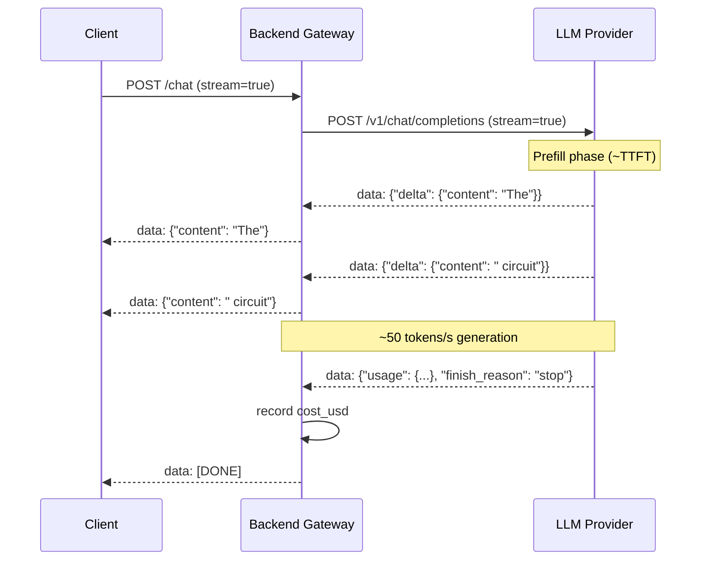

# [BEE-30016] LLM Streaming Patterns

:::info
LLM streaming delivers the first token to the user in hundreds of milliseconds rather than waiting seconds for a complete response, fundamentally changing the perceived responsiveness of AI features — but introduces a set of architectural concerns around SSE transport, backpressure, error handling mid-stream, and token counting that batch completions do not have.
:::

## Context

A non-streaming LLM call blocks the HTTP connection until the model finishes generating the entire response. For a response of 500 tokens at 50 tokens per second, that is a 10-second wait before the user sees anything. Streaming changes the contract: the server begins flushing individual tokens as they are generated, and the user sees text appearing on screen within hundreds of milliseconds of submitting the request.

This matters beyond raw latency. Research on human perception of computer system response distinguishes three zones: under 100ms feels instantaneous, 100ms–1s feels like a natural system response, and above 1s requires explicit feedback that work is in progress. Streaming moves the perceptible wait from the total generation time (often 3–30 seconds) to the time-to-first-token (TTFT, typically 100–500ms on well-configured inference endpoints). This is the metric that users feel.

The transport mechanism is Server-Sent Events (SSE), defined in the WHATWG HTML Living Standard (§9.2). SSE is a unidirectional HTTP channel that sends `text/event-stream` data: the server writes lines prefixed with `data:` and separated by `\n\n`, and the client reads them as a stream. OpenAI and Anthropic both implement their streaming APIs over SSE, sending JSON-encoded token deltas as individual events, ending with a `data: [DONE]` sentinel. The HTTP layer uses chunked transfer encoding (RFC 7230 §4.1) to send variable-length chunks without a known Content-Length.

## Design Thinking

Streaming introduces two architectural dimensions that batch completions do not have:

**Transport visibility**: The application must decide where streaming starts and ends. If the backend calls the LLM synchronously and then streams to the client, the backend bears the full TTFT cost before the client sees anything. If the backend proxies the LLM's SSE stream directly to the client, the client sees the first token as soon as the LLM produces it — but the backend must handle a long-lived connection per in-flight request.

**Partial state management**: With batch completions, the response arrives complete and parsing is straightforward. With streaming, the application receives and must process incomplete data: partial text, incomplete JSON tool-call arguments, and usage metadata that only appears in the final chunk. Each component that touches the stream must handle partial state explicitly.

## Best Practices

### Set `stream=True` and Consume Deltas Incrementally

**MUST** enable streaming for any user-facing LLM feature where the generation time exceeds one second. Batch completions on long generations produce the spinner-then-dump UX that streaming eliminates.

**SHOULD** accumulate token deltas into the full response string as they arrive, rather than collecting chunks and joining at the end:

```python
from openai import AsyncOpenAI

client = AsyncOpenAI()

async def stream_response(messages: list[dict]) -> str:
    full_text = ""
    async with client.chat.completions.stream(
        model="gpt-4o",
        messages=messages,
        stream_options={"include_usage": True},  # usage in final chunk
    ) as stream:
        async for event in stream:
            if event.type == "content.delta":
                delta = event.delta          # string fragment, may be empty
                full_text += delta
                yield delta                  # send to client immediately
            elif event.type == "chunk":
                if event.chunk.usage:        # final chunk with token counts
                    log_cost(event.chunk.usage.total_tokens)
    return full_text
```

**SHOULD** request usage statistics in the final stream chunk. OpenAI requires `stream_options={"include_usage": True}`; Anthropic includes usage in `message_delta` events automatically:

```python
# Anthropic: event types are more granular
import anthropic

client = anthropic.AsyncAnthropic()

async def stream_anthropic(messages: list[dict]):
    async with client.messages.stream(
        model="claude-sonnet-4-6",
        max_tokens=2048,
        messages=messages,
    ) as stream:
        async for text in stream.text_stream:
            yield text   # yields string fragments

    # Usage is available after the stream completes
    msg = await stream.get_final_message()
    # msg.usage.input_tokens, msg.usage.output_tokens
```

### Proxy Streams Without Buffering

For backend services that sit between the LLM provider and the client, proxying the SSE stream directly — rather than buffering the full response — preserves the latency benefit:

**MUST** use non-blocking I/O throughout the proxying path. A synchronous proxy that reads from the LLM and writes to the client blocks the server thread for the entire generation duration:

```python
from fastapi import FastAPI
from fastapi.responses import StreamingResponse
import httpx

app = FastAPI()

@app.post("/v1/chat/completions")
async def proxy_stream(request_body: dict):
    async def event_generator():
        async with httpx.AsyncClient() as client:
            async with client.stream(
                "POST",
                "https://api.openai.com/v1/chat/completions",
                json={**request_body, "stream": True},
                headers={"Authorization": f"Bearer {OPENAI_API_KEY}"},
                timeout=120.0,
            ) as response:
                async for line in response.aiter_lines():
                    if line:
                        yield f"{line}\n\n"  # re-emit SSE line

    return StreamingResponse(
        event_generator(),
        media_type="text/event-stream",
        headers={
            "Cache-Control": "no-cache",
            "X-Accel-Buffering": "no",   # disable nginx/proxy buffering
        },
    )
```

**MUST** set `X-Accel-Buffering: no` (for nginx) or equivalent proxy headers to prevent intermediate proxies from buffering the SSE stream. A buffering reverse proxy defeats streaming entirely.

**SHOULD** set an explicit timeout on the upstream LLM connection (120–300 seconds for long generations) and propagate connection closure cleanly to the downstream client.

### Handle Mid-Stream Errors in the SSE Format

**MUST NOT** attempt to set a non-200 HTTP status code after streaming has started — the status line has already been sent. Instead, send errors as SSE data events:

```python
async def safe_stream(messages: list[dict]):
    try:
        async with client.chat.completions.stream(...) as stream:
            async for event in stream:
                if event.type == "content.delta":
                    yield f"data: {json.dumps({'content': event.delta})}\n\n"
            yield "data: [DONE]\n\n"
    except openai.APIStatusError as e:
        # Error after stream started: send error in stream format
        error_event = {"error": {"message": str(e), "type": "provider_error"}}
        yield f"data: {json.dumps(error_event)}\n\n"
        yield "data: [DONE]\n\n"
    except Exception as e:
        error_event = {"error": {"message": "Internal error", "type": "internal"}}
        yield f"data: {json.dumps(error_event)}\n\n"
        yield "data: [DONE]\n\n"
```

**SHOULD** distinguish between errors that occur before the first token (where a normal HTTP error response is still possible) and errors that occur after tokens have been flushed (where in-stream error events are the only option):

```python
first_token_sent = False

async def stream_with_early_error_handling(messages):
    try:
        # Pre-flight: validate before opening stream
        stream = await client.chat.completions.create(..., stream=True)
    except openai.APIStatusError as e:
        # Status not yet sent: raise normally for HTTP error response
        raise HTTPException(status_code=e.status_code, detail=str(e))

    async for chunk in stream:
        first_token_sent = True
        yield chunk
        # Any exception here must be sent in-stream
```

### Accumulate Tool Call Arguments Before Parsing

Streaming tool calls deliver arguments as a character stream. The JSON is incomplete until `finish_reason="tool_calls"`:

**MUST NOT** attempt to parse tool call argument JSON from individual stream chunks. Parse only after accumulation is complete:

```python
async def stream_with_tool_calls(messages: list[dict]):
    tool_call_accumulator: dict[int, dict] = {}  # index → partial call

    async with client.chat.completions.stream(
        model="gpt-4o",
        messages=messages,
        tools=tools,
    ) as stream:
        async for event in stream:
            if event.type == "chunk":
                chunk = event.chunk
                choice = chunk.choices[0] if chunk.choices else None
                if not choice:
                    continue

                delta = choice.delta
                if delta.tool_calls:
                    for tc in delta.tool_calls:
                        idx = tc.index
                        if idx not in tool_call_accumulator:
                            tool_call_accumulator[idx] = {
                                "id": tc.id or "",
                                "name": tc.function.name or "",
                                "arguments": "",
                            }
                        if tc.function.arguments:
                            tool_call_accumulator[idx]["arguments"] += tc.function.arguments

                if choice.finish_reason == "tool_calls":
                    # Now safe to parse: arguments are complete
                    for idx, tc in tool_call_accumulator.items():
                        tc["arguments_parsed"] = json.loads(tc["arguments"])
                    yield {"tool_calls": list(tool_call_accumulator.values())}
```

**SHOULD** show streaming progress in the UI for tool calls even though arguments cannot be parsed mid-stream. Display the tool name as soon as it arrives, then show a progress indicator until the call is ready to execute.

### Track Token Counts and Cost in Streaming Pipelines

**MUST** track token counts for every streaming request — the absence of a complete response object does not exempt streaming requests from cost attribution:

```python
import tiktoken

def count_tokens_from_stream(model: str, chunks: list[str]) -> int:
    """Fallback: count output tokens from accumulated text."""
    enc = tiktoken.encoding_for_model(model)
    full_text = "".join(chunks)
    return len(enc.encode(full_text))

async def tracked_stream(messages: list[dict], feature: str):
    output_chunks = []
    usage = None

    async with client.chat.completions.stream(
        model="gpt-4o",
        messages=messages,
        stream_options={"include_usage": True},
    ) as stream:
        async for event in stream:
            if event.type == "content.delta":
                output_chunks.append(event.delta)
                yield event.delta
            elif event.type == "chunk" and event.chunk.usage:
                usage = event.chunk.usage

    # Cost attribution after stream completes
    total_tokens = (
        usage.total_tokens
        if usage
        else count_tokens_from_stream("gpt-4o", output_chunks)
    )
    record_cost(feature=feature, total_tokens=total_tokens, model="gpt-4o")
```

**SHOULD** prefer the provider's `usage` field in the final chunk over client-side counting with tiktoken. Provider counts are authoritative for billing; tiktoken counts are approximations and may differ for multi-modal or tool-use requests.

### Handle Backpressure from Slow Clients

**SHOULD** use async generators throughout the streaming path. A slow client causes the generator to pause at `yield` without blocking a thread:

```python
# Correct: async generator yields; no thread blocked while client reads slowly
async def sse_generator(messages):
    async for chunk in llm_stream(messages):
        yield f"data: {json.dumps({'content': chunk})}\n\n"
        # If client is slow, this `yield` pauses until client reads;
        # no OS thread is consumed during the wait.
```

**MUST NOT** accumulate the full stream into memory before sending, even for transformation purposes. This destroys the latency benefit and introduces unbounded memory growth proportional to response length times concurrent requests.

## Visual



## Related BEEs

- [BEE-30001](llm-api-integration-patterns.md) -- LLM API Integration Patterns: streaming is the primary delivery mode for LLM responses; retry and timeout configuration in the client setup applies to streaming connections
- [BEE-30009](llm-observability-and-monitoring.md) -- LLM Observability and Monitoring: TTFT is the primary latency metric for streaming endpoints; token counts from the final stream chunk feed cost_usd attribution
- [BEE-19037](../distributed-systems/long-polling-sse-and-websocket-architecture.md) -- Long-Polling, SSE, and WebSocket Architecture: SSE protocol fundamentals, connection lifecycle, and proxy configuration apply directly to LLM streaming endpoints
- [BEE-30013](ai-gateway-patterns.md) -- AI Gateway Patterns: gateway-level streaming proxying, buffering prevention headers, and per-request token accounting in a streaming context

## References

- [WHATWG. Server-Sent Events — html.spec.whatwg.org §9.2](https://html.spec.whatwg.org/multipage/server-sent-events.html)
- [IETF RFC 6202. Known Issues and Best Practices for the Use of Long Polling and Streaming in Bidirectional HTTP — rfc-editor.org](https://www.rfc-editor.org/rfc/rfc6202)
- [OpenAI. Streaming Responses — developers.openai.com](https://developers.openai.com/api/docs/guides/streaming-responses)
- [Anthropic. Streaming Messages — docs.anthropic.com](https://docs.anthropic.com/en/api/streaming)
- [OpenAI. How to Stream Completions — github.com/openai/openai-cookbook](https://github.com/openai/openai-cookbook/blob/main/examples/How_to_stream_completions.ipynb)
- [Vercel AI SDK. Stream Protocol — ai-sdk.dev](https://ai-sdk.dev/docs/ai-sdk-ui/stream-protocol)
- [IBM. Time to First Token (TTFT) — ibm.com/think](https://www.ibm.com/think/topics/time-to-first-token)
