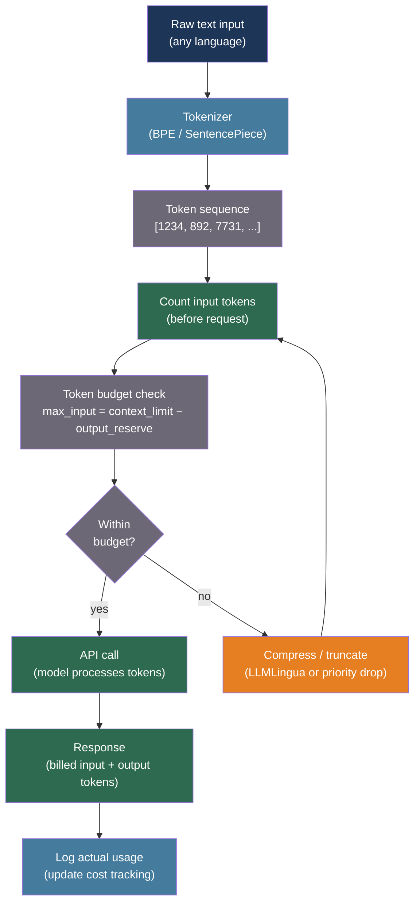

# [BEE-553] LLM Tokenization Internals and Token Budget Management

:::info
Every LLM API call is priced in tokens, not characters or words — understanding how tokenizers convert text to integer sequences, why CJK languages cost 2–3× more than English for equivalent content, and how to count tokens before sending requests prevents budget overruns, context-window overflows, and silent truncation bugs.
:::

## Context

The token is the atomic unit of language model computation: the model reads tokens, generates tokens, and is billed for tokens. A token is not a word, a character, or a byte — it is a learned compression of frequent character sequences. The mapping from text to tokens is determined by the tokenizer, a component trained separately from the language model itself.

Sennrich, Haddow, and Birch (2016, arXiv:1508.07909, ACL 2016) introduced Byte-Pair Encoding (BPE) as the dominant tokenization algorithm for neural machine translation. BPE starts from a character vocabulary and iteratively merges the most frequent adjacent pair of tokens, building a vocabulary of subword units. A 50,000-merge BPE vocabulary covers virtually all English text efficiently: common words become single tokens ("hello"), rare words are split into subwords ("tokenization" → "token" + "ization"), and unknown characters fall back to bytes.

Kudo and Richardson (2018, arXiv:1808.06226, EMNLP 2018) introduced SentencePiece, which applies BPE (or Unigram language model) directly to raw unsegmented text without requiring whitespace pre-tokenization. This matters for languages without word boundaries: Chinese, Japanese, and Korean (CJK) write without spaces between words, and BPE applied to individual characters without a language-aware pre-tokenizer produces deeply inefficient tokenizations. GPT-4's `cl100k_base` vocabulary has ~100,000 slots; the CJK Unified Ideographs block alone contains 97,000+ characters, forcing most CJK characters to consume multiple tokens. The result: a Chinese sentence that conveys the same meaning as an English sentence costs 1.7–2.4× as many tokens.

For backend engineers, this has direct operational consequences. Multilingual applications that assume uniform token-per-character rates will underestimate costs and overflow context windows for non-Latin input. Applications that count English characters and divide by four (the commonly cited 4 chars/token heuristic) will be wrong for code (higher special-character density), JSON (bracket and quote overhead), and any non-Latin script. The only safe approach is to count tokens using the same tokenizer the API uses — before sending the request.

## Best Practices

### Count Tokens with the Model's Own Tokenizer Before Every API Call

**MUST** count tokens using the actual tokenizer rather than estimating from character count for any context-sensitive application. The 4 chars/token heuristic has ~25% error for English and can exceed 200% error for CJK content:

```python
import anthropic
import tiktoken
from functools import lru_cache

# --- Anthropic: count via API (exact, accounts for tools and images) ---

async def count_tokens_anthropic(
    messages: list[dict],
    system: str,
    model: str = "claude-sonnet-4-20250514",
    tools: list[dict] | None = None,
) -> int:
    """
    Use Anthropic's token counting endpoint before sending the real request.
    This is the only way to get an accurate count that includes tool definitions
    and any special tokens the API injects internally.
    The count endpoint is free and subject to its own (generous) rate limit.
    """
    client = anthropic.AsyncAnthropic()
    params = {
        "model": model,
        "system": system,
        "messages": messages,
        "max_tokens": 1,   # Required field, value irrelevant for counting
    }
    if tools:
        params["tools"] = tools

    result = await client.messages.count_tokens(**params)
    return result.input_tokens

# --- OpenAI: count via tiktoken (local, no API call needed) ---

@lru_cache(maxsize=4)
def get_encoding(model: str):
    """Cache encoding objects — they are expensive to construct."""
    try:
        return tiktoken.encoding_for_model(model)
    except KeyError:
        return tiktoken.get_encoding("cl100k_base")

def count_tokens_openai(
    messages: list[dict],
    model: str = "gpt-4o",
) -> int:
    """
    Count tokens for OpenAI chat messages using tiktoken.
    Each message has a fixed overhead of 3 tokens (role + content delimiters).
    Each reply is primed with 3 additional tokens.
    """
    enc = get_encoding(model)
    n_tokens = 3   # Reply primer
    for message in messages:
        n_tokens += 3  # Per-message overhead
        for key, value in message.items():
            if isinstance(value, str):
                n_tokens += len(enc.encode(value))
            if key == "name":
                n_tokens += 1  # name field has a -1 offset per OpenAI spec
    return n_tokens
```

**SHOULD** cache token count results when the same prompt components are sent repeatedly. System prompts and tool definitions that do not change across requests can be counted once at startup.

### Reserve Output Budget and Enforce Strict Input Limits

**MUST NOT** allocate the entire context window to input, leaving no room for the model to generate a complete response. A model that reaches `max_tokens` mid-sentence produces a truncated response that is often more confusing than no response:

```python
from dataclasses import dataclass, field

CONTEXT_LIMITS = {
    "claude-sonnet-4-20250514": 200_000,
    "claude-haiku-4-5-20251001": 200_000,
    "gpt-4o": 128_000,
    "gpt-4o-mini": 128_000,
}

@dataclass
class TokenBudget:
    model: str
    max_output: int = 4_096

    @property
    def total(self) -> int:
        return CONTEXT_LIMITS.get(self.model, 128_000)

    @property
    def max_input(self) -> int:
        return self.total - self.max_output

    def check(self, input_tokens: int) -> None:
        if input_tokens > self.max_input:
            raise ValueError(
                f"Input ({input_tokens} tokens) exceeds budget "
                f"({self.max_input} = {self.total} − {self.max_output} reserved for output)"
            )

    def remaining(self, input_tokens: int) -> int:
        return max(0, self.max_input - input_tokens)
```

### Handle Language-Specific Token Inflation

**SHOULD** apply language-aware cost multipliers when estimating token budgets for multilingual content. Use actual token counts for precision, but these multipliers are useful for capacity planning:

```python
# Empirical token-per-character ratios relative to English baseline
# Derived from OpenAI cl100k_base tokenizer on typical prose
LANGUAGE_TOKEN_MULTIPLIERS = {
    "en": 1.0,         # ~4 chars/token
    "es": 1.4,         # Spanish: more tokens per word due to accents
    "ru": 2.1,         # Russian Cyrillic: ~2 chars/token
    "he": 2.3,         # Hebrew
    "zh": 1.8,         # Mandarin Chinese: most chars need 2-3 tokens
    "ja": 2.1,         # Japanese (mix of kanji, kana, romaji)
    "ko": 2.4,         # Korean Hangul
    "ar": 2.0,         # Arabic
}

def estimate_tokens(text: str, language: str = "en") -> int:
    """
    Rough estimate using character count and language multiplier.
    Use the tokenizer API for precision; use this for capacity planning.
    English: ~4 chars/token. CJK: ~1.5-2 chars/token (higher token density).
    """
    chars = len(text)
    multiplier = LANGUAGE_TOKEN_MULTIPLIERS.get(language, 1.5)
    base_estimate = chars / 4   # English baseline
    return int(base_estimate * multiplier)

def warn_if_expensive(text: str, language: str, budget_tokens: int) -> None:
    estimate = estimate_tokens(text, language)
    if estimate > budget_tokens * 0.8:
        ratio = LANGUAGE_TOKEN_MULTIPLIERS.get(language, 1.5)
        print(
            f"Warning: {language} content estimated at {estimate} tokens "
            f"({ratio:.1f}× English rate). "
            f"Consider compressing before sending."
        )
```

**SHOULD** log actual token counts from API responses and compare them to pre-send estimates. Systematic underestimates (>20% error) indicate the estimate model needs recalibration for that content type or language.

### Guard Against Tokenization Edge Cases in Production

**MUST NOT** assume that the same string produces the same token count across different models or providers. Token vocabularies differ:

```python
def token_count_audit(
    text: str,
    models: list[tuple[str, str]] = None,   # [(model_name, encoding_name)]
) -> dict[str, int]:
    """
    Compare token counts across different encodings for the same text.
    Useful for auditing prompts before deploying to a new model.
    Significant differences indicate the prompt needs re-budgeting.
    """
    if models is None:
        models = [
            ("gpt-3.5 (cl100k)", "cl100k_base"),
            ("gpt-4o (o200k)", "o200k_base"),
        ]

    results = {}
    for name, encoding_name in models:
        enc = tiktoken.get_encoding(encoding_name)
        results[name] = len(enc.encode(text))
    return results

# Known edge cases to test in CI:
TOKENIZATION_EDGE_CASES = [
    "Hello, world!",        # Basic English
    "你好，世界！",            # Chinese — expect 3-4× English count
    "SELECT * FROM users WHERE id = 1;",   # SQL — special chars inflate
    "https://example.com/very/long/url?param=value&other=thing",  # URLs
    '{"key": "value", "nested": {"array": [1, 2, 3]}}',           # JSON
    "    " * 10,             # Whitespace: BPE may treat differently than expected
]
```

## Visual



## Tokenizer Comparison

| Tokenizer | Algorithm | Used by | CJK efficiency | Source |
|---|---|---|---|---|
| cl100k_base | BPE (byte-level) | GPT-3.5, GPT-4 | Poor (3× English) | tiktoken |
| o200k_base | BPE (byte-level, larger vocab) | GPT-4o | Slightly better | tiktoken |
| Anthropic (proprietary) | BPE variant | Claude models | Similar to cl100k | API count endpoint |
| SentencePiece (Llama) | BPE on raw text | Llama, Gemma | Better than cl100k | HuggingFace |
| WordPiece | Likelihood-maximizing | BERT family | Poor | HuggingFace |

## Common Mistakes

**Using character count divided by four as the token budget.** This heuristic is off by 200–300% for CJK content and by 30–50% for code and JSON. Always use the tokenizer.

**Not reserving output tokens.** A 200,000-token context window with 199,500 input tokens leaves only 500 output tokens — the model cannot produce a complete response. Reserve at minimum 1× the expected output length.

**Assuming token counts are stable across model versions.** OpenAI introduced `o200k_base` with GPT-4o, changing counts for some inputs relative to `cl100k_base`. Prompts that fit in GPT-4 context may not fit in a new model if the encoding changed.

**Not logging actual token usage from API responses.** Every response includes the exact input and output token counts used. Comparing actual to estimated is the only way to detect systematic tokenizer discrepancies before they cause context overflows.

## Related BEEs

- [BEE-30047](llm-prompt-compression-and-token-efficiency.md) -- LLM Prompt Compression and Token Efficiency: compression techniques to apply once a token count exceeds the budget
- [BEE-30010](llm-context-window-management.md) -- LLM Context Window Management: sliding window and memory strategies for long conversations
- [BEE-30011](ai-cost-optimization-and-model-routing.md) -- AI Cost Optimization and Model Routing: routing requests to smaller models to reduce token cost

## References

- [Sennrich et al. Neural Machine Translation of Rare Words with Subword Units — arXiv:1508.07909, ACL 2016](https://arxiv.org/abs/1508.07909)
- [Kudo and Richardson. SentencePiece: A simple and language independent subword tokenizer — arXiv:1808.06226, EMNLP 2018](https://arxiv.org/abs/1808.06226)
- [OpenAI tiktoken — github.com/openai/tiktoken](https://github.com/openai/tiktoken)
- [Anthropic Token Counting API — platform.claude.com](https://platform.claude.com/docs/en/api/messages-count-tokens)
- [HuggingFace Tokenizer Summary — huggingface.co](https://huggingface.co/docs/transformers/tokenizer_summary)
