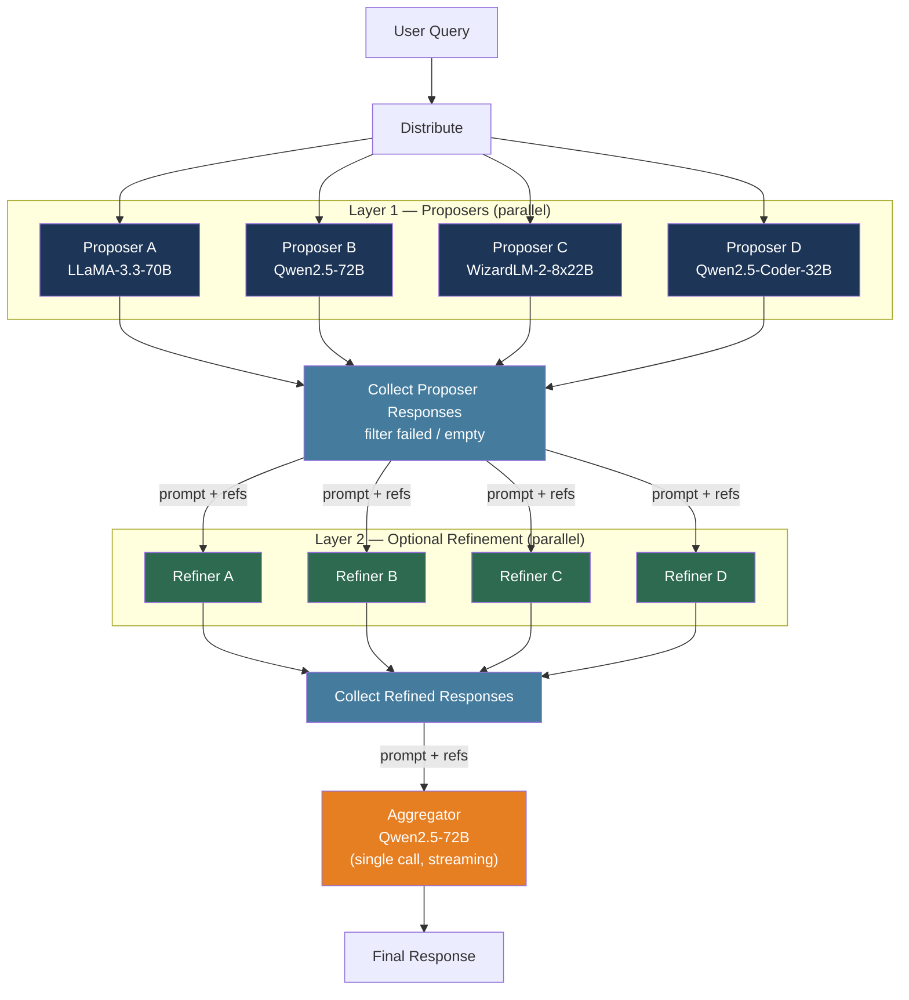

# [BEE-578] Mixture of Agents Architecture

:::info
Mixture of Agents (MoA) routes a single user query to multiple LLMs in parallel, then uses a final model to synthesize their responses into a single answer. By exploiting the empirical observation that LLMs produce higher-quality output when shown other models' responses, MoA achieves quality above any single model in the configuration — at the cost of higher latency and proportionally more API calls.
:::

## Context

Multi-agent debate, ensemble sampling, and ranked selection each explore a narrow dimension of combining LLM outputs. Mixture of Agents, introduced by Wang et al. (arXiv:2406.04692, Together AI, June 2024), rests on a more fundamental empirical finding: **the collaborative nature of LLMs**. When presented with responses from other models — even weaker ones — an LLM reliably generates a higher-quality response than when given only the original prompt. This effect holds across all tested models and is not merely the model selecting the best input; controlled analysis confirms the aggregator performs genuine synthesis, not selection.

The practical consequence is that a pipeline of inexpensive open-source models can collectively outperform a single expensive proprietary model. The paper's headline result: MoA using only open-source models achieved a 65.1% length-controlled win rate on AlpacaEval 2.0, versus 57.5% for GPT-4o alone — a 7.6 percentage point absolute improvement. On MT-Bench, MoA with GPT-4o as final aggregator scored 9.40 versus 9.19 for standalone GPT-4o.

The distinguishing engineering challenge of MoA is not quality — the results are clear — but latency: the system cannot emit the first token until the final aggregation layer completes. This makes MoA appropriate for batch, asynchronous, or high-value single-turn tasks, and inappropriate for real-time interactive chat where time-to-first-token dominates user experience.

## Architecture

### Roles: Proposers and Aggregators

MoA defines two functionally distinct roles:

**Proposers** generate initial responses to the original prompt. A good proposer contributes diverse perspectives and detailed content; it need not have the highest standalone quality. WizardLM is cited in the paper as an excellent proposer precisely because it produces comprehensive, verbose responses that give the aggregator rich material to synthesize, even though it performs poorly as an aggregator. The key property is diversity: running the same model multiple times at temperature > 0 provides far less benefit than running different models.

**Aggregators** receive the original prompt plus all proposer responses and synthesize them into a single, higher-quality output. Aggregators must remain stable when presented with low-quality or incorrect inputs — rather than parroting bad information, they must critically evaluate it. The paper identifies GPT-4o, Qwen1.5-110B-Chat, and LLaMA-3-70B-Instruct as strong aggregators.

Models can serve as both proposer and aggregator across different layers. The paper's ablation shows diversity of proposer models matters more than their individual quality.

### Layer Structure

MoA organizes agents into layers:

- **Layer 1**: Each of `n` proposer models receives the original prompt and generates an independent response (all in parallel)
- **Layers 2 through l−1** (optional refinement layers): Each agent receives the original prompt plus all responses from the previous layer; produces a refined response
- **Final layer**: A single aggregator receives the original prompt plus all responses from the preceding layer and produces the final output

The reference configurations from the paper:
- **MoA** (highest quality): 3 layers, 6 proposers per layer, Qwen1.5-110B-Chat as final aggregator
- **MoA w/ GPT-4o aggregator**: Same structure, GPT-4o as final aggregator (65.7% on AlpacaEval 2.0)
- **MoA-Lite** (cost-optimized, 2 layers): 6 proposers, Qwen1.5-72B-Chat aggregator (59.3%, comparable to GPT-4o cost with 1.8 pp improvement)

### Aggregation Prompt

The aggregation prompt is injected as a system message prepended to the conversation. The exact text used in the reference implementation:

```
You have been provided with a set of responses from various open-source models to
the latest user query. Your task is to synthesize these responses into a single,
high-quality response. It is crucial to critically evaluate the information provided
in these responses, recognizing that some of it may be biased or incorrect. Your
response should not simply replicate the given answers but should offer a refined,
accurate, and comprehensive reply to the instruction. Ensure your response is
well-structured, coherent, and adheres to the highest standards of accuracy and
reliability.

Responses from models:
1. {proposer_response_1}
2. {proposer_response_2}
...
n. {proposer_response_n}
```

## Implementation

### Single-Layer MoA with Parallel Proposers

The core implementation: fire all proposer calls concurrently, collect results, then make the single aggregation call:

```python
import asyncio
from openai import AsyncOpenAI

PROPOSER_MODELS = [
    "meta-llama/Llama-3.3-70B-Instruct-Turbo",
    "Qwen/Qwen2.5-72B-Instruct-Turbo",
    "Qwen/Qwen2.5-Coder-32B-Instruct",
    "microsoft/WizardLM-2-8x22B",
]
AGGREGATOR_MODEL = "Qwen/Qwen2.5-72B-Instruct-Turbo"

AGGREGATION_SYSTEM = """You have been provided with a set of responses from various \
models to the latest user query. Your task is to synthesize these responses into a \
single, high-quality response. Critically evaluate the information provided — some \
may be biased or incorrect. Do not simply replicate the given answers; offer a \
refined, accurate, and comprehensive reply.

Responses from models:
{references}"""

async def call_proposer(
    client: AsyncOpenAI,
    model: str,
    messages: list[dict],
) -> str:
    for attempt in range(3):
        try:
            response = await client.chat.completions.create(
                model=model,
                messages=messages,
                temperature=0.7,
                max_tokens=512,
            )
            return response.choices[0].message.content or ""
        except Exception as e:
            if attempt == 2:
                return ""  # excluded from aggregation if all retries fail
            await asyncio.sleep(2 ** attempt)
    return ""

def build_aggregation_messages(
    original_messages: list[dict],
    proposer_responses: list[str],
) -> list[dict]:
    """Inject proposer responses as a numbered list in the system message."""
    valid_responses = [r for r in proposer_responses if r]
    references = "\n".join(
        f"{i + 1}. {resp}" for i, resp in enumerate(valid_responses)
    )
    aggregation_system = AGGREGATION_SYSTEM.format(references=references)

    existing_system = next(
        (m["content"] for m in original_messages if m["role"] == "system"), None
    )
    new_system = (
        f"{existing_system}\n\n{aggregation_system}"
        if existing_system
        else aggregation_system
    )

    non_system = [m for m in original_messages if m["role"] != "system"]
    return [{"role": "system", "content": new_system}] + non_system

async def moa_generate(
    client: AsyncOpenAI,
    messages: list[dict],
    num_rounds: int = 1,  # number of refinement layers before final aggregation
) -> str:
    """
    Execute MoA with `num_rounds` refinement layers plus a final aggregation pass.
    Total layers = num_rounds + 1. Default (num_rounds=1) is MoA-Lite equivalent.
    """
    current_messages = messages

    for _ in range(num_rounds):
        # All proposers run in parallel per layer
        proposer_tasks = [
            call_proposer(client, model, current_messages)
            for model in PROPOSER_MODELS
        ]
        proposer_responses = await asyncio.gather(*proposer_tasks)

        # Inject proposer outputs into the aggregation prompt for the next layer
        current_messages = build_aggregation_messages(messages, list(proposer_responses))

    # Final aggregation call (synchronous, streaming enabled for UX)
    final_response = await client.chat.completions.create(
        model=AGGREGATOR_MODEL,
        messages=current_messages,
        temperature=0.7,
        max_tokens=2048,
        stream=False,
    )
    return final_response.choices[0].message.content or ""
```

### Latency Model

Per-layer latency equals the maximum proposer latency (since proposers are parallel), not the sum:

```
total_latency ≈ (num_layers × max_proposer_latency_per_layer) + aggregator_latency
```

For a 2-layer MoA with 4 proposers where each proposer call takes 3–6 seconds and the aggregator takes 5 seconds, the expected total wall-clock time is roughly:

```
wall_time ≈ max(3, 4, 5, 3) seconds   # layer 1 proposers in parallel
          + max(3, 4, 5, 3) seconds   # layer 2 proposers in parallel
          + 5 seconds                  # final aggregation
          ≈ 15–17 seconds
```

Compare to a single GPT-4o call at 3–8 seconds. MoA-Lite adds 2–3× latency in exchange for a quality improvement.

### Context Window Budget

Each proposer response (up to 512 tokens) expands the aggregator's input by 512 tokens. With 6 proposers, the aggregation prompt grows by ~3,000 tokens per layer:

```python
def estimate_aggregator_context(
    original_prompt_tokens: int,
    num_proposers: int,
    proposer_max_tokens: int = 512,
    num_layers: int = 2,
) -> int:
    """
    Estimate aggregator input context size for context limit checks.
    Each layer adds proposer_max_tokens × num_proposers to the prompt.
    """
    proposer_overhead = num_proposers * proposer_max_tokens * num_layers
    return original_prompt_tokens + proposer_overhead

# Example: 6 proposers, 512 tokens each, 3 layers, 500-token prompt
# = 500 + (6 × 512 × 3) = 500 + 9,216 = ~9,700 tokens input to aggregator
```

Choose aggregators with context windows at least as large as this estimate. For 3-layer MoA with 6 proposers and long-form questions, the aggregator context routinely exceeds 10,000 tokens.

## Best Practices

### Use diverse models, not multiple samples from the same model

**MUST** use meaningfully different models as proposers. The paper's ablation shows 6 diverse proposers achieve 61.3% on AlpacaEval 2.0, while 6 samples from the same model achieve only 56.7% — a 4.6 pp gap that closes most of the benefit of additional proposers. Model diversity (different architectures, training data, fine-tuning objectives) provides the complementary perspectives the aggregator can synthesize into a better-than-any-individual response. Using the same model with different temperatures is a weak substitute.

### Route to MoA selectively based on query complexity

**SHOULD** apply MoA only to queries that justify the latency and cost overhead. Simple factual lookups, classification tasks, and short-form completions are unlikely to benefit meaningfully from synthesis across six models. Candidate routing signals:

- Query requires deep reasoning, multi-step analysis, or long-form generation
- Stakes are high (legal, medical, financial decisions)
- Task is asynchronous and latency-insensitive (batch document processing, report generation)
- Historical quality gap between single-model output and desired quality is documented

**SHOULD NOT** apply MoA to real-time interactive UX where time-to-first-token must be under 2–3 seconds. The irreducible MoA latency (multiple sequential API calls) cannot meet this constraint.

### Exclude failed proposer responses from aggregation

**MUST** filter out empty, truncated, or error responses from the proposer set before building the aggregation prompt. Passing an error message or empty string to the aggregator corrupts the synthesis context. Implement retry logic with exponential backoff (1, 2, 4 seconds) before treating a proposer call as failed:

```python
def filter_valid_responses(responses: list[str]) -> list[str]:
    """Remove empty/whitespace-only or very short responses that indicate failure."""
    return [r for r in responses if r and len(r.strip()) > 20]
```

Proceed with aggregation even if some proposers fail, as long as at least two provide valid responses. Surface metrics for per-model failure rates to monitor infrastructure health.

### Separate the aggregation prompt from the user prompt

**SHOULD** maintain the aggregation system prompt as a separate, versioned artifact from user-facing system prompts. The aggregation instruction changes independently of application behavior: you may need to tune it for conciseness, domain specificity, or citation formatting without touching application logic. Store it in a prompt registry (see [BEE-30028](prompt-management-and-versioning.md)) and version it independently.

### Monitor for verbosity degradation in outputs

**SHOULD** track output length and conciseness metrics separately from quality metrics. The paper's own evaluation shows MoA scores lower on conciseness than single-model outputs — the synthesized answer tends to incorporate content from multiple proposers and is therefore longer. If the application requires concise outputs, add an explicit length constraint to the aggregation prompt or apply a post-aggregation compression step.

## Visual



## Common Mistakes

**Using the same model as multiple proposers.** Running four instances of the same model at varying temperatures provides much less benefit than four genuinely different models. The quality improvement comes from diverse perspectives synthesized together, not from ensemble variance. If you only have access to one model, self-consistency (BEE-543) with majority voting is a simpler alternative.

**Applying MoA to latency-sensitive interactive UX.** The time-to-first-token for a 2-layer MoA with 4 proposers is typically 10–20 seconds — the sum of at least two rounds of parallel API calls. This is fine for document processing pipelines and batch jobs; it is not acceptable for chat UIs where users expect streaming to begin within 2–3 seconds. Route interactively to a single model; use MoA offline or in background queues.

**Ignoring context window growth.** Each proposer adds up to 512 tokens to the aggregator's system prompt. With 6 proposers and 3 layers, the aggregator receives ~9,200 tokens of references on top of the original prompt. This can cause `invalid_request_error` from context limit overflows if not budgeted at pipeline design time. Choose an aggregator with a context window that comfortably accommodates the calculated overhead.

**Treating AlpacaEval 2.0 numbers as universal quality claims.** AlpacaEval 2.0 uses GPT-4 as evaluator, which may favor outputs stylistically similar to GPT-4's own. The MoA benchmarks are from June 2024; since then, many models (Claude 3.5 Sonnet, Gemini 2.0, Llama 3.3) have closed or reversed the standalone-model gap that made MoA necessary. Benchmark MoA against your target task domain, not just aggregate leaderboard scores.

**Passing aggregation errors to downstream systems.** When the aggregator's context limit is exceeded or the API fails, the pipeline must degrade gracefully — fall back to the best single proposer response rather than propagating an error or empty string as the MoA output.

## Related BEEs

- [BEE-30041](llm-self-consistency-and-ensemble-sampling.md) -- LLM Self-Consistency and Ensemble Sampling: generates multiple samples from a single model and aggregates by majority vote; conceptually simpler but lacks the inter-model diversity that makes MoA effective
- [BEE-30045](multi-agent-debate-and-critique-patterns.md) -- Multi-Agent Debate and Critique Patterns: agents engage in iterative adversarial rounds ("tit for tat") to arrive at consensus; complementary to MoA's constructive synthesis approach — debate surfaces disagreements, MoA integrates perspectives
- [BEE-30011](ai-cost-optimization-and-model-routing.md) -- AI Cost Optimization and Model Routing: routes individual queries to the cheapest model that can answer them (cascade/FrugalGPT approach); MoA and routing are complementary — use routing to decide whether MoA is justified, then MoA when quality matters more than cost
- [BEE-30028](prompt-management-and-versioning.md) -- Prompt Management and Versioning: the aggregation prompt is a first-class artifact requiring independent versioning; treat it as a prompt registry entry, not inline code
- [BEE-30002](ai-agent-architecture-patterns.md) -- AI Agent Architecture Patterns: MoA is a specific, narrow multi-agent topology; the broader design space of agent communication, memory, and tool use is covered there

## References

- [Wang et al., "Mixture-of-Agents Enhances Large Language Model Capabilities" — arXiv:2406.04692](https://arxiv.org/abs/2406.04692)
- [MoA paper (HTML, full text) — arxiv.org/html/2406.04692](https://arxiv.org/html/2406.04692)
- [Together AI MoA reference implementation — github.com/togethercomputer/MoA](https://github.com/togethercomputer/MoA)
- [Together AI blog: Mixture of Agents — together.ai/blog/together-moa](https://together.ai/blog/together-moa)
- [Jiang et al., LLM-Blender: Ensembling LLMs with pairwise ranking and generative fusion (ACL 2023) — arXiv:2306.02561](https://arxiv.org/abs/2306.02561)
- [LLM-Blender ACL proceedings — aclanthology.org/2023.acl-long.792](https://aclanthology.org/2023.acl-long.792)
- [Chen et al., FrugalGPT: Cascading LLMs for cost/quality tradeoffs — arXiv:2305.05176](https://arxiv.org/abs/2305.05176)
- [Liang et al., Multi-Agent Debate for Divergent Thinking (EMNLP 2024) — arXiv:2305.19118](https://arxiv.org/abs/2305.19118)
- [Du et al., Improving Factuality via Multiagent Debate — arXiv:2305.14325](https://arxiv.org/abs/2305.14325)
