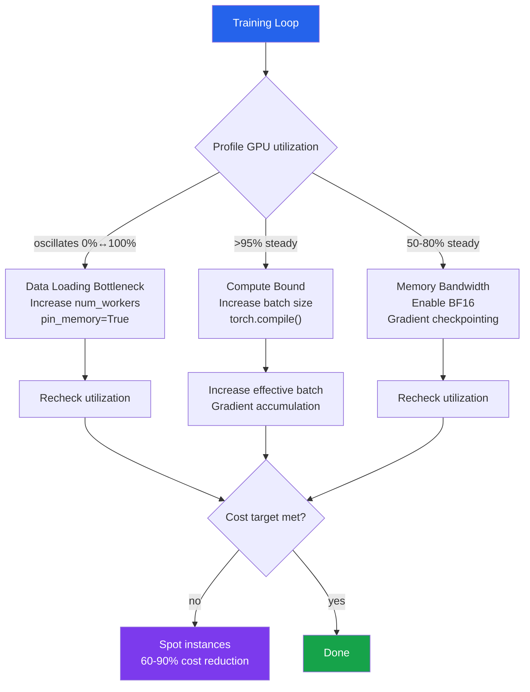

# [BEE-30091] ML Training Cost Optimization

:::info
ML training cost optimization reduces GPU-hours and cloud spend by maximizing GPU utilization through mixed precision, gradient checkpointing, efficient data loading, and spot instance checkpointing — techniques that can cut training cost by 60–90% without degrading model quality.
:::

## Context

GPU compute is the dominant cost in ML training. A single A100 instance on AWS costs $3.21/hour on-demand; running an experiment for 72 hours costs $231 before accounting for storage and data transfer. Teams running dozens of experiments per week on multiple instances routinely spend $50 000–200 000 per month on compute alone.

Most of that spend is avoidable. GPU utilization benchmarks from production ML workloads commonly show 30–50% effective utilization — the GPU is either waiting for data (DataLoader bottleneck), blocked on host-device transfers (pinned memory disabled), or operating in FP32 when the hardware can do the same work in BF16 at twice the throughput. Fixing these is an engineering problem, not a research problem.

The optimization landscape organizes into three tiers by impact:

1. **Memory efficiency** — mixed precision, gradient checkpointing, gradient accumulation: allow larger effective batch sizes on existing hardware, directly reducing per-sample compute cost
2. **Hardware efficiency** — DataLoader tuning, `torch.compile()`, batch size scaling: maximize the fraction of time the GPU is doing useful math
3. **Infrastructure efficiency** — spot instances, checkpoint-and-resume, S3 lifecycle policies: reduce the hourly rate and eliminate wasted spend

## Mixed Precision Training

FP32 stores each value in 4 bytes. BF16 stores the same value in 2 bytes with the same exponent range as FP32 (8 exponent bits vs FP32's 8) but fewer mantissa bits. The hardware consequence: BF16 matrix multiplications on A100/H100 run at ~2× the throughput of FP32.

`torch.amp.autocast` applies BF16 to forward pass operations where numerical precision is not critical (linear layers, convolutions) while keeping FP32 for accumulation and numerically sensitive operations (softmax, loss computation):

```python
import torch
from torch.amp import autocast, GradScaler

model = MyModel().to("cuda")
optimizer = torch.optim.AdamW(model.parameters(), lr=1e-4)

# GradScaler only needed for FP16 (not BF16 — BF16 doesn't underflow)
# Use it anyway for forward compatibility if switching between FP16 and BF16
scaler = GradScaler("cuda", enabled=(dtype == torch.float16))

for batch in dataloader:
    optimizer.zero_grad(set_to_none=True)  # set_to_none=True is faster than zeroing

    with autocast("cuda", dtype=torch.bfloat16):
        output = model(batch["input"])
        loss = criterion(output, batch["label"])

    scaler.scale(loss).backward()
    scaler.unscale_(optimizer)

    # Clip gradients before scaler.step to avoid NaN propagation
    torch.nn.utils.clip_grad_norm_(model.parameters(), max_norm=1.0)

    scaler.step(optimizer)
    scaler.update()
```

**BF16 vs FP16**: Use BF16 on Ampere+ (A100, H100, RTX 30xx/40xx). BF16 has the same exponent range as FP32, so gradients never overflow without loss scaling. FP16 has a narrower exponent range and requires `GradScaler` to prevent underflow. On older hardware (V100, T4), use FP16 with `GradScaler`.

Memory savings are immediate: a 1B parameter model in FP32 requires ~4 GB for parameters alone. In BF16 it requires ~2 GB, freeing capacity for a larger batch size or a deeper architecture without changing the GPU budget.

## Gradient Checkpointing

Backpropagation requires storing all intermediate activations from the forward pass. For a transformer with L layers, this is O(L × batch × sequence) memory. Gradient checkpointing (Chen et al. 2016) trades compute for memory: discard activations during the forward pass and recompute them during the backward pass. The cost is ~30% more compute; the saving is ~70% less activation memory.

```python
from torch.utils.checkpoint import checkpoint

class CheckpointedTransformerLayer(torch.nn.Module):
    def __init__(self, layer):
        super().__init__()
        self.layer = layer

    def forward(self, x):
        # checkpoint recomputes layer(x) during backward instead of storing activations
        return checkpoint(
            self.layer,
            x,
            use_reentrant=False,  # non-reentrant is recommended for new code
        )

# Wrap every other layer to halve memory at ~15% compute overhead
# (full checkpointing of every layer doubles compute cost)
for i, layer in enumerate(model.transformer_layers):
    if i % 2 == 0:
        model.transformer_layers[i] = CheckpointedTransformerLayer(layer)
```

Gradient checkpointing is most valuable when: (a) you are OOM at the desired batch size, or (b) you want to double the batch size without upgrading hardware. It SHOULD NOT be applied uniformly to every layer — checkpointing every other layer captures most of the memory saving at ~15% compute overhead rather than the full 30% of checkpointing every layer.

## Gradient Accumulation

Gradient accumulation simulates a larger effective batch size without allocating memory for the full batch. Gradients from N micro-batches are summed before a weight update:

```python
ACCUMULATION_STEPS = 8  # effective batch = batch_size × 8
optimizer.zero_grad(set_to_none=True)

for step, batch in enumerate(dataloader):
    with autocast("cuda", dtype=torch.bfloat16):
        output = model(batch["input"])
        # Normalize loss by accumulation steps so magnitude matches full-batch loss
        loss = criterion(output, batch["label"]) / ACCUMULATION_STEPS

    scaler.scale(loss).backward()

    if (step + 1) % ACCUMULATION_STEPS == 0:
        scaler.unscale_(optimizer)
        torch.nn.utils.clip_grad_norm_(model.parameters(), max_norm=1.0)
        scaler.step(optimizer)
        scaler.update()
        optimizer.zero_grad(set_to_none=True)
```

Divide loss by `ACCUMULATION_STEPS` before `.backward()` to normalize gradient magnitudes — otherwise gradients accumulate as if the loss function is `N × loss`, producing excessively large weight updates.

Apply the **linear scaling rule** (Goyal et al. 2017, arXiv:1706.02677) when increasing effective batch size: scale learning rate proportionally. Doubling effective batch size → double the learning rate. Add a linear warmup of 5 epochs before applying the full scaled LR to prevent early divergence.

## Efficient DataLoader Configuration

The most common GPU underutilization cause is a starved DataLoader: the GPU finishes a batch and waits for the CPU to prepare the next one. Profile with `nvidia-smi dmon -s u` — if GPU SM utilization oscillates between 0% and 100%, data loading is the bottleneck.

```python
from torch.utils.data import DataLoader

dataloader = DataLoader(
    dataset,
    batch_size=256,
    num_workers=8,           # Rule of thumb: min(CPU cores, 8); profiling is definitive
    pin_memory=True,         # Allocate host memory in pinned (non-pageable) region
                             # → GPU DMA engine transfers directly, bypassing OS copy
    prefetch_factor=4,       # Prefetch 4 batches ahead per worker (requires num_workers > 0)
    persistent_workers=True, # Keep workers alive between epochs; eliminates worker restart cost
    drop_last=True,          # Drop incomplete final batch; avoids variable batch shapes
)
```

`pin_memory=True` is the highest-impact single parameter. With paged host memory, each GPU transfer requires an OS copy to a staging buffer first. Pinned memory allows the DMA engine to transfer directly. On A100 with 80 GB bandwidth, this saves 10–30% of transfer time for medium-to-large batches.

`persistent_workers=True` eliminates the worker process startup cost between epochs — each worker is forked once per training run, not once per epoch. On datasets where workers hold file handles or database connections, this also eliminates reconnection cost.

## Spot Instance Training

AWS EC2 Spot instances and GCP Spot VMs offer up to 90% discount over on-demand pricing with a 2-minute eviction warning. The engineering constraint is that training MUST be checkpoint-able and resumable.

```python
import signal
import boto3
import torch

s3 = boto3.client("s3")
CHECKPOINT_BUCKET = "ml-training-checkpoints"
CHECKPOINT_KEY = "experiment-42/checkpoint-latest.pt"

def save_checkpoint(model, optimizer, scheduler, step, loss):
    state = {
        "step": step,
        "model_state_dict": model.state_dict(),
        "optimizer_state_dict": optimizer.state_dict(),
        "scheduler_state_dict": scheduler.state_dict() if scheduler else None,
        "loss": loss,
    }
    # Write locally first, then upload to avoid partial S3 uploads
    torch.save(state, "/tmp/checkpoint.pt")
    s3.upload_file("/tmp/checkpoint.pt", CHECKPOINT_BUCKET, CHECKPOINT_KEY)

def load_checkpoint(model, optimizer, scheduler):
    try:
        s3.download_file(CHECKPOINT_BUCKET, CHECKPOINT_KEY, "/tmp/checkpoint.pt")
        state = torch.load("/tmp/checkpoint.pt", map_location="cuda")
        model.load_state_dict(state["model_state_dict"])
        optimizer.load_state_dict(state["optimizer_state_dict"])
        if scheduler and state["scheduler_state_dict"]:
            scheduler.load_state_dict(state["scheduler_state_dict"])
        return state["step"], state["loss"]
    except Exception:
        return 0, float("inf")   # no checkpoint; start from step 0

# Checkpoint every 500 steps to limit maximum lost work to ~minutes
CHECKPOINT_INTERVAL = 500

start_step, _ = load_checkpoint(model, optimizer, scheduler)

for step, batch in enumerate(dataloader, start=start_step):
    # ... training loop ...

    if step % CHECKPOINT_INTERVAL == 0:
        save_checkpoint(model, optimizer, scheduler, step, loss.item())
```

Use S3 Intelligent-Tiering or Lifecycle policies to automatically transition checkpoints older than 7 days to Glacier — checkpoints more than a week old are almost never needed for resumption but can accumulate significant storage costs.

## torch.compile()

PyTorch 2.0+ `torch.compile()` compiles the model's computation graph to eliminate Python interpreter overhead and fuse GPU kernel launches:

```python
import torch

model = MyModel().to("cuda")

# Compile model: TorchDynamo traces and optimizes the computation graph
# mode="reduce-overhead": maximize GPU utilization (recommended for training)
# mode="max-autotune": slower compile, potentially faster execution (long runs)
compiled_model = torch.compile(model, mode="reduce-overhead")

# Usage is identical to uncompiled model
output = compiled_model(input_tensor)
```

Typical training throughput improvement: 20–50% on transformer architectures. Compilation happens lazily on the first forward pass and takes 1–5 minutes. Add a warm-up step with a dummy batch before timing or benchmarking.

`torch.compile()` requires Python 3.8+, PyTorch 2.0+, and CUDA 11.6+. It is NOT compatible with `DataParallel` (use `DistributedDataParallel` instead).

## GPU Profiling

Profile before optimizing. The three common bottlenecks have distinct signatures:

```python
import torch
from torch.profiler import profile, ProfilerActivity, tensorboard_trace_handler

with profile(
    activities=[ProfilerActivity.CPU, ProfilerActivity.CUDA],
    schedule=torch.profiler.schedule(wait=1, warmup=1, active=5),
    on_trace_ready=tensorboard_trace_handler("./profiler_logs"),
    record_shapes=True,
    profile_memory=True,
    with_flops=True,
) as prof:
    for step, batch in enumerate(dataloader):
        train_step(model, batch, optimizer)
        prof.step()

# Identify top operations by CUDA time
print(prof.key_averages().table(sort_by="cuda_time_total", row_limit=20))
```

| Bottleneck | Signature | Fix |
|---|---|---|
| Data loading | GPU SM utilization oscillates 0%/100% | Increase `num_workers`, enable `pin_memory` |
| Memory bandwidth | GPU utilization ~100% but throughput low | Enable BF16; reduce batch size to fit in L2 cache |
| Compute bound | GPU SM utilization >95% constantly | This is the ideal state; increase batch size |



## Common Mistakes

**Using FP16 when BF16 is available.** FP16 requires a `GradScaler` to prevent gradient underflow, adds implementation complexity, and still overflows for large gradient values. On any Ampere+ GPU (A100, H100, RTX 30xx+), BF16 provides the same memory reduction with identical exponent range to FP32 — no loss scaling needed. Use BF16 by default and FP16 only when targeting older hardware (V100, T4).

**Setting `num_workers` by convention, not profiling.** `num_workers=4` is a common default that is wrong for most machines. On an 8-core instance, 4 workers may be fine; on a 96-core instance, 4 workers is a severe bottleneck. Profile GPU SM utilization: if it oscillates, increase workers. If it is flat, workers are not the bottleneck. Too many workers causes memory pressure (each worker holds a copy of the dataset cache).

**Not normalizing loss in gradient accumulation.** Accumulating gradients across 8 micro-batches without dividing loss by 8 scales the effective learning rate by 8×. This produces gradient explosions that are attributed to the wrong cause. Always divide loss by `ACCUMULATION_STEPS` before calling `.backward()`.

**Checkpointing on-demand GPU storage instead of S3.** Saving checkpoints to the instance's local NVMe drive loses all checkpoints on spot termination. Checkpoints MUST be written to S3 or GCS before the training step completes. Write locally first, then upload asynchronously to avoid blocking the training loop.

**Applying `torch.compile()` before fixing the data loading bottleneck.** `torch.compile()` improves GPU compute efficiency by 20–50%, but if GPU utilization is already low due to data loading, compiling the model makes no difference. Always fix the slowest part of the pipeline first: data → memory → compute.

## Related BEEs

- [BEE-30088 ML Model Serving Infrastructure](590) — inference cost optimization with dynamic batching complements training cost optimization
- [BEE-30084 ML Experiment Tracking and Model Registry](586) — log cost-per-run metrics to MLflow alongside model quality for cost/accuracy trade-off analysis
- [BEE-30070 Distributed Training Infrastructure for Large Language Models](572) — DeepSpeed ZeRO and tensor parallelism for training costs at LLM scale
- [BEE-13004 Profiling and Bottleneck Identification](303) — general profiling principles that apply to GPU training profiling

## References

- PyTorch, Automatic Mixed Precision. https://docs.pytorch.org/docs/stable/amp.html
- PyTorch, Gradient checkpointing (`torch.utils.checkpoint`). https://docs.pytorch.org/docs/stable/checkpoint.html
- PyTorch, DataLoader documentation. https://docs.pytorch.org/docs/stable/data.html
- PyTorch, `torch.compile` tutorial. https://docs.pytorch.org/tutorials/intermediate/torch_compile_tutorial.html
- PyTorch, Profiler. https://docs.pytorch.org/docs/stable/profiler.html
- Goyal, P., et al. (2017). Accurate, large minibatch SGD: Training ImageNet in 1 hour. arXiv:1706.02677. https://arxiv.org/abs/1706.02677
- Rajbhandari, S., et al. (2020). ZeRO: Memory optimizations toward training trillion parameter models. arXiv:1910.02054. https://arxiv.org/abs/1910.02054
- DeepSpeed, GitHub repository. https://github.com/deepspeedai/DeepSpeed
- AWS EC2 Spot Instances. https://aws.amazon.com/ec2/spot/
- GCP Spot VMs documentation. https://docs.cloud.google.com/compute/docs/instances/spot
- NVIDIA Data Center GPU Manager (DCGM). https://developer.nvidia.com/dcgm
- AWS S3 object lifecycle management. https://docs.aws.amazon.com/AmazonS3/latest/userguide/object-lifecycle-mgmt.html
