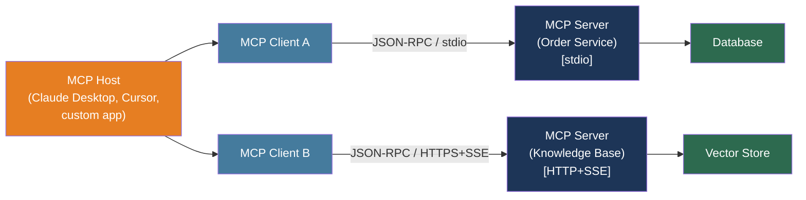

# [BEE-505] Model Context Protocol (MCP)

:::info
The Model Context Protocol is an open standard for connecting AI models to external tools and data sources — replacing the N×M custom integration problem (N models × M data sources) with a single, reusable server-client interface.
:::

## Context

Before November 2024, connecting an LLM application to external tools meant writing a custom integration for every (model, tool) pair. An application using three models and ten data sources required up to thirty separate connectors — each speaking a different dialect of function calling, each tightly coupled to one provider's SDK, each duplicated across teams that all needed the same capability.

Anthropic announced the Model Context Protocol on November 25, 2024 (created by David Soria Parra and Justin Spahr-Summers). MCP is now governed by the Linux Foundation as a vendor-neutral open standard. The protocol is adopted by Claude Desktop, Claude Code, Cursor, Zed, VS Code Copilot, and dozens of other AI tools. OpenAI and Google have both announced MCP support.

The protocol reduces the integration surface from N×M to N+M: any MCP-compatible client can discover and call any MCP server without custom glue code. An enterprise tool team writes one MCP server; every AI application in the organization can consume it immediately.

MCP is structurally analogous to the Language Server Protocol (LSP), which solved the same combinatorial problem for IDE features in 2016. Before LSP, every IDE needed a custom plugin for every language. After LSP, a language server written once worked in every editor that implemented the protocol. MCP applies the same pattern to AI tool integration.

## Protocol Architecture

MCP has three roles:

**MCP Host**: The AI application that manages the user session — Claude Desktop, Cursor, a custom application. The host spawns or connects to multiple MCP servers and coordinates their use by the LLM.

**MCP Client**: A component inside the host that maintains exactly one connection to one MCP server. A host with ten connected servers runs ten clients.

**MCP Server**: A program that exposes tools, resources, and prompts over the MCP protocol. A server can be a local subprocess (stdio transport) or a remote service (HTTP transport).

The message format is JSON-RPC 2.0. Messages are either requests (with an `id`, expecting a response), responses (carrying the result or error for a prior request), or notifications (one-way, no response expected).

```
Client                          Server
  |                               |
  |-- initialize (capabilities) -->|
  |<-- initialized -------------------|
  |                               |
  |-- tools/list ----------------->|
  |<-- [tool definitions] ---------|
  |                               |
  |-- tools/call (name, args) ---->|
  |<-- {content: [...]} -----------|
```

**Transport options**:

| Transport | When to use | Notes |
|-----------|-------------|-------|
| **stdio** | Local process, same machine | Server launched as subprocess; fastest; no network config |
| **HTTP + SSE** | Remote server, multi-tenant | Server streams responses via SSE; supports OAuth 2.0 |

Stdio is the default for developer tools and Claude Desktop. HTTP is the right choice for shared enterprise servers accessed by multiple hosts or users.

## MCP Primitives

An MCP server exposes up to three primitive types:

**Tools** — functions the LLM can call autonomously. The model sees the tool's name, description, and JSON Schema for its parameters, and decides when to invoke it. Tools are model-controlled: the LLM initiates the call.

**Resources** — read-only data identified by URI (e.g., `file:///path/to/file`, `postgres://table/customers`). Resources are application-controlled: the host decides which resources to pull into context, not the model.

**Prompts** — reusable message templates that guide an interaction. Prompts are user-controlled: the human explicitly selects a prompt workflow.

Most backend integrations center on tools. Resources and prompts are supplementary.

## Best Practices

### Implement Servers with Minimal Scope

**MUST** define only the tools required for the specific use case. Each tool added to an MCP server is additional attack surface: the LLM can invoke any tool it knows about, and a prompt injection attack can weaponize any tool in scope.

**MUST** write precise, accurate descriptions for every tool. The LLM reads the description to decide whether and when to call the tool. Ambiguous descriptions cause incorrect invocations; descriptions that reveal sensitive implementation details are an information-disclosure risk.

```python
from mcp.server.fastmcp import FastMCP

mcp = FastMCP("Order Service")

@mcp.tool()
def get_order_status(order_id: str) -> dict:
    """
    Return the current status of an order.

    Args:
        order_id: The UUID of the order (format: xxxxxxxx-xxxx-xxxx-xxxx-xxxxxxxxxxxx).

    Returns a dict with keys: order_id, status, updated_at.
    Status is one of: pending, processing, shipped, delivered, cancelled.
    """
    order = db.get_order(order_id)
    if order is None:
        return {"error": "order_not_found"}
    # Return only the fields the LLM needs — not the full DB row
    return {"order_id": order.id, "status": order.status, "updated_at": order.updated_at.isoformat()}

if __name__ == "__main__":
    mcp.run(transport="stdio")
```

### Validate and Authorize Every Tool Call

**MUST validate** all tool arguments before acting on them. The LLM constructs tool arguments based on its understanding of the schema — it can hallucinate parameter values that pass JSON Schema validation but are semantically wrong (an `order_id` that looks like a valid UUID but belongs to a different user).

**MUST enforce authorization** at the tool execution layer. An MCP server called by a multi-user host must know which user initiated the request and verify that the user has access to the requested resource. OAuth 2.0 scopes or short-lived bearer tokens issued per user are the standard mechanism for remote HTTP servers.

**MUST NOT** assume that because the request arrived via MCP it is authorized. The protocol authenticates the client, not the end user. Authorization is the server's responsibility.

```python
@mcp.tool()
def cancel_order(order_id: str, user_token: str) -> dict:
    """Cancel an order. Requires the authenticated user's session token."""
    user = auth.verify_token(user_token)            # verify identity
    order = db.get_order(order_id)
    if order is None or order.owner_id != user.id:  # enforce authorization
        return {"error": "not_found_or_forbidden"}
    if order.status not in ("pending", "processing"):
        return {"error": "cannot_cancel", "current_status": order.status}
    db.cancel_order(order_id)
    return {"order_id": order_id, "status": "cancelled"}
```

### Treat Tool Output as Untrusted Content

**MUST sanitize or validate data** that flows from external sources through an MCP tool back to the LLM. If a tool fetches a web page, reads a document, or queries an external API and returns the raw result verbatim, an attacker who controls that content can inject instructions into the LLM's context — a form of indirect prompt injection mediated by the MCP server.

The principle: an MCP server is a trust boundary. Data from outside the server must be treated as untrusted before being passed to the model, just as user input is validated before being passed to a database.

**SHOULD** return structured, schema-validated responses from tools rather than raw strings. A tool that returns `{"status": "shipped", "carrier": "FedEx"}` gives the model clean data; a tool that returns an entire raw HTML page gives the model an injection vector.

### Audit All Tool Invocations

**MUST log** every tool invocation with: timestamp, user identity (if available), tool name, arguments, and outcome. MCP servers can be invoked by multiple AI clients; without centralized audit logging, there is no visibility into what the AI systems are doing.

**SHOULD emit OpenTelemetry spans** for each tool call. Distributed tracing ties the tool invocation to the upstream LLM request, the user session, and any downstream operations, enabling end-to-end debugging of agent workflows.

### Secure Remote Servers

**SHOULD use OAuth 2.0** for any MCP server deployed over HTTP that serves multiple users or clients. The MCP specification includes OAuth 2.0 guidance for authorization code flows, token scoping, and audience-restricted tokens.

**SHOULD enforce rate limiting** per client or per user at the HTTP transport layer. An LLM agent in a loop can generate hundreds of tool calls per minute; rate limiting prevents runaway agents from exhausting downstream resources.

**MUST use TLS** (HTTPS) for all remote MCP connections. MCP messages carry tool arguments and results that may include sensitive data; plaintext transport is not acceptable.

### Choose stdio vs HTTP Deliberately

Use **stdio** when:
- The MCP server runs on the same machine as the host (development tools, Claude Desktop)
- No multi-tenancy is needed
- Startup latency and network configuration are undesirable

Use **HTTP** when:
- The server is shared across multiple hosts or users
- The server needs to run in the cloud or a different network segment
- Per-user authentication and authorization are required
- You want to run the server as a managed service with independent scaling

## Visual



One host runs multiple clients — one client per server. Servers are independent services: they can be deployed locally (stdio) or remotely (HTTP+SSE) without changing the host's integration logic.

## Comparison to Alternatives

| | OpenAI function calling | LangChain tools | MCP |
|--|------------------------|-----------------|-----|
| **Standard** | Provider-specific | Framework-specific | Open protocol (Linux Foundation) |
| **Tool discovery** | Static (defined at build time) | Static | Dynamic (discovered at runtime via `tools/list`) |
| **Model portability** | OpenAI only | LangChain ecosystem | Any MCP-compatible host |
| **Deployment** | Inside application code | Inside application code | Independent server process |
| **Multi-user auth** | Application responsibility | Application responsibility | OAuth 2.0 specified in protocol |
| **Analogy** | Database driver | ORM | ODBC |

MCP's key architectural difference is that tool definitions live outside the application. Deploying a new tool means starting a new MCP server — no application redeployment, no SDK upgrade.

## Related BEEs

- [BEE-30001](llm-api-integration-patterns.md) -- LLM API Integration Patterns: MCP servers are invoked via the LLM's tool use mechanism; the same token management, retry, and observability patterns apply
- [BEE-30002](ai-agent-architecture-patterns.md) -- AI Agent Architecture Patterns: agents that use MCP servers must still apply step limits, loop detection, and tool authorization — MCP is a transport layer, not a security layer
- [BEE-19048](../distributed-systems/service-to-service-authentication.md) -- Service-to-Service Authentication: remote MCP servers require authenticated connections; the same bearer token and OAuth 2.0 patterns used for service-to-service auth apply
- [BEE-4006](../api-design/api-error-handling-and-problem-details.md) -- API Error Handling and Problem Details: MCP tool error responses follow structured formats; servers should return machine-readable error codes, not raw exception messages

## References

- [Anthropic. Introducing the Model Context Protocol — anthropic.com, November 2024](https://www.anthropic.com/news/model-context-protocol)
- [Model Context Protocol. Official Specification — modelcontextprotocol.io](https://modelcontextprotocol.io/specification/2025-11-25)
- [Model Context Protocol. Architecture Overview — modelcontextprotocol.io](https://modelcontextprotocol.io/docs/learn/architecture)
- [Model Context Protocol. Python SDK — github.com/modelcontextprotocol/python-sdk](https://github.com/modelcontextprotocol/python-sdk)
- [Model Context Protocol. TypeScript SDK — github.com/modelcontextprotocol/typescript-sdk](https://github.com/modelcontextprotocol/typescript-sdk)
- [OWASP. MCP Top 10 — owasp.org](https://owasp.org/www-project-mcp-top-10/)
- [OWASP. A Practical Guide for Secure MCP Server Development — genai.owasp.org](https://genai.owasp.org/resource/a-practical-guide-for-secure-mcp-server-development/)
- [OWASP. MCP Security Cheat Sheet — cheatsheetseries.owasp.org](https://cheatsheetseries.owasp.org/cheatsheets/MCP_Security_Cheat_Sheet.html)
- [Model Context Protocol. Security Best Practices — modelcontextprotocol.io](https://modelcontextprotocol.io/docs/tutorials/security/security_best_practices)
- [Model Context Protocol. Official Server Registry — registry.modelcontextprotocol.io](https://registry.modelcontextprotocol.io/)
