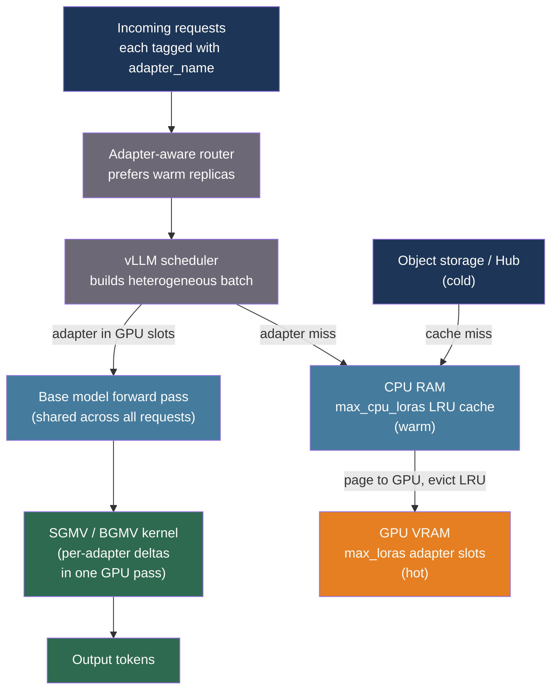

# [BEE-30060] Multi-LoRA Serving and Adapter Management

:::info
LoRA fine-tuning produces compact adapter weights (10–100 MB) that specialize a base model for a specific domain or tenant. Serving each adapter as a separate model copy is infeasible at scale. Dedicated multi-LoRA serving systems share the base model across thousands of concurrent adapters, batch computation across heterogeneous adapters with custom GPU kernels, and page adapter weights through a GPU/CPU/disk cache hierarchy — achieving throughput within 10% of a single-model server.
:::

## Context

Low-Rank Adaptation (LoRA), introduced by Hu et al. (arXiv:2106.09685, 2021), fine-tunes a model by adding pairs of low-rank matrices A and B to selected weight matrices, with the update expressed as ΔW = B·A. Only A and B are trained; the base model is frozen. For a weight matrix of shape (d_in, d_out) with rank r, the adapter stores r·(d_in + d_out) parameters — typically 10–100 MB per adapter versus 14 GB for Llama-7B in bf16. This makes per-tenant or per-use-case fine-tuning economically viable.

The serving problem is that naive multi-adapter deployment merges each adapter into a separate copy of the base model, requiring N full GPU memory allocations for N adapters. At five adapters, an A100 80 GB runs out of memory with Llama-7B. Two complementary research efforts at MLSys 2024 addressed this:

**Punica** (Chen et al., arXiv:2310.18547, MLSys 2024) solved the compute problem. In standard LLM inference, all requests in a batch share one base model weight matrix, so a single batched GEMM covers the whole batch. LoRA adds a per-request delta y_i += x_i · A_i · B_i where A_i, B_i differ per request. Punica introduced SGMV (Segmented Gather Matrix-Vector Multiplication), a CUDA kernel that groups requests by adapter identity and executes batched GEMMs per group, using Tensor Cores in the prefill stage. For single-token decoding, the simpler BGMV (Batched Gather Matrix-Vector Multiplication) handles the memory-bound regime. In practice, adapter heterogeneity within a batch adds negligible latency: SGMV at batch size 64 with all-distinct adapters costs 116 µs vs 37 µs for all-identical — a 3x overhead that is dwarfed by the base model's attention computation. The headline result: Punica achieves 12x higher throughput than state-of-the-art multi-LoRA baselines and comes within 8–12% of a backbone-only vLLM server (1,044 vs 1,140 tokens/s for Llama-7B on A100).

**S-LoRA** (Sheng et al., arXiv:2311.03285, MLSys 2024) solved the memory problem. It extends PagedAttention's paged memory manager to handle both KV cache tensors and LoRA adapter weights in the same unified pool. Since LoRA matrices have a dimension equal to the model's hidden size d, setting the page size to d means both tensor types are managed in uniform d-vector pages with no fragmentation. Adapters not currently in use live in CPU RAM and are paged to GPU on demand; S-LoRA tested 2,000 concurrent adapters on a single A100 80 GB where vLLM-packed OOMs past 5 adapters and achieves 4x higher throughput than vLLM-packed at equivalent load. S-LoRA incorporates both MBGMM (prefill) and MBGMV (decode) kernels derived from Punica's design, adapted for non-contiguous paged memory.

**dLoRA** (Wu et al., USENIX OSDI 2024) added dynamic adapter management: per-batch, the scheduler decides whether to merge the adapter into the base model weights (more efficient when one adapter dominates the batch) or to keep adapters separate and use SGMV-style batching (more efficient for heterogeneous workloads). dLoRA's credit-based scheduler achieves up to 57.9x higher throughput than vanilla vLLM and 1.8x lower average latency than S-LoRA for mixed workloads.

## Best Practices

### Understand adapter memory before setting serving parameters

**MUST** calculate expected adapter memory to size the CPU cache correctly. For a model with hidden dimension d, adapted across L transformer layers at rank r in bf16:

```
adapter_bytes = 2 * r * d * L * 2   # factor of 2: A matrix + B matrix; 2 bytes for bf16

# Llama-3.1-8B: d=4096, L=32, r=16, adapting q_proj + v_proj only (2 matrices per layer)
# = 2 * 16 * 4096 * 32 * 2 * 2 = 33,554,432 bytes ≈ 32 MB per adapter
# 1,000 adapters in CPU RAM: ~32 GB  (feasible on a modern server node)
```

Concrete sizes for common models at bf16, adapting q, k, v, o projections (4 matrices per layer):

| Model | Rank | Adapter size |
|---|---|---|
| Llama-3.1-8B (d=4096, L=32) | 8 | 32 MB |
| Llama-3.1-8B | 16 | 64 MB |
| Llama-3.1-8B | 64 | 256 MB |
| Llama-3.1-70B (d=8192, L=80) | 16 | 512 MB |
| Llama-3.1-70B | 64 | 2,048 MB |

**MUST NOT** set `--max-lora-rank` higher than the maximum rank any adapter actually uses. vLLM pre-allocates GPU memory for this rank across all active adapter slots; over-provisioning wastes GPU memory that could serve requests.

### Configure vLLM's multi-LoRA engine for production

**SHOULD** use vLLM's built-in multi-LoRA support rather than running multiple server instances. Key parameters:

```python
from vllm import LLM, SamplingParams
from vllm.lora.request import LoRARequest

llm = LLM(
    model="meta-llama/Llama-3.1-8B-Instruct",
    enable_lora=True,
    max_loras=4,           # adapters GPU-resident simultaneously in one batch
    max_cpu_loras=32,      # CPU LRU cache size; must be >= max_loras
    max_lora_rank=16,      # pre-allocates GPU memory for this rank
)

# Each request specifies its adapter by name and path
outputs = llm.generate(
    ["Summarize the following contract:..."],
    SamplingParams(temperature=0.0, max_tokens=256),
    lora_request=LoRARequest(
        lora_name="legal-summarizer",          # logical name for routing
        lora_int_id=1,                         # integer ID for batch tracking
        lora_path="s3://adapters/legal-v2/",  # HuggingFace Hub, S3, or local path
    ),
)
```

For the OpenAI-compatible HTTP API, specify the adapter as the `model` field:

```bash
# Adapter pre-registered at startup with --lora-modules legal-summarizer=s3://adapters/legal-v2
curl http://localhost:8000/v1/completions \
  -H "Content-Type: application/json" \
  -d '{
    "model": "legal-summarizer",
    "prompt": "Summarize the following contract clause:",
    "max_tokens": 256
  }'
```

**Dynamic loading at runtime** (avoids server restart when adding new adapters):

```bash
# Enable dynamic loading
export VLLM_ALLOW_RUNTIME_LORA_UPDATING=True

# Load a new adapter without restarting
curl -X POST http://localhost:8000/v1/load_lora_adapter \
  -H "Content-Type: application/json" \
  -d '{"lora_name": "medical-coder", "lora_path": "s3://adapters/medical-v1/"}'

# Hot-reload updated adapter weights in place (e.g., after an RL training step)
curl -X POST http://localhost:8000/v1/load_lora_adapter \
  -H "Content-Type: application/json" \
  -d '{"lora_name": "policy-v3", "lora_path": "s3://adapters/policy-v3/", "load_inplace": true}'

# Unload an adapter to free its CPU cache slot
curl -X DELETE http://localhost:8000/v1/unload_lora_adapter \
  -H "Content-Type: application/json" \
  -d '{"lora_name": "deprecated-adapter"}'
```

### Route requests to replicas that already hold the adapter

**SHOULD** implement adapter-aware routing in the load balancer layer to minimize costly GPU↔CPU swaps. A replica that already has the requested adapter GPU-resident processes the request at full speed; routing to a cold replica forces an adapter load (2 ms for a 64 MB adapter) that stalls the batch.

```python
from collections import defaultdict
from typing import Optional
import random

class AdapterAwareRouter:
    """
    Routes requests to the replica most likely to have the adapter GPU-resident.
    Falls back to random assignment when no warm replica exists.
    """

    def __init__(self, replicas: list[str]) -> None:
        self.replicas = replicas
        # Track which adapters each replica has GPU-resident (max_loras slots)
        self._hot: dict[str, set[str]] = {r: set() for r in replicas}

    def route(self, adapter_name: str) -> str:
        warm = [r for r in self.replicas if adapter_name in self._hot[r]]
        return random.choice(warm) if warm else random.choice(self.replicas)

    def notify_loaded(self, replica: str, adapter_name: str, evicted: Optional[str]) -> None:
        """Call after the serving engine reports an adapter was paged to GPU."""
        self._hot[replica].add(adapter_name)
        if evicted:
            self._hot[replica].discard(evicted)
```

For Kubernetes deployments, **SHOULD** set `sessionAffinity: ClientIP` or use a consistent-hash ingress for tenants whose adapter fits within a single replica's `max_loras` budget, keeping their requests on the same replica.

### Apply adapter versioning via path encoding, not name aliasing

**SHOULD** treat adapter names as immutable identifiers and encode version into the storage path. Changing the name requires updating all routing configuration; changing only the path allows in-place reload:

```
# Recommended path convention
s3://adapters/{base_model}/{tenant}/{adapter_name}/{version}/

# Blue-green rollout
s3://adapters/llama-3.1-8b/acme/legal-summarizer/v3/   # new
s3://adapters/llama-3.1-8b/acme/legal-summarizer/v2/   # old (kept for rollback)

# Promote new version by hot-reloading at the existing logical name
POST /v1/load_lora_adapter {"lora_name": "acme-legal", "lora_path": "...v3/", "load_inplace": true}
# Traffic shifts immediately; v2 path retained for rollback via another inplace reload
```

**MUST NOT** maintain separate logical names for each adapter version in a running server — the CPU LRU cache fills with stale versions that consume cache slots and are never evicted.

### Tune `max_loras` and `max_cpu_loras` together

**SHOULD** size `max_loras` (GPU-resident slots) and `max_cpu_loras` (CPU LRU slots) based on workload:

```python
# Rule of thumb:
# max_loras: number of distinct adapters expected in a single batch window (~100ms)
#            Start at 4-8; increase if adapter miss rate > 5% under peak load.
# max_cpu_loras: number of distinct adapters in the active working set (last ~1 hour)
#                = unique_adapters_used_per_hour * 1.2 (20% buffer)
#
# Memory consumed by CPU LRU cache (estimate):
# cpu_cache_bytes = max_cpu_loras * adapter_size_bytes
# For 32 adapters at 64 MB each = 2 GB of CPU RAM — trivial on modern nodes.
#
# GPU memory consumed by active adapter slots (estimate):
# gpu_adapter_bytes = max_loras * max_lora_rank * d_model * 2 * num_layers * 2
# For max_loras=4, rank=16, Llama-3.1-8B: 4 * 16 * 4096 * 2 * 32 * 2 = 256 MB
```

## Visual



## Common Mistakes

**Running one server process per adapter.** This multiplies base model GPU memory by the number of adapters. Llama-3.1-8B occupies 16 GB in bf16; 10 adapters in separate processes require 160 GB of GPU memory. Multi-LoRA serving keeps one copy of the base model in GPU memory regardless of how many adapters are registered.

**Setting `max_lora_rank` to the maximum possible value (e.g., 256) "for safety."** vLLM allocates GPU memory for rank-256 adapter slots even when your adapters use rank 16. This wastes 16x the expected GPU memory. Always set `max_lora_rank` to the actual maximum rank among your deployed adapters.

**Ignoring adapter locality in the load balancer.** Routing without adapter affinity causes GPU↔CPU swaps on every request when the active adapter count exceeds `max_loras` per replica. A single adapter load takes ~2 ms; at high QPS, this adds seconds of latency per request in pathological cases.

**Using Medusa or speculative decoding alongside multi-LoRA.** Most speculative decoding implementations (including vLLM's EAGLE and Medusa backends) are incompatible with the LoRA adapter path because the draft head or auxiliary heads are trained against the base model, not the adapted weights. Disable speculative decoding when serving LoRA adapters.

**Training adapters at rank 64+ when rank 16 suffices.** Higher rank improves adapter expressiveness marginally for most fine-tuning tasks, but doubles memory per adapter and doubles SGMV kernel computation time. Benchmark adapter quality at ranks 8, 16, and 32 before committing to a higher rank for production.

**Deploying Medusa-fine-tuned models with third-party LoRA adapters.** Medusa heads are fine-tuned jointly with the backbone; adding a separate LoRA adapter that changes the backbone's output distribution invalidates the Medusa head predictions, causing high rejection rates and net-negative latency.

## Related BEEs

- [BEE-18001](../multi-tenancy/multi-tenancy-models.md) -- Multi-Tenancy Models: per-tenant adapter routing is a form of tenant isolation
- [BEE-30021](llm-inference-optimization-and-self-hosting.md) -- LLM Inference Optimization and Self-Hosting: the broader inference optimization landscape
- [BEE-30059](speculative-decoding-for-llm-inference.md) -- Speculative Decoding for LLM Inference: incompatible with most LoRA adapter deployments; choose one

## References

- [Hu et al. LoRA: Low-Rank Adaptation of Large Language Models — arXiv:2106.09685, ICLR 2022](https://arxiv.org/abs/2106.09685)
- [Chen et al. Punica: Multi-Tenant LoRA Serving — arXiv:2310.18547, MLSys 2024](https://arxiv.org/abs/2310.18547)
- [Sheng et al. S-LoRA: Serving Thousands of Concurrent LoRA Adapters — arXiv:2311.03285, MLSys 2024](https://arxiv.org/abs/2311.03285)
- [Wu et al. dLoRA: Dynamically Orchestrating Requests and Adapters for LoRA LLM Serving — USENIX OSDI 2024](https://dl.acm.org/doi/10.5555/3691938.3691987)
- [Li et al. CaraServe: CPU-Assisted and Rank-Aware LoRA Serving — arXiv:2401.11240, 2024](https://arxiv.org/abs/2401.11240)
- [vLLM. LoRA Adapter Documentation — github.com/vllm-project/vllm](https://github.com/vllm-project/vllm/blob/main/docs/features/lora.md)
- [Predibase. LoRAX: The Open-Source Framework for Serving Hundreds of Fine-Tuned LLMs — github.com/predibase/lorax](https://github.com/predibase/lorax)
- [Anyscale. Multi-LoRA Serving with Ray Serve LLM — docs.anyscale.com](https://docs.anyscale.com/llm/serving/multi-lora)
- [NVIDIA. Deploying a Swarm of LoRA Adapters with NIM — developer.nvidia.com](https://developer.nvidia.com/blog/seamlessly-deploying-a-swarm-of-lora-adapters-with-nvidia-nim/)
