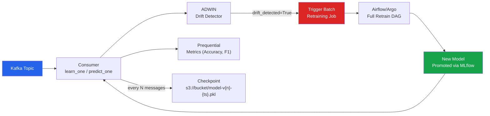

# [BEE-589] Online Learning and Continual Model Updates

:::info
Online learning updates model weights incrementally on each arriving data point without storing or reprocessing historical data. It is the correct approach when data arrives faster than batch retraining cycles can absorb it, when the underlying distribution shifts continuously, or when storage of historical examples is infeasible. The tradeoff is sensitivity to noise and the risk of catastrophic forgetting — overwriting previously learned patterns when concept drift changes the distribution.
:::

## Context

Batch retraining assumes a fixed, i.i.d. dataset and a discrete training window. This breaks for any system where the world changes between retraining cycles: fraud patterns evolve in minutes, recommendation relevance shifts within hours, sensor readings from industrial equipment reflect gradual mechanical wear. The cost of stale models is not theoretical — a credit card fraud model retrained weekly will miss fraud patterns introduced on day two of the week.

The dominant Python library for online ML is **River** (formerly creme, Montiel et al., JMLR 2021, arXiv:2012.04740), which provides a streaming-native API: `learn_one(x, y)` updates the model on a single labeled example, `predict_one(x)` generates a prediction with zero historical state required. River's HoeffdingTreeClassifier, drift detectors (ADWIN, DDM, Page-Hinkley), and pipeline composition make it production-viable without external orchestration.

## The Hoeffding Bound

Hoeffding Trees (Domingos & Hulten, KDD 2000) are the canonical online decision tree. They grow splits using the Hoeffding bound — a distribution-independent guarantee that with probability 1-δ, the attribute chosen on n examples is the same attribute that would be chosen on infinite data, when the information gain difference between the top two attributes exceeds:

```
ε = √(R² ln(1/δ) / 2n)
```

where R is the range of the splitting criterion (log c for information gain with c classes) and n is the number of examples seen at the node. The tree splits only when this bound is satisfied, so it never adds a node that would be reversed with high probability given more data. This is what makes Hoeffding Trees practical for high-speed streams: each example touches only the root-to-leaf path, not the full tree.

## River: Streaming ML in Production

```python
from river import compose, linear_model, preprocessing, drift, metrics, tree

# --- Pipeline composition ---
model = compose.Pipeline(
    preprocessing.StandardScaler(),
    linear_model.LogisticRegression(optimizer=None),  # uses SGD by default
)

# ADWIN drift detector alongside the model
detector = drift.ADWIN(delta=0.002)  # lower delta = less sensitive, fewer false positives
accuracy = metrics.Accuracy()

def process_message(x: dict, y: int) -> dict:
    """Process one Kafka message: predict, evaluate, update, detect drift."""
    prediction = model.predict_one(x)

    accuracy.update(y_true=y, y_pred=prediction)
    detector.update(int(prediction != y))  # feed error rate to ADWIN

    model.learn_one(x, y)  # update weights on this example

    return {
        "prediction": prediction,
        "running_accuracy": accuracy.get(),
        "drift_detected": detector.drift_detected,
        "adwin_width": detector.width,  # current window size
    }
```

**HoeffdingTreeClassifier** for non-linear online problems:

```python
from river import tree, drift

model = tree.HoeffdingTreeClassifier(
    grace_period=200,        # min samples before considering a split
    delta=1e-7,              # Hoeffding confidence (lower = more conservative splits)
    tau=0.05,                # tie-breaking threshold
    leaf_prediction="nba",   # Naive Bayes Adaptive — blends NB with majority vote
    nb_threshold=0,          # switch to NB immediately (no min sample requirement)
)
```

## Kafka Integration

```python
from kafka import KafkaConsumer
from river import compose, preprocessing, linear_model, drift, metrics
import pickle
import boto3
import time

def run_online_learner(
    topic: str,
    bootstrap_servers: list[str],
    checkpoint_interval: int = 10_000,
    s3_bucket: str = "ml-models",
) -> None:
    consumer = KafkaConsumer(
        topic,
        bootstrap_servers=bootstrap_servers,
        value_deserializer=lambda b: json.loads(b.decode()),
        auto_offset_reset="earliest",
        enable_auto_commit=True,
    )

    model = compose.Pipeline(
        preprocessing.StandardScaler(),
        linear_model.LogisticRegression(),
    )
    detector = drift.ADWIN(delta=0.002)
    s3 = boto3.client("s3")
    n = 0

    for msg in consumer:
        payload = msg.value
        x, y = payload["features"], payload["label"]

        model.predict_one(x)       # evaluate before learning (prequential evaluation)
        model.learn_one(x, y)      # update model
        detector.update(0 if ... else 1)  # feed prediction correctness

        n += 1

        if detector.drift_detected:
            trigger_batch_retrain(topic)   # delegate to Airflow/Argo
            detector = drift.ADWIN(delta=0.002)  # reset detector

        if n % checkpoint_interval == 0:
            version = n // checkpoint_interval
            key = f"online-model/v{version}-{int(time.time())}.pkl"
            s3.put_object(Bucket=s3_bucket, Key=key, Body=pickle.dumps(model))
```

Checkpoint keys embed both a logical version (`v3`) and a wall-clock timestamp. This allows both ordered recovery (restore latest version) and temporal audit (which model was active at time T).

## ADWIN: Adaptive Windowing

ADWIN (Bifet & Gavaldà, SIAM SDM 2007) maintains a variable-size window of the most recent observations. It continuously partitions the window into two subwindows and tests whether their means differ by more than the Hoeffding bound. When they do, it discards the older subwindow — the older distribution is gone.

```
Window: [---older---][---recent---]
If |mean(older) - mean(recent)| > ε_Hoeffding → drift detected, drop older half
```

ADWIN's delta parameter (`ADWIN(delta=0.002)`) controls the false positive rate. A lower delta requires a larger mean difference to trigger, reducing false alarms from natural noise. For high-noise domains (fraud, clickstream), delta=0.002 is a reasonable starting point.

## Warm-Start Retraining vs. `partial_fit()`

These are distinct mechanisms that are frequently confused:

| Mechanism | What it does | When to use |
|---|---|---|
| `warm_start=True` (RF/GBM) | Adds new trees; does NOT update existing trees | Add capacity without discarding learned structure |
| `partial_fit()` (SGDClassifier) | Updates weights on a new mini-batch via SGD | True incremental learning for linear models |
| River `learn_one()` | Updates weights on a single example | Streaming with per-message latency budget |

```python
from sklearn.linear_model import SGDClassifier

clf = SGDClassifier(loss="log_loss", random_state=42)
clf.partial_fit(X_batch, y_batch, classes=[0, 1])   # first call must include classes=

# New data arrives in next window
clf.partial_fit(X_new, y_new)   # updates weights; does NOT re-initialize
```

`warm_start=True` on a RandomForestClassifier does not update the decision boundaries of existing trees. It adds new trees estimated on the combined old+new dataset — useful for adding capacity, not for concept adaptation.

## Catastrophic Forgetting and EWC

Naive online learning on a non-stationary distribution suffers catastrophic forgetting: gradient updates that fit new data overwrite weights that encoded old patterns. For deep models, Elastic Weight Consolidation (EWC, Kirkpatrick et al., PNAS 2017, arXiv:1612.00796) adds a quadratic penalty to the loss that slows learning on weights that were important for previous tasks:

```
L_EWC(θ) = L_new(θ) + (λ/2) Σᵢ Fᵢ (θᵢ - θ*ᵢ)²
```

where F_i is the diagonal of the Fisher information matrix (measuring how important weight i was for the previous task) and θ* are the weights after the previous task. EWC is primarily relevant for neural networks trained with gradient descent; River's tree and linear models use explicit windowing (ADWIN) instead.

## Prequential Evaluation

Standard train/test split evaluation is invalid for streaming data because it leaks temporal information. Prequential (predictive-sequential) evaluation (Dawid & Vovk, Bernoulli, 1999) uses interleaved test-then-train: each example is evaluated *before* the model learns from it, preserving temporal ordering.

```python
from river import metrics

accuracy = metrics.Accuracy()
precision = metrics.Precision()
recall = metrics.Recall()

for x, y in data_stream:
    y_pred = model.predict_one(x)         # test first
    accuracy.update(y_true=y, y_pred=y_pred)
    precision.update(y_true=y, y_pred=y_pred)
    recall.update(y_true=y, y_pred=y_pred)

    model.learn_one(x, y)                 # then train
```

Because each sample serves as both test and training data in sequence, prequential accuracy converges to the true accuracy of the model at steady state even for non-stationary distributions.



## Common Mistakes

**Using batch accuracy metrics on streaming data.** Reporting accuracy on a held-out test set from before drift is meaningless — the distribution has changed. Always use prequential metrics that reflect current model performance on the live stream.

**Ignoring drift after triggering retrain.** When ADWIN triggers a full retraining job (Airflow DAG, Argo Workflow), the online model continues learning on the drifted distribution until the new batch-trained model is promoted. Reset the ADWIN detector after triggering to avoid double-triggering, but do not stop online learning during the retraining window.

**Setting ADWIN delta too low.** `delta=1e-10` detects every minor fluctuation as drift. Natural data noise produces variance in error rates. Start with `delta=0.002` and tune based on false positive rate in staging — count triggered retrains that produced no meaningful accuracy improvement.

**Using `learn_one()` for deep neural networks.** River is designed for structured, tabular data with linear or tree-based learners. For deep models on image or text data, use replay buffers, EWC, or progressive networks — `learn_one()` style SGD on a single sample produces too much gradient variance.

**Not versioning checkpoints by timestamp.** A checkpoint identified only by `model-latest.pkl` prevents post-hoc attribution of predictions to a specific model state. Always include both a logical version number and a Unix timestamp in the key.

## Related BEEs

- [BEE-585 ML Monitoring and Drift Detection](585) — population-level drift detection complements ADWIN's per-prediction detection
- [BEE-584 Shadow Mode and Canary Deployment for ML Models](584) — validate the retrained model before promoting it to replace the online learner
- [BEE-586 ML Experiment Tracking and Model Registry](586) — track each checkpoint and batch-retrained model in MLflow for auditability
- [BEE-529 AI Workflow Orchestration](529) — Airflow/Argo DAGs triggered by drift detection for batch retraining

## References

- Montiel, J., et al. (2021). River: machine learning for streaming data in Python. JMLR, 22(110). arXiv:2012.04740. https://arxiv.org/abs/2012.04740
- River documentation and API reference. https://riverml.xyz/
- Domingos, P., & Hulten, G. (2000). Mining high-speed data streams. KDD 2000. https://homes.cs.washington.edu/~pedrod/papers/kdd00.pdf
- Bifet, A., & Gavaldà, R. (2007). Learning from time-changing data with adaptive windowing. SIAM SDM 2007. https://epubs.siam.org/doi/10.1137/1.9781611972771.42
- Kirkpatrick, J., et al. (2017). Overcoming catastrophic forgetting in neural networks. PNAS, 114(13), 3521–3526. arXiv:1612.00796. https://www.pnas.org/doi/10.1073/pnas.1611835114
- Dawid, A. P., & Vovk, V. (1999). Prequential probability: principles and properties. Bernoulli, 5(1), 125–162. https://projecteuclid.org/journals/bernoulli/volume-5/issue-1/Prequential-probability-principles-and-properties/bj/1173707098.full
- scikit-learn: SGDClassifier partial_fit. https://scikit-learn.org/stable/modules/generated/sklearn.linear_model.SGDClassifier.html
- Waehner, K. (2025). Online model training and model drift with Apache Kafka and Flink. https://www.kai-waehner.de/blog/2025/02/23/online-model-training-and-model-drift-in-machine-learning-with-apache-kafka-and-flink/
