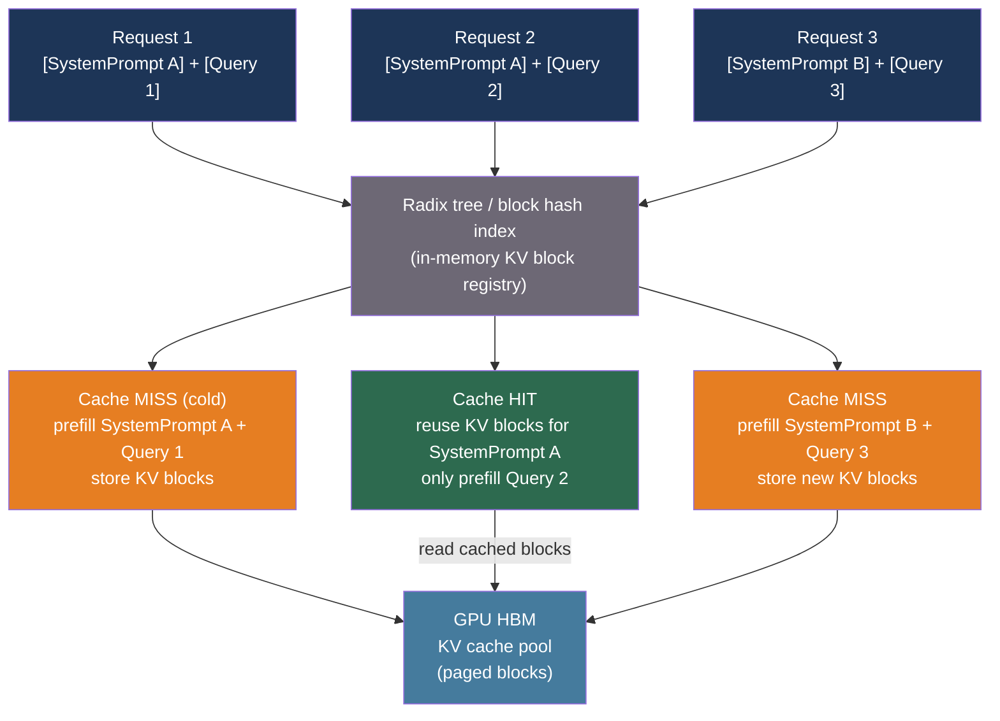

# [BEE-565] Prefix Caching and KV Cache Reuse

:::info
When many LLM requests share a common prefix — a system prompt, retrieved document, or few-shot examples — the prefill computation for that prefix is repeated identically for every request. Prefix caching stores the resulting KV tensors and reuses them across requests, cutting TTFT by up to 86% and API cost by up to 90% for long shared prompts.
:::

## Context

The prefill phase of LLM inference computes a KV (Key-Value) cache entry for every input token. These intermediate tensors are used by subsequent attention layers and are proportional in size to sequence length. For a 10,000-token system prompt, prefill takes several seconds and produces gigabytes of KV data — data that is identical across every request that sends the same prompt.

Without prefix caching, 100 concurrent users with the same 2,000-token system prompt cause 100 independent prefill computations. Each produces an identical KV tensor at the cost of GPU FLOPS and memory bandwidth proportional to prefix_length × n_layers × head_dim². The KV tensor is discarded after each request.

Prefix caching breaks this pattern. The first request computes and stores the KV tensor; subsequent requests skip prefill for the cached prefix and resume inference from the cache hit boundary. TTFT becomes proportional to the uncached suffix length, not the full prompt length. For a Qwen3-32B model with a 10,000-token cached prefix, TTFT drops from 4.3 seconds to 0.6 seconds — an 86% reduction.

**RadixAttention**, introduced in SGLang (Zheng et al., arXiv:2312.07104, NeurIPS 2024), implemented the first general prefix caching mechanism for LLM serving. SGLang maintains a radix tree mapping token prefix sequences to their KV cache blocks in GPU memory. When a new request arrives, the scheduler walks the tree to find the longest matching prefix; only the unmatched suffix undergoes prefill. LRU eviction removes leaf nodes first. A cache-aware scheduler sorts incoming requests by matched prefix length — approximating depth-first tree traversal — to maximize reuse. Production deployments of Vicuna-33B achieved 74.1% cache hit rates and 1.7× average TTFT reduction; LLaVA-NeXT-34B achieved 52.4% hit rates and up to 6× throughput improvement over comparable baselines.

**vLLM Automatic Prefix Caching (APC)** extends PagedAttention with block-level hash-based reuse. Each 16-token KV block is identified by a SHA-256 hash chained from its parent block's hash and the token IDs in the block. Chained hashing means a single hash lookup validates the entire matching prefix. APC is enabled by default in current vLLM versions. For workloads with high prefix overlap, it delivers ~13% throughput improvement and ~10% TPOT reduction; on workloads with no overlap, it adds ~37% overhead due to scheduler cost.

At the API layer, Anthropic (prompt caching, GA December 2024) and OpenAI (automatic prefix caching) expose server-side KV reuse without infrastructure management. Anthropic's API requires explicit `cache_control` breakpoints; OpenAI's detects shared prefixes automatically at 128-token granularity. Anthropic benchmarks show 79–90% TTFT reduction and 53–90% cost reduction for long-prompt workloads.

## Best Practices

### Place static content before dynamic content at every boundary

**MUST** structure prompts with stable content before variable content. Cache hits require an exact token-level prefix match from the beginning of the prompt to the cache boundary. Any character change in a cached segment invalidates that segment and all downstream content.

```python
import anthropic

client = anthropic.Anthropic()

# System prompt: large, static, cacheable
SYSTEM_PROMPT = """You are a legal document analyst.
[... 5,000 tokens of stable instructions and domain knowledge ...]"""

def analyze_clause(user_query: str, doc_excerpt: str) -> str:
    response = client.messages.create(
        model="claude-sonnet-4-6",
        max_tokens=1024,
        system=[
            {
                "type": "text",
                "text": SYSTEM_PROMPT,
                "cache_control": {"type": "ephemeral"},  # mark cache boundary
            }
        ],
        messages=[
            {
                "role": "user",
                # Dynamic content goes AFTER the cached system prompt,
                # not inside it. A timestamp or user ID inside the
                # cached block would invalidate every cache entry.
                "content": f"Analyze this clause:\n\n{doc_excerpt}\n\nQuestion: {user_query}",
            }
        ],
    )
    return response.content[0].text
```

**MUST NOT** include timestamps, request IDs, per-user identifiers, or any content that changes per-request inside a cached segment. For Anthropic's API, the maximum is 4 cache breakpoints per request; place them at the end of each stable section.

### Standardize system prompts as versioned artifacts

**SHOULD** treat system prompts as code — version-controlled, reviewed, and deployed atomically. A single character difference (trailing whitespace, different quote style, reordered fields) breaks the cache and causes a prefill regression that appears as TTFT spikes.

```python
# prompts/legal_analyst_v3.txt — committed to version control
SYSTEM_PROMPT_HASH = "sha256:a3f4..."  # verified at deploy time

def load_system_prompt(version: str) -> str:
    """Load prompt from a content-addressed store to guarantee immutability."""
    path = f"prompts/legal_analyst_{version}.txt"
    return open(path).read()

# Runtime: verify the prompt hasn't drifted before using it
import hashlib

def get_verified_prompt(version: str) -> str:
    text = load_system_prompt(version)
    digest = "sha256:" + hashlib.sha256(text.encode()).hexdigest()
    assert digest == SYSTEM_PROMPT_HASH, f"Prompt drift detected: {digest}"
    return text
```

### Enable APC in vLLM and measure cache hit rate

**SHOULD** enable vLLM's Automatic Prefix Caching and monitor its hit rate before declaring a performance target met:

```python
from vllm import LLM, SamplingParams

llm = LLM(
    model="meta-llama/Llama-3.1-8B-Instruct",
    enable_prefix_caching=True,   # enabled by default in current vLLM
    gpu_memory_utilization=0.85,   # leave headroom for cached KV blocks
)

# Prefix-sharing workload: all requests start with the same system prompt
SHARED_PREFIX = "You are a helpful assistant. " * 200  # ~400 tokens

requests = [
    f"{SHARED_PREFIX}Question: {q}"
    for q in ["What is RAG?", "Explain GQA.", "What is speculative decoding?"]
]

outputs = llm.generate(requests, SamplingParams(temperature=0.0, max_tokens=100))

# Inspect prefix cache metrics via vLLM's /metrics endpoint (Prometheus)
# vllm:gpu_prefix_cache_hit_rate — target > 0.5 for prefix-heavy workloads
# vllm:gpu_prefix_cache_queries_total — total lookups
```

**SHOULD NOT** enable APC for workloads with no prefix sharing. On random-prefix workloads, APC adds ~37% overhead from scheduler hash computation and lookup with no benefit. Disable with `--no-enable-prefix-caching` in those cases.

### Use cache_salt for tenant isolation in multi-tenant deployments

**SHOULD** apply a per-tenant `cache_salt` in vLLM multi-tenant deployments to prevent cross-tenant cache sharing and mitigate timing side-channel leakage:

```python
from vllm import LLM
from vllm.inputs import TokensPrompt

llm = LLM(model="...", enable_prefix_caching=True)

# Each tenant gets a different salt — their caches never intersect
def make_request(prompt: str, tenant_id: str) -> dict:
    return {
        "prompt": prompt,
        "cache_salt": tenant_id,  # incorporated into block hash chain
    }
```

The `cache_salt` is hashed into the first block's identifier, ensuring that even identical prompt prefixes produce different cache keys for different tenants. This trades approximately 38% higher TTFT and some throughput for isolation guarantees.

### Size the KV cache to hold working-set prefixes

**MUST** account for prefix cache resident memory when sizing the KV cache allocation. A 10,000-token prefix cached across all layers of Llama-3.1-8B in bf16 occupies:

```
prefix_kv_bytes = 2 * n_kv_heads * head_dim * n_layers * prefix_len * 2
                = 2 * 8 * 128 * 32 * 10_000 * 2  # bytes
                = 1,310,720,000 bytes ≈ 1.25 GB
```

If the prefix cache holds 10 distinct 10,000-token prefixes, that is 12.5 GB of KV cache consumed by cached (non-active) entries — memory unavailable for active requests. Set `gpu_memory_utilization` and `max_model_len` with the prefix working set in mind.

## Comparison

| System | Granularity | Breakpoints | TTL | Cost model | Isolation |
|---|---|---|---|---|---|
| SGLang RadixAttention | Token-level (radix tree) | Automatic | LRU | Open-source (self-hosted) | Single-tenant or per-salt |
| vLLM APC | 16-token blocks (hash chained) | Automatic | LRU | Open-source (self-hosted) | Per `cache_salt` |
| Anthropic API | Content block boundary | Explicit `cache_control` | 5 min (ephemeral), 1 hr (extended) | 1.25x write, 0.1x read | Organization / workspace |
| OpenAI API | 128-token increments | Automatic | 5–60 min (LRU) | 0.5x read (no write charge) | Organization |

## Visual



## Common Mistakes

**Placing variable content before fixed content.** A system prompt that embeds a per-request timestamp (e.g., `"Today is 2026-04-15."`) at the beginning invalidates the cache for every request because the prefix differs. Move all dynamic content to the user turn, after the last cache breakpoint.

**Expecting prefix caching to speed up token generation.** Prefix caching only accelerates the prefill phase (TTFT). The decode phase — generating each output token — is unaffected. For workloads with short prompts and long outputs (e.g., story generation, code generation), the benefit is minimal. Use load testing (BEE-560) to measure actual TTFT vs. TPOT for your specific workload.

**Assuming cold cache in benchmarks.** The first request to a cold cache pays full prefill cost and a cache-write overhead (25% extra at Anthropic). Benchmarks that run only one request, or that restart the server between runs, will show prefix caching as net-negative. Run at least 5+ warm requests before measuring TTFT.

**Not versioning system prompts.** A system prompt change mid-deployment — a typo fix, an added sentence — invalidates all existing cache entries and causes a TTFT spike for all users until the new prompt is cached. Deploy prompt changes with a deliberate warm-up strategy: route a small percentage of traffic through the new prompt first, allow the cache to warm, then cut over.

**Ignoring the Anthropic break-even analysis.** Anthropic's 5-minute ephemeral cache charges 1.25× the input token price to write and 0.1× to read. If a cached prefix is written once but never hit within its TTL, you paid 25% more than no caching. Prefix caching is cost-positive only when the expected number of reads within the TTL exceeds `1 / (1 - 0.1/1.25)` ≈ 1.09 reads — so even a single re-use within 5 minutes breaks even. For high-traffic prefixes this is trivially satisfied; for rare prompts it may not be.

**Using prefix caching as a substitute for semantic caching.** Prefix caching requires exact token-level match. Semantically identical prompts with different wording ("You are helpful" vs. "Be helpful") miss the cache. For near-duplicate prompt deduplication, semantic caching (BEE-558) is the complementary tool.

## Related BEEs

- [BEE-30024](llm-caching-strategies.md) -- LLM Caching Strategies: response-level caching, distinct from KV tensor reuse
- [BEE-30056](semantic-caching-for-llm-applications.md) -- Semantic Caching for LLM Applications: embedding-based near-duplicate detection, complements exact prefix caching
- [BEE-30058](llm-load-testing-and-capacity-planning.md) -- LLM Load Testing and Capacity Planning: TTFT measurement for validating prefix cache gains
- [BEE-30062](flashattention-and-efficient-attention-kernels.md) -- FlashAttention and Efficient Attention Kernels: prefill computation that prefix caching avoids

## References

- [Zheng et al. SGLang: Efficient Execution of Structured Language Model Programs — arXiv:2312.07104, NeurIPS 2024](https://arxiv.org/abs/2312.07104)
- [Kwon et al. Efficient Memory Management for Large Language Model Serving with PagedAttention — arXiv:2309.06180, SOSP 2023](https://arxiv.org/abs/2309.06180)
- [vLLM. Automatic Prefix Caching — docs.vllm.ai](https://docs.vllm.ai/en/latest/features/automatic_prefix_caching/)
- [Anthropic. Prompt Caching — claude.com/blog/prompt-caching](https://claude.com/blog/prompt-caching)
- [Anthropic. Prompt Caching API Documentation — platform.claude.com](https://platform.claude.com/docs/en/docs/build-with-claude/prompt-caching)
- [OpenAI. Prompt Caching Announcement — openai.com](https://openai.com/index/api-prompt-caching/)
- [LMSYS. Fast and Expressive LLM Inference with RadixAttention and SGLang — lmsys.org](https://www.lmsys.org/blog/2024-01-17-sglang/)
