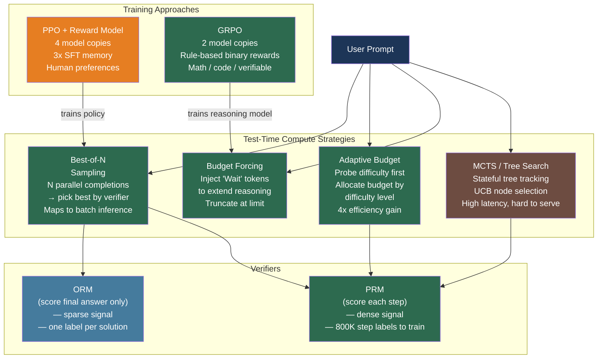

# [BEE-30072] Process Reward Models and Test-Time Compute Scaling

:::info
Scaling inference compute — generating more candidate solutions and selecting the best using a verifier — can outperform scaling training compute. A small model with 64x more inference budget can surpass a model 14x larger; the key bottleneck is having a reliable verifier to distinguish correct from incorrect outputs.
:::

## Context

LLM capability improvements traditionally came from scaling training: more parameters, more data, more compute. OpenAI's o1 (2024) demonstrated an orthogonal axis: **test-time compute scaling** — training models to think longer and use more inference tokens, with performance improving predictably as the token budget grows. DeepSeek-R1 (arXiv:2501.12948, January 2025) replicated this with an open recipe, matching o1's performance on AIME 2024 (79.8% vs 79.2%) and MATH-500 (97.3% vs 96.4%) using only rule-based verification and a critic-free RL algorithm.

The central technical question is: how does the model know which candidate solution is correct? Two classes of verifiers address this:

**Outcome Reward Models (ORM)** assign a single correctness label to the final answer. For verifiable domains (math, code), this can be fully automated: compare the numeric answer or run unit tests. For open-ended text, a trained ORM scores the complete response as a single scalar.

**Process Reward Models (PRM)** assign correctness labels to each intermediate reasoning step, not just the final answer. Lightman et al. ("Let's Verify Step by Step", arXiv:2305.20050, ICLR 2024) showed PRMs outperform ORMs significantly: the PRM-trained verifier achieved 78% accuracy on a representative MATH subset, beating the ORM baseline. To train this PRM, OpenAI collected the **PRM800K** dataset — 800,000 step-level human preference labels across 75,000 solutions to 12,000 MATH problems, released at https://github.com/openai/prm800k. Each step receives one of three labels: +1 (correct and helpful), 0 (neutral), or −1 (incorrect).

The shift from ORMs to PRMs is analogous to the shift from outcome-only to process-supervised learning: dense step-level feedback enables the model to identify exactly where reasoning went wrong rather than receiving only a terminal success/failure signal.

## ORM vs PRM Training

**ORM training** is straightforward: add a scalar output head to the LM, train with binary cross-entropy on the EOS token only. The loss is sparse — one label per full solution.

**PRM training** requires step-level supervision. The implementation masks the vocabulary to only reward tokens (+/−) at each step boundary, propagating loss at every step rather than only at EOS:

```python
import torch
import torch.nn as nn
from transformers import AutoModelForCausalLM

class ProcessRewardModel(nn.Module):
    def __init__(self, base_model_name: str):
        super().__init__()
        self.lm = AutoModelForCausalLM.from_pretrained(base_model_name)
        # Two-class output: good step (+1) vs bad step (-1)
        self.reward_head = nn.Linear(self.lm.config.hidden_size, 2)

    def forward(self, input_ids, attention_mask, step_boundary_positions):
        outputs = self.lm(input_ids=input_ids,
                          attention_mask=attention_mask,
                          output_hidden_states=True)
        hidden = outputs.hidden_states[-1]          # (B, T, H)

        # Extract hidden states at step boundaries only
        step_hiddens = hidden[torch.arange(hidden.size(0)).unsqueeze(1),
                              step_boundary_positions]  # (B, num_steps, H)

        # Predict reward for each step
        step_rewards = self.reward_head(step_hiddens)   # (B, num_steps, 2)
        return step_rewards

def prm_loss(step_logits, step_labels, valid_step_mask):
    """
    step_logits: (B, num_steps, 2)
    step_labels: (B, num_steps)  — 1 = correct step, 0 = incorrect
    valid_step_mask: (B, num_steps)  — mask padded steps
    """
    B, S, _ = step_logits.shape
    loss = nn.CrossEntropyLoss(reduction='none')(
        step_logits.view(-1, 2),
        step_labels.view(-1)
    ).view(B, S)
    loss = (loss * valid_step_mask).sum() / valid_step_mask.sum()
    return loss
```

**Monte Carlo estimation** approximates step-level labels without human annotation: for each intermediate step, sample many continuations and measure the fraction that produce a correct final answer. This fraction serves as a soft step-level reward. However, Gu et al. (arXiv:2501.07301, 2025) found that MC estimation consistently underperforms human annotation and LLM-as-judge methods due to policy-dependent noise — steps that are wrong but happen to produce correct answers by chance are rewarded, and vice versa.

## Test-Time Compute Strategies

Given a verifier (ORM or PRM), three main strategies allocate more compute at inference:

### Best-of-N Sampling

Generate N independent complete solutions from the policy, score all with the verifier, return the highest-scoring one. Best-of-N maps directly onto standard batched inference — N completions are independent and parallelizable:

```python
from vllm import LLM, SamplingParams

def best_of_n(
    model: LLM,
    verifier,             # ORM or PRM callable
    prompt: str,
    n: int = 64,
    temperature: float = 0.8,
) -> str:
    sampling_params = SamplingParams(
        n=n,
        temperature=temperature,
        max_tokens=2048,
    )
    outputs = model.generate([prompt], sampling_params)
    candidates = [o.text for o in outputs[0].outputs]

    # Score all candidates; select the best
    scores = [verifier(prompt, c) for c in candidates]
    best_idx = max(range(len(scores)), key=lambda i: scores[i])
    return candidates[best_idx]
```

Brown et al. ("Large Language Monkeys", arXiv:2407.21787) showed that **coverage** (the fraction of problems solved by any of N samples) scales log-linearly with N across four orders of magnitude. On SWE-bench Lite, DeepSeek-Coder-V2-Instruct's coverage grew from 15.9% at N=1 to **56% at N=250**, surpassing the then-state-of-the-art single-sample rate of 43%.

### Adaptive Budget Allocation

Snell et al. (arXiv:2408.03314, 2024) showed that **difficulty-adaptive** best-of-N achieves the same accuracy as uniform best-of-N using **4× fewer samples**. The key insight: problems where the base model has near-0% or near-100% pass@1 gain little from more samples. The 10%–90% difficulty range is where test-time compute pays off most. Allocate based on question difficulty:

```python
def adaptive_best_of_n(model, verifier, prompt: str, total_budget: int) -> str:
    # Step 1: Quick difficulty estimate with a small probe (4 samples)
    probe_params = SamplingParams(n=4, temperature=0.8, max_tokens=512)
    probe_outputs = model.generate([prompt], probe_params)
    probe_solutions = [o.text for o in probe_outputs[0].outputs]
    probe_scores = [verifier(prompt, s) for s in probe_solutions]
    pass_at_probe = sum(1 for s in probe_scores if s > 0.5) / len(probe_scores)

    # Step 2: Allocate remaining budget based on difficulty
    if pass_at_probe > 0.9 or pass_at_probe < 0.1:
        # Easy or near-impossible — use minimum samples
        n = 4
    elif pass_at_probe > 0.7:
        n = total_budget // 4
    else:
        n = total_budget   # Hard problems get full budget

    # Step 3: Best-of-N with allocated budget
    return best_of_n(model, verifier, prompt, n=n)
```

### Budget Forcing for Reasoning Models

Muennighoff et al. ("s1: Simple Test-Time Scaling", arXiv:2501.19393) showed that a 32B model fine-tuned on 1,000 carefully curated reasoning examples can outperform o1-preview on AIME 2024 (57% vs 50%) using **budget forcing**: append "Wait" tokens to prevent the model from ending its reasoning chain prematurely, and forcibly truncate once the token budget is reached:

```python
def generate_with_budget_forcing(
    model,
    tokenizer,
    prompt: str,
    min_thinking_tokens: int = 1024,
    max_thinking_tokens: int = 8192,
) -> str:
    thinking_end = "<|end_of_thinking|>"
    inputs = tokenizer(prompt, return_tensors="pt")

    with torch.no_grad():
        output_ids = model.generate(
            **inputs,
            max_new_tokens=max_thinking_tokens,
        )

    generated = tokenizer.decode(output_ids[0], skip_special_tokens=False)

    # If model tries to end thinking too early, inject "Wait" to extend it
    token_count = len(output_ids[0]) - len(inputs.input_ids[0])
    if token_count < min_thinking_tokens and thinking_end in generated:
        # Mask end-of-thinking token and force continuation
        generated = generated.replace(thinking_end, "\nWait,", 1)

    return generated
```

## GRPO: Training Reasoning Models Without a Critic

Training reasoning models with PPO requires four model copies — actor, critic, reward model, and reference — consuming 3× the GPU memory of SFT (see BEE-30071). **GRPO (Group Relative Policy Optimization)**, introduced in DeepSeekMath (arXiv:2402.03300) and scaled in DeepSeek-R1 (arXiv:2501.12948), eliminates the critic by estimating the baseline from a group of sampled outputs:

```python
def grpo_loss(
    policy_logps: torch.Tensor,    # (G,) — log probs of G sampled outputs
    ref_logps: torch.Tensor,       # (G,) — log probs under reference model
    rewards: torch.Tensor,         # (G,) — rule-based rewards (0 or 1)
    epsilon: float = 0.2,          # PPO clip range
    beta: float = 0.001,           # KL penalty coefficient
) -> torch.Tensor:
    # Normalize rewards within the group (group-relative baseline)
    advantages = (rewards - rewards.mean()) / (rewards.std() + 1e-8)

    # Compute clipped PPO-style policy gradient
    ratios = torch.exp(policy_logps - policy_logps.detach())
    clipped = torch.clamp(ratios, 1 - epsilon, 1 + epsilon)
    policy_loss = -torch.min(ratios * advantages, clipped * advantages).mean()

    # KL divergence penalty (added to loss, not reward)
    kl = (policy_logps - ref_logps).mean()
    return policy_loss + beta * kl
```

DeepSeek-R1's GRPO configuration: G=16 output samples per question, max 32,768 tokens per output, rule-based binary reward (1 if final answer is correct, 0 otherwise), KL coefficient β=0.001. This avoids training a separate reward or value network entirely — binary correctness of math and code answers is auto-verifiable, making an ORM unnecessary.

| Aspect | PPO | GRPO |
|---|---|---|
| Critic model | Required (same size as policy) | Not needed |
| Memory overhead | ~4 model copies | ~2 model copies |
| Reward type | Trained reward model | Rule-based / verifiable |
| Advantage estimate | Value network V(s) | (r_i − group_mean) / group_std |
| Best for | Human preference alignment | Verifiable reasoning tasks |

## Best Practices

### Use Best-of-N as the default test-time compute strategy

**SHOULD** start with best-of-N rather than MCTS for production deployments. Best-of-N maps directly to batched inference — N parallel requests are independent, require no stateful coordination, and work naturally with continuous batching in vLLM or SGLang. MCTS requires stateful tree tracking across partial KV caches, is orders of magnitude harder to serve at scale, and shows marginal accuracy benefit over well-tuned best-of-N at comparable FLOPs budgets.

**SHOULD NOT** use beam search for reasoning tasks. More et al. (arXiv:2603.15377) showed that beam search can hurt accuracy compared to sampling due to overestimation bias — the model scores its own partial generations too optimistically, causing the beam to converge on locally plausible but globally incorrect paths.

### Control token budget explicitly to bound inference cost

**MUST** set a hard `max_tokens` limit for reasoning model deployments. Without explicit limits, reasoning models can generate arbitrarily long thinking chains that exhaust KV cache capacity and GPU memory. Token-Budget-Aware Reasoning (arXiv:2412.18547) shows that including the token budget explicitly in the prompt reduces output token count by **67%** with only minor accuracy degradation:

```python
BUDGET_PROMPT = (
    "You have a token budget of {budget} tokens for your reasoning chain. "
    "Be concise but complete. Budget remaining: {budget} tokens.\n\n"
    "{original_prompt}"
)

def generate_with_budget(model, prompt: str, budget: int = 2048) -> str:
    budgeted_prompt = BUDGET_PROMPT.format(
        budget=budget, original_prompt=prompt
    )
    sampling_params = SamplingParams(max_tokens=budget, temperature=0.6)
    outputs = model.generate([budgeted_prompt], sampling_params)
    return outputs[0].outputs[0].text
```

### Use disaggregated prefill-decode for long-CoT serving

**SHOULD** deploy reasoning models with disaggregated prefill and decode hardware when serving at scale (see BEE-30067). Reasoning models exhibit extreme prefill-decode asymmetry: the thinking token generation is a pure high-throughput decode phase, while visible response generation is a separate, shorter phase. Separating prefill GPUs from decode GPUs allows allocating specialized hardware to each phase and avoids the memory pressure of long KV caches competing with prefill compute. DistServe (arXiv:2401.09670) reports serving 7.4× more requests at the same SLO with this approach.

### Train PRMs with LLM-as-judge rather than MC rollouts for step-level labels

**SHOULD** prefer LLM-as-judge or human annotation over Monte Carlo rollout estimation when training PRMs. MC rollouts produce policy-dependent noise: a step can produce a correct final answer by lucky accident (false positive) or fail despite being a valid intermediate step (false negative), both of which degrade PRM quality. Gu et al. (arXiv:2501.07301) confirmed MC consistently underperforms human labels. ThinkPRM (arXiv:2504.16828) achieves a practical middle ground: a generative PRM that writes a verification chain-of-thought for each step, trained on only 8,000 synthetic examples — outperforming discriminative PRMs trained on the full 800k-label PRM800K dataset.

## Visual



## Common Mistakes

**Using MCTS in production without a learned value function.** MCTS requires a reliable value function to evaluate partial solutions — using the policy's own log-probability as a proxy produces poor search guidance and high latency with no accuracy benefit. Unless a well-calibrated PRM is available as the value function, best-of-N at the same compute budget outperforms naive MCTS.

**Applying test-time scaling to easy or impossible problems.** The compute benefit is concentrated in the 10%–90% base pass@1 difficulty range. Generating 64 samples for a question the model answers correctly on the first try wastes 64× the inference compute. Adaptive difficulty probing with a small initial sample (4 completions) classifies question difficulty and allocates budget accordingly.

**Training GRPO on non-verifiable rewards.** GRPO's rule-based binary reward (correct/incorrect) is reliable only when correctness can be verified automatically — math answers, unit test pass/fail, formal logic checkers. Applying GRPO to open-ended text generation without a reliable verifier produces noisy advantages that destabilize training. Use PPO + trained reward model for non-verifiable tasks.

**Not bounding the maximum reasoning token budget.** Reasoning models can generate unboundedly long thinking chains if no limit is enforced. Without `max_tokens`, a single long-CoT request can exhaust the KV cache for all other concurrent requests, degrading throughput. Always set an explicit hard cap matched to the P99 reasoning trace length observed in production.

**Scoring Best-of-N candidates with the policy's own log-probability.** Using the policy's assigned probability to rank candidates (equivalent to greedy beam search) introduces self-reinforcement bias — the model ranks its most likely continuations highest, which are not necessarily the most correct ones. Always use an independent verifier (ORM, PRM, or external checker) to score candidates.

## Related BEEs

- [BEE-30071](rlhf-and-alignment-training-infrastructure.md) -- RLHF and Alignment Training Infrastructure: GRPO is to RLHF what DPO is to PPO — a simpler, more efficient alternative; both belong to the alignment training family
- [BEE-30023](chain-of-thought-and-extended-thinking-patterns.md) -- Chain-of-Thought and Extended Thinking Patterns: chain-of-thought is the reasoning mechanism; test-time compute scaling is the infrastructure strategy for allocating more CoT budget
- [BEE-30059](speculative-decoding-for-llm-inference.md) -- Speculative Decoding for LLM Inference: speculative decoding accelerates the decode phase of reasoning models, reducing the wall-clock latency of long thinking chains
- [BEE-30067](disaggregated-prefill-and-decode-for-llm-serving.md) -- Disaggregated Prefill and Decode for LLM Serving: reasoning model long-CoT generation is an extreme case of the decode bottleneck that disaggregation addresses
- [BEE-30041](llm-self-consistency-and-ensemble-sampling.md) -- LLM Self-Consistency and Ensemble Sampling: self-consistency (majority vote) is a form of best-of-N using agreement rather than a trained verifier

## References

- [Lightman et al. Let's Verify Step by Step — arXiv:2305.20050, ICLR 2024](https://arxiv.org/abs/2305.20050)
- [OpenAI PRM800K dataset — github.com/openai/prm800k](https://github.com/openai/prm800k)
- [DeepSeek-AI. DeepSeek-R1: Incentivizing Reasoning Capability in LLMs via Reinforcement Learning — arXiv:2501.12948, 2025](https://arxiv.org/abs/2501.12948)
- [Shao et al. DeepSeekMath: Pushing the Limits of Mathematical Reasoning in Open Language Models (GRPO origin) — arXiv:2402.03300, 2024](https://arxiv.org/abs/2402.03300)
- [Snell et al. Scaling LLM Test-Time Compute Optimally can be More Effective than Scaling Model Parameters — arXiv:2408.03314, 2024](https://arxiv.org/abs/2408.03314)
- [Brown et al. Large Language Monkeys: Scaling Inference Compute with Repeated Sampling — arXiv:2407.21787, 2024](https://arxiv.org/abs/2407.21787)
- [Muennighoff et al. s1: Simple Test-Time Scaling — arXiv:2501.19393, 2025](https://arxiv.org/abs/2501.19393)
- [Wu et al. Inference Scaling Laws: An Empirical Analysis of Compute-Optimal Inference for Problem-Solving with Language Models — arXiv:2408.00724, 2024](https://arxiv.org/abs/2408.00724)
- [OpenAI. Learning to Reason with LLMs (o1 blog post) — openai.com/index/learning-to-reason-with-llms](https://openai.com/index/learning-to-reason-with-llms/)
- [Gu et al. The Lessons of Developing Process Reward Models in Mathematical Reasoning — arXiv:2501.07301, 2025](https://arxiv.org/abs/2501.07301)
- [He et al. Token-Budget-Aware LLM Reasoning — arXiv:2412.18547, 2024](https://arxiv.org/abs/2412.18547)
- [Feng et al. AlphaZero-like Tree-Search can Guide Large Language Model Decoding and Training — arXiv:2309.17179, ICML 2024](https://arxiv.org/abs/2309.17179)
