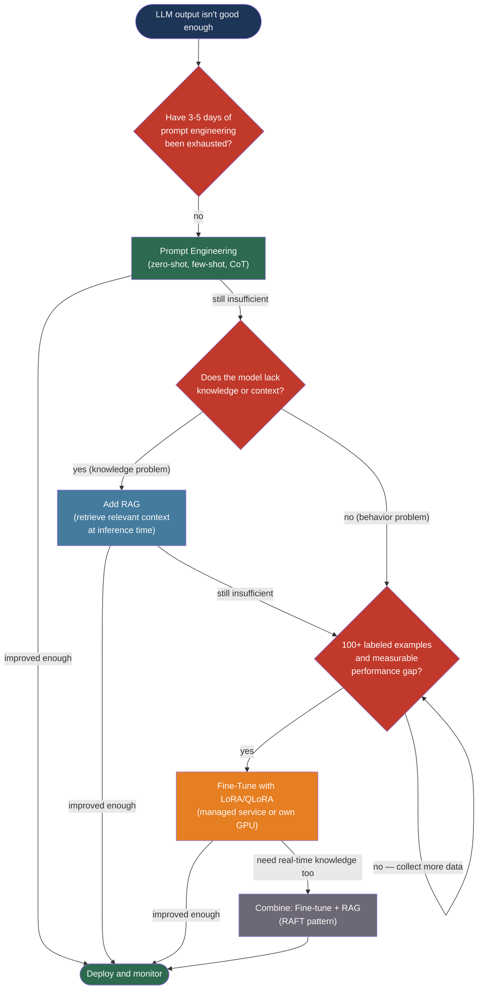

# [BEE-507] Prompt Engineering vs RAG vs Fine-Tuning

:::info
There are three ways to make an LLM do what you want — prompt engineering, retrieval-augmented generation, and fine-tuning — and choosing the wrong one wastes weeks of work and tens of thousands of dollars. The right decision depends on what kind of problem you are actually solving.
:::

## Context

When GPT-3 was released in 2020, the only customization mechanism available to application developers was prompt engineering: carefully crafted instructions and examples passed in the input. RAG emerged as a pattern in 2020, formalized in the Lewis et al. paper "Retrieval-Augmented Generation for Knowledge-Intensive NLP Tasks" (arXiv:2005.11401, NeurIPS 2020), which showed that retrieving relevant documents at inference time dramatically improved factual accuracy on open-domain question answering without retraining the model.

Fine-tuning existed long before LLMs but became practically inaccessible for most organizations when models scaled to billions of parameters — the compute cost of updating all weights was prohibitive. Two papers changed this. Edward Hu et al.'s LoRA: Low-Rank Adaptation of Large Language Models (arXiv:2106.09685, 2021) showed that fine-tuning could be accomplished by injecting a pair of small low-rank matrices into each Transformer attention layer, reducing trainable parameters by 10,000× with no inference latency penalty. Tim Dettmers et al.'s QLoRA: Efficient Finetuning of Quantized LLMs (arXiv:2305.14314, 2023) added 4-bit quantization to LoRA, making it possible to fine-tune a 65 billion parameter model on a single consumer GPU.

These developments created three legitimate options with very different cost, complexity, and applicability profiles. The mistake practitioners make is reaching for fine-tuning first — the most expensive and time-consuming option — before exhausting the simpler ones. The correct default order is: prompt engineering first, RAG if knowledge is the bottleneck, fine-tuning only when consistent behavior at scale cannot be achieved otherwise.

## Design Thinking

Each customization strategy addresses a different root cause of poor LLM performance:

| Strategy | Problem it solves | What it changes |
|----------|------------------|-----------------|
| Prompt engineering | Model doesn't understand the task or format | The input to the model |
| RAG | Model lacks knowledge (outdated or proprietary) | The context available at inference time |
| Fine-tuning | Model behavior is inconsistent at scale | The model's weights |

A model that produces the wrong output format is a prompt engineering problem. A model that gives outdated information or lacks proprietary domain knowledge is a RAG problem. A model that sometimes follows the task correctly and sometimes doesn't — after prompting is exhausted — is a fine-tuning candidate.

**Prompt engineering is always the starting point** because it requires no infrastructure, no training data, and no compute — only a well-specified task. 40–70% of LLM problems are solved at this stage.

## Best Practices

### Exhaust Prompt Engineering Before Anything Else

**MUST** attempt prompt engineering first. Spend at least two to five days iterating on the prompt before concluding that the model cannot do the task through instruction alone.

Effective techniques, in order of complexity:
- **Zero-shot**: Describe the task precisely with output format specification
- **Few-shot**: Provide three to five high-quality input-output examples; examples outweigh instructions
- **Chain-of-thought**: Add "Think step by step" or show reasoning in the examples — this alone often resolves failures on reasoning tasks
- **Structured output constraints**: Force JSON mode or specify an exact schema to eliminate format inconsistency

Prompt engineering fails when the model lacks the underlying knowledge (not solvable by instruction), when the task requires hundreds of examples that exceed the context window, or when the output must be perfectly consistent across 99.9% of requests.

**SHOULD** measure baseline performance on a representative test set before concluding prompt engineering is insufficient. A prompt that works for obvious inputs may fail on edge cases — collect failure examples to understand what is actually wrong before choosing the next step.

### Add RAG When Knowledge Is the Bottleneck

**SHOULD** choose RAG over fine-tuning when the problem is that the model lacks information, not that its behavior is wrong. RAG is the right choice when:
- The model needs access to information created after its training cutoff
- The model needs access to proprietary or confidential data not in its training corpus
- Responses must be traceable to specific source documents
- The knowledge base changes frequently and retraining would be prohibitively expensive

**MUST NOT** use RAG as a substitute for prompt engineering for behavior problems. A model that incorrectly formats JSON output will continue to incorrectly format JSON even with retrieval augmentation — the problem is behavioral, not informational.

RAG failure modes: noisy retrieval (wrong chunks returned), missing retrieval (relevant document not in the corpus), and retrieval-generation mismatch (retrieved documents confuse rather than help the model). Diagnose retrieval and generation failures separately — the RAGAS framework (BEE-506) measures each independently.

### Fine-Tune When Behavior Must Be Consistent at Scale

**SHOULD** consider fine-tuning when prompt engineering and RAG have been exhausted, you have at least 100 high-quality labeled examples, and you have measured a concrete performance gap between the current best approach and the target.

Fine-tuning is the right choice when:
- Output format or style must be consistent and prompt-level constraints produce occasional failures
- Domain-specific terminology is required that the model does not reliably produce
- Reducing inference cost at high volume matters — baking behaviors into weights reduces prompt length and therefore per-request cost
- The task requires more examples than fit in the context window

**MUST NOT** fine-tune on fewer than 50 examples. Below this threshold, the model overfits to the training data and performs poorly on unseen inputs. 200 high-quality, diverse examples typically outperform 2,000 noisy ones.

Fine-tuning failure modes: catastrophic forgetting (model loses general capability), overfitting (excellent training accuracy, poor test accuracy), and distribution shift (fine-tuned model performs well on training distribution but fails on real production inputs). LoRA and QLoRA substantially reduce catastrophic forgetting by freezing 99.99% of model weights.

### Use Parameter-Efficient Fine-Tuning (LoRA / QLoRA)

**SHOULD** use LoRA or QLoRA for any fine-tuning task rather than full fine-tuning. Full fine-tuning updates all model weights, requires 100+ GB of GPU memory for 7B parameter models, and risks catastrophic forgetting. LoRA injects trainable low-rank matrices into attention layers, reducing trainable parameters by 10,000× with no inference latency penalty. QLoRA adds 4-bit quantization to LoRA, enabling fine-tuning of 65B models on a single 48 GB GPU.

```
LoRA: Woriginal (frozen) + AB (trainable, rank r << d)
      where A ∈ R^{d×r}, B ∈ R^{r×d}, r typically 8–64

Trainable parameters: 2 × d × r per attention layer
vs. Full fine-tuning: d × d per attention layer
```

For most teams without GPU infrastructure, **SHOULD** use a managed fine-tuning service rather than operating GPU infrastructure:

| Service | Models supported | Notes |
|---------|-----------------|-------|
| OpenAI Fine-tuning API | GPT-4o mini, GPT-4o | Simplest; $25/M training tokens |
| Google Vertex AI | Gemini 2.5 Pro/Flash | Multimodal fine-tuning |
| Amazon Bedrock | Claude 3 Haiku | For Anthropic models |
| Together AI | Llama, Mistral, Qwen | Open-source models, managed |

### Evaluate Fine-Tuning by Comparing Against a Baseline

**MUST** compare fine-tuned model performance against the best available baseline (base model + best prompt, with or without RAG) on a held-out test set — not on the training set. Measuring improvement only on training data confirms overfitting, not learning.

A rigorous comparison:
```
Set A: Base model + best prompt
Set B: Base model + best prompt + RAG
Set C: Fine-tuned model + minimal prompt
Set D: Fine-tuned model + RAG

Deploy only if Set C or Set D materially outperforms the best available baseline
on the held-out test set for your target metric.
```

A fine-tuning project is justified when it produces a measurable, statistically significant improvement (typically 5% or more) on the metric that matters for the application.

### Combine Strategies When Each Addresses a Different Problem

**MAY** combine prompt engineering, RAG, and fine-tuning when each addresses a genuinely distinct problem. Fine-tune for consistent behavior and output format; add RAG for real-time knowledge; use the prompt for task framing. This combination — sometimes called RAFT (Retrieval-Augmented Fine-Tuning) — is appropriate for high-volume, high-stakes applications where the investment is justified.

Do not combine strategies to compensate for a weak implementation of one. A poorly performing RAG pipeline plus a poorly fine-tuned model produces a poorly performing combined system. Fix each component before combining.

## Visual



## Related BEEs

- [BEE-30001](llm-api-integration-patterns.md) -- LLM API Integration Patterns: token cost management, streaming, and semantic caching apply regardless of customization strategy
- [BEE-30004](evaluating-and-testing-llm-applications.md) -- Evaluating and Testing LLM Applications: the RAGAS metrics, golden datasets, and LLM-as-judge patterns are the evaluation tools for measuring whether each customization strategy succeeded
- [BEE-17004](../search/vector-search-and-semantic-search.md) -- Vector Search and Semantic Search: the retrieval component of RAG is a vector search problem; chunking, embedding, and top-k retrieval patterns are covered there
- [BEE-9001](../caching/caching-fundamentals-and-cache-hierarchy.md) -- Caching Fundamentals: fine-tuned model responses are more predictable and thus more cache-friendly; semantic caching applies to both RAG and non-RAG LLM calls

## References

- [Edward Hu et al. LoRA: Low-Rank Adaptation of Large Language Models — arXiv:2106.09685, 2021](https://arxiv.org/abs/2106.09685)
- [Tim Dettmers et al. QLoRA: Efficient Finetuning of Quantized LLMs — arXiv:2305.14314, 2023](https://arxiv.org/abs/2305.14314)
- [Patrick Lewis et al. Retrieval-Augmented Generation for Knowledge-Intensive NLP Tasks — arXiv:2005.11401, NeurIPS 2020](https://arxiv.org/abs/2005.11401)
- [OpenAI. Supervised Fine-Tuning — developers.openai.com](https://developers.openai.com/api/docs/guides/supervised-fine-tuning)
- [OpenAI. Fine-Tuning Best Practices — developers.openai.com](https://developers.openai.com/api/docs/guides/fine-tuning-best-practices)
- [Google. Tune Gemini models using supervised fine-tuning — cloud.google.com](https://docs.cloud.google.com/vertex-ai/generative-ai/docs/models/gemini-use-supervised-tuning)
- [Hugging Face. PEFT: Parameter-Efficient Fine-Tuning — huggingface.co](https://huggingface.co/docs/peft/en/package_reference/lora)
- [Prompt Engineering Guide — promptingguide.ai](https://www.promptingguide.ai/)
- [IBM. RAG vs Fine-Tuning vs Prompt Engineering — ibm.com](https://www.ibm.com/think/topics/rag-vs-fine-tuning-vs-prompt-engineering)
