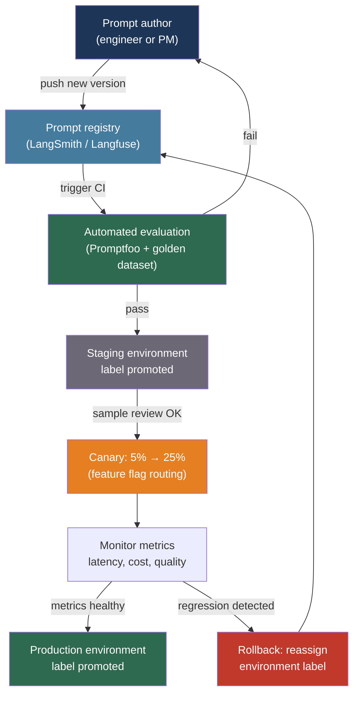

# [BEE-530] Prompt Management and Versioning

:::info
Prompts are the primary control surface of a production LLM system — they need the same operational discipline as application code: version control, automated testing, staged deployment, and instant rollback without a full application release.
:::

## Context

A prompt change in a production LLM system is a deployment. It changes behavior, affects cost, and can introduce regressions that surface only hours later when edge-case inputs hit the new phrasing. Unlike a code change, a prompt change produces no compile error, no type mismatch, no failing unit test at the language level. The failure mode is silent degradation: structured output error rates climb, hallucination frequency increases, user satisfaction scores drift downward before anyone connects the cause to a three-word edit made two days prior.

Teams that hardcode prompts directly in source files treat prompts as configuration, not code, and pay the price in release coupling. Every prompt improvement requires a code deployment. Non-technical contributors — product managers, domain experts, writers — cannot iterate without a pull request. There is no history of which prompt was active at a given time, making postmortem analysis guesswork.

The discipline of prompt management applies version control, automated evaluation, and staged deployment to prompts. The tooling has matured substantially since 2023: dedicated registries (LangSmith Prompt Hub, Langfuse, PromptLayer) handle versioning and hot reloading; open-source evaluation frameworks (Promptfoo) run regression suites against every prompt change; feature flag systems enable per-segment canary rollouts without code changes.

## Design Thinking

The core tension in prompt management is between coupling and control. Storing prompts in code (Git) provides full coupling: every change is tracked, reviewable, and tied to a specific application version. Storing prompts in a registry provides separation of concerns: prompt changes deploy independently, non-engineers can contribute, and rollback does not require reverting application code. Most production systems move toward the registry approach as prompt iteration velocity increases.

A secondary tension is between hot reloading and caching. Fetching the active prompt version at request time enables instant propagation of changes without a deployment, but adds a network round trip to every LLM call. Registry clients mitigate this with a short-TTL local cache (LangSmith defaults to 100 prompts, 300 seconds TTL), which provides near-instant propagation with a sub-millisecond lookup for most requests.

The evaluation gap is the most underinvested area. Teams that have prompt version control but no automated evaluation cannot safely ship prompt changes: they deploy, watch metrics for 24 hours, and either ship or revert. Automated evaluation — a test suite that runs on every prompt change and reports pass/fail against a golden dataset — compresses this feedback loop to minutes.

## Best Practices

### Store Prompts in a Registry, Not in Application Code

**SHOULD** extract prompts from application source files into a versioned registry as soon as a product ships to users who depend on output quality. A registry decouples the prompt change cycle from the application release cycle:

```python
from langsmith import Client

client = Client()

# Pull the production-tagged version at request time (cached for 300s by default)
def get_prompt(name: str, environment: str = "production"):
    return client.pull_prompt(f"{name}:{environment}")

# In application code: no prompt literal, only a registry reference
prompt_template = get_prompt("support-response-v2")
response = llm.invoke(prompt_template.format_messages(user_query=query))
```

For Langfuse (open-source alternative):

```python
from langfuse import Langfuse

lf = Langfuse()

# Pull by label; labels map to environments
prompt = lf.get_prompt("support-response", label="production")
compiled = prompt.compile(user_query=query)
```

**SHOULD** use environment labels (`development`, `staging`, `production`) rather than pinning to specific version IDs in application code. The application code references the environment label; the registry operator promotes versions between environments without a code change:

```python
# Staging deployment pulls from staging label
prompt = get_prompt("support-response", environment="staging")

# Production deployment pulls from production label
prompt = get_prompt("support-response", environment="production")

# Rollback: update the registry label mapping, zero code change required
```

**MAY** keep prompts in source code during pre-launch development when the prompt is unstable and changes are always bundled with code changes. Extract to a registry when the team starts making prompt-only changes more than a few times per week.

### Version Every Prompt Change with Metadata

**MUST** record the author, reason for change, and evaluation result alongside every new prompt version. An audit log that says "version 7 was active from 2026-04-15T14:30Z to 2026-04-17T09:00Z" allows postmortem correlation with metric changes:

```python
# LangSmith: push a new version with commit metadata
from langchain_core.prompts import ChatPromptTemplate

new_prompt = ChatPromptTemplate.from_messages([
    ("system", "You are a helpful support agent. Be concise and accurate."),
    ("human", "{user_query}"),
])

client.push_prompt(
    "support-response",
    object=new_prompt,
    description="Removed verbose preamble — reduced avg output tokens by 23%",
    tags=["staging"],  # Tag for staging; do not tag as production until evaluated
)
```

**SHOULD** treat prompt versions with semantic versioning conventions:
- **Patch** (1.0.x): Wording tweaks that do not change output structure or behavior
- **Minor** (1.x.0): New optional context, added examples, backward-compatible format changes
- **Major** (x.0.0): Output structure changes, format changes, role changes, few-shot example overhauls

A breaking version change should trigger a manual review gate before promotion to production.

### Test Prompts Against a Golden Dataset Before Promotion

**MUST** run automated evaluation on every candidate prompt before it reaches production. Promptfoo is the standard open-source tool for this:

```yaml
# promptfooconfig.yaml
prompts:
  - file://prompts/support_v7.txt   # Candidate
  - file://prompts/support_v6.txt   # Baseline (current production)

providers:
  - id: anthropic:messages:claude-haiku-4-5-20251001
    config:
      temperature: 0
      max_tokens: 512

tests:
  - description: "Handles billing question"
    vars:
      user_query: "Why was I charged twice this month?"
    assert:
      - type: icontains
        value: "account"
      - type: llm-rubric
        value: "Response acknowledges the billing concern and offers a clear next step"
      - type: not-contains
        value: "I don't know"

  - description: "Does not hallucinate policy details"
    vars:
      user_query: "Can I get a refund after 60 days?"
    assert:
      - type: llm-rubric
        value: "Response does not state a specific refund deadline unless it appears in the context"

  - description: "Maintains reasonable length"
    vars:
      user_query: "How do I reset my password?"
    assert:
      - type: javascript
        value: "output.length < 400"
```

Run the evaluation suite:

```bash
npx promptfoo eval --config promptfooconfig.yaml
npx promptfoo view  # Opens interactive results browser
```

**SHOULD** integrate Promptfoo into CI/CD so that any pull request touching a prompt file triggers an evaluation run and posts results as a PR comment:

```yaml
# .github/workflows/prompt-eval.yml
name: Evaluate prompt changes
on:
  pull_request:
    paths:
      - 'prompts/**'
      - 'promptfooconfig.yaml'

jobs:
  evaluate:
    runs-on: ubuntu-latest
    steps:
      - uses: actions/checkout@v4
      - uses: promptfoo/promptfoo-action@v1
        with:
          github-token: ${{ secrets.GITHUB_TOKEN }}
          openai-api-key: ${{ secrets.OPENAI_API_KEY }}
          anthropic-api-key: ${{ secrets.ANTHROPIC_API_KEY }}
          config: promptfooconfig.yaml
          cache-path: .promptfoo/cache
```

**SHOULD** maintain a golden dataset of at least 50–100 representative inputs covering normal cases, edge cases, and adversarial inputs. The dataset size needed for statistical reliability is larger than most teams expect: high-variance LLM outputs require more samples, not fewer, to distinguish genuine improvement from noise.

### Roll Out with a Canary Pattern

**SHOULD** route a small fraction of traffic to a challenger prompt before full promotion. Use a feature flag to control routing:

```python
from feature_flags import flags  # Any feature flag client: LaunchDarkly, Unleash, etc.

def get_active_prompt(user_id: str) -> str:
    """Return the active prompt for this user based on flag assignment."""
    if flags.is_enabled("support_prompt_v7_canary", user_id=user_id):
        return get_prompt("support-response", environment="staging")  # v7 candidate
    return get_prompt("support-response", environment="production")   # v6 control
```

Canary rollout stages:
1. **5% of users**: Validate no catastrophic failures; watch error rate and cost
2. **25% of users**: Measure quality metrics (user satisfaction, task completion rate)
3. **100% of users**: Promote staging label to production in the registry; disable the flag

**MUST NOT** rely solely on automated metrics to approve a full rollout. Review a sample of 50–100 outputs from the canary cohort by hand before promotion. Automated metrics miss failure modes that are obvious to a human reviewer (off-topic responses, subtle factual errors, tone mismatches).

### Instrument Every Prompt Call with the Active Version

**MUST** log the prompt name and version (or commit hash) alongside every LLM call. This is the precondition for any postmortem analysis: without it, you cannot determine which prompt version was active when a degradation occurred:

```python
import logging
from opentelemetry import trace

tracer = trace.get_tracer("prompt-management")
logger = logging.getLogger(__name__)

def invoke_with_tracking(prompt_name: str, environment: str, **inputs):
    prompt_meta = registry.get_prompt_metadata(prompt_name, environment)

    with tracer.start_as_current_span("llm.call") as span:
        span.set_attribute("prompt.name", prompt_name)
        span.set_attribute("prompt.version", prompt_meta["version"])
        span.set_attribute("prompt.environment", environment)

        response = llm.invoke(prompt_meta["template"].format(**inputs))

        logger.info(
            "llm_call",
            extra={
                "prompt_name": prompt_name,
                "prompt_version": prompt_meta["version"],
                "input_tokens": response.usage.input_tokens,
                "output_tokens": response.usage.output_tokens,
            },
        )
        return response
```

## Visual



## Related BEEs

- [BEE-30004](evaluating-and-testing-llm-applications.md) -- Evaluating and Testing LLM Applications: the golden dataset construction and LLM-as-judge patterns described in BEE-506 feed directly into the Promptfoo evaluation suite here
- [BEE-30009](llm-observability-and-monitoring.md) -- LLM Observability and Monitoring: the per-version metrics (cost, latency, error rate) that trigger canary rollback are collected by the observability layer
- [BEE-16004](../cicd-devops/feature-flags.md) -- Feature Flags: the canary routing mechanism uses the same feature flag infrastructure described in BEE-363
- [BEE-16002](../cicd-devops/deployment-strategies.md) -- Deployment Strategies: prompt canary rollout follows the same pattern as application canary releases — small percentage, monitor, expand, or rollback

## References

- [Promptfoo. Open-Source Prompt Evaluation — promptfoo.dev](https://www.promptfoo.dev/)
- [Promptfoo. GitHub Actions Integration — promptfoo.dev](https://www.promptfoo.dev/docs/integrations/github-action/)
- [LangSmith. Manage Prompts — docs.langchain.com](https://docs.langchain.com/langsmith/manage-prompts)
- [Langfuse. Prompt Management — langfuse.com](https://langfuse.com/docs/prompt-management/overview)
- [PromptLayer — promptlayer.com](https://www.promptlayer.com/)
- [Braintrust. What Is Prompt Versioning? — braintrust.dev](https://www.braintrust.dev/articles/what-is-prompt-versioning)
- [LaunchDarkly. Prompt Versioning and Management — launchdarkly.com](https://launchdarkly.com/blog/prompt-versioning-and-management/)
