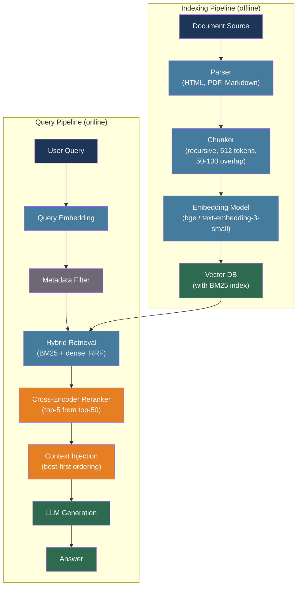

# [BEE-30007] RAG Pipeline Architecture

:::info
Retrieval-Augmented Generation solves the knowledge problem in LLM applications: instead of relying on a model's frozen training weights, inject relevant documents at inference time. Getting the pipeline right requires making dozens of concrete engineering decisions — chunking strategy, embedding model, retrieval method, reranking, and context injection — each of which has measurable production impact.
:::

## Context

Patrick Lewis et al. introduced Retrieval-Augmented Generation in "Retrieval-Augmented Generation for Knowledge-Intensive NLP Tasks" (arXiv:2005.11401, NeurIPS 2020). The paper showed that combining a pre-trained LLM with a non-parametric retrieval component — a differentiable document index — dramatically improved factual accuracy on open-domain question answering without retraining the model. The key insight was that LLMs store factual knowledge in their weights but lack a precise mechanism to access and update that knowledge. An external retrieval layer solves both problems: it provides access to documents not in the training corpus, and the index can be updated without touching the model.

By 2023, RAG had become the dominant pattern for grounding LLM responses in organizational knowledge. The use cases are precise: any scenario where the model needs access to information created after its training cutoff, proprietary data that was never in the training corpus, or sources that must be cited explicitly. RAG is not a cure for model incapability — a model that produces wrong output format or inconsistent behavior needs prompt engineering or fine-tuning (BEE-30005), not retrieval augmentation.

The engineering challenge is that RAG looks simple in a proof-of-concept (embed documents, embed query, fetch top-K, stuff into prompt) and becomes a multi-component production system where each component has its own failure modes. Context that is retrieved incorrectly, compressed destructively, or injected in the wrong position produces answers that are confident and wrong. A working RAG pipeline requires deliberate decisions at every stage.

## Design Thinking

A RAG system separates into two distinct pipelines with different operational profiles:

**Indexing pipeline** (batch or streaming, latency-tolerant): Load documents → parse → chunk → embed → store in vector index. This runs offline or on a schedule. It can be slow because the work is amortized across all future queries. The primary concerns are correctness, completeness, and cost per document.

**Query pipeline** (online, latency-critical): Embed query → retrieve candidates → rerank → inject context → call LLM. This runs on every user request. The primary concerns are latency, precision, and cost per request.

Treating these as separate concerns allows each to be scaled, optimized, and debugged independently. A bug in chunking affects indexing; a bug in re-ranking affects every query. Know which component you are debugging.

The three main failure modes map to three pipeline stages:
- **Wrong chunks retrieved**: retrieval precision failure (embedding quality, retrieval strategy, metadata filtering)
- **Right chunks missed**: retrieval recall failure (chunking, sparse/dense tradeoff, chunk boundaries)
- **Correct chunks, bad answer**: context injection failure (ordering, compression, context window overflow)

Measure each independently before combining fixes.

## Best Practices

### Choose a Chunking Strategy That Matches Document Structure

**SHOULD** use recursive character splitting with 512 tokens and 50–100 tokens of overlap as the baseline for general-purpose RAG. This is the benchmark-validated default: it respects sentence and paragraph boundaries by trying delimiters in order (`\n\n`, `\n`, ` `, characters) and is fast enough to run inline in the ingestion pipeline.

**SHOULD** use document-specific chunking for structured formats:
- Markdown: chunk by header hierarchy, preserving parent headings as metadata on each chunk
- Code: never split inside function definitions or block structures
- Tables: keep table rows together; a table split across chunks is retrieved as two incomplete facts

**SHOULD** use parent-child chunking when query precision and answer completeness are both critical. Index small child chunks (128–256 tokens) for retrieval precision; fetch the corresponding parent chunk (512–1024 tokens) as the context window input. The child chunk finds the needle; the parent chunk provides the surrounding story.

**MUST NOT** change chunk boundaries or chunk size after initial indexing without re-embedding the entire corpus. Mixing chunks from different chunking configurations in the same index produces inconsistent retrieval — some queries will match old boundaries, others new ones, without any visible error signal.

### Select an Embedding Model Aligned with Your Volume and Privacy Constraints

| Model | Dimensions | MTEB score | Cost | Notes |
|-------|-----------|-----------|------|-------|
| OpenAI text-embedding-3-small | 1,536 | 62.3 | $0.00002/1K tokens | MRL support; best price-quality ratio |
| OpenAI text-embedding-3-large | 3,072 | 64.6 | $0.00013/1K tokens | MRL; can truncate to 256d at higher quality than ada-002 at 1,536d |
| BAAI/bge-large-en-v1.5 | 1,024 | 64.2 | Self-hosted | No vendor lock-in; strong English retrieval |
| BAAI/bge-m3 | 1,024 | — | Self-hosted | Dense + sparse + multi-vector in one model; 100+ languages |

**SHOULD** prefer text-embedding-3-small for cost-sensitive applications. With Matryoshka Representation Learning (MRL, arXiv:2205.13147), the 3-small model can be truncated to 256 dimensions at inference time while outperforming the legacy ada-002 model at full 1,536 dimensions — enabling a 6x storage and latency reduction with better accuracy.

**MUST NOT** mix embeddings from different models or model versions in the same vector index. An index containing both ada-002 and text-embedding-3-small embeddings will produce nonsensical similarity scores — the vector spaces are not aligned.

### Use Hybrid Retrieval for Production Reliability

Pure dense retrieval misses exact keyword matches. Pure sparse retrieval (BM25) misses semantic equivalents. Hybrid retrieval runs both and merges results using Reciprocal Rank Fusion (RRF):

```
RRF score = Σ 1 / (rank_i + k)    where k = 60 (empirically optimal)
```

RRF merges ranked lists from BM25 and dense retrieval without requiring score normalization between the two systems (BM25 scores 0–200; cosine similarity 0–1). The rank position, not the raw score, is the merging unit.

**SHOULD** use hybrid retrieval in any production system. The combination handles both the vocabulary mismatch problem (BM25 catches exact terms) and the semantic gap problem (dense retrieval catches paraphrases and synonyms).

**SHOULD** apply metadata filtering before ANN search to narrow the candidate pool:

```python
results = vector_store.similarity_search(
    query_embedding,
    filter={"source": "product_docs", "published_after": "2024-01-01"},
    top_k=20
)
```

Filtering before search reduces both retrieval latency and precision noise. A question about a 2024 product release should not retrieve 2018 documentation even if the vectors are similar.

**MAY** use multi-query retrieval — generate 3–5 rephrasings of the user's question, run retrieval for each, and deduplicate results — for queries where vocabulary ambiguity is common. Each rephrasing illuminates a different semantic angle of the same question.

**MAY** use HyDE (Hypothetical Document Embeddings, arXiv:2212.10496) for queries where the question form is very different from the answer form. The model generates a hypothetical answer; that answer's embedding is used for retrieval rather than the question's. This bridges the semantic gap between short questions and long document passages, though it adds one LLM generation step to the retrieval latency.

### Add a Re-ranking Stage Before Context Injection

Bi-encoder retrieval (embedding similarity) is fast but imprecise: it forces all meaning into a single vector, so query and document tokens never interact during scoring. Cross-encoder re-ranking concatenates query and document and scores them together, producing much higher precision at the cost of latency.

Use a two-stage pipeline:

```
Stage 1: Bi-encoder retrieval → top-50 candidates  (fast, broad recall)
Stage 2: Cross-encoder reranker → top-5 candidates (precise, latency-limited)
```

**SHOULD** add reranking to any RAG system where answer precision matters. BGE-reranker-v2-m3 (BAAI, self-hosted, 278M parameters) processes batches of under 100 query-document pairs on CPU in under 1 second. Cohere Rerank is the managed-service alternative.

**SHOULD** set `top_k` for reranking input conservatively (20–50 candidates). Running the cross-encoder over 200 candidates adds 3–5 seconds of latency with diminishing returns.

### Inject Context with Position Awareness

Liu et al. showed in "Lost in the Middle: How Language Models Use Long Contexts" (arXiv:2307.03172, TACL 2024) that LLM performance follows a U-shaped curve across context position: information at the beginning and end of the context is recalled at significantly higher rates than information buried in the middle. The performance drop for middle-positioned information exceeds 30% on multi-document QA tasks.

**MUST** place the highest-relevance chunks at the beginning of the context window. After reranking, put rank-1 at position 1. Do not randomize or preserve arbitrary order.

**SHOULD** use a sandwich pattern for safety-critical applications: put the most relevant chunks at both the beginning and end of the injected context, with less relevant material in the middle.

**SHOULD** use context compression when retrieved chunks exceed the available context budget. Microsoft's LLMLingua (EMNLP 2023) uses a small model's perplexity to identify and remove redundant tokens, compressing prompts up to 20x with minimal accuracy loss. Prefer compression over truncation — truncation discards entire chunks; compression preserves information density.

### Separate Indexing and Query Pipelines

**MUST** treat the indexing pipeline and the query pipeline as separate systems with independent deployment cycles. A chunking fix requires re-indexing; a prompt fix does not. Coupling them in one codebase creates operational risk.

```
Indexing pipeline (offline):
  document source → parser → chunker → embedding model → vector DB

Query pipeline (online):
  user query → query embedding → hybrid retrieval (BM25 + dense)
             → metadata filter → reranker → context injector → LLM
```

**SHOULD** implement incremental indexing: hash document content on ingestion; re-embed only documents whose hash has changed. Re-embedding an unchanged corpus burns compute and introduces unnecessary model-version risk. Track the embedding model version and chunking configuration as metadata on each stored chunk.

**MUST NOT** re-embed a subset of the corpus with a new embedding model while leaving the rest with the old model. The two models' vector spaces are incompatible; mixed-model indexes produce unpredictable retrieval quality with no visible error signal. If the embedding model must change, re-embed the entire corpus.

### Evaluate Each Pipeline Stage Independently

**MUST** use RAGAS (BEE-30004) to measure retrieval and generation failures separately:

| Metric | What it measures | Low score means |
|--------|-----------------|-----------------|
| Context Precision | Are retrieved chunks ranked by relevance? | Fix retriever ranking / reranker |
| Context Recall | Are all needed chunks retrieved? | Fix chunking / retrieval recall |
| Faithfulness | Are claims grounded in context? | Fix generator prompt / context injection |
| Answer Relevance | Does the answer address the question? | Fix query understanding / routing |

**SHOULD** build a golden dataset from real production queries where the system failed (BEE-30004). Synthetic test queries miss the long tail of real-world vocabulary, document formats, and edge cases that appear in production.

## Failure Modes

**Noisy retrieval** — wrong chunks returned. Caused by vocabulary mismatch between query and document or a weak embedding model. Fix with hybrid retrieval, metadata filtering, and reranking.

**Missing retrieval** — correct document exists but is not in the corpus, or its chunk boundary split the relevant passage in half. Fix with semantic chunking or parent-child chunking; audit corpus completeness.

**Lost-in-the-middle** — the right chunks are retrieved but positioned in the middle of a long context, degrading LLM recall. Fix with position-aware injection (best chunk first) or context compression.

**Embedding drift** — silent degradation after a model version change or preprocessing change, because old and new embeddings are mixed or preprocessing produces systematically different inputs. Fix by versioning embeddings, detecting changes via retrieval metric monitoring, and re-embedding the full corpus atomically when the pipeline changes.

**Stale embeddings** — documents are updated but the vector index is not. Fix with incremental indexing keyed on content hash; set TTL on chunks for documents that change frequently.

## Visual



## Related BEEs

- [BEE-17004](../search/vector-search-and-semantic-search.md) -- Vector Search and Semantic Search: the dense retrieval component of RAG is a vector search problem; ANN index selection, HNSW parameters, and approximate search trade-offs are covered there
- [BEE-30005](prompt-engineering-vs-rag-vs-fine-tuning.md) -- Prompt Engineering vs RAG vs Fine-Tuning: the decision framework for when to choose RAG over fine-tuning; RAG is the right choice when the problem is knowledge access, not model behavior
- [BEE-30004](evaluating-and-testing-llm-applications.md) -- Evaluating and Testing LLM Applications: RAGAS metrics, golden datasets, and the offline/online evaluation split that measures RAG pipeline health
- [BEE-30006](structured-output-and-constrained-decoding.md) -- Structured Output and Constrained Decoding: when RAG answers must be returned in a structured format alongside citations, structured output constraints apply to the generation step
- [BEE-9001](../caching/caching-fundamentals-and-cache-hierarchy.md) -- Caching Fundamentals: embedding caches and retrieval result caches reduce per-query cost and latency; semantic caching at the query level reuses results for similar queries

## References

- [Patrick Lewis et al. Retrieval-Augmented Generation for Knowledge-Intensive NLP Tasks — arXiv:2005.11401, NeurIPS 2020](https://arxiv.org/abs/2005.11401)
- [Nelson F. Liu et al. Lost in the Middle: How Language Models Use Long Contexts — arXiv:2307.03172, TACL 2024](https://arxiv.org/abs/2307.03172)
- [Luyu Gao et al. Precise Zero-Shot Dense Retrieval without Relevance Labels (HyDE) — arXiv:2212.10496, ACL 2023](https://arxiv.org/abs/2212.10496)
- [Omar Khattab and Matei Zaharia. ColBERT: Efficient and Effective Passage Search — arXiv:2004.12832, SIGIR 2020](https://arxiv.org/abs/2004.12832)
- [Aditya Kusupati et al. Matryoshka Representation Learning — arXiv:2205.13147, NeurIPS 2022](https://arxiv.org/abs/2205.13147)
- [Niklas Muennighoff et al. MTEB: Massive Text Embedding Benchmark — arXiv:2210.07316](https://arxiv.org/abs/2210.07316)
- [Huiqiang Jiang et al. LLMLingua: Compressing Prompts for Accelerated Inference — EMNLP 2023](https://github.com/microsoft/LLMLingua)
- [Jon Saad-Falcon et al. ARES: An Automated Evaluation Framework for RAG — arXiv:2311.09476, NAACL 2024](https://arxiv.org/abs/2311.09476)
- [Shahul Es et al. RAGAS: Automated Evaluation of Retrieval Augmented Generation — arXiv:2309.15217, EACL 2024](https://arxiv.org/abs/2309.15217)
- [OpenAI. New Embedding Models and API Updates — openai.com](https://openai.com/index/new-embedding-models-and-api-updates/)
- [BAAI. BGE-M3: Multi-Functionality, Multi-Linguality, Multi-Granularity — huggingface.co](https://huggingface.co/BAAI/bge-m3)
