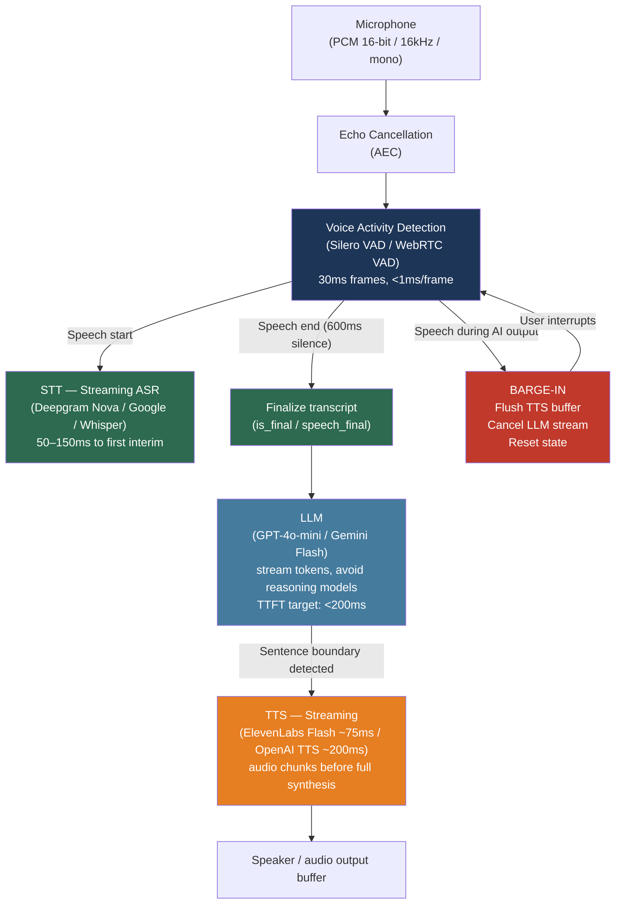

# [BEE-30080] Real-Time Voice AI Integration Patterns

:::info
A real-time voice AI pipeline translates spoken input to text, generates a response, and synthesizes speech — targeting a total round-trip under 300ms. The primary engineering challenge is latency: each stage (VAD, STT, LLM, TTS) accumulates delay, and only pipelining the LLM-to-TTS boundary without waiting for full LLM completion makes sub-second conversation feel natural.
:::

## Context

The building blocks for voice AI — automatic speech recognition, language models, and text-to-speech synthesis — each matured independently. The convergence of streaming APIs across all three layers made low-latency voice AI feasible as a production backend pattern around 2023.

OpenAI's Whisper (Radford et al., arXiv:2212.04356, "Robust Speech Recognition via Large-Scale Weak Supervision," 2022) established a new quality floor: a single neural model trained on 680,000 hours of multilingual audio, achieving 2.01 WER on LibriSpeech clean with its large-v3 variant. Whisper is a batch model and introduces 1–3 seconds of latency on its own, making it unsuitable for real-time conversation. Streaming ASR services — Deepgram Nova, Google Speech-to-Text, and AssemblyAI — achieve latency in the 50–150ms range by returning interim transcripts as audio arrives.

Text-to-speech quality took a parallel leap. ElevenLabs' Flash v2.5 model targets ~75ms time-to-first-audio-byte; OpenAI TTS targets ~200ms. Both support streaming: audio chunks begin arriving before the full text input is processed. This enables the most important latency optimization: rather than waiting for the LLM to finish its full response before sending it to TTS, the pipeline sends each sentence to TTS as soon as the LLM generates it.

Conversation naturalness depends almost entirely on latency. Gaps under 200ms feel seamless; 300–500ms begin to feel sluggish; above 1.5 seconds, users repeatedly interrupt or abandon the interaction. In production, GPT-4o averages ~700ms time-to-first-token and Gemini Flash 1.5 averages ~300ms TTFT. Even with fast STT and TTS, the LLM stage is the binding constraint. The pipeline architecture must be designed to minimize time from speech-end to first audio output.

## Architecture Choices

Two fundamental architectures exist:

### Cascading Pipeline (STT → LLM → TTS)

The dominant production architecture. Three independent API services are composed in sequence:

```
[Microphone] → [VAD] → [STT] → [LLM] → [TTS] → [Speaker]
```

**Advantages:** Modular — each component can be swapped independently. Debuggable — transcripts and responses are text and can be logged. Cost-efficient — STT and TTS services are cheaper than audio token processing.

**Latency:** Sum of STT finalization (50–100ms), LLM TTFT (100–700ms depending on model and infrastructure), and TTS first audio chunk (50–200ms). Total: 300ms to over 1 second.

### End-to-End Speech-to-Speech (OpenAI Realtime API, Gemini Live)

The model receives audio directly and emits audio directly. No explicit STT or TTS boundary. OpenAI's Realtime API (`wss://api.openai.com/v1/realtime?model=gpt-realtime`) and Google's Gemini Live implement this.

**Advantages:** Lower TTFT (model processes audio tokens, no STT delay). Native emotion and prosody propagation from the user's voice. Single API endpoint.

**Disadvantages:** Audio tokens are approximately 10× more expensive than text tokens, making conversation cost roughly 10× higher. No access to intermediate transcripts for logging and compliance. Cannot swap underlying models without changing the integration point. Less suitable for high-volume deployments.

For most production deployments, the cascading pipeline provides a better cost-quality-observability tradeoff. End-to-end speech-to-speech is appropriate for consumer-grade applications where conversation naturalness outweighs cost.

## Voice Activity Detection

Voice Activity Detection (VAD) solves three problems in a voice pipeline:

1. **Silence filtering**: Do not send silence frames to the STT API. Background noise and breathing add cost and reduce accuracy.
2. **Turn-end detection**: Infer when the user has finished speaking and the pipeline should trigger STT finalization.
3. **Barge-in detection**: Detect when the user speaks while the AI is generating audio, so the AI can stop and listen.

### Silero VAD

Silero VAD (https://github.com/snakers4/silero-vad, MIT license) is a 2MB neural model that classifies each 30ms audio frame as speech or non-speech in under 1ms on a single CPU thread. It consistently outperforms classical GMM-based VAD in noisy environments:

```python
import torch
import numpy as np

# Load once at startup (2MB model)
model, utils = torch.hub.load(
    repo_or_dir="snakers4/silero-vad",
    model="silero_vad",
    force_reload=False,
)
(get_speech_timestamps, _, read_audio, VADIterator, collect_chunks) = utils

vad_iterator = VADIterator(
    model,
    threshold=0.5,          # speech probability threshold
    sampling_rate=16000,
    min_silence_duration_ms=600,  # ms of silence before declaring turn end
    speech_pad_ms=100,           # pad detected speech edges
)

def process_audio_frame(pcm_bytes: bytes) -> dict | None:
    """
    Process one 30ms frame of 16kHz 16-bit mono PCM.
    Returns {"start": True} on speech start, {"end": int} on speech end (ms offset),
    or None when no boundary event.
    """
    audio_float = np.frombuffer(pcm_bytes, dtype=np.int16).astype(np.float32) / 32768.0
    audio_tensor = torch.from_numpy(audio_float)
    return vad_iterator(audio_tensor, return_seconds=False)
```

### Barge-In with Full-Duplex VAD

In a full-duplex pipeline, VAD runs on the microphone feed continuously — including while the AI is speaking. Acoustic Echo Cancellation (AEC) must subtract the AI's speaker output from the microphone signal before VAD processing; without it, the AI's own voice triggers false barge-in.

When VAD detects user speech during AI output:
1. Cancel in-flight TTS streaming
2. Flush the audio output buffer
3. Optionally cancel the pending LLM generation
4. Reset conversation state
5. Begin new STT capture

## STT: Streaming Speech-to-Text

### Deepgram Nova-2/3

Deepgram's streaming WebSocket delivers interim transcripts in ~150ms after audio delivery, with `is_final` events (sentence-level, locked) and `speech_final` events (utterance-level) to drive pipeline state:

```python
import asyncio
import websockets
import json

DEEPGRAM_WS = "wss://api.deepgram.com/v1/listen"
DEEPGRAM_PARAMS = (
    "model=nova-2-conversationalai"
    "&encoding=linear16"
    "&sample_rate=16000"
    "&channels=1"
    "&smart_format=true"
    "&interim_results=true"
    "&endpointing=600"   # 600ms silence → speech_final event
)

async def stream_to_deepgram(
    audio_queue: asyncio.Queue,
    transcript_callback,
    api_key: str,
):
    uri = f"{DEEPGRAM_WS}?{DEEPGRAM_PARAMS}"
    headers = {"Authorization": f"Token {api_key}"}

    async with websockets.connect(uri, extra_headers=headers) as ws:
        async def sender():
            while True:
                chunk = await audio_queue.get()
                if chunk is None:
                    break
                await ws.send(chunk)  # raw PCM16 bytes, no base64

        async def receiver():
            async for message in ws:
                data = json.loads(message)
                if data.get("type") == "Results":
                    alt = data["channel"]["alternatives"][0]
                    transcript = alt.get("transcript", "")
                    is_final = data.get("is_final", False)
                    speech_final = data.get("speech_final", False)
                    if transcript:
                        await transcript_callback(transcript, is_final, speech_final)

        await asyncio.gather(sender(), receiver())
```

### Google Cloud Speech-to-Text (Streaming)

Google STT uses gRPC bidirectional streaming, requiring a server-side proxy if clients connect via WebSocket. The gRPC streaming config:

```python
from google.cloud import speech

def create_streaming_config() -> speech.StreamingRecognitionConfig:
    return speech.StreamingRecognitionConfig(
        config=speech.RecognitionConfig(
            encoding=speech.RecognitionConfig.AudioEncoding.LINEAR16,
            sample_rate_hertz=16000,
            language_code="en-US",
        ),
        interim_results=True,
    )
```

## LLM to TTS Pipelining

The highest-impact latency optimization is **not waiting for the full LLM response** before sending text to TTS. As soon as the LLM emits a sentence boundary (`.`, `!`, `?` followed by whitespace), send that sentence to TTS immediately. TTS begins generating audio for sentence 1 while the LLM generates sentence 2.

```python
import re
import asyncio
from openai import AsyncOpenAI

# Pattern that matches sentence-ending punctuation followed by space or end
SENTENCE_BOUNDARY = re.compile(r'(?<=[.!?])\s+')

async def stream_llm_to_tts(
    openai_client: AsyncOpenAI,
    messages: list[dict],
    tts_queue: asyncio.Queue,  # receives sentence strings for TTS
) -> str:
    """
    Stream LLM tokens; as each sentence completes, push to TTS queue.
    Returns the full response text for logging.
    """
    buffer = ""
    full_response = ""

    stream = await openai_client.chat.completions.create(
        model="gpt-4o-mini",   # TTFT-optimized; avoid reasoning models for voice
        messages=messages,
        stream=True,
        max_tokens=300,         # keep voice responses short
        temperature=0.7,
    )

    async for chunk in stream:
        token = chunk.choices[0].delta.content or ""
        buffer += token
        full_response += token

        # Detect sentence boundary and flush to TTS
        parts = SENTENCE_BOUNDARY.split(buffer, maxsplit=1)
        if len(parts) > 1:
            sentence = parts[0].strip()
            if sentence:
                await tts_queue.put(sentence)
            buffer = parts[1]

    # Flush any remaining text after stream ends
    if buffer.strip():
        await tts_queue.put(buffer.strip())

    return full_response


async def stream_tts_elevenlabs(
    sentence: str,
    voice_id: str,
    xi_api_key: str,
    audio_output_queue: asyncio.Queue,
):
    """
    Send one sentence to ElevenLabs Flash and stream PCM audio chunks
    to the audio output queue for playback.
    """
    import websockets
    uri = (
        f"wss://api.elevenlabs.io/v1/text-to-speech/{voice_id}"
        f"/stream-input?model_id=eleven_flash_v2_5"
        f"&output_format=pcm_16000"
    )
    headers = {"xi-api-key": xi_api_key}

    async with websockets.connect(uri, extra_headers=headers) as ws:
        # Send text
        await ws.send(json.dumps({
            "text": sentence,
            "voice_settings": {"stability": 0.5, "similarity_boost": 0.75},
        }))
        await ws.send(json.dumps({"text": ""}))  # flush signal

        # Receive audio chunks
        async for message in ws:
            data = json.loads(message)
            if data.get("audio"):
                import base64
                pcm_chunk = base64.b64decode(data["audio"])
                await audio_output_queue.put(pcm_chunk)
```

## Best Practices

### Design for the 300ms latency target from the start

**MUST** establish a latency budget before choosing components. A typical target:

| Stage | Budget |
|---|---|
| STT finalization after speech end | 80ms |
| LLM TTFT | 200ms |
| TTS first audio chunk | 80ms |
| Transport and buffering | 40ms |
| Total | **400ms** (acceptable); **< 300ms** (target) |

**MUST NOT** use reasoning models (o1, o3, Claude thinking mode) in live voice pipelines. Reasoning model TTFT runs 5–30 seconds, making real-time conversation impossible. Reserve them for asynchronous tasks.

### Use sentence-level LLM-to-TTS pipelining

**MUST** pipeline the LLM and TTS stages rather than waiting for full LLM completion. This is the single highest-impact optimization, reducing perceived latency by 300–600ms for typical two-to-four sentence responses. The TTS begins generating audio for the first sentence while the LLM generates the second.

### Keep persistent WebSocket connections for all API services

**SHOULD** maintain long-lived WebSocket connections to STT and TTS providers rather than opening a new connection per conversation turn. DNS resolution plus TLS handshake adds 50–200ms per new connection. Pool connections at startup, reconnect on error with exponential backoff.

### Run VAD with a minimum 600ms silence window for turn-end detection

**SHOULD** set the VAD silence threshold to at least 600ms before triggering STT finalization and LLM invocation. Users naturally pause mid-sentence — at 200–300ms silence detection, the system interrupts users prematurely. At 600ms, most mid-sentence pauses are absorbed without cutting off the user, while still responding quickly after genuine turn ends.

**SHOULD** supplement timer-based VAD with semantic turn detection: if the transcript ends with an incomplete sentence or an open-ended conjunction ("and...", "but..."), delay LLM invocation even if the silence timer fires.

### Implement barge-in with acoustic echo cancellation

**MUST** use acoustic echo cancellation (AEC) before applying VAD to the microphone feed in any full-duplex deployment. Without AEC, the AI's own speaker output is picked up by the microphone and triggers false barge-in, causing the AI to interrupt itself. Browser-based pipelines can use the Web Audio API's built-in AEC (`echoCancellation: true` in `getUserMedia` constraints); server-side pipelines require a dedicated AEC library.

### Normalize audio format at the ingress boundary

**SHOULD** convert all incoming audio to PCM 16-bit signed, 16,000 Hz, mono at the pipeline's first processing stage, before VAD and STT. Different clients (web browser at 48kHz, telephony at 8kHz, mobile app at 44.1kHz) deliver audio in different formats and sample rates. Centralizing format normalization at one point prevents each downstream service from needing its own conversion logic.

## Visual



## Common Mistakes

**Waiting for full LLM completion before invoking TTS.** This is the most common performance mistake and adds the full LLM generation time (often 1–3 seconds for a multi-sentence response) to the perceived latency. The LLM and TTS stages must be pipelined: send each sentence to TTS as soon as the LLM emits a sentence boundary.

**Using Whisper for real-time streaming.** Whisper is a file-oriented batch model that processes audio in 30-second chunks. It is not suitable for streaming transcription — latency is 1–3 seconds minimum. Use a purpose-built streaming STT service (Deepgram Nova, Google STT, AssemblyAI) for voice pipelines. Whisper is appropriate for post-processing and asynchronous transcription of recordings.

**Setting VAD silence threshold too low.** At 200ms, VAD interrupts users mid-sentence on any brief pause. At 600ms, the pipeline tolerates natural pauses while still responding quickly after genuine turn endings. Tuning the threshold down for perceived responsiveness creates a worse conversational experience than a higher threshold.

**Skipping AEC in full-duplex deployments.** In server-side pipelines where the audio output plays through speakers rather than headphones, the AI's speech is picked up by the microphone and triggers false barge-in. This causes the AI to interrupt its own responses, creating a confusing loop. Always apply AEC before VAD on microphone input.

**Choosing end-to-end speech-to-speech for cost-sensitive deployments.** The OpenAI Realtime API and Gemini Live audio models are priced on audio tokens, which are approximately 10× more expensive than text tokens. A five-minute voice conversation at GPT-4o Realtime rates can cost $0.30–$1.00; the same conversation through a cascading STT → text LLM → TTS pipeline costs $0.01–$0.05. For high-volume customer service or call center applications, use the cascading pipeline.

## Related BEEs

- [BEE-30016](llm-streaming-patterns.md) -- LLM Streaming Patterns: the token-by-token streaming pattern used for LLM-to-TTS pipelining is covered here
- [BEE-30031](conversational-ai-and-multi-turn-dialog-architecture.md) -- Conversational AI and Multi-Turn Dialog Architecture: turn management, context window handling, and conversation state apply directly to voice pipelines
- [BEE-30010](llm-context-window-management.md) -- LLM Context Window Management: voice conversations accumulate context rapidly; pruning strategies are required to prevent context exhaustion in long calls
- [BEE-30011](ai-cost-optimization-and-model-routing.md) -- AI Cost Optimization and Model Routing: the cost differential between cascading and end-to-end speech architectures is a routing decision covered here

## References

- [Radford et al., "Robust Speech Recognition via Large-Scale Weak Supervision" (Whisper) — arXiv:2212.04356](https://arxiv.org/abs/2212.04356)
- [OpenAI Whisper large-v3 model card (WER benchmarks) — huggingface.co/openai/whisper-large-v3](https://huggingface.co/openai/whisper-large-v3)
- [Deepgram Nova-2 — deepgram.com/learn/nova-2-speech-to-text-api](https://deepgram.com/learn/nova-2-speech-to-text-api)
- [Deepgram streaming API reference — developers.deepgram.com/reference/speech-to-text/listen-streaming](https://developers.deepgram.com/reference/speech-to-text/listen-streaming)
- [Google Cloud Speech-to-Text streaming — docs.cloud.google.com/speech-to-text/docs/v1/transcribe-streaming-audio](https://docs.cloud.google.com/speech-to-text/docs/v1/transcribe-streaming-audio)
- [OpenAI Realtime API guide — platform.openai.com/docs/guides/realtime](https://platform.openai.com/docs/guides/realtime)
- [OpenAI Realtime WebSocket architecture (Azure docs) — learn.microsoft.com/azure/foundry/openai/how-to/realtime-audio-websockets](https://learn.microsoft.com/en-us/azure/foundry/openai/how-to/realtime-audio-websockets)
- [OpenAI TTS API — developers.openai.com/api/docs/guides/text-to-speech](https://developers.openai.com/api/docs/guides/text-to-speech)
- [ElevenLabs TTS WebSocket streaming — elevenlabs.io/docs/api-reference/text-to-speech/v-1-text-to-speech-voice-id-stream-input](https://elevenlabs.io/docs/api-reference/text-to-speech/v-1-text-to-speech-voice-id-stream-input)
- [Silero VAD — github.com/snakers4/silero-vad](https://github.com/snakers4/silero-vad)
- [WebRTC VAD Python — github.com/wiseman/py-webrtcvad](https://github.com/wiseman/py-webrtcvad)
- [Barge-in handling in voice agents — sayna.ai/blog/handling-barge-in](https://sayna.ai/blog/handling-barge-in-what-happens-when-users-interrupt-your-ai-mid-sentence)
- [Engineering for real-time voice agent latency — cresta.com/blog/engineering-for-real-time-voice-agent-latency](https://cresta.com/blog/engineering-for-real-time-voice-agent-latency)
- [Voice AI pipeline latency budget — channel.tel/blog/voice-ai-pipeline-stt-tts-latency-budget](https://www.channel.tel/blog/voice-ai-pipeline-stt-tts-latency-budget)
- [Cascading vs. real-time voice architecture — softcery.com/lab/ai-voice-agents-real-time-vs-turn-based-tts-stt-architecture](https://softcery.com/lab/ai-voice-agents-real-time-vs-turn-based-tts-stt-architecture)
