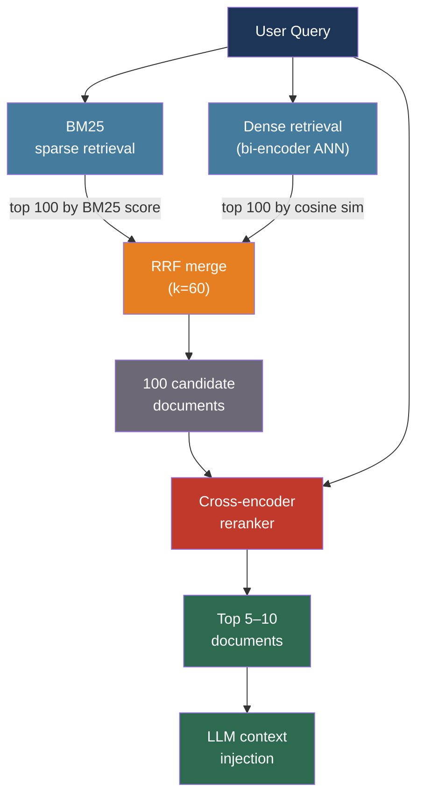

# [BEE-30015] Retrieval Reranking and Hybrid Search

:::info
Single-stage dense retrieval misses exact keyword matches; BM25 misses paraphrased queries; combining both with Reciprocal Rank Fusion and a cross-encoder reranker in a two-stage pipeline recovers the best of each, typically reducing retrieval failures by 30–50% compared to either method alone.
:::

## Context

The standard RAG retrieval story — embed the query, find the k nearest vectors, inject them into context — leaves significant precision on the table. The BEIR benchmark (Thakur et al., arXiv:2104.08663, NeurIPS 2021), which evaluates retrieval models across 18 diverse datasets in a zero-shot setting, exposed this clearly: dense retrievers fail on keyword-heavy queries where exact lexical overlap matters, and BM25 fails on paraphrased queries where the vocabulary differs but the meaning is the same. Neither method alone dominates across domains.

BM25 (Robertson and Zaragoza, "The Probabilistic Relevance Framework: BM25 and Beyond", 2009) is a probabilistic ranking function that scores documents by how often query terms appear, weighted by how rare those terms are across the corpus. Despite being a pre-neural algorithm, BM25 remains a strong baseline on domains where exact terminology matters — legal text, medical literature, code search, product catalogs with precise identifiers. Dense retrieval, by contrast, embeds semantics into continuous space and retrieves documents that are conceptually related even when they share no words with the query.

Hybrid retrieval fuses both signals. Reciprocal Rank Fusion (RRF, Cormack, Clarke, Buettcher, SIGIR 2009) is the standard merging algorithm: it ranks each retrieved document by the sum of its reciprocal rank across all retrievers, using a smoothing constant k=60. This rank-based aggregation is robust to the incompatible score scales of BM25 and embedding similarity — BM25 scores are term-count-based integers while cosine similarities are floats between 0 and 1.

A two-stage pipeline — retrieve a wide candidate set, then rerank with a more accurate but slower model — closes the remaining gap. Cross-encoder rerankers jointly encode the query and each candidate document through the full transformer attention mechanism, enabling the model to directly compare query tokens against document tokens. This is too slow for first-stage retrieval over millions of documents, but tractable when applied to 50–200 candidates.

## Design Thinking

Retrieval quality has three levers that operate at different latency and cost points:

**First-stage recall**: Maximize the number of relevant documents in the candidate set. Hybrid retrieval (dense + BM25 + RRF) consistently outperforms either method alone on BEIR, with the improvement most pronounced in out-of-domain settings.

**Reranking precision**: From the candidate set, select the ones most relevant to the specific query. Cross-encoders are the most accurate tool for this; ColBERT is a middle ground between the speed of bi-encoders and the accuracy of cross-encoders.

**Candidate set size tradeoff**: Retrieving more candidates (k=200 vs. k=50) gives the reranker more to work with but increases reranking latency linearly. The practical sweet spot is k=100 candidates for reranking on CPU, k=200 on GPU for latency-tolerant workloads.

## Best Practices

### Build a Hybrid First-Stage Retrieval

**SHOULD** run sparse (BM25) and dense (bi-encoder) retrieval in parallel and merge results with RRF. The two methods fail on complementary query classes; hybrid retrieval hedges against both failure modes:

```python
from rank_bm25 import BM25Okapi
import numpy as np

def rrf_merge(rankings: list[list[str]], k: int = 60) -> list[tuple[str, float]]:
    """
    Reciprocal Rank Fusion: score each doc across multiple ranked lists.
    k=60 is the empirical default from Cormack et al. 2009.
    """
    scores: dict[str, float] = {}
    for ranked_list in rankings:
        for rank, doc_id in enumerate(ranked_list, start=1):
            scores[doc_id] = scores.get(doc_id, 0.0) + 1.0 / (k + rank)
    return sorted(scores.items(), key=lambda x: x[1], reverse=True)

def hybrid_retrieve(query: str, bm25_index, vector_index, embed_fn,
                    top_k: int = 100) -> list[str]:
    # BM25: token overlap
    tokens = query.lower().split()
    bm25_scores = bm25_index.get_scores(tokens)
    bm25_top = [str(i) for i in np.argsort(bm25_scores)[::-1][:top_k]]

    # Dense: semantic similarity
    q_vec = embed_fn(query)
    dense_top = vector_index.search(q_vec, top_k)  # returns doc IDs

    # RRF merge
    merged = rrf_merge([bm25_top, dense_top], k=60)
    return [doc_id for doc_id, _ in merged[:top_k]]
```

**SHOULD** retrieve at least k=100 candidates at the hybrid stage. The reranker needs a sufficiently large candidate set to surface the best documents; fetching only 10–20 candidates with hybrid retrieval and then reranking defeats the purpose.

**MAY** add a third SPLADE retriever to the RRF merge for domains where learned sparse representations consistently outperform BM25. SPLADE (arXiv:2107.05720) expands queries and documents with semantically related terms using a neural model, then uses a standard inverted index — it adds recall for near-synonyms that BM25 would miss while retaining lexical matching precision.

### Apply a Cross-Encoder Reranker for Final Ordering

**MUST** apply a reranker after hybrid retrieval for any RAG application where retrieval quality directly affects answer quality. Cross-encoders see the full query and document together and produce a relevance score that is substantially more accurate than cosine similarity:

```python
from sentence_transformers import CrossEncoder

# Lightweight production reranker (80MB, fast on CPU)
reranker = CrossEncoder("cross-encoder/ms-marco-MiniLM-L6-v2")

def rerank(query: str, candidate_docs: list[dict], top_n: int = 10) -> list[dict]:
    pairs = [(query, doc["text"]) for doc in candidate_docs]
    scores = reranker.predict(pairs)  # one forward pass per pair
    ranked = sorted(zip(candidate_docs, scores), key=lambda x: x[1], reverse=True)
    return [doc for doc, _ in ranked[:top_n]]
```

**SHOULD** select a reranker based on deployment constraints:

| Reranker | Type | Dimensions | Best for |
|----------|------|-----------|---------|
| Cohere Rerank v3.5 | API | — | Managed; no GPU needed; multilingual |
| BAAI/bge-reranker-v2-m3 | Self-hosted | — | Open-source; multilingual; competitive quality |
| cross-encoder/ms-marco-MiniLM-L6-v2 | Self-hosted | — | Fast CPU inference; English; low memory |
| Jina Reranker v2 | API + Self-hosted | — | 100+ languages; function-calling support |

**SHOULD** rerank to top 5–10 documents for injection into the LLM context window. Injecting more than 10 retrieved chunks degrades LLM performance due to the U-shaped recall curve described in BEE-30010.

**MAY** use Cohere Rerank via API for rapid prototyping before investing in self-hosted infrastructure. The API adds one network round-trip (~50–100ms) but requires no GPU:

```python
import cohere

co = cohere.Client(api_key=COHERE_API_KEY)

def cohere_rerank(query: str, docs: list[str], top_n: int = 5) -> list[dict]:
    response = co.rerank(
        model="rerank-v3.5",
        query=query,
        documents=docs,
        top_n=top_n,
    )
    return [
        {"index": r.index, "score": r.relevance_score, "text": docs[r.index]}
        for r in response.results
    ]
```

### Consider ColBERT for High-Throughput or Domain Shift

**MAY** use ColBERT (arXiv:2112.01488) as a single-stage retriever when you need better accuracy than bi-encoders without the latency of cross-encoders. ColBERT stores a vector per token for every document and computes MaxSim at query time — for each query token, it finds the highest similarity to any document token:

```
score(Q, D) = Σ_qi max_dj sim(qi_vec, dj_vec)
```

This late interaction captures fine-grained token-level matching, producing significantly better generalization to new domains than bi-encoders. RAGatouille provides a practical production interface:

```python
from ragatouille import RAGPretrainedModel

RAG = RAGPretrainedModel.from_pretrained("colbert-ir/colbertv2.0")
RAG.index(collection=documents, index_name="my-index")

results = RAG.search(query="circuit breaker pattern for microservices", k=10)
# Returns top-10 chunks with late-interaction relevance scores
```

**SHOULD** consider ColBERT when: operating in a low-data domain where bi-encoder fine-tuning is not feasible, dealing with frequent domain shifts, or when the candidate pool is too large for cross-encoder reranking but bi-encoder accuracy is insufficient.

### Set Up the Two-Stage Pipeline

The canonical production pipeline integrates all three components with explicit latency budgets:

```python
class TwoStageRetriever:
    def __init__(self, bm25_index, vector_index, embed_fn, reranker):
        self.bm25 = bm25_index
        self.vectors = vector_index
        self.embed = embed_fn
        self.reranker = reranker

    def retrieve(self, query: str, final_k: int = 5) -> list[dict]:
        # Stage 1: broad candidate retrieval (~50–150ms)
        candidates = hybrid_retrieve(
            query, self.bm25, self.vectors, self.embed,
            top_k=100,   # retrieve 100, rerank to final_k
        )
        candidate_docs = self.load_docs(candidates)

        # Stage 2: accurate reranking (~50–200ms for 100 candidates)
        return rerank(query, candidate_docs, top_n=final_k)
```

**SHOULD** allocate the retrieval latency budget as follows for user-facing applications:

| Stage | Target latency | Action if exceeded |
|-------|---------------|-------------------|
| Hybrid retrieval (ANN + BM25) | < 100ms | Reduce candidate k; use approximate BM25 |
| RRF merge | < 5ms | Already negligible |
| Reranker (100 candidates) | < 150ms | Switch to lighter reranker; reduce candidate k |
| Total retrieval | < 250ms | Add GPU for reranker; use Cohere API |

**SHOULD** monitor retrieval quality, not just latency. Track Mean Reciprocal Rank (MRR@5) and NDCG@10 on a held-out query benchmark. Retrieval quality directly determines the upper bound on downstream answer quality; a fast retriever that returns the wrong documents produces confidently wrong answers.

### Choose Candidate Set Size Deliberately

**SHOULD** calibrate the first-stage candidate count based on the expected recall at that k:

```python
# Measure recall@k: what fraction of relevant docs appear in the top-k candidates?
def recall_at_k(query_benchmark: list[dict], retriever, k: int) -> float:
    hits = 0
    for item in query_benchmark:
        candidates = retriever.retrieve(item["query"], top_k=k)
        if item["relevant_doc_id"] in candidates:
            hits += 1
    return hits / len(query_benchmark)

# Run for k in [10, 25, 50, 100, 200] to find the knee in the curve
```

The typical recall curve has a steep initial slope and a diminishing-returns plateau. If recall@50 = 0.82 and recall@100 = 0.86, the extra 50 candidates buy only 4 percentage points of recall at 2× the reranking cost. Adjust k based on this measurement, not by guessing.

## Visual



## Related BEEs

- [BEE-30007](rag-pipeline-architecture.md) -- RAG Pipeline Architecture: the two-stage retrieval pipeline described here is the production-grade retrieval component of a RAG system
- [BEE-30014](embedding-models-and-vector-representations.md) -- Embedding Models and Vector Representations: bi-encoder embedding models power the dense retrieval stage; model selection and quantization decisions apply directly
- [BEE-17004](../search/vector-search-and-semantic-search.md) -- Vector Search and Semantic Search: ANN index structures (HNSW, IVF) and approximate search are the underlying mechanism for the dense retrieval stage
- [BEE-30010](llm-context-window-management.md) -- LLM Context Window Management: the reranker's top-k output must fit within the allocated RAG context budget

## References

- [Nandan Thakur et al. BEIR: A Heterogeneous Benchmark for Zero-shot Evaluation of Information Retrieval Models — arXiv:2104.08663, NeurIPS 2021](https://arxiv.org/abs/2104.08663)
- [Gordon V. Cormack, Charles L.A. Clarke, Stefan Buettcher. Reciprocal Rank Fusion Outperforms Condorcet and Individual Rank Learning Methods — SIGIR 2009](https://dl.acm.org/doi/10.1145/1571941.1572114)
- [Omar Khattab, Matei Zaharia. ColBERTv2: Effective and Efficient Retrieval via Lightweight Late Interaction — arXiv:2112.01488, ACL 2022](https://arxiv.org/abs/2112.01488)
- [Thibault Formal et al. SPLADE: Sparse Lexical and Expansion Model for First Stage Ranking — arXiv:2107.05720, SIGIR 2021](https://arxiv.org/abs/2107.05720)
- [Stephen Robertson, Hugo Zaragoza. The Probabilistic Relevance Framework: BM25 and Beyond — Foundations and Trends in Information Retrieval, Vol. 3, No. 4, 2009](https://dl.acm.org/doi/abs/10.1561/1500000019)
- [Cohere. Rerank Documentation — docs.cohere.com](https://docs.cohere.com/docs/rerank)
- [BAAI. bge-reranker-v2-m3 Model Card — huggingface.co/BAAI/bge-reranker-v2-m3](https://huggingface.co/BAAI/bge-reranker-v2-m3)
- [Sentence Transformers. Cross-Encoders — sbert.net](https://sbert.net/docs/cross_encoder/pretrained_models.html)
- [RAGatouille. ColBERT for RAG — github.com/AnswerDotAI/RAGatouille](https://github.com/AnswerDotAI/RAGatouille)
- [Pinecone. Rerankers and Two-Stage Retrieval — pinecone.io/learn](https://www.pinecone.io/learn/series/rag/rerankers/)
