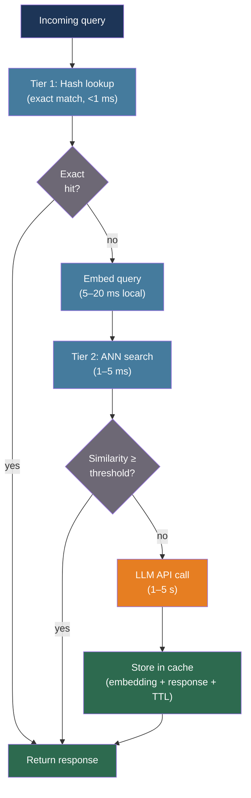

# [BEE-30056] Semantic Caching for LLM Applications

:::info
Exact-match caching reuses responses only when the query string is identical — an impossibly strict condition for natural language. Semantic caching replaces string equality with vector-similarity matching: when a new query is semantically equivalent to a cached query, the stored response is returned without calling the LLM, reducing API costs by 30–70% and cache-hit latency by 50–100×.
:::

## Context

Standard caching with a key-value store (BEE-9001) identifies cache hits by the exact bytes of the key. For LLM queries, this means "What is the capital of France?" and "Tell me the capital of France" are treated as different requests and billed separately, even though any LLM will produce an identical or semantically equivalent response. Natural language paraphrasing makes exact-match hit rates negligible for real conversational workloads.

Bang (2023, NLP-OSS Workshop, "GPTCache: An Open-Source Semantic Cache for LLM Applications Enabling Faster Answers and Cost Savings") introduced the first systematic open-source semantic cache architecture. GPTCache converts each incoming query to an embedding vector, stores the embedding and its associated LLM response, and uses approximate nearest-neighbor (ANN) search to detect semantically similar future queries. A similarity threshold determines when a retrieved entry is "close enough" to reuse. Studies across ChatGPT query logs (MeanCache, arXiv:2403.02694, IPDPS 2025) found that 31% of user queries within a session are semantically similar to a prior query — this is the practical ceiling for per-session cache hit rate.

Semantic caching faces challenges that exact-match caches do not. The optimal eviction policy is NP-hard: a theoretical analysis (arXiv:2603.03301) proves that computing the optimal semantic cache policy (VOPT) reduces to the Maximum Coverage Problem and cannot be approximated better than (1 − 1/e) ≈ 63.2% unless P = NP. Empirical evaluation across nine real-world datasets (ELI5, WildChat, MS MARCO, StackOverflow) found that LFU-based eviction consistently outperforms LRU because LLM query distributions follow a Zipfian (heavy-tailed) pattern, not temporal locality. A single static similarity threshold also produces a fundamental precision-recall tradeoff: a permissive threshold increases hit rate but returns semantically wrong responses; a conservative threshold is safe but misses valid hits. Per-prompt adaptive thresholds (vCache, arXiv:2502.03771, ICLR 2026) achieve 12.5× higher hit rate and 26× lower error rate compared to static-threshold baselines.

For backend engineers, semantic caching is an application-layer optimization that sits between the application and the LLM API. It does not require model changes. The critical implementation decisions are: embedding model selection, similarity threshold, eviction policy, TTL strategy for stale content, and multi-tenant safety.

## Best Practices

### Use a Two-Tier Architecture: Exact Match Before Semantic Match

**MUST** check exact string equality before invoking embedding and vector search. The embedding step costs 5–20 ms for local inference; the vector search adds 1–5 ms. Paying this overhead on identical repeated queries is wasteful:

```python
import hashlib
from dataclasses import dataclass, field

@dataclass
class SemanticCache:
    """
    Two-tier semantic cache.
    Tier 1: exact key match (hash lookup, sub-millisecond)
    Tier 2: semantic match (embed + ANN search, 5-20 ms)
    """
    exact_store: dict = field(default_factory=dict)        # hash -> response
    vector_store: object = None                            # ANN index
    embedder: object = None                                # embedding model
    similarity_threshold: float = 0.90                    # cosine similarity

    def _hash(self, prompt: str) -> str:
        return hashlib.sha256(prompt.encode()).hexdigest()

    def get(self, prompt: str) -> str | None:
        # Tier 1: exact match
        key = self._hash(prompt)
        if key in self.exact_store:
            return self.exact_store[key]

        # Tier 2: semantic match
        embedding = self.embedder.encode(prompt)
        results = self.vector_store.search(embedding, top_k=1)
        if results and results[0].score >= self.similarity_threshold:
            return results[0].response

        return None   # cache miss — call the LLM

    def set(self, prompt: str, response: str) -> None:
        key = self._hash(prompt)
        self.exact_store[key] = response
        embedding = self.embedder.encode(prompt)
        self.vector_store.upsert(prompt, embedding, response)
```

### Choose an Embedding Model Optimized for Paraphrase Detection

**MUST NOT** reuse the same embedding model as your RAG pipeline for semantic caching. RAG embeddings are optimized for document-query relevance across a large vocabulary; cache embeddings need to detect paraphrases of a narrow query space. These objectives are different:

| Model | Dims | Deployment | Use for caching |
|---|---|---|---|
| all-MiniLM-L6-v2 | 384 | Local | Good default; 5ms inference |
| redis/langcache-embed-v1 | 768 | Local / HuggingFace | Trained for cache matching |
| MPNet (paraphrase-mpnet-base-v2) | 768 | Local | F1=0.89 on cache hit/miss task (MeanCache) |
| text-embedding-ada-002 | 1536 | Cloud API | 50–200ms cloud round-trip; avoid for cache layer |
| Llama-2 variants | 4096+ | Local GPU | Lower F1 (0.75) than MPNet despite larger size |

MeanCache (arXiv:2403.02694) measured paraphrase detection F1 across embedding models and found that a purpose-tuned 768-dimension MPNet outperformed a 30 GB Llama-2 variant (F1 = 0.89 vs 0.75). Smaller models trained for paraphrase tasks beat larger general models on the cache classification task.

**SHOULD** use a local model for the cache embedding layer to avoid adding a cloud round-trip on every request. A cloud embedding call (50–200 ms) on cache misses adds overhead that partially offsets the benefit of cache hits.

### Set Similarity Thresholds Carefully — and Mind the Convention

**MUST** verify whether your vector store uses cosine **similarity** (higher = more similar) or cosine **distance** (lower = more similar) before configuring a threshold. The two conventions are inverted:

```python
# RedisVL SemanticCache: uses COSINE DISTANCE
# distance_threshold=0.1 ≈ cosine similarity of 0.9 (strict)
# distance_threshold=0.5 ≈ cosine similarity of 0.5 (too permissive)
from redisvl.extensions.llmcache import SemanticCache

cache = SemanticCache(
    name="llmcache",
    redis_url="redis://localhost:6379",
    distance_threshold=0.1,   # DISTANCE — lower = stricter (opposite of intuition)
)

# GPTCache / most libraries: uses COSINE SIMILARITY
# similarity_threshold=0.9 means "only cache hits with 90%+ similarity"
# similarity_threshold=0.7 is GPTCache's default (too permissive for factual apps)
```

**Practical threshold recommendations by use case:**

| Use case | Cosine similarity | Rationale |
|---|---|---|
| FAQ / support bots | 0.65–0.75 | High paraphrase rate; wrong answers are low-stakes |
| General-purpose chat | 0.85–0.90 | Balanced hit rate and accuracy |
| Factual / high-stakes | 0.90–0.95 | False positives (wrong cached answers) are costly |

**SHOULD** evaluate false positive rate — fraction of cache hits that return semantically wrong responses — separately from hit rate. A threshold that looks good on hit rate may have an unacceptable false positive rate for your content domain. Redis recommends keeping false positive rate below 3–5% for production deployments.

### Apply LFU Eviction, Not LRU

**SHOULD** configure frequency-based (LFU) eviction rather than recency-based (LRU) eviction for LLM query caches. LLM query workloads follow Zipfian distributions: a small fraction of query types accounts for the majority of requests. LRU evicts cache entries based on time since last access, which works well when usage is temporally correlated. For LLM caches, the most valuable entries are frequently-repeated query patterns, not necessarily the most recently accessed ones:

```python
# Redis configuration: use LFU eviction policy
# In redis.conf or via CONFIG SET:
#   maxmemory-policy allkeys-lfu
#
# LFU eviction removes the least-frequently-accessed keys when
# memory is full, preserving high-value cached query patterns.
#
# For exact-match keys (Tier 1), Redis LFU eviction applies automatically.
# For vector store entries (Tier 2), eviction is managed by the vector DB
# or must be implemented explicitly with frequency counters.

@dataclass
class LFUSemanticCache:
    frequency: dict[str, int] = field(default_factory=dict)

    def on_hit(self, cache_key: str) -> None:
        self.frequency[cache_key] = self.frequency.get(cache_key, 0) + 1

    def evict_if_needed(self, max_entries: int) -> None:
        if len(self.frequency) > max_entries:
            # Remove least-frequently-used entries
            sorted_keys = sorted(self.frequency, key=self.frequency.get)
            for key in sorted_keys[:len(self.frequency) - max_entries]:
                del self.frequency[key]
                # Also remove from exact_store and vector_store
```

### Use TTL to Handle Content Staleness

**MUST** set TTL on cached entries for content that changes over time. Semantic caches do not have a clean invalidation mechanism for updates — a single fact change may make many semantically related cached entries wrong without a way to enumerate them:

```python
from datetime import timedelta

# TTL guidelines by content volatility:
CACHE_TTL = {
    "prices_inventory": timedelta(minutes=5),
    "news_current_events": timedelta(minutes=15),
    "product_descriptions": timedelta(hours=4),
    "documentation_faqs": timedelta(hours=24),
    "reference_stable_facts": None,   # No TTL — eviction only
}

async def get_or_fetch(
    prompt: str,
    content_type: str,
    llm_client,
    cache: SemanticCache,
) -> str:
    cached = cache.get(prompt)
    if cached is not None:
        return cached

    response = await llm_client.complete(prompt)
    ttl = CACHE_TTL.get(content_type)
    cache.set(prompt, response, ttl=ttl)
    return response
```

**SHOULD** tag cached entries with metadata (product ID, document version, user ID) to enable targeted bulk invalidation when source data changes:

```python
# RedisVL supports filter-based deletion:
# Delete all cache entries tagged with a specific product_id
cache.delete(filter_expression=Tag("product_id") == "SKU-12345")
```

### Enforce Tenant Isolation with Metadata Filters

**MUST NOT** allow cached responses from one tenant to be served to another tenant in multi-tenant deployments. Users from different tenants may ask semantically similar questions with different correct answers (different pricing tiers, different feature access, different data):

```python
from redisvl.query.filter import Tag

async def get_cached_response(
    prompt: str,
    tenant_id: str,
    cache,
) -> str | None:
    """
    Always include tenant_id in the cache lookup filter.
    Without this, a cache entry for tenant A may be returned to tenant B.
    """
    return cache.check(
        prompt=prompt,
        filter_expression=Tag("tenant_id") == tenant_id,
    )

async def store_cached_response(
    prompt: str,
    response: str,
    tenant_id: str,
    cache,
) -> None:
    cache.store(
        prompt=prompt,
        response=response,
        metadata={"tenant_id": tenant_id},
    )
```

## Visual



## Common Mistakes

**Using the same threshold for all content domains.** A single global threshold produces a tradeoff between hit rate and false positive rate that is wrong for at least one of your content types. Measure false positive rate by domain and set separate cache instances or threshold profiles.

**Confusing cosine distance with cosine similarity.** RedisVL's `distance_threshold` is a cosine distance (0 = identical, 2 = opposite). Most academic papers and GPTCache use cosine similarity (1 = identical, 0 = orthogonal). Setting `distance_threshold=0.9` on RedisVL is nearly useless (allows almost any match); the equivalent of "90% similar" is `distance_threshold=0.1`.

**Caching multi-turn conversation responses without context encoding.** A query like "What's the next step?" has a correct response that depends entirely on the prior conversation. Semantic caching must either encode conversation context into the embedding (context chain encoding from MeanCache) or explicitly exclude context-dependent queries from the cache.

**Skipping tenant isolation.** In a multi-tenant system, users from different tenants may ask "What is our enterprise plan pricing?" and receive each other's cached pricing data. Always scope cache lookups to tenant context using metadata filters.

**Using LRU eviction.** LRU evicts the least recently accessed entries. For LLM caches with Zipfian query distributions, the most valuable entries are those frequently re-queried — not necessarily those accessed recently. Use LFU or a frequency-weighted policy.

**Not measuring false positive rate.** Hit rate alone is a misleading metric. A 30% hit rate with 10% false positives means 3% of all user responses are factually wrong and appear correct. Measure false positive rate through sampling + LLM judge evaluation, and track it as a production SLO.

## Related BEEs

- [BEE-9001](../caching/caching-fundamentals-and-cache-hierarchy.md) -- Caching Fundamentals and Cache Hierarchy: exact-match caching foundations this article extends
- [BEE-30024](llm-caching-strategies.md) -- LLM Caching Strategies: API-level prompt caching (Anthropic, OpenAI) and KV cache reuse
- [BEE-30014](embedding-models-and-vector-representations.md) -- Embedding Models and Vector Representations: embedding model selection and tradeoffs
- [BEE-30026](vector-database-architecture.md) -- Vector Database Architecture: ANN search engines used by the semantic cache tier

## References

- [Bang. GPTCache: An Open-Source Semantic Cache for LLM Applications — NLP-OSS Workshop 2023](https://openreview.net/pdf?id=ivwM8NwM4Z)
- [GPTCache — github.com/zilliztech/GPTCache](https://github.com/zilliztech/GPTCache)
- [Cheng et al. MeanCache: User-Centric Semantic Caching for LLM Web APIs — arXiv:2403.02694, IPDPS 2025](https://arxiv.org/abs/2403.02694)
- [SCALM: Semantic Caching for Large Language Models — arXiv:2406.00025, IEEE/ACM 2024](https://arxiv.org/abs/2406.00025)
- [From Exact Hits to Close Enough: Semantic Caching Eviction Policies — arXiv:2603.03301](https://arxiv.org/html/2603.03301)
- [Krites: Asynchronous Verified Semantic Caching (Apple) — arXiv:2602.13165, 2026](https://arxiv.org/html/2602.13165v1)
- [vCache: Semantic Cache with Per-Prompt Adaptive Thresholds — arXiv:2502.03771, ICLR 2026](https://arxiv.org/abs/2502.03771)
- [RedisVL SemanticCache Documentation — redis.io](https://redis.io/docs/latest/develop/ai/redisvl/user_guide/llmcache/)
