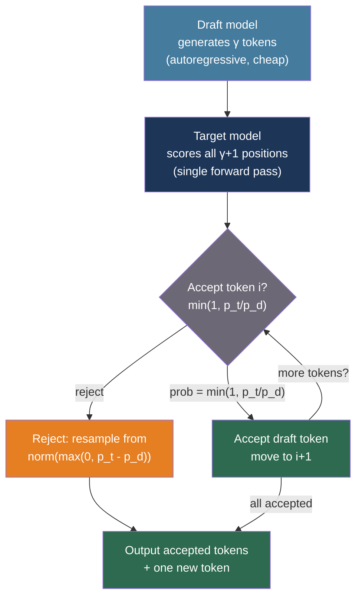
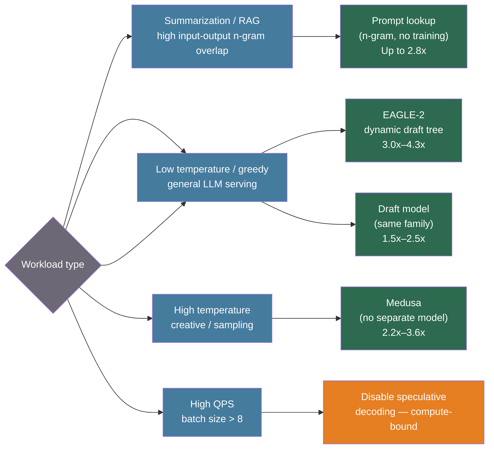

# [BEE-561] Speculative Decoding for LLM Inference

:::info
Autoregressive LLM decoding generates one token per forward pass, leaving the GPU underutilized between passes while weights are loaded from memory. Speculative decoding amortizes this cost: a cheap draft model proposes multiple tokens in sequence, and the large target model verifies all of them in a single parallel forward pass using modified rejection sampling that provably preserves the target distribution.
:::

## Context

Standard autoregressive decoding is memory-bandwidth-bound at interactive batch sizes: the GPU must load all model weights from HBM for every single output token, but the arithmetic performed per byte of weight is minimal. This ratio — FLOP per byte — is far below the GPU's compute-to-bandwidth ceiling, leaving compute cores idle most of the time.

Speculative decoding, introduced independently by Leviathan, Kalman, and Matias (Google, arXiv:2211.17192, ICML 2023 oral) and Chen et al. (DeepMind, arXiv:2302.01318, 2023), addresses this by decoupling proposal from verification. A cheap draft model generates a sequence of gamma candidate tokens autoregressively; the target model scores all gamma+1 positions (the gamma draft tokens plus the next token after them) in a single forward pass. Each draft token is accepted or rejected according to a modified rejection sampling rule that yields an output distribution identical to what the target model alone would produce — no quality loss, not an approximation.

The acceptance rule for draft token x at position i: accept with probability `min(1, p_target(x) / p_draft(x))`. When rejected, resample from the normalized positive residual `norm(max(0, p_target - p_draft))`, which maintains the exact target distribution. Expected tokens accepted per target call ≈ `(1 - α^(γ+1)) / (1 - α)` where α is the per-token acceptance rate and γ is draft length. At α = 0.8 with γ = 4, one target call yields ~2.8 tokens on average.

Two practical limitations constrain classic speculative decoding: the draft and target models must share identical vocabularies (limiting cross-family use), and gains diminish at high batch sizes where the system becomes compute-bound rather than memory-bandwidth-bound.

Subsequent work addressed the draft quality problem. EAGLE (Li et al., arXiv:2401.15077, 2024) operates at the feature level rather than token level: its autoregressive draft head takes the previous token shifted one step ahead plus the preceding hidden state to predict the next hidden state, resolving the "inherent uncertainty" of pure token-level prediction. EAGLE achieves 2.7x–3.5x speedup on LLaMA2-Chat 70B at greedy decoding. EAGLE-2 (arXiv:2406.16858, 2024) adds a context-aware dynamic draft tree: it uses the draft head's confidence score as a well-calibrated proxy for per-branch acceptance rate (confidence < 0.05 → ~0.04 acceptance; confidence > 0.95 → ~0.98 acceptance) to prune low-probability branches at runtime, reaching 3.05x–4.26x speedup.

Medusa (Cai et al., arXiv:2401.10774, 2024) eliminates the separate draft model entirely by adding multiple feed-forward decoding heads directly to the frozen backbone, each predicting a different future token offset. A tree-based attention mask verifies all Cartesian-product candidate continuations in one target forward pass. Medusa-1 (frozen backbone, heads only) achieves >2.2x speedup losslessly; Medusa-2 (joint fine-tuning) reaches 2.3x–3.6x. The vocabulary-mismatch constraint is avoided since there is no separate model.

## Best Practices

### Start with prompt lookup for summarization and RAG workloads

**SHOULD** try prompt lookup (n-gram speculative decoding) first before investing in draft models. Prompt lookup scans the input prompt for n-grams matching the current suffix of the generated output and uses them as draft tokens. No training required, vocabulary constraints are irrelevant, and it achieves up to 2.8x speedup on tasks with high input-output overlap (summarization, RAG, translation):

```python
from vllm import LLM, SamplingParams

llm = LLM(
    model="meta-llama/Llama-3.1-8B-Instruct",
    speculative_config={
        "method": "ngram",
        "num_speculative_tokens": 5,  # draft length gamma
        "prompt_lookup_max": 4,       # max n-gram match length
        "prompt_lookup_min": 1,       # min n-gram match length
    },
)
params = SamplingParams(temperature=0.0, max_tokens=512)
outputs = llm.generate(prompts, params)
```

### Use a draft model from the same family for general-purpose acceleration

**SHOULD** use a small model from the same family (shared tokenizer and vocabulary) as the target when prompt lookup yields insufficient gains. The draft model is ~10x smaller: Llama 3.1 8B drafting for Llama 3.1 70B is a common pairing.

```python
llm = LLM(
    model="meta-llama/Llama-3.1-70B-Instruct",
    speculative_config={
        "method": "draft_model",
        "model": "meta-llama/Llama-3.1-8B-Instruct",  # must share vocabulary
        "num_speculative_tokens": 5,
        "draft_tensor_parallel_size": 1,  # draft runs on fewer GPUs
    },
)
```

**MUST NOT** deploy speculative decoding at high QPS without load testing. At low batch sizes (1–4 requests) the system is memory-bandwidth-bound and speculative decoding helps. At high batch sizes the GPU becomes compute-bound and the proposal overhead can degrade throughput. vLLM's dynamic speculative decoding adjusts draft length based on system load:

```python
speculative_config={
    "method": "draft_model",
    "model": "meta-llama/Llama-3.1-8B-Instruct",
    "num_speculative_tokens": -1,    # -1 enables dynamic adjustment
    "disable_by_batch_size": 8,      # disable speculative decoding above this batch size
}
```

### Deploy EAGLE for highest single-user latency reduction

**SHOULD** use EAGLE or EAGLE-2 when optimizing for single-user p50 and p99 TTFT and ITL (see BEE-560) on generation-heavy workloads. EAGLE requires a pre-trained draft head — official heads are released for LLaMA-2, LLaMA-3, Mistral, and Vicuna families.

```python
# EAGLE-2 with dynamic draft tree in vLLM
llm = LLM(
    model="meta-llama/Llama-3.1-8B-Instruct",
    speculative_config={
        "method": "eagle",
        "model": "yuhuili/EAGLE2-LLaMA3.1-Instruct-8B",  # EAGLE-2 draft head
        "num_speculative_tokens": 6,
    },
)
```

**MUST** keep temperature = 0 (greedy decoding) to maximize acceptance rates when latency is the primary objective. At temperature ≥ 1.0, flat output distributions reduce acceptance rates significantly (EAGLE drops to 1.7x–2.1x range vs. 3x+ at greedy).

### Use Medusa when a separate draft model is impractical

**SHOULD** use Medusa when vocabulary mismatch rules out a separate draft model, or when serving infrastructure cannot accommodate a second model process:

```python
# Medusa in TensorRT-LLM (temperature must be 0)
llm = LLM(
    model="FasterDecoding/medusa-1-vicuna-7b-v1.5",
    speculative_config={
        "method": "medusa",
        "num_speculative_tokens": 5,  # one per Medusa head
    },
)
```

**MUST NOT** use Medusa with non-zero temperature in the lossless (Medusa-1) configuration — token matching breaks at temperature > 0. Medusa-2's joint fine-tuning can relax this constraint at the cost of slight quality drift.

### Measure acceptance rate to diagnose underperforming deployments

**SHOULD** instrument acceptance rate and mean tokens per target call to detect when speculative decoding is net-negative:

```python
import time
from dataclasses import dataclass, field
from collections import deque

@dataclass
class SpecDecMetrics:
    """Rolling window metrics for speculative decoding health."""
    window: int = 1000
    _accepted: deque = field(default_factory=lambda: deque(maxlen=1000))
    _drafted: deque = field(default_factory=lambda: deque(maxlen=1000))

    def record(self, drafted: int, accepted: int) -> None:
        self._drafted.append(drafted)
        self._accepted.append(accepted)

    @property
    def acceptance_rate(self) -> float:
        d = sum(self._drafted)
        return sum(self._accepted) / d if d else 0.0

    @property
    def mean_tokens_per_call(self) -> float:
        return sum(self._accepted) / len(self._accepted) if self._accepted else 0.0

    def is_healthy(self, min_acceptance_rate: float = 0.6) -> bool:
        """Below 0.6 acceptance rate, overhead often exceeds gains."""
        return self.acceptance_rate >= min_acceptance_rate
```

If `acceptance_rate` falls below 0.6 over a sustained window, consider: raising temperature threshold, reducing draft length gamma, or disabling speculative decoding for that request class.

## Visual





## Common Mistakes

**Enabling speculative decoding at high QPS without measuring throughput.** The proposal-verification overhead adds latency per step. At high batch sizes the GPU is compute-bound, not memory-bandwidth-bound, so there is no free lunch. Always compare goodput (requests/second meeting SLO) before and after enabling. vLLM's `disable_by_batch_size` prevents degradation at scale.

**Using a draft model from a different model family.** Vocabulary mismatch makes token-level draft proposal impossible. Llama 3 tokens ≠ Mistral tokens even if the models look similar. Use EAGLE or Medusa when families do not align.

**Applying speculative decoding to high-temperature sampling without checking acceptance rate.** At temperature = 1.0+, output distributions are nearly uniform. The acceptance rate `min(1, p_t/p_d)` drops close to 0 for most tokens, meaning nearly every draft token is rejected and resampled — the overhead of the draft model is wasted.

**Setting draft length gamma too long.** A long draft sequence means a single rejected token invalidates all subsequent draft tokens. Empirically, gamma = 4–6 is near-optimal for most model family pairings. Longer drafts help only when acceptance rate is very high (> 0.9).

**Assuming quality is unaffected with Medusa-2.** Medusa-2 involves joint fine-tuning of the backbone and heads. MT-bench scores shift by ±0.15 on average — usually negligible, but not zero. Validate on your task distribution before deploying to production.

**Not isolating interactive from batch workloads.** Speculative decoding benefits single-user interactive latency (TTFT, ITL). Batch offline workloads are already compute-bound and should not use it. Route workloads by type.

## Related BEEs

- [BEE-30021](llm-inference-optimization-and-self-hosting.md) -- LLM Inference Optimization and Self-Hosting: the broader optimization landscape that speculative decoding fits into
- [BEE-30058](llm-load-testing-and-capacity-planning.md) -- LLM Load Testing and Capacity Planning: measuring TTFT/ITL to validate speculative decoding gains
- [BEE-30011](ai-cost-optimization-and-model-routing.md) -- AI Cost Optimization and Model Routing: choosing smaller models to reduce cost, complementary to speculative decoding

## References

- [Leviathan, Kalman, Matias. Fast Inference from Transformers via Speculative Decoding — arXiv:2211.17192, ICML 2023](https://arxiv.org/abs/2211.17192)
- [Chen et al. Accelerating Large Language Model Decoding with Speculative Sampling — arXiv:2302.01318, DeepMind 2023](https://arxiv.org/abs/2302.01318)
- [Li et al. EAGLE: Speculative Sampling Requires Rethinking Feature Uncertainty — arXiv:2401.15077, 2024](https://arxiv.org/abs/2401.15077)
- [Li et al. EAGLE-2: Faster Inference of Language Models with Dynamic Draft Trees — arXiv:2406.16858, 2024](https://arxiv.org/abs/2406.16858)
- [Cai et al. Medusa: Simple LLM Inference Acceleration Framework with Multiple Decoding Heads — arXiv:2401.10774, 2024](https://arxiv.org/abs/2401.10774)
- [Xia et al. Unlocking Efficiency in Large Language Model Inference: A Comprehensive Survey of Speculative Decoding — arXiv:2401.07851, ACL Findings 2024](https://arxiv.org/abs/2401.07851)
- [vLLM. Speculative Decoding — vllm.ai](https://vllm.ai/blog/spec-decode)
- [NVIDIA TensorRT-LLM. Speculative Decoding — nvidia.github.io](https://nvidia.github.io/TensorRT-LLM/advanced/speculative-decoding.html)
