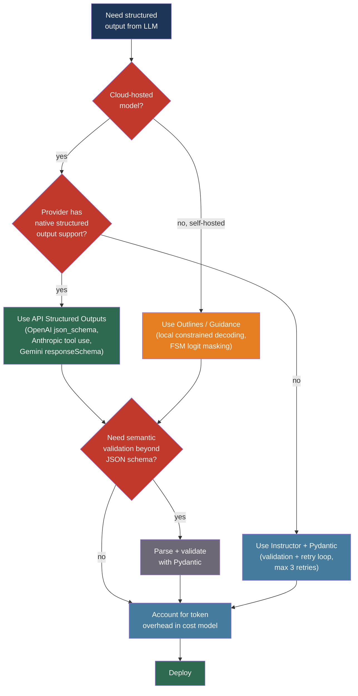

# [BEE-30006] Structured Output and Constrained Decoding

:::info
LLMs generate free-form text by default, making reliable schema-compliant JSON a parsing problem at scale. Constrained decoding solves this at the token level, eliminating the 8–15% JSON parse failure rate that naive "prompt for JSON" approaches produce in production.
:::

## Context

The earliest production pattern for extracting structured data from LLMs was prompting: include "respond only with valid JSON" in the system prompt and post-process the output. This worked well enough in demos but failed in production at rates between 8% and 15% — missing commas, unclosed braces, extra commentary, and enum violations that passed syntactic validation but violated the schema.

OpenAI introduced JSON mode in November 2023 with `response_format: {type: "json_object"}`. JSON mode guarantees syntactically valid JSON, not schema compliance. A model can return `{}` or a completely different key structure and satisfy the constraint. The gap between "valid JSON" and "JSON matching this schema" remained the application's problem.

The underlying theory for solving this gap appeared in Willard and Louf's "Efficient Guided Generation for Large Language Models" (arXiv:2307.09702, 2023), which reformulated structured generation as transitions through a finite-state machine derived from the target grammar. At each decoding step, only tokens that keep the FSM in a valid state receive non-zero logit weight. This guarantees output conformance without post-hoc validation. Geng et al.'s "Grammar-Constrained Decoding for Structured NLP Tasks without Finetuning" (arXiv:2305.13971, EMNLP 2023) extended this to context-free grammars, enabling recursive JSON schemas.

By 2024, API providers had internalized constrained decoding. OpenAI's Structured Outputs (GPT-4o, August 2024) uses Microsoft's llguidance engine to enforce JSON schemas server-side. Anthropic's tool-use API and Gemini's `responseSchema` parameter apply equivalent mechanisms. The field moved from "prompt for JSON" to "algorithmic guarantees" in under three years.

## Design Thinking

Structured output enforcement operates at three tiers with different cost, control, and portability trade-offs:

| Tier | Mechanism | Schema guarantee | Latency overhead |
|------|-----------|-----------------|-----------------|
| API constrained decoding | Provider enforces schema during token sampling | Hard | ~0ms (server-side) |
| Client validation + retry | Parse and validate after generation, retry with error | Probabilistic | 1–3 full round-trips |
| Local constrained decoding | Library masks logits during local inference | Hard | ~50µs per token |

**API constrained decoding** (OpenAI Structured Outputs, Anthropic tool use, Gemini responseSchema) is the right default for cloud-hosted models: zero client-side retry cost, guaranteed conformance, no library dependencies. Its cost is schema complexity limits and provider lock-in.

**Client validation + retry** (Instructor + Pydantic) is the pragmatic middle ground: works with any provider, including those without native structured output support, and handles semantic validation that no decoding constraint can express (e.g., "start date must precede end date").

**Local constrained decoding** (Outlines, Guidance, llama.cpp GBNF) is the choice for self-hosted models where hard guarantees are required and API cost matters.

The key insight: JSON mode is not constrained decoding. It guarantees syntactic validity, not schema compliance. Do not use JSON mode as a substitute for structured outputs or schema validation.

## Best Practices

### Use API Structured Outputs Over JSON Mode

**MUST NOT** rely on JSON mode as the primary schema enforcement mechanism for production systems. JSON mode guarantees a valid JSON value; it does not guarantee that the value matches your schema. A response of `{}` or `{"unexpected": true}` satisfies JSON mode but breaks the application.

**SHOULD** use provider-native structured outputs when available:

```python
# OpenAI Structured Outputs -- schema compliance guaranteed server-side
from openai import OpenAI
import json

client = OpenAI()

schema = {
    "type": "object",
    "properties": {
        "status": {"type": "string", "enum": ["success", "failure", "pending"]},
        "items": {
            "type": "array",
            "items": {"type": "object", "properties": {
                "id": {"type": "string"},
                "score": {"type": "number"}
            }, "required": ["id", "score"]}
        }
    },
    "required": ["status", "items"],
    "additionalProperties": False
}

response = client.chat.completions.create(
    model="gpt-4o-2024-08-06",
    response_format={
        "type": "json_schema",
        "json_schema": {"name": "result", "strict": True, "schema": schema}
    },
    messages=[{"role": "user", "content": "Extract the items..."}]
)
result = json.loads(response.choices[0].message.content)
```

**MUST** set `additionalProperties: false` and `strict: true` in OpenAI structured outputs to prevent the model from adding undeclared fields. Without this, the model may include extra fields that break strict deserializers.

### Validate with Pydantic and Use Instructor for Retry Loops

**SHOULD** define output schemas as Pydantic models, not raw JSON schema dictionaries. Pydantic models provide Python type safety, IDE autocomplete, and semantic validators that no token-level constraint can enforce.

**SHOULD** use the Instructor library when working with providers that lack native structured output support, or when semantic validation is required:

```python
import instructor
from anthropic import Anthropic
from pydantic import BaseModel, field_validator

class OrderExtraction(BaseModel):
    order_id: str
    amount_cents: int
    currency: str

    @field_validator("currency")
    @classmethod
    def must_be_iso4217(cls, v: str) -> str:
        if v not in {"USD", "EUR", "GBP", "JPY"}:
            raise ValueError(f"Unknown currency: {v}")
        return v

client = instructor.from_anthropic(Anthropic())

# Instructor retries automatically with validation error feedback
order = client.messages.create(
    model="claude-sonnet-4-6",
    max_tokens=512,
    max_retries=3,          # retry on validation failure
    response_model=OrderExtraction,
    messages=[{"role": "user", "content": "Extract order details from: ..."}]
)
# order is a typed OrderExtraction instance, not raw JSON
```

Instructor injects the validation error message back into the next prompt attempt, giving the model diagnostic feedback rather than just trying again blindly.

**MUST NOT** set `max_retries` above 3 in production retry loops. Each retry is a full API round-trip. A schema that requires more than 3 retries consistently is a schema design problem or a model capability mismatch.

### Account for Token Overhead in Cost Models

Structured output enforcement is not free. JSON scaffolding — braces, quotes, colons, commas — inflates token count independent of information content. A value that is 11 tokens of data may require 35 tokens of JSON structure.

**SHOULD** measure actual token counts for your specific schemas before committing to a pricing model:

| Provider | Schema enforcement overhead |
|----------|-----------------------------|
| OpenAI Structured Outputs | 80–120 tokens per request (schema transmission) |
| Anthropic tool use | 150–300 tokens (tool definition + system prompt) |
| Gemini responseSchema | Schema size counted against input token limit |
| JSON scaffolding (all) | ~3x multiplier on structured data content |

**SHOULD** decompose large schemas into smaller sequential calls for high-volume applications. Extracting 20 fields in one call costs more than extracting 5 fields in four focused calls when the JSON scaffolding overhead dominates.

**SHOULD NOT** use structured outputs for responses that are naturally free-form (summaries, explanations, creative text). The overhead is unjustified when no downstream parser consumes the structure.

### Use Local Constrained Decoding for Self-Hosted Models

**SHOULD** use Outlines for JSON schema-constrained generation when running open-weight models locally or on private infrastructure:

```python
from outlines import models, generate

model = models.transformers("mistralai/Mistral-7B-Instruct-v0.2")

schema = {
    "type": "object",
    "properties": {
        "sentiment": {"type": "string", "enum": ["positive", "negative", "neutral"]},
        "confidence": {"type": "number"}
    },
    "required": ["sentiment", "confidence"]
}

generator = generate.json(model, schema)
result = generator("Classify the sentiment of: 'The product exceeded my expectations.'")
# result is a dict guaranteed to match the schema
```

Outlines builds a finite-state machine from the JSON schema and masks logit weights at each step to permit only tokens that keep the FSM in a valid state. Schema conformance is a mathematical guarantee, not a probabilistic one.

**SHOULD** prefer Outlines for JSON schema constraints and Guidance for programs that interleave control flow with generation (conditionals, loops, tool calls within generation).

### Handle Streaming Structured Output with Stateful Parsing

Streaming structured output requires care: intermediate chunks are not valid JSON. Naive implementations that parse each chunk independently will fail on all but the last chunk.

**SHOULD** use streaming support built into client libraries rather than implementing stateful parsing from scratch:

```python
# Instructor streaming with Pydantic partial validation
import instructor
from openai import OpenAI
from pydantic import BaseModel

class Report(BaseModel):
    title: str
    summary: str
    key_points: list[str]

client = instructor.from_openai(OpenAI())

# Stream partial models as they become available
for partial_report in client.chat.completions.create_partial(
    model="gpt-4o",
    response_model=Report,
    messages=[{"role": "user", "content": "Write a report on ..."}],
    stream=True,
):
    # partial_report has fields populated as they complete
    if partial_report.title:
        print(f"Title: {partial_report.title}")
```

**MUST NOT** buffer the entire stream before parsing for latency-sensitive applications. Partial validation allows progressive rendering of completed fields while the model continues generating the remaining structure.

### Limit Schema Nesting Depth

**SHOULD** keep JSON schema nesting depth below five levels. LLM performance on constrained schema generation degrades measurably beyond this range: the model must track more structural context simultaneously, which competes with semantic content generation.

**SHOULD** flatten deeply nested schemas by extracting nested objects into top-level fields with prefixed names (`address_city` instead of `address.city`) for schemas that need to stay within a single API call.

**SHOULD** decompose complex extraction into sequential calls when nesting is unavoidable:

```
Call 1: Extract top-level entity fields
Call 2: Extract nested line items for the entity from Call 1
Call 3: Extract nested metadata for each line item
```

Sequential decomposition improves per-call reliability and produces smaller, more focused prompts.

## Visual



## Related BEEs

- [BEE-30001](llm-api-integration-patterns.md) -- LLM API Integration Patterns: token cost management and semantic caching apply directly to structured output calls; schema transmission tokens count against the cost model covered there
- [BEE-30002](ai-agent-architecture-patterns.md) -- AI Agent Architecture Patterns: tool use in agentic loops depends on structured output for parameter passing; every tool invocation is a constrained decoding problem
- [BEE-30004](evaluating-and-testing-llm-applications.md) -- Evaluating and Testing LLM Applications: format compliance is one of the evaluation dimensions in the table; schema violations should appear in the golden dataset as regression cases
- [BEE-7004](../data-modeling/encoding-and-serialization-formats.md) -- Encoding and Serialization Formats: JSON Schema as a serialization contract; the trade-offs between strict and lenient schema validation are covered in the context of data pipelines

## References

- [Brandon T. Willard and Rémi Louf. Efficient Guided Generation for Large Language Models — arXiv:2307.09702, 2023](https://arxiv.org/abs/2307.09702)
- [Saibo Geng et al. Grammar-Constrained Decoding for Structured NLP Tasks without Finetuning — arXiv:2305.13971, EMNLP 2023](https://arxiv.org/abs/2305.13971)
- [OpenAI. Structured Outputs — developers.openai.com](https://developers.openai.com/api/docs/guides/structured-outputs)
- [Anthropic. Tool Use — platform.claude.com](https://platform.claude.com/docs/en/agents-and-tools/tool-use/overview)
- [Google. Gemini Structured Output — ai.google.dev](https://ai.google.dev/gemini-api/docs/structured-output)
- [Instructor. Structured LLM Outputs — python.useinstructor.com](https://python.useinstructor.com/)
- [Outlines. Structured Text Generation — github.com/dottxt-ai/outlines](https://github.com/dottxt-ai/outlines)
- [Microsoft Guidance — github.com/guidance-ai/guidance](https://github.com/guidance-ai/guidance)
- [Pydantic. LLM Integration — pydantic.dev](https://pydantic.dev/articles/llm-intro)
