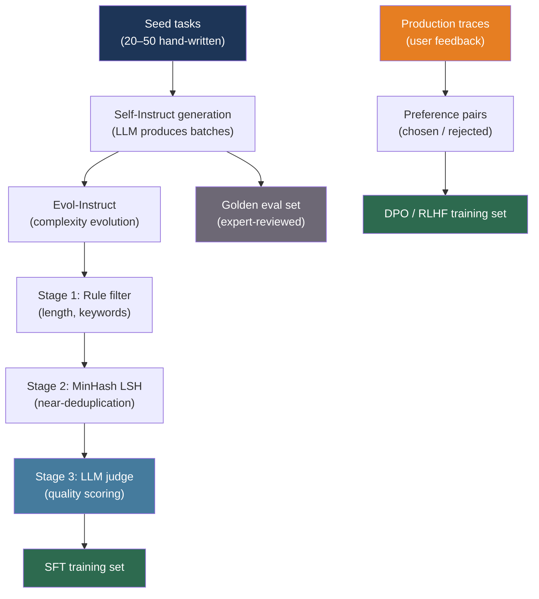

# [BEE-30032] Synthetic Data Generation for AI Systems

:::info
Synthetic data generation uses LLMs to produce labeled training examples, evaluation datasets, and diverse test inputs at scale — breaking the dependency on expensive human annotation for every new task or domain.
:::

## Context

Supervised fine-tuning, preference optimization, and evaluation all require labeled data. Historically, labeled data required human annotators: expensive, slow, and bottlenecked on domain expert availability. The quality ceiling was set by how many examples a team could afford to label.

Wang et al. introduced Self-Instruct (arXiv:2212.10560, ACL 2023), demonstrating that an LLM can generate its own instruction-following training data from a small seed set. Starting from 175 manually written seed tasks, the pipeline generated 52,000 instruction-input-output triples and used them to fine-tune the base model, closing 85% of the gap between the untuned base and InstructGPT on SuperNaturalInstructions. A capable model can serve as a noisy but scalable annotator for tasks it can perform.

Xu et al. pushed the idea further with Evol-Instruct (arXiv:2304.12244, 2023), which does not just generate instructions but iteratively evolves them toward greater complexity. An LLM rewrites each seed instruction using one of five operations — add constraints, deepen, concretize, increase reasoning steps, complicate input — until the dataset spans a wide difficulty spectrum. WizardLM models trained on 70,000 evolved instructions outperformed models trained on larger human-curated sets on instruction-following benchmarks.

The engineering challenge is not generation — any LLM can generate text — but quality control at scale. Raw LLM output contains duplicates, contradictions, hallucinated facts, and low-difficulty examples that add noise without signal. Production synthetic data pipelines spend as much engineering effort on filtering as on generation.

## Design Thinking

Synthetic data serves three distinct purposes in an AI system, each requiring a different pipeline:

1. **Fine-tuning data**: instruction-input-output triples for supervised fine-tuning (SFT) or preference pairs (chosen/rejected) for DPO/RLHF. Volume matters; quality gates prevent noise.
2. **Evaluation golden sets**: a small, high-precision set of examples with verified expected outputs used to benchmark model quality. Quality matters; volume is secondary.
3. **Test inputs**: diverse, edge-case-covering inputs for integration testing. Coverage matters; exact outputs are less important than eliciting specific behaviors.

These three uses have different generation strategies and different quality thresholds. A fine-tuning pipeline can tolerate 5–10% noisy examples; a golden evaluation set cannot tolerate any.

## Best Practices

### Generate Instructions with Self-Instruct

**SHOULD** bootstrap instruction datasets from a small human-written seed using the Self-Instruct pattern when labeled data is unavailable or expensive:

```python
import random
import anthropic

client = anthropic.Anthropic()

SEED_TASKS = [
    {"instruction": "Summarize the following article in two sentences.", "input": "<article>", "output": "<summary>"},
    {"instruction": "Classify the sentiment of this review as positive, negative, or neutral.", "input": "<review>", "output": "<label>"},
    # ... 20–50 seed tasks covering the target domain
]

GENERATION_PROMPT = """\
You are generating diverse task instructions for training a language model.

Here are {n_shots} example tasks:
{examples}

Generate {n_new} new task instructions that are:
- Different from the examples above
- Diverse in format and domain
- Solvable by a language model without external tools
- Between one sentence and one paragraph in length

For each task, provide:
1. A clear instruction
2. An optional input (or "<noinput>" if not needed)
3. A correct output

Format: JSON array with fields "instruction", "input", "output"."""

def generate_instruction_batch(n_new: int = 20) -> list[dict]:
    n_shots = min(8, len(SEED_TASKS))
    examples = random.sample(SEED_TASKS, n_shots)
    formatted = "\n\n".join(
        f"Instruction: {t['instruction']}\nInput: {t['input']}\nOutput: {t['output']}"
        for t in examples
    )
    response = client.messages.create(
        model="claude-sonnet-4-6",
        max_tokens=4096,
        messages=[{
            "role": "user",
            "content": GENERATION_PROMPT.format(
                n_shots=n_shots, examples=formatted, n_new=n_new
            ),
        }],
    )
    import json
    return json.loads(response.content[0].text)
```

**SHOULD** use few-shot sampling from the seed (8–16 examples) rather than including all seeds on every generation call. Random sampling forces diversity and reduces the model's tendency to cluster around the same task types.

### Evolve Complexity with Evol-Instruct

**SHOULD** apply Evol-Instruct when the initial dataset lacks hard examples. A model fine-tuned only on easy instructions fails on complex real-world queries. Evolving the existing dataset fills the difficulty spectrum without manual effort:

```python
EVOLUTION_OPERATIONS = {
    "add_constraints": (
        "Rewrite the following instruction to be more specific by adding "
        "2–3 explicit constraints or requirements:\n\n{instruction}"
    ),
    "deepen": (
        "Rewrite the following instruction to require deeper domain knowledge "
        "or multi-step reasoning to answer:\n\n{instruction}"
    ),
    "concretize": (
        "Rewrite the following instruction by replacing vague terms with "
        "specific, concrete details:\n\n{instruction}"
    ),
    "increase_reasoning": (
        "Rewrite the following instruction so that answering it requires "
        "explicit reasoning steps or logical deduction:\n\n{instruction}"
    ),
}

def evolve_instruction(instruction: str, operation: str) -> str | None:
    prompt = EVOLUTION_OPERATIONS[operation].format(instruction=instruction)
    response = client.messages.create(
        model="claude-sonnet-4-6",
        max_tokens=512,
        messages=[{"role": "user", "content": prompt}],
    )
    evolved = response.content[0].text.strip()
    # Reject if the evolved instruction is nearly identical to the original
    if rouge_l_similarity(evolved, instruction) > 0.7:
        return None
    return evolved

def rouge_l_similarity(a: str, b: str) -> float:
    """Simplified ROUGE-L: LCS length / max(len(a), len(b)) as word sequences."""
    a_words, b_words = a.lower().split(), b.lower().split()
    if not a_words or not b_words:
        return 0.0
    # Dynamic programming LCS
    m, n = len(a_words), len(b_words)
    dp = [[0] * (n + 1) for _ in range(m + 1)]
    for i in range(1, m + 1):
        for j in range(1, n + 1):
            dp[i][j] = dp[i-1][j-1] + 1 if a_words[i-1] == b_words[j-1] else max(dp[i-1][j], dp[i][j-1])
    return dp[m][n] / max(m, n)
```

### Apply a Three-Stage Quality Filter

**MUST** filter synthetic data before using it for fine-tuning. Raw LLM output contains duplicates, low-quality examples, and examples that contradict the target behavior. A three-stage filter catches the dominant failure modes at increasing cost:

```python
# Stage 1: Rule-based filters (fast, free)
def rule_based_filter(example: dict) -> bool:
    instruction = example.get("instruction", "")
    output = example.get("output", "")
    # Reject too-short instructions (likely malformed)
    if len(instruction.split()) < 3:
        return False
    # Reject empty outputs
    if len(output.strip()) < 10:
        return False
    # Reject instructions that ask for harmful content (keyword list)
    BANNED_PHRASES = ["how to hack", "illegal", "kill"]
    if any(p in instruction.lower() for p in BANNED_PHRASES):
        return False
    return True

# Stage 2: Near-deduplication with MinHash (cheap)
from datasketch import MinHash, MinHashLSH

def build_dedup_index(examples: list[dict], threshold: float = 0.8) -> list[dict]:
    """Remove near-duplicates using MinHash LSH."""
    lsh = MinHashLSH(threshold=threshold, num_perm=128)
    kept = []
    for i, ex in enumerate(examples):
        m = MinHash(num_perm=128)
        for word in ex["instruction"].lower().split():
            m.update(word.encode())
        key = f"ex_{i}"
        if not lsh.query(m):  # No near-duplicate found
            lsh.insert(key, m)
            kept.append(ex)
    return kept

# Stage 3: LLM-as-judge quality scoring (expensive — run on sample or on all if budget allows)
JUDGE_PROMPT = """\
Rate the quality of this instruction-output pair on a scale of 1–5.

Instruction: {instruction}
Input: {input}
Output: {output}

Score criteria:
5 - Clear instruction, factually correct, detailed output
4 - Good instruction, mostly correct output with minor issues
3 - Acceptable but vague instruction or incomplete output
2 - Confusing instruction or incorrect output
1 - Unusable: incoherent, harmful, or completely wrong

Respond with only a single digit (1–5)."""

def llm_quality_score(example: dict) -> int:
    response = client.messages.create(
        model="claude-haiku-4-5-20251001",  # Cheap model for scoring
        max_tokens=5,
        messages=[{
            "role": "user",
            "content": JUDGE_PROMPT.format(**example),
        }],
    )
    try:
        return int(response.content[0].text.strip()[0])
    except (ValueError, IndexError):
        return 1  # Default to low score on parse failure

def filter_pipeline(raw_examples: list[dict], judge_threshold: int = 3) -> list[dict]:
    # Stage 1: Rule-based
    after_rules = [ex for ex in raw_examples if rule_based_filter(ex)]
    # Stage 2: Near-dedup
    after_dedup = build_dedup_index(after_rules)
    # Stage 3: LLM judge (sample 20% to limit cost, filter rest by proxy)
    after_judge = [ex for ex in after_dedup if llm_quality_score(ex) >= judge_threshold]
    return after_judge
```

**SHOULD** run Stage 3 (LLM judge) on a sample first to calibrate the score threshold. A threshold of 3 typically retains 60–80% of examples; adjust based on observed quality at your target domain.

### Generate Golden Evaluation Sets with Diverse Personas

**SHOULD** use diverse persona prompting to generate evaluation golden sets that cover a wide range of user intents, expertise levels, and phrasing styles. Cui et al. (arXiv:2406.20094, 2024) demonstrated that seeding generation with 1 billion personas from web text produces dramatically more diverse outputs than generic prompting:

```python
PERSONAS = [
    "a junior software engineer encountering this for the first time",
    "an experienced site reliability engineer debugging a production incident",
    "a product manager trying to understand technical tradeoffs without coding",
    "a security researcher looking for edge cases and attack vectors",
    "a data scientist optimizing for performance with large datasets",
]

def generate_golden_set(
    topic: str,
    n_examples_per_persona: int = 5,
) -> list[dict]:
    """
    Generate a diverse golden evaluation set by sampling from multiple
    user personas. Each persona produces distinct phrasing and intent.
    """
    golden_examples = []
    for persona in PERSONAS:
        response = client.messages.create(
            model="claude-sonnet-4-6",
            max_tokens=2048,
            messages=[{
                "role": "user",
                "content": (
                    f"You are acting as {persona}.\n"
                    f"Generate {n_examples_per_persona} realistic questions you would ask "
                    f"about the following topic: {topic}\n\n"
                    f"For each question, also provide the ideal answer.\n"
                    f"Format: JSON array with 'question' and 'ideal_answer' fields."
                ),
            }],
        )
        import json
        examples = json.loads(response.content[0].text)
        for ex in examples:
            ex["persona"] = persona
        golden_examples.extend(examples)
    return golden_examples
```

**MUST** have domain experts review generated golden sets before using them as evaluation benchmarks. An incorrect expected answer in a golden set is more damaging than a noisy training example — it misleads the entire evaluation pipeline.

### Implement the Data Flywheel

**SHOULD** instrument production LLM calls to capture the inputs and outputs that will become training data. The data flywheel converts production traffic into a continuously improving training corpus:

```python
import hashlib
import time

def log_production_trace(
    thread_id: str,
    user_input: str,
    assistant_output: str,
    feedback_signal: str | None,  # "thumbs_up", "thumbs_down", None
    latency_ms: int,
    token_count: int,
):
    """
    Write every production LLM interaction to a trace store.
    Feedback signal (if any) enables preference pair construction.
    """
    trace = {
        "trace_id": hashlib.sha256(f"{thread_id}:{time.time()}".encode()).hexdigest()[:16],
        "thread_id": thread_id,
        "input": user_input,
        "output": assistant_output,
        "feedback": feedback_signal,
        "latency_ms": latency_ms,
        "token_count": token_count,
        "timestamp": time.time(),
    }
    trace_store.insert(trace)

def build_preference_pairs_from_traces() -> list[dict]:
    """
    Construct DPO preference pairs from traces where:
    - 'thumbs_up' responses become 'chosen'
    - 'thumbs_down' responses become 'rejected'
    Match by similar inputs to build (prompt, chosen, rejected) triples.
    """
    positive = trace_store.query(feedback="thumbs_up", limit=10_000)
    negative = trace_store.query(feedback="thumbs_down", limit=10_000)

    pairs = []
    for pos in positive:
        # Find a negative trace with similar input (embedding similarity or keyword overlap)
        match = find_similar_trace(pos["input"], negative)
        if match:
            pairs.append({
                "prompt": pos["input"],
                "chosen": pos["output"],
                "rejected": match["output"],
            })
    return pairs
```

## Visual



## Filter Stage Comparison

| Stage | Technique | Cost | Removes |
|---|---|---|---|
| Rule-based | Length, keyword, format checks | Near-zero | Malformed, obviously harmful |
| Near-dedup | MinHash LSH (128 permutations) | Low (CPU) | Duplicate and near-duplicate instructions |
| Perplexity | Reference model PPL scoring | High (GPU) | Low-quality or off-distribution text |
| LLM judge | Scored by auxiliary model | Medium (API) | Low-quality content a rule cannot detect |

## Related BEEs

- [BEE-30004](evaluating-and-testing-llm-applications.md) -- Evaluating and Testing LLM Applications: the golden evaluation sets produced by this pipeline feed directly into the LLM-as-judge evaluation patterns described there
- [BEE-30012](fine-tuning-and-peft-patterns.md) -- Fine-Tuning and PEFT Patterns: the fine-tuning process that consumes the SFT and preference datasets produced here
- [BEE-30025](llm-batch-processing-patterns.md) -- LLM Batch Processing Patterns: synthetic data generation at scale runs as a batch job; the OpenAI and Anthropic batch APIs are the cost-efficient path for generating millions of examples

## References

- [Wang et al. Self-Instruct: Aligning Language Models with Self-Generated Instructions — arXiv:2212.10560, ACL 2023](https://arxiv.org/abs/2212.10560)
- [Xu et al. WizardLM: Empowering Large Pre-Trained Language Models to Follow Complex Instructions — arXiv:2304.12244, 2023](https://arxiv.org/abs/2304.12244)
- [Cui et al. Scaling Synthetic Data Creation with 1,000,000,000 Personas — arXiv:2406.20094, 2024](https://arxiv.org/abs/2406.20094)
- [Rafailov et al. Direct Preference Optimization: Your Language Model is Secretly a Reward Model — arXiv:2305.18290, NeurIPS 2023](https://arxiv.org/abs/2305.18290)
- [Cui et al. UltraFeedback: Boosting Language Models with Scaled AI Feedback — arXiv:2310.01377, ICML 2024](https://arxiv.org/abs/2310.01377)
- [Argilla. distilabel: Synthetic data and AI feedback framework — github.com/argilla-io/distilabel](https://github.com/argilla-io/distilabel)
