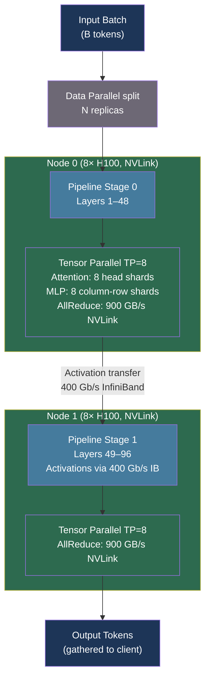

# [BEE-30066] Tensor Parallelism and Pipeline Parallelism for LLM Inference

:::info
When a large language model exceeds the memory capacity of a single GPU, it must be sharded across multiple devices. Tensor parallelism splits individual weight matrices across GPUs in the same node; pipeline parallelism splits model layers across nodes. Choosing and composing these strategies correctly determines whether you extract 90% or 50% of your hardware's theoretical throughput.
:::

## Context

The naive approach to multi-GPU inference is data parallelism (DP): replicate the model on each GPU and route different requests to different replicas. DP scales throughput but not model size — a 70B parameter model at BF16 requires ~140 GB, which does not fit on a single A100 (80 GB) or H100 (80 GB). You need to split the model itself across devices.

Two orthogonal strategies exist: **tensor parallelism** (TP), which partitions individual tensor operations within a layer, and **pipeline parallelism** (PP), which partitions the sequence of layers across stages. Their combination, called **3D parallelism** when composed with data parallelism, was formalized by **Narayanan et al.** in *Efficient Large-Scale Language Model Training on GPU Clusters Using Megatron-LM* (arXiv:2104.04473, SC 2021). The paper demonstrated 502 petaFLOP/s on 3,072 A100 GPUs — 52% of theoretical peak — training a 1 trillion parameter model with TP=8, PP=64, DP=6.

A third strategy — **sequence parallelism** (SP) — distributes the sequence dimension across GPUs, enabling contexts of millions of tokens that would otherwise exhaust KV cache memory on any single device.

## Tensor Parallelism

Megatron-LM's tensor parallelism exploits the structure of transformer linear layers. Every feed-forward block is a sequence of two GEMMs: Y = GeLU(XA) followed by Z = YB. Megatron splits these with a **column-parallel then row-parallel** pattern that requires exactly one AllReduce per layer in the forward pass:

```
GPU 0: Y₀ = X @ A[:,0:d/2]    GPU 1: Y₁ = X @ A[:,d/2:d]   (ColumnParallel, no comm)
        Z₀ = Y₀ @ B[0:d/2,:]          Z₁ = Y₁ @ B[d/2:d,:]  (RowParallel)
        Z = AllReduce(Z₀ + Z₁)                                 (one AllReduce per MLP)
```

For the attention mechanism, TP splits across attention heads. Each GPU owns H/TP heads and computes full attention independently for its subset. The query, key, and value projection matrices are column-split; the output projection is row-split. This gives **2 AllReduces per transformer layer** (one after attention, one after MLP).

TP speedup scales well when the AllReduce communication can be hidden behind computation. NVLink provides 900 GB/s aggregate bandwidth on H100 NVL, making intra-node AllReduce cheap:

| TP degree | Effective speedup (NVLink) | Effective speedup (PCIe) |
|---|---|---|
| 2 | ~1.9× | ~1.7× |
| 4 | ~3.7× | ~2.5× |
| 8 | ~7.2× | ~4.5× |
| 16 | ~13× | not viable |

**The constraint:** TP degree must evenly divide the number of attention heads. Llama-3 70B has 64 heads, so TP ∈ {1, 2, 4, 8}. TP beyond the node boundary is inadvisable: a single 100 Gbps InfiniBand port delivers ~12 GB/s, while NVLink delivers 900 GB/s — a 75× difference that turns 2 AllReduces per layer into a severe bottleneck.

## Pipeline Parallelism

Pipeline parallelism assigns consecutive transformer layers to different GPUs (stages). A 96-layer model on 4 pipeline stages means 24 layers per stage. Stages communicate only the activation tensors at stage boundaries — far less data than AllReduces in TP, making PP suitable for inter-node communication.

**The pipeline bubble problem**: in a naive pipeline, stage P₀ processes the first micro-batch, passes activations to P₁, then sits idle while P₁, P₂, P₃ compute. The bubble fraction — fraction of time all stages are simultaneously idle — is:

```
Bubble ratio = (P − 1) / M
```

where P is the number of pipeline stages and M is the number of micro-batches. **GPipe** (Huang et al., arXiv:1811.06965, NeurIPS 2019) introduced micro-batching to reduce the bubble: split each batch into M micro-batches, pipeline them through, accumulate gradients. With M ≥ 4×P, the bubble fraction is <25%.

Megatron-LM's **1F1B interleaved schedule** assigns multiple non-consecutive layer chunks per GPU (k chunks per device), reducing the bubble to (P−1)/(k×M). This improves throughput by ~10% over GPipe at the cost of increased peak memory for storing intermediate activations.

```
Interleaved 1F1B with P=4, M=8, k=2:
Bubble = (4−1)/(2×8) = 18.75%  vs  GPipe bubble = (4−1)/8 = 37.5%
```

**Pipeline parallelism at inference differs significantly from training.** During autoregressive decode, each iteration generates one token — only one micro-batch flows through the pipeline at any time. This means stages are almost always idle except the single active stage, making PP nearly useless for decode throughput. PP is beneficial for inference only when prefilling long contexts (single large forward pass, no autoregressive loop) or when the model is too large to fit any other way.

## Sequence Parallelism

When context length exceeds what fits in GPU memory even after TP and PP sharding, sequence parallelism (SP) partitions the sequence dimension across GPUs.

**DeepSpeed Ulysses** (arXiv:2309.14509) uses all-to-all communication to redistribute sequence partitions before and after attention:

```
Before attention: all-to-all exchanges Q/K/V so each GPU computes all tokens for its heads
After attention:  all-to-all redistributes outputs back to sequence partitions
```

The communication volume is constant as both sequence length and GPU count scale proportionally, giving a 10× communication reduction over naive SP. Ulysses achieves 2.5× throughput for million-token sequences.

**Ring Attention** (arXiv:2310.01889, Liu, Zaharia, Abbeel) organizes GPUs in a ring topology, rotating K/V blocks while each GPU computes blockwise attention on its local Q block. Communication is fully overlapped with computation, achieving zero communication overhead. Ring Attention has demonstrated 100M-token sequences — 500× longer than memory-efficient transformers.

## Best Practices

### Keep tensor parallelism within a single NVLink node

**MUST NOT** span tensor parallelism across nodes. NVLink 900 GB/s vs InfiniBand 50 GB/s is a 18× bandwidth gap; 2 AllReduces per layer at 70B scale produces ~70 MB per AllReduce at BF16, requiring 140 MB/layer transmitted. At TP=8 across nodes, AllReduce latency consumes 40–50% of inference time.

```bash
# Correct: TP within a single 8-GPU H100 node, PP across nodes
vllm serve meta-llama/Llama-3-70b-hf \
  --tensor-parallel-size 8 \      # all 8 GPUs in one node
  --pipeline-parallel-size 1      # single node, no PP needed

# Multi-node: TP within nodes, PP across nodes
# Node 0 (8 GPUs) + Node 1 (8 GPUs) → 16 GPUs total
vllm serve meta-llama/Llama-3-405B-Instruct \
  --tensor-parallel-size 8 \      # 8 GPUs per node
  --pipeline-parallel-size 2      # 2 nodes
```

### Choose TP over PP for decode-latency-sensitive workloads

**SHOULD** prefer tensor parallelism for interactive workloads where inter-token latency matters. TP keeps all GPUs simultaneously active during every decode step. PP leaves (P−1)/P of stages idle during single-token generation:

| Strategy | Decode behavior | Latency | Throughput |
|---|---|---|---|
| TP=8, PP=1 | All 8 GPUs active every step | Low | Moderate |
| TP=1, PP=8 | 1 of 8 GPUs active per step | High | Low |
| TP=4, PP=2 | 4 GPUs active, 1 stage flows | Medium | Medium |
| TP=8, PP=2 | Best for 16-GPU prefill + decode | Low (prefill) | High |

For Llama-3 70B on 8×H100 (single node, fits without PP):

```bash
# Minimum latency configuration
vllm serve meta-llama/Llama-3-70b-hf \
  --tensor-parallel-size 8 \
  --max-model-len 8192 \
  --dtype bfloat16
```

### Tune micro-batch count to suppress pipeline bubbles

**SHOULD** configure micro-batches M ≥ 4×P when using PP for prefill workloads. With P=4 pipeline stages, use at least 16 micro-batches per global batch to reduce the bubble below 20%:

```python
# TensorRT-LLM pipeline configuration
from tensorrt_llm import LLM, ModelConfig

llm = LLM(
    model="meta-llama/Llama-3-405B-Instruct",
    tensor_parallel_size=8,
    pipeline_parallel_size=4,      # 4 pipeline stages across 4 nodes
)
# Ensure batch size gives at least 4×PP micro-batches:
# global_batch_size / micro_batch_size >= 4 * pipeline_stages
```

### Use sequence parallelism for context lengths above 32K tokens

**SHOULD** add SP when serving long-context workloads (>32K tokens) and KV cache pressure limits concurrent requests. Ulysses SP integrates directly with TP — the all-to-all replaces the TP AllReduce for attention layers, with no additional communication cost:

```bash
# vLLM: sequence parallelism combined with tensor parallelism
# (available in vLLM >= 0.7 via --enable-chunked-prefill + large --max-model-len)
vllm serve meta-llama/Llama-3.1-70B-Instruct \
  --tensor-parallel-size 8 \
  --max-model-len 131072 \
  --enable-chunked-prefill \
  --max-num-batched-tokens 4096
```

## Visual



## Common Mistakes

**Applying tensor parallelism across nodes.** The AllReduce frequency of TP (2 per layer) saturates inter-node interconnects. A 70B model with 80 transformer layers requires 160 AllReduces per forward pass. At 50 GB/s InfiniBand, this consumes ~560 ms per request — 10× the compute time. Always keep TP within a single NVLink domain.

**Using pipeline parallelism for decode-latency-sensitive workloads.** PP cuts model memory requirements but does not improve single-request decode throughput — it degrades it. A 4-stage pipeline generates one token with 1/4 of its GPUs active at any time. For interactive workloads, increase TP or add replicas instead.

**Setting TP greater than the number of attention heads.** If TP=16 but the model has 8 attention heads, some GPUs receive zero heads and remain idle. Always verify: `num_attention_heads % tensor_parallel_size == 0`. For grouped-query attention (GQA) models, check the number of key-value heads: `num_key_value_heads % tensor_parallel_size == 0`.

**Ignoring pipeline bubble in throughput calculations.** A 4-stage pipeline with batch size 8 and micro-batch size 2 (M=4) has a bubble of (4−1)/4 = 75% — three-quarters of GPU time is wasted. Increase micro-batch count or reduce pipeline stages.

**Conflating model parallelism strategies with data parallelism.** DP copies the full model onto each GPU and splits batches; TP/PP split the model across GPUs and process the full batch together. Mixing up these semantics leads to incorrect memory estimates and wrong replica counts. For a 70B model on 4×A100 80GB: TP=4 holds one shard per GPU; DP=4 would require 4 full copies (impossible, doesn't fit).

## Related BEEs

- [BEE-30021](llm-inference-optimization-and-self-hosting.md) -- LLM Inference Optimization and Self-Hosting: hardware selection and overall inference optimization
- [BEE-30064](mixture-of-experts-architecture-and-serving.md) -- Mixture of Experts Architecture and Serving: Expert Parallel interacts with TP/PP scheduling
- [BEE-30065](continuous-batching-and-iteration-level-scheduling.md) -- Continuous Batching and Iteration-Level Scheduling: micro-batching for PP interacts with continuous batch scheduler
- [BEE-30061](llm-quantization-for-inference.md) -- LLM Quantization for Inference: reduces memory per GPU, changing the TP degree needed

## References

- [Narayanan et al. Efficient Large-Scale Language Model Training on GPU Clusters Using Megatron-LM — arXiv:2104.04473, SC 2021](https://arxiv.org/abs/2104.04473)
- [Huang et al. GPipe: Efficient Training of Giant Neural Networks Using Pipeline Parallelism — arXiv:1811.06965, NeurIPS 2019](https://arxiv.org/abs/1811.06965)
- [Jacobs et al. DeepSpeed Ulysses: System Optimizations for Enabling Training of Extreme Long Sequence Transformer Models — arXiv:2309.14509](https://arxiv.org/abs/2309.14509)
- [Liu, Zaharia, Abbeel. Ring Attention with Blockwise Transformers for Near-Infinite Context — arXiv:2310.01889](https://arxiv.org/abs/2310.01889)
- [vLLM. Distributed Serving and Parallelism Scaling — docs.vllm.ai](https://docs.vllm.ai/en/stable/serving/parallelism_scaling/)
- [NVIDIA TensorRT-LLM. Deciding Model Sharding Strategy — nvidia.github.io](https://nvidia.github.io/TensorRT-LLM/performance/performance-tuning-guide/deciding-model-sharding-strategy.html)
