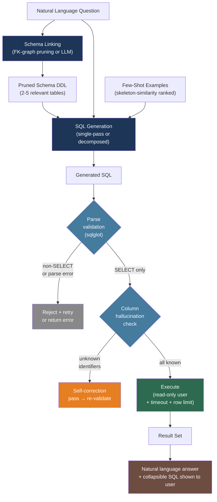

# [BEE-580] Text-to-SQL: Natural Language Database Interfaces

:::info
Text-to-SQL translates natural language questions into executable SQL queries using an LLM. It exposes your database to users without requiring SQL knowledge — and introduces a distinct attack surface, a hallucination failure mode that returns plausible but wrong results, and a schema-injection cost that grows quadratically with database size if not addressed.
:::

## Context

Text-to-SQL has a research history predating LLMs. Early systems (LUNAR, NLIDB, circa 1970s) used hand-crafted grammars. The modern era began with the Spider benchmark (Yu et al., Yale, arXiv:1809.08887, EMNLP 2018): 10,181 questions over 200 databases spanning 138 domains, with training and test sets on entirely different databases to measure cross-domain generalization. At launch, the best system scored 12.4% exact match. By 2023, DAIL-SQL + GPT-4 reached 86.2% execution accuracy (arXiv:2308.15363, VLDB 2024), making production deployment plausible for the first time.

Spider 2.0 (arXiv:2411.07763, ICLR 2025 Oral) rapidly deflated that optimism. Built from 632 real enterprise workflows with schemas exceeding 1,000 columns, multi-dialect SQL (BigQuery, Snowflake), and queries exceeding 100 lines, it showed that o1-preview achieves only 21.3% and GPT-4o only 10.1% — a 4–8× drop from Spider 1.0 performance on academic schemas. The BIRD benchmark (arXiv:2305.03111, 12,751 pairs, 95 real-world databases totaling 33.4 GB) further quantified the gap: ChatGPT scores 40.08% while human data engineers reach 92.96%, leaving an 11+ percentage point gap even after the best 2025 systems (~82%) are accounted for.

The practical lesson is that text-to-SQL is a spectrum, not a binary capability. Simple single-table queries with unambiguous questions over schemas of 5–15 tables are reliably solvable. Multi-hop joins, window functions, recursive queries, and questions that require business domain knowledge beyond what is in the schema remain genuinely hard for current models.

## Schema Representation

The single largest engineering lever in text-to-SQL is how the database schema is presented to the model. A 35-table schema serialized as `CREATE TABLE` DDL consumes approximately 5,164 tokens before any question is asked. An enterprise schema with hundreds of tables can exceed 17,000 tokens. Context-window limits, cost, and accuracy all suffer as schema size grows.

### Schema Format

**CREATE TABLE DDL** is the standard format and performs best as a baseline:

```sql
CREATE TABLE orders (
    order_id INT PRIMARY KEY,
    customer_id INT NOT NULL,
    order_date DATE NOT NULL,
    status VARCHAR(20) NOT NULL,  -- 'pending', 'shipped', 'cancelled'
    total_amount DECIMAL(10, 2),
    FOREIGN KEY (customer_id) REFERENCES customers(customer_id)
);
```

Including foreign key constraints is critical — models that cannot see FK relationships generate wrong join paths. Including example column values (enum members, representative strings) consistently improves accuracy on questions that filter by value, because the model needs to know whether the status column contains `'shipped'` or `'SHIPPED'` or `'Shipped'`.

### Schema Pruning

Sending the entire schema for every query is correct but expensive. Schema pruning reduces tokens by 83–93% with minimal accuracy loss:

```python
import networkx as nx
from sqlalchemy import inspect, MetaData

def build_fk_graph(engine) -> nx.Graph:
    """Build an undirected graph of tables connected by foreign keys."""
    meta = MetaData()
    meta.reflect(bind=engine)
    graph = nx.Graph()
    inspector = inspect(engine)
    for table_name in inspector.get_table_names():
        graph.add_node(table_name)
        for fk in inspector.get_foreign_keys(table_name):
            graph.add_edge(table_name, fk["referred_table"])
    return graph

def prune_schema(
    question: str,
    tables: list[str],
    fk_graph: nx.Graph,
    schema_ddl: dict[str, str],  # table_name -> DDL string
    relevant_tables: list[str],  # from schema linking step
    hop_distance: int = 1,
) -> str:
    """
    Include directly relevant tables plus their immediate FK neighbors.
    A hop_distance of 1 captures bridge tables needed for joins.
    """
    included = set(relevant_tables)
    for table in relevant_tables:
        for neighbor in nx.neighbors(fk_graph, table):
            included.add(neighbor)
    return "\n\n".join(schema_ddl[t] for t in sorted(included) if t in schema_ddl)
```

The FK-graph traversal approach requires zero LLM calls and reduces a 35-table schema from 5,164 tokens to 157–751 tokens depending on the question. Advanced approaches like RSL-SQL (arXiv:2411.00073) use bidirectional schema linking with voting to achieve 94% table-recall while cutting 83% of input columns.

## Execution Safety

Text-to-SQL creates a new attack surface: the LLM is a code generator, and users can attempt to inject instructions that produce destructive SQL. Pourreza et al. (arXiv:2308.01990) demonstrated that LangChain's `SQLDatabaseAgent`, despite system-prompt instructions prohibiting DML statements, executes destructive queries when users inject instructions through the natural language input. API-access models blocked only 13.4% of tested malicious prompts.

A three-layer defense is required:

### Layer 1: Database Permissions (Cannot Be Bypassed)

Create a dedicated read-only database user. Even if the LLM generates `DROP TABLE users`, the database rejects the command at the permission level:

```sql
-- PostgreSQL: create a text-to-sql read-only user
CREATE ROLE text_to_sql_reader LOGIN PASSWORD 'changeme';
-- Grant SELECT on specific tables only — not TRUNCATE, DELETE, INSERT
GRANT SELECT ON orders, customers, products, categories TO text_to_sql_reader;
-- Deny access to sensitive tables entirely
REVOKE ALL ON user_credentials, payment_cards, audit_logs FROM text_to_sql_reader;
```

### Layer 2: Schema Curation (Information Hiding)

Present the LLM only with a sanitized schema that excludes sensitive columns. A column that does not appear in the schema cannot be queried:

```python
EXCLUDED_COLUMNS = {
    "users": {"password_hash", "mfa_secret", "session_tokens"},
    "payments": {"card_number", "cvv", "bank_account"},
}

def sanitize_schema(full_ddl: str, table: str) -> str:
    """Remove sensitive column definitions before injecting into LLM prompt."""
    excluded = EXCLUDED_COLUMNS.get(table, set())
    lines = []
    for line in full_ddl.splitlines():
        col_name = line.strip().split()[0].lower() if line.strip() else ""
        if col_name not in excluded:
            lines.append(line)
    return "\n".join(lines)
```

### Layer 3: SQL Validation Before Execution

Parse the generated SQL and reject non-SELECT statements before any database call:

```python
import sqlglot

def validate_select_only(sql: str, dialect: str = "postgres") -> tuple[bool, str]:
    """
    Parse generated SQL and verify it contains only SELECT statements.
    Returns (is_safe, error_message).
    Uses sqlglot for AST-level validation across 31 SQL dialects.
    """
    try:
        statements = sqlglot.parse(sql, dialect=dialect)
    except sqlglot.errors.ParseError as e:
        return False, f"SQL parse error: {e}"

    for stmt in statements:
        if not isinstance(stmt, sqlglot.exp.Select):
            stmt_type = type(stmt).__name__
            return False, f"Rejected: expected SELECT, got {stmt_type}"

    # Verify no subquery modification (CTEs are SELECT-only by nature)
    for node in statements[0].walk():
        if isinstance(node, (
            sqlglot.exp.Insert, sqlglot.exp.Update,
            sqlglot.exp.Delete, sqlglot.exp.Drop,
        )):
            return False, f"Rejected: DML statement found in query tree"

    return True, ""
```

## Generation Architecture

### Single-Pass Prompt Engineering (DAIL-SQL Style)

For schemas of 5–20 tables with well-defined questions, a single-pass approach with few-shot examples selected by structural similarity performs well. The DAIL-SQL prompt format (arXiv:2308.15363, VLDB 2024) injects schema, few-shot examples ordered by skeleton similarity, and the question:

```python
SYSTEM_PROMPT = """You are an expert SQL query writer. Given a database schema and a natural language question, write a correct SQL SELECT query.

Rules:
- Return ONLY the SQL query, no explanation
- Use only tables and columns that appear in the schema
- Always use table aliases in multi-table queries
- Use appropriate JOINs based on the foreign key relationships shown"""

def build_prompt(
    schema_ddl: str,
    question: str,
    few_shot_examples: list[dict],  # [{"question": ..., "sql": ...}]
) -> list[dict]:
    examples_text = "\n\n".join(
        f"Question: {ex['question']}\nSQL: {ex['sql']}"
        for ex in few_shot_examples[:3]
    )
    user_content = f"""Schema:
{schema_ddl}

Examples:
{examples_text}

Question: {question}
SQL:"""
    return [
        {"role": "system", "content": SYSTEM_PROMPT},
        {"role": "user", "content": user_content},
    ]
```

### Decomposed Generation (DIN-SQL Style)

For complex queries (multi-table joins, nested subqueries, window functions), decomposing the problem into sequential subtasks improves accuracy by approximately 10 percentage points over single-pass (arXiv:2304.11015):

```python
async def generate_sql_decomposed(
    llm_client,
    schema_ddl: str,
    question: str,
) -> str:
    # Step 1: Schema linking — identify relevant tables and columns
    linking_prompt = f"""Given this schema:
{schema_ddl}

Question: {question}

Which tables and columns are needed to answer this question? List only the table.column pairs."""
    schema_links = await llm_client.complete(linking_prompt)

    # Step 2: Classify complexity
    classify_prompt = f"""Question: {question}
Relevant schema elements: {schema_links}

Classify the query as:
- SIMPLE: single table, no joins needed
- COMPLEX: requires joins but no nested subqueries
- NESTED: requires subqueries, CTEs, or window functions
Answer with just one word."""
    complexity = await llm_client.complete(classify_prompt)

    # Step 3: Generate SQL with complexity-appropriate prompt
    generate_prompt = build_generation_prompt(schema_ddl, question, schema_links, complexity)
    raw_sql = await llm_client.complete(generate_prompt)

    # Step 4: Self-correction pass
    correction_prompt = f"""Review this SQL query for correctness:
Schema: {schema_ddl}
Question: {question}
SQL: {raw_sql}

If the query is correct, return it unchanged. If it has errors, return the corrected version.
Return ONLY the SQL."""
    return await llm_client.complete(correction_prompt)
```

### Column Hallucination Guard

After generating SQL, validate that all referenced identifiers exist in the actual schema before executing:

```python
def extract_referenced_identifiers(sql: str) -> set[tuple[str, str]]:
    """Extract (table_alias_or_name, column) pairs from parsed SQL."""
    references = set()
    try:
        tree = sqlglot.parse_one(sql)
        for col in tree.find_all(sqlglot.exp.Column):
            table = col.table or ""
            references.add((table.lower(), col.name.lower()))
    except Exception:
        pass
    return references

def check_column_existence(
    references: set[tuple[str, str]],
    schema_columns: dict[str, set[str]],  # table -> {col1, col2, ...}
) -> list[str]:
    """Return list of hallucinated column references."""
    errors = []
    for table, col in references:
        if table and table in schema_columns:
            if col not in schema_columns[table]:
                errors.append(f"{table}.{col} does not exist")
    return errors
```

## Best Practices

### Default to read-only database users and never skip the validation layer

**MUST** always enforce execution behind a database user that has SELECT-only grants on the tables exposed to the text-to-SQL system. **MUST** also enforce application-layer SQL validation (Layer 3) even when using a read-only user — defense in depth is required because permission boundaries alone do not prevent queries that return data the user should not see (for example, data belonging to other tenants).

### Prune schema before injection; never send the full schema for large databases

**MUST NOT** inject the full schema of databases with more than 20 tables without a pruning step. Token costs scale linearly with schema size and accuracy degrades as the model must search through irrelevant tables. Implement schema linking — either by FK-graph traversal (zero LLM calls, deterministic) or a light-weight classifier — to reduce context to the 2–5 tables relevant to each question.

### Treat ambiguous questions as a first-class failure mode

**SHOULD** implement an ambiguity detection step before SQL generation. Questions like "show me top customers" require clarifying what "top" means (by revenue, order count, or recency). Questions with time references ("last month", "recent", "this quarter") require a known current date and business-defined time window. When a question is ambiguous, return a clarifying question to the user rather than generating SQL that silently picks one interpretation.

### Make SQL visible to users before execution for high-stakes queries

**SHOULD** display the generated SQL query to end-users in a collapsible "how I answered this" section before or alongside the result, especially when the interface is used for business decision-making. Users who can see the query can catch misinterpretations. This also builds trust and trains users to ask questions the system handles well.

### Use fine-tuned smaller models for cost-sensitive high-volume deployments

**SHOULD** evaluate SQLCoder-7B or SQLCoder-34B (fine-tuned on domain-specific schemas) against GPT-4 for deployments above 10,000 queries/day. Schema pruning + a 7B fine-tuned model can achieve comparable accuracy to GPT-4o at a fraction of the per-query cost. At 100,000 queries/day, schema pruning alone on a 35-table schema saves over $430,000/year on GPT-4o API costs.

### Implement result-set size limits and query timeouts

**MUST** enforce maximum row limits and execution timeouts at the database level, not at the application layer. An LLM-generated query that performs a full table scan or a cartesian product can saturate database resources. Use `SET statement_timeout = '5s'` (PostgreSQL) or equivalent per-session settings for the text-to-SQL connection pool:

```python
from contextlib import contextmanager
from sqlalchemy import text

@contextmanager
def safe_execution_context(session, max_rows: int = 1000, timeout_ms: int = 5000):
    """Apply per-query safety limits to the database session."""
    session.execute(text(f"SET statement_timeout = '{timeout_ms}'"))
    try:
        yield
    finally:
        session.execute(text("RESET statement_timeout"))

def execute_safe(session, sql: str, max_rows: int = 1000) -> list[dict]:
    with safe_execution_context(session):
        result = session.execute(text(f"SELECT * FROM ({sql}) q LIMIT :limit"), {"limit": max_rows})
        return [dict(row._mapping) for row in result]
```

## Visual



## Common Mistakes

**Using the full schema without pruning for databases larger than 20 tables.** At 35 tables, a naive CREATE TABLE schema consumes 5,164 tokens before the question is asked. At enterprise scale (hundreds of tables), the schema alone exceeds model context windows, forcing the model to work with a truncated schema and hallucinate the missing tables. Implement schema pruning as a prerequisite for any production deployment, not as an optimization.

**Treating execution accuracy on Spider 1.0 as a deployment readiness signal.** Spider 1.0 scores of 85–90% come from clean academic schemas with 15–20 tables, clear question phrasing, and queries that test defined SQL constructs. Real production databases have ambiguous column names, missing foreign keys, business logic encoded in application code rather than schema, and questions phrased by non-technical users. Spider 2.0's 10–21% scores on real enterprise schemas are a better proxy for real-world performance.

**Omitting example column values from the schema.** Schema structure tells the model that a `status` column exists; it does not tell the model whether to write `WHERE status = 'active'` or `WHERE status = 'ACTIVE'` or `WHERE status = 1`. Without representative sample values or enum definitions in the schema, value-dependent queries fail silently with empty result sets or wrong filters.

**Skipping the SQL display to end users.** Silent text-to-SQL is dangerous: the system produces answers that look authoritative but may be based on incorrectly interpreted questions. A query for "orders this quarter" that uses the wrong quarter boundary returns wrong revenue figures without any visible error. Showing users the generated SQL (or a plain-English paraphrase of it) allows them to catch misinterpretations before acting on wrong numbers.

**Not enforcing row limits at the database level.** A cartesian join of two large tables, accidentally generated by the LLM, can return millions of rows and saturate the database. Application-layer `LIMIT` clauses can be bypassed by SQL injection; use database-level `statement_timeout` and row limits in the connection pool configuration.

## Related BEEs

- [BEE-30007](rag-pipeline-architecture.md) -- RAG Pipeline Architecture: schema linking uses the same retrieval-over-structured-context pattern as RAG; the techniques are transferable
- [BEE-30008](llm-security-and-prompt-injection.md) -- LLM Security and Prompt Injection: the prompt injection attack surface in text-to-SQL (arXiv:2308.01990) is a direct instance of the prompt injection problem
- [BEE-18007](../multi-tenancy/database-row-level-security.md) -- Database Row-Level Security: for multi-tenant text-to-SQL, row-level security at the database level is the complement to schema curation and read-only permissions
- [BEE-30006](structured-output-and-constrained-decoding.md) -- Structured Output and Constrained Decoding: forcing the model to output valid SQL (constrained decoding to the SQL grammar) reduces parse errors and hallucinated identifiers

## References

- [Yu et al., "Spider: A Large-Scale Human-Labeled Dataset for Text-to-SQL" (EMNLP 2018) — arXiv:1809.08887](https://arxiv.org/abs/1809.08887)
- [Spider leaderboard — yale-lily.github.io/spider](https://yale-lily.github.io/spider)
- [Spider 2.0 (ICLR 2025 Oral) — arXiv:2411.07763](https://arxiv.org/abs/2411.07763)
- [Spider 2.0 project page — spider2-sql.github.io](https://spider2-sql.github.io/)
- [Li et al., "Can LLM Already Serve as A Database Interface? A BIg Bench (BIRD)" — arXiv:2305.03111](https://arxiv.org/abs/2305.03111)
- [BIRD leaderboard — bird-bench.github.io](https://bird-bench.github.io/)
- [Gao et al., "DAIL-SQL: Text-to-SQL Empowered by LLMs" (VLDB 2024) — arXiv:2308.15363](https://arxiv.org/abs/2308.15363)
- [Pourreza & Rafiei, "DIN-SQL: Decomposed In-Context Learning" — arXiv:2304.11015](https://arxiv.org/abs/2304.11015)
- [Luo et al., "RSL-SQL: Bidirectional Schema Linking" — arXiv:2411.00073](https://arxiv.org/abs/2411.00073)
- [Xie et al., "PET-SQL: Cross-Consistency with Multiple LLMs" — arXiv:2403.09732](https://arxiv.org/abs/2403.09732)
- [Prompt injection in SQL agents — arXiv:2308.01990](https://arxiv.org/abs/2308.01990)
- [Vanna: RAG-based text-to-SQL framework — github.com/vanna-ai/vanna](https://github.com/vanna-ai/vanna)
- [SQLCoder: fine-tuned text-to-SQL model — github.com/defog-ai/sqlcoder](https://github.com/defog-ai/sqlcoder)
- [sqlglot: SQL parser and transpiler (31 dialects) — github.com/tobymao/sqlglot](https://github.com/tobymao/sqlglot)
- [LLM-based Text-to-SQL Survey (TKDE 2025) — arXiv:2406.08426](https://arxiv.org/abs/2406.08426)
