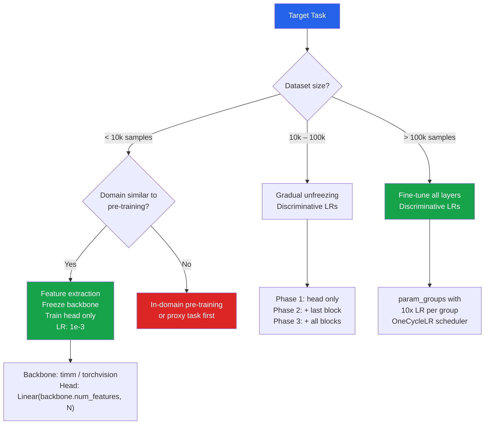

# [BEE-30092] Transfer Learning and Fine-Tuning Patterns

:::info
Transfer learning reuses representations learned on a large source dataset for a target task with fewer labeled examples, cutting the data and compute requirements by an order of magnitude — but only when the source and target domains are sufficiently similar and the fine-tuning strategy matches the available data size.
:::

## Context

ImageNet, trained on 1.2 million labeled images across 1 000 categories, produced an unexpected result: features learned by convolutional networks on this dataset transfer to almost any visual recognition task, even tasks with very different target categories. He et al.'s ResNet (arXiv:1512.03385, CVPR 2016) demonstrated that deep residual networks trained on ImageNet learn edge detectors, texture recognizers, and object part detectors in early layers — representations useful for medical imaging, satellite imagery, product defect detection, and dozens of other domains that share no categories with ImageNet.

Howard & Ruder (2018) generalized this insight to NLP with ULMFiT (arXiv:1801.06146, ACL 2018), demonstrating that a language model pre-trained on Wikipedia could be fine-tuned for text classification with as few as 100 labeled examples, matching what previous models required 10× more data to achieve. They introduced three fine-tuning techniques that remain standard: **discriminative learning rates** (each layer uses a different learning rate), **gradual unfreezing** (unfreeze one layer group at a time), and **slanted triangular learning rates** (a short warmup followed by linear decay). These three ideas collectively address catastrophic forgetting — the risk that gradient updates on the target task overwrite learned representations.

The practical consequence: a team with 5 000 labeled training examples can achieve results that previously required 50 000, by starting from a pre-trained backbone rather than random initialization. The cost is the choice of backbone, the right fine-tuning strategy, and awareness of when domain mismatch makes transfer harmful rather than helpful.

## The Four-Quadrant Decision Framework

Andrej Karpathy's CS231n notes (http://cs231n.github.io/transfer-learning/) define the decision as a function of two axes: dataset size and domain similarity to the pre-training data.

| | Similar domain | Different domain |
|---|---|---|
| **Small dataset** | Feature extraction — freeze backbone, train head only | Difficult case — consider in-domain pre-training or proxy task |
| **Large dataset** | Fine-tune most layers with lower LR for early layers | Fine-tune all layers, possibly with a higher LR for all |

**Feature extraction** (freeze backbone): The pre-trained network is a fixed feature extractor. Only the final classification head is trained. This is the correct strategy when the target dataset is small (< 10 000 labeled samples) and the domain is similar to the pre-training source. The risk of fine-tuning with insufficient data is overfitting to the noise in the small target dataset.

**Fine-tuning**: Update weights in the backbone, not just the head. Use discriminative learning rates — lower LR for earlier layers, higher for later layers — because early layers contain generic features (edges, textures) that should change little, while later layers contain source-domain-specific features that need to adapt to the target domain.

Sun et al. (2017, arXiv:1707.02968) showed that more pre-training data consistently helps but with diminishing returns, and that the benefit depends on source-target domain similarity. When domains diverge substantially (e.g., applying ImageNet features to X-ray images), the first few layers remain useful but the deeper layers need full fine-tuning.

## Feature Extraction with TIMM

TIMM (PyTorch Image Models, created by Ross Wightman, now maintained at github.com/huggingface/pytorch-image-models) provides > 700 pre-trained models with a unified API. `num_classes=0` removes the classification head, returning the raw feature vector:

```python
import timm
import torch
import torch.nn as nn
from torch.optim import AdamW

# Load backbone without classification head — returns feature vectors
backbone = timm.create_model(
    "resnet50",
    pretrained=True,
    num_classes=0,          # removes the final FC layer
    global_pool="avg",      # global average pooling → (batch, 2048)
)

# Freeze all backbone parameters
for param in backbone.parameters():
    param.requires_grad = False

# Small custom head — only these parameters are trained
num_target_classes = 10
head = nn.Sequential(
    nn.Dropout(p=0.3),
    nn.Linear(backbone.num_features, num_target_classes),
)

model = nn.Sequential(backbone, head).to("cuda")

# Optimizer sees ONLY head parameters — backbone is frozen
optimizer = AdamW(
    filter(lambda p: p.requires_grad, model.parameters()),
    lr=1e-3,  # higher LR acceptable since only the head updates
)
```

For the feature extraction phase, a higher learning rate is acceptable because random-initialized head weights need large steps to converge, and the frozen backbone cannot be harmed. Once the head converges (typically 3–5 epochs), switch to fine-tuning.

## Fine-Tuning with Discriminative Learning Rates

ULMFiT's key insight: earlier layers of a network encode generic, broadly transferable features (edges, textures, syntactic structure). Later layers encode source-domain-specific features. Earlier layers should change less during fine-tuning. Discriminative learning rates implement this by assigning a lower learning rate to earlier parameter groups:

```python
import timm
import torch.nn as nn
from torch.optim import AdamW

model = timm.create_model("resnet50", pretrained=True, num_classes=NUM_CLASSES)

# Divide model into layer groups for discriminative LRs
# ResNet50: layer1/2 = generic features; layer3/4 = specific; fc = head
param_groups = [
    {"params": model.layer1.parameters(), "lr": 1e-5},  # earliest, slowest
    {"params": model.layer2.parameters(), "lr": 3e-5},
    {"params": model.layer3.parameters(), "lr": 1e-4},
    {"params": model.layer4.parameters(), "lr": 3e-4},
    {"params": model.fc.parameters(),     "lr": 1e-3},  # head, fastest
]

optimizer = AdamW(param_groups, weight_decay=0.01)

# Slanted triangular LR schedule: short linear warmup, then linear decay
# OneCycleLR implements this pattern
scheduler = torch.optim.lr_scheduler.OneCycleLR(
    optimizer,
    max_lr=[g["lr"] for g in param_groups],
    steps_per_epoch=len(train_loader),
    epochs=NUM_EPOCHS,
    pct_start=0.1,  # 10% of training is warmup
)
```

The 10× rule-of-thumb for discriminative LRs: each successive layer group uses a learning rate 10× higher than the previous. The head uses the highest rate (1e-3), the earliest layers use the lowest (1e-5).

## Gradual Unfreezing

Rather than unfreezing all layers simultaneously, unfreeze one layer group per training phase. This prevents catastrophic forgetting by allowing each unfrozen layer group to adapt incrementally:

```python
def set_layer_group_requires_grad(model, group_name: str, requires_grad: bool):
    layer = getattr(model, group_name, None)
    if layer is None:
        return
    for param in layer.parameters():
        param.requires_grad = requires_grad

# Phase 1: Train only the head (all other layers frozen)
set_layer_group_requires_grad(model, "layer1", False)
set_layer_group_requires_grad(model, "layer2", False)
set_layer_group_requires_grad(model, "layer3", False)
set_layer_group_requires_grad(model, "layer4", False)
train(model, epochs=3, lr=1e-3)

# Phase 2: Unfreeze layer4, fine-tune with discriminative LRs
set_layer_group_requires_grad(model, "layer4", True)
train(model, epochs=3, lr_groups=[3e-4, 1e-3])  # layer4, head

# Phase 3: Unfreeze layer3
set_layer_group_requires_grad(model, "layer3", True)
train(model, epochs=3, lr_groups=[1e-4, 3e-4, 1e-3])

# Phase 4: Unfreeze everything
set_layer_group_requires_grad(model, "layer2", True)
set_layer_group_requires_grad(model, "layer1", True)
train(model, epochs=5, lr_groups=[1e-5, 3e-5, 1e-4, 3e-4, 1e-3])
```

Gradual unfreezing adds training phases but substantially reduces total epochs needed versus fine-tuning everything from the start. The total compute cost is similar; the accuracy and stability improve because each phase reaches a good local minimum before the next layer group is unlocked.

## Using Torchvision Pre-Trained Models

Torchvision provides official pre-trained weights with the `weights=` API (introduced in v0.13 to replace deprecated `pretrained=True`):

```python
import torchvision.models as models
from torchvision.models import ResNet50_Weights, EfficientNet_B0_Weights

# ResNet50 with best available weights
model = models.resnet50(weights=ResNet50_Weights.IMAGENET1K_V2)

# Replace final FC layer for a different number of classes
# ResNet50's fc: Linear(2048, 1000) — in_features depends on the architecture
in_features = model.fc.in_features  # 2048 for ResNet50
model.fc = torch.nn.Linear(in_features, NUM_TARGET_CLASSES)

# EfficientNet-B0 (smaller, faster than ResNet50)
model = models.efficientnet_b0(weights=EfficientNet_B0_Weights.IMAGENET1K_V1)
in_features = model.classifier[1].in_features  # 1280 for EfficientNet-B0
model.classifier[1] = torch.nn.Linear(in_features, NUM_TARGET_CLASSES)

# Use the same preprocessing as the pre-training dataset
transforms = ResNet50_Weights.IMAGENET1K_V2.transforms()
```

`IMAGENET1K_V2` weights are preferred over V1 — they use improved training procedures (MixUp, CutMix, AutoAugment) and achieve higher accuracy at the same architecture. The `weights.transforms()` method returns the correct preprocessing pipeline for those weights, avoiding the common bug of using different normalization statistics.

## Choosing the Learning Rate for Fine-Tuning

Leslie Smith's learning rate range test (arXiv:1506.01186) finds the optimal base learning rate empirically: run a single epoch with the learning rate increasing linearly from 1e-7 to 1e-1, plotting loss against learning rate. The optimal LR is in the zone of steepest loss decrease, just before the point where loss diverges.

As a starting point, fine-tuning learning rates are typically 10–100× smaller than training from scratch:

| Scenario | Typical LR range |
|---|---|
| Training from scratch | 1e-3 to 1e-2 |
| Fine-tuning (head only) | 1e-3 to 5e-3 |
| Fine-tuning (all layers) | 1e-4 to 3e-4 |
| Fine-tuning early layers | 1e-5 to 1e-4 |

## Vision Transformers and Non-CNN Transfer Learning

Dosovitskiy et al.'s ViT (arXiv:2010.11929, ICLR 2021) extends transfer learning to transformer architectures: a vision transformer pre-trained on ImageNet-21k achieves 88.55% top-1 on ImageNet. HuggingFace provides ViT and Swin Transformer pre-trained weights for image classification:

```python
from transformers import AutoFeatureExtractor, AutoModelForImageClassification
import torch

# Load a pre-trained ViT for fine-tuning on a custom dataset
feature_extractor = AutoFeatureExtractor.from_pretrained("google/vit-base-patch16-224")
model = AutoModelForImageClassification.from_pretrained(
    "google/vit-base-patch16-224",
    num_labels=NUM_TARGET_CLASSES,
    id2label={i: label for i, label in enumerate(class_names)},
    label2id={label: i for i, label in enumerate(class_names)},
    ignore_mismatched_sizes=True,  # replaces the pre-trained classification head
)
```

ViT fine-tuning requires the same gradual unfreezing and discriminative LR strategy as CNNs. The key difference: ViT is more sensitive to the learning rate schedule and typically requires a longer warmup (10–20% of training vs. 5% for CNN).



## Common Mistakes

**Using `pretrained=True` with the wrong preprocessing.** Pre-trained weights are calibrated to specific normalization statistics (ImageNet mean/std). Failing to apply these statistics — or applying different ones — shifts the input distribution and degrades feature quality. Always use `weights.transforms()` from torchvision or the `feature_extractor` from HuggingFace to get the correct preprocessing for the specific checkpoint.

**Fine-tuning with a uniform learning rate.** Applying the same learning rate to all layers — particularly using a learning rate appropriate for training from scratch — destroys early-layer features that took millions of samples to learn. The early layers of a pre-trained ResNet encode edge and texture detectors that are near-universally useful. A learning rate of 1e-3 applied to layer1 will overwrite these in a few gradient steps. Use discriminative learning rates: 1e-5 for early layers, 1e-3 for the head.

**Not replacing the classification head before loading weights.** Calling `model.fc = nn.Linear(in_features, new_num_classes)` after loading weights initializes the new head randomly while preserving the backbone. Replacing the head before loading pre-trained weights results in loading weights into the old head shape, which fails if the number of classes differs.

**Skipping gradual unfreezing and fine-tuning everything at once.** Fine-tuning all layers simultaneously with a uniform learning rate converges to worse optima than gradual unfreezing on small-to-medium datasets. The head needs several epochs to reach a stable point before backbone weights can be usefully updated.

**Assuming transfer learning always helps.** When the source and target domains are very different — medical imaging from a model pre-trained on web photos, for example — ImageNet features in later layers may actively hurt by biasing the network toward irrelevant visual features. In this case, use in-domain pre-training (e.g., RadImageNet for radiology, SatMAE for satellite imagery) or limit transfer to early layers only.

## Related BEEs

- [BEE-30012 Fine-Tuning and PEFT Patterns](/ai-backend-patterns/fine-tuning-and-peft-patterns) — LLM-specific fine-tuning (LoRA, QLoRA, adapters) — distinct from the CV/NLP fine-tuning covered here
- [BEE-30091 ML Training Cost Optimization](/ai-backend-patterns/ml-training-cost-optimization) — mixed precision and gradient checkpointing apply directly to fine-tuning workloads
- [BEE-30089 Testing Machine Learning Pipelines](/ai-backend-patterns/testing-machine-learning-pipelines) — behavioral tests for fine-tuned models should verify that task-specific invariants hold
- [BEE-30087 Online Learning and Continual Model Updates](/ai-backend-patterns/online-learning-and-continual-model-updates) — continual learning addresses catastrophic forgetting in streaming settings; complementary to the batch fine-tuning approach here

## References

- Howard, J., & Ruder, S. (2018). Universal language model fine-tuning for text classification. ACL 2018. arXiv:1801.06146. https://aclanthology.org/P18-1031/
- He, K., Zhang, X., Ren, S., & Sun, J. (2016). Deep residual learning for image recognition. CVPR 2016. arXiv:1512.03385. https://arxiv.org/abs/1512.03385
- Dosovitskiy, A., et al. (2021). An image is worth 16×16 words: Transformers for image recognition at scale. ICLR 2021. arXiv:2010.11929. https://arxiv.org/abs/2010.11929
- Smith, L. N. (2015). Cyclical learning rates for training neural networks. arXiv:1506.01186. https://arxiv.org/abs/1506.01186
- Sun, C., et al. (2017). Revisiting unreasonable effectiveness of data in deep learning era. ICCV 2017. arXiv:1707.02968. https://arxiv.org/abs/1707.02968
- Karpathy, A. CS231n: Transfer learning. https://cs231n.github.io/transfer-learning/
- TIMM (PyTorch Image Models) documentation. https://huggingface.co/docs/timm/index
- PyTorch Vision models documentation. https://docs.pytorch.org/vision/stable/models.html
- HuggingFace, Image classification with AutoModelForImageClassification. https://huggingface.co/docs/transformers/tasks/image_classification
