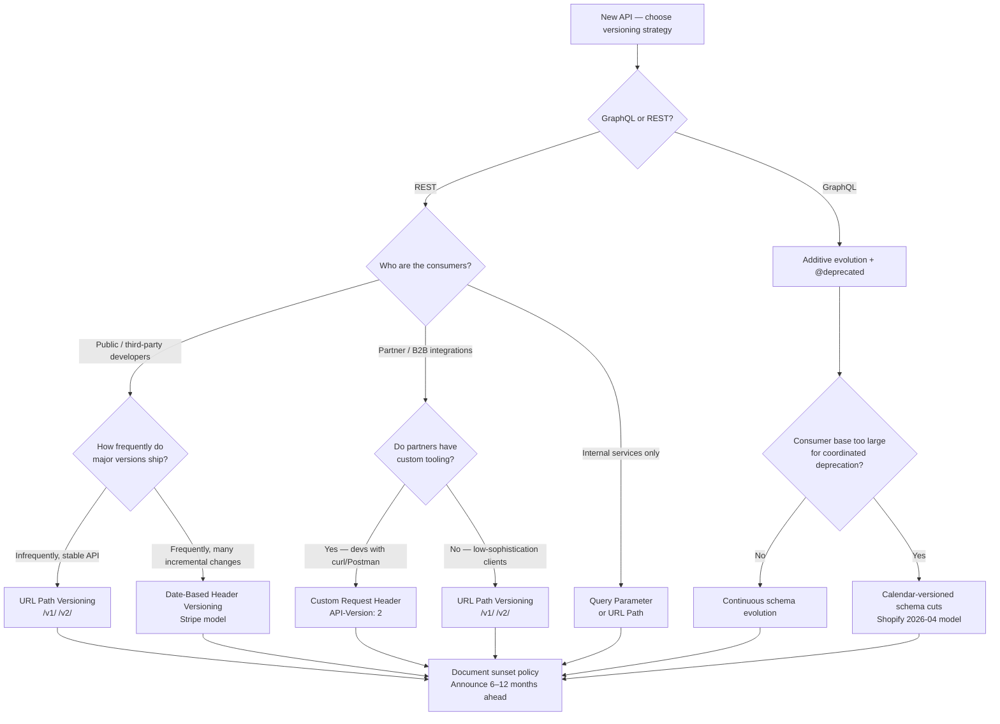

# [BEE-4002] API Versioning Strategies

:::info
URL path, header, query param, and content negotiation versioning for REST; additive schema evolution with `@deprecated` and calendar-versioned schema cuts for GraphQL. When each is appropriate, how to manage breaking changes, and how to retire old versions.
:::

:::tip Deep Dive
For detailed API versioning governance and lifecycle management, see [ADE (API Design Essentials)](https://alivedise.github.io/api-design-essentials/).
:::

## Context

An API is a contract between a provider and its consumers. Once clients depend on that contract, any change carries risk. Without a versioning strategy, providers face a dilemma: either freeze the API forever to avoid breaking consumers, or make improvements and accept that some integrations will break silently.

Versioning is the mechanism that lets an API evolve while keeping existing consumers functional. It answers the question: when a breaking change is unavoidable, how do we introduce it without forcing all consumers to upgrade simultaneously?

Troy Hunt put it plainly in his influential post on API versioning: "More important than all the ranting and raving about doing it this way or that way is to give people stability. If they invest their hard-earned effort writing code to consume your API then you'd better damn well not go and break it on them." The goal is not to pick the theoretically "correct" versioning mechanism — it is to make a deliberate choice, document it, and honour the commitment to stability.

## Principle

### Breaking vs. Non-Breaking Changes

The first discipline is knowing what constitutes a breaking change. Not every change requires a version bump.

| Change Type | Breaking? | Examples |
|---|---|---|
| Remove a field from a response | **Yes** | Remove `user.phone` from `GET /users/{id}` |
| Rename a field | **Yes** | `created_at` → `createdAt` |
| Change a field's type | **Yes** | `price` from string to number |
| Remove an endpoint | **Yes** | `DELETE /v1/reports` removed |
| Change HTTP method semantics | **Yes** | `PUT` changed to behave like `PATCH` |
| Make a previously optional field required | **Yes** | Request body `reason` becomes mandatory |
| Change error codes or error shapes | **Yes** | `400` changed to `422` for validation errors |
| Add a new optional field to a response | No | Add `user.avatar_url` to existing response |
| Add a new optional field to a request | No | Add optional `filter` query param |
| Add a new endpoint | No | `GET /v1/reports/{id}/summary` is new |
| Expand an enum with new values | No* | Add `status: "archived"` to allowed values |
| Relax a validation constraint | No | Accept longer strings where shorter was required |

*Expanding enums is technically non-breaking on the wire but can break clients that use exhaustive switch statements. Treat it as a breaking change for strongly-typed consumers.

The rule of thumb: if an existing client written against the current API can receive the new response and continue working without modification, the change is non-breaking. If the client would need to change code to handle the new response correctly, it is breaking.


### The Four Versioning Strategies

#### 1. URL Path Versioning

The version is embedded in the URI path.

```
GET /v1/users/42
GET /v2/users/42
```

**Pros:**
- Immediately visible in every log, browser URL bar, and link
- Easy to test and share — a URL is self-contained
- Simple to route at the gateway or load balancer level
- Cache-friendly; CDNs can cache `/v1/` and `/v2/` separately

**Cons:**
- Violates the REST principle that a URI should identify a resource, not a version of a resource
- Forces consumers to update base URLs when upgrading
- Can lead to URL explosion if versioning is applied at per-resource granularity

**Best fit:** Public APIs, developer-facing APIs, APIs with infrequent major versions.


#### 2. Custom Request Header Versioning

The version is passed in a dedicated HTTP header.

```
GET /users/42
API-Version: 2
```

Or using a date, as Stripe does:

```
GET /charges
Stripe-Version: 2024-06-20
```

**Pros:**
- URI stays stable — the resource identifier does not change
- Separates versioning from resource identification (more REST-aligned)
- Enables per-request version overrides for testing

**Cons:**
- Not visible in a browser URL bar or plain hyperlink
- Harder to test without tooling (curl, Postman, etc.)
- Requires additional documentation discipline — consumers must know the header name

**Best fit:** Partner APIs where consumers are developers with tooling; Stripe-style date-based versioning models.


#### 3. Query Parameter Versioning

The version is passed as a query string parameter.

```
GET /users/42?api-version=2
GET /users/42?version=2026-04-01
```

**Pros:**
- Visible in logs and URLs without special tooling
- Easy to override for debugging or testing
- Does not change the base path structure

**Cons:**
- Query parameters are semantically for filtering or controlling response, not for identifying a contract; mixing concerns
- Can be accidentally stripped by proxies or API gateways
- Less obvious than path versioning for API discovery

**Best fit:** Internal APIs, Azure-style services (Azure DevOps uses `?api-version=`), tools where URL path changes are undesirable.


#### 4. Accept Header Versioning (Content Negotiation)

The version is expressed as a media type parameter in the `Accept` header.

```
GET /users/42
Accept: application/vnd.myapi.v2+json
```

**Pros:**
- Fully REST-compliant — the URI identifies the resource; the `Accept` header negotiates the representation
- No URI proliferation; no query parameter pollution
- Theoretically the cleanest separation of concerns

**Cons:**
- Significantly harder to test without tooling
- Cannot be typed directly into a browser
- Difficult to cache at CDN level (requires `Vary: Accept` header)
- Low adoption in practice; most consumers do not expect this pattern

**Best fit:** Hypermedia-driven APIs aiming for strict REST compliance; rarely appropriate for general-purpose developer APIs.


### GraphQL: schema evolution instead of version bumps

The four strategies above all assume a REST interface: a URL path, a set of verbs, a negotiable content type. GraphQL collapses that surface to a single endpoint, `POST /graphql`, so none of the four version carriers is available. The GraphQL Foundation's own guidance is that GraphQL APIs should evolve the schema in place rather than cut new versions: *"GraphQL takes a strong opinion on avoiding versioning by providing the tools for the continuous evolution of a GraphQL schema."* ([GraphQL — Schema Design](https://graphql.org/learn/schema-design/)). The schema is the contract; evolving the contract means evolving the schema.

**The additive-only rule.** Adding fields, types, enum values, and optional arguments is safe: old clients ignore new fields, and GraphQL's response shape is driven by the client's selection set. Removing a field, renaming a field, or tightening a field's type is breaking. Adding a new non-null field to an input type is also breaking, the GraphQL equivalent of making a previously optional REST field required. Apollo's Principled GraphQL frames this as a continuous operation rather than a release cycle: *"Updating the graph should be a continuous process. Rather than releasing a new 'version' of the graph periodically, such as every 6 or 12 months, it should be possible to change the graph many times a day if necessary."* ([Principled GraphQL — Agility](https://principledgraphql.com/agility)).

**The `@deprecated` directive.** When a field must be retired, mark it deprecated rather than removing it. The October 2021 edition of the GraphQL specification defines the built-in directive as:

```graphql
directive @deprecated(reason: String = "No longer supported")
  on FIELD_DEFINITION | ENUM_VALUE
```

Introspection exposes `__Field.isDeprecated` and `__Field.deprecationReason`, so IDEs (GraphiQL), code generators, and linters can surface the signal to consumers without release notes. Field deprecation is non-breaking on the wire: the spec's Field Deprecation section (§3.6.2) states that deprecated fields remain legally selectable. That is the whole point — consumers migrate at their pace.

:::warning Spec-version caveat
The October 2021 published edition allows `@deprecated` only on `FIELD_DEFINITION | ENUM_VALUE`. Deprecation of arguments (`ARGUMENT_DEFINITION`) and input-object fields (`INPUT_FIELD_DEFINITION`) exists in the GraphQL working draft and in major implementations (Apollo Server, graphql-js). Confirm support before deprecating an argument in a published schema.
:::

Example:

```graphql
type User {
  id: ID!
  phone: String @deprecated(reason: "Use contact.phone instead. Removed 2026-10-01.")
  contact: Contact!
}
```

**When schema evolution is not enough: calendar-versioned schema cuts.** Some GraphQL deployments outgrow coordinated deprecation. When the consumer base is large enough that individual deprecation cycles cannot reach every integration, a calendar-versioned schema cut becomes the escape valve.

- **Shopify Admin GraphQL.** Quarterly releases named by release date (`2026-04`, `2026-07`). The version is a URL path segment: `/admin/api/{version}/graphql.json`. Each stable version is supported for a minimum of 12 months, with at least nine months of overlap between consecutive versions. After retirement, Shopify falls forward to the oldest supported stable version. ([Shopify — API versioning](https://shopify.dev/docs/api/usage/versioning)).
- **GitHub GraphQL.** Single continuously-evolving schema, but breaking changes are gated to calendar windows — January 1, April 1, July 1, or October 1 — and announced at least three months in advance via the public schema changelog. ([GitHub — Breaking changes](https://docs.github.com/en/graphql/overview/breaking-changes)).
- **Meta Graph API.** Versioned URL path (`v25.0`), with each version guaranteed to work for at least two years from its release date, then falling forward to the next available version.

**The rule in one line.** Default to additive changes plus `@deprecated`. Cut a calendar-named schema version only when the consumer base is too large for per-field coordination. Never rename a field in place without a deprecation cycle. The spec's insistence that deprecated fields remain selectable is the contract that makes continuous evolution safe.


### Stripe's Date-Based Versioning Model

Stripe is the canonical example of production API versioning done at scale. Instead of incrementing a version number, Stripe names versions by release date (e.g., `2024-06-20`). Key properties:

- Each account is **pinned** to the API version active when it first authenticated. Existing integrations receive the same behavior indefinitely.
- New accounts default to the current latest version.
- Developers can **override** the version on a per-request basis using the `Stripe-Version` header, enabling safe testing of upgrades in staging or even production.
- Stripe treats webhook payload shapes as part of the same versioned contract.
- Old versions are encapsulated in **version change modules** — when new code is written, it expresses only the new behavior; transformations back to older representations are isolated in adapters.

This model works because Stripe made versioning a first-class architectural concern from early on, not a retrofit. The lesson for new APIs: establish your versioning policy before the first external consumer, not after.


### Sunset Policies and Deprecation Communication

Introducing a new version without retiring old ones creates an unbounded maintenance burden. Every active version is production code that must be monitored, secured, and bug-fixed. A **sunset policy** defines how long old versions are supported after a new one ships.

**Minimum communication requirements when deprecating a version:**

1. **Announce in advance** — publish a deprecation notice with a specific end-of-life date, not "some time in the future". Six to twelve months is standard for public APIs; internal APIs may use shorter windows.
2. **Use the `Sunset` header** (RFC 8594) — respond to requests on deprecated versions with:
   ```
   Sunset: Sat, 31 Dec 2026 23:59:59 GMT
   Deprecation: true
   Link: <https://api.example.com/v2/users>; rel="successor-version"
   ```
3. **Document the migration path** — provide a changelog listing every breaking change and, for each one, the equivalent in the new version.
4. **Notify consumers directly** — email, changelog, or dashboard alerts; do not rely solely on passive header signals.
5. **Enforce the sunset date** — return `410 Gone` after the declared end-of-life date; returning `200` indefinitely defeats the policy.


### Backward Compatibility Rules

Teams that want to minimize version bumps should adopt backward compatibility rules as a default discipline:

- **Add, never remove, never rename** — add new fields instead of replacing existing ones. When a field truly must change, add the new field alongside the old one and deprecate the old field first.
- **Treat your schema as an append-only log** — removals are events that require version bumps.
- **Default new fields conservatively** — if a new required field is added to a request, provide a sensible server-side default so that old clients sending requests without that field continue to work.
- **Do not tighten validation without notice** — making a previously accepted value invalid is a breaking change.
- **Version your error contract** — changing error codes, error bodies, or the structure of problem details (see [BEE-7](7.md)5) is a breaking change.


## Visual

Decision tree for selecting a versioning strategy based on API audience and requirements:




## Example

### Same resource under different versioning strategies

The `GET /orders/99` endpoint, expressed under each strategy:

```
# URL Path
GET /v1/orders/99

# Custom Header
GET /orders/99
API-Version: 1

# Query Parameter
GET /orders/99?api-version=1

# Accept Header (content negotiation)
GET /orders/99
Accept: application/vnd.myapi.v1+json
```

All four request forms refer to the same logical resource. The difference is where the version signal lives.


### Version evolution: handling a breaking change correctly

**v1 response** for `GET /v1/users/42`:

```json
{
  "id": 42,
  "name": "Alice Chen",
  "phone": "0912-345-678"
}
```

The team decides to split `name` into `given_name` and `family_name`, and remove `phone`. These are breaking changes. Correct sequence:

1. Release `v2` with the new shape. Keep `v1` running.
2. Add `Sunset` + `Deprecation` headers to all `v1` responses.
3. Publish migration guide: `name` → `given_name` + `family_name`; `phone` moved to `GET /v2/users/42/contact`.
4. Notify consumers by email and developer portal announcement.
5. After the sunset date, `v1` returns `410 Gone`.

**v2 response** for `GET /v2/users/42`:

```json
{
  "id": 42,
  "given_name": "Alice",
  "family_name": "Chen"
}
```


## Common Mistakes

**1. No versioning strategy from day one**

The most expensive mistake. Once an unversioned API has external consumers, adding versioning becomes a breaking change itself. Establish the strategy — even if the first version is `v1` and it never changes — before any consumer goes live.

**2. Too many active versions**

Every active version is a maintenance liability. Teams that never sunset old versions end up running multiple versions of the same logic in parallel, each needing security patches and bug fixes. Define the sunset window up front and enforce it.

**3. Breaking changes without a version bump**

Renaming a field, changing a type, or making an optional field required while keeping the same version number silently breaks existing integrations. These failures are often invisible until a consumer files a bug report weeks later. If a change is breaking, it requires a new version.

**4. No deprecation timeline communicated to consumers**

Announcing deprecation without a concrete end-of-life date is not deprecation — it is a warning. Consumers will not prioritize an upgrade with no deadline. Publish a specific date and hold to it.

**5. Versioning at the wrong granularity**

Per-endpoint versioning (`/users/v2/42`, `/orders/v3/99`) creates an explosion of version combinations and makes it impossible to reason about which "version" of the API a client is on. Version the API surface as a whole, not individual endpoints. The exception is minor additive changes (non-breaking), which do not need a version bump at all.

**6. Treating GraphQL as "versionless" and skipping deprecation discipline**

The "evolve the schema, not the version" model only works when deprecations are followed through: mark the field, communicate the retirement date, then remove it. Two failure modes are common. First, marking a field `@deprecated` and never removing it leaves a growing surface area of fields that consumers keep selecting because nothing stops them. Second, removing a field in place without a deprecation cycle breaks every client that still selects it. That is exactly the failure mode the directive exists to prevent. A GraphQL API without a removal policy is a REST API that pretends not to need one.


## Related BEPs

- [BEE-4001](rest-api-design-principles.md) REST API Design Principles
- [BEE-4005](graphql-vs-rest-vs-grpc.md) GraphQL vs REST vs gRPC
- [BEE-4006](api-error-handling-and-problem-details.md) API Error Handling and Problem Details
- [BEE-4011](graphql-vs-rest-request-side-http-trade-offs.md) GraphQL vs REST: Request-Side HTTP Trade-offs
- [BEE-7002](../data-modeling/normalization-and-denormalization.md) Schema Evolution


## References

- Stripe. "APIs as infrastructure: future-proofing Stripe with versioning". https://stripe.com/blog/api-versioning
- Stripe. "Versioning". Stripe API Reference. https://docs.stripe.com/api/versioning
- Stripe. "API upgrades". https://docs.stripe.com/upgrades
- Microsoft. "Web API Design Best Practices". Azure Architecture Center. https://learn.microsoft.com/en-us/azure/architecture/best-practices/api-design
- Microsoft. "Versions in Azure API Management". https://learn.microsoft.com/en-us/azure/api-management/api-management-versions
- Microsoft. "REST API Versioning for Azure DevOps". https://learn.microsoft.com/en-us/azure/devops/integrate/concepts/rest-api-versioning
- Hunt, T. "Your API versioning is wrong, which is why I decided to do it 3 different wrong ways". https://www.troyhunt.com/your-api-versioning-is-wrong-which-is/
- Nottingham, M. 2021. "The Sunset HTTP Header Field". RFC 8594. https://www.rfc-editor.org/rfc/rfc8594
- GraphQL Foundation. "Schema Design". https://graphql.org/learn/schema-design/
- GraphQL Foundation. "`@deprecated` directive". GraphQL Specification October 2021, §3.13.3. https://spec.graphql.org/October2021/#sec--deprecated
- GraphQL Foundation. "Field Deprecation". GraphQL Specification October 2021, §3.6.2. https://spec.graphql.org/October2021/#sec-Field-Deprecation
- Apollo. "Principled GraphQL — Agility". https://principledgraphql.com/agility
- Apollo. "Schema deprecations". Apollo GraphOS docs. https://www.apollographql.com/docs/graphos/schema-design/guides/deprecations
- Shopify. "About Shopify API versioning". https://shopify.dev/docs/api/usage/versioning
- GitHub. "Breaking changes". GitHub GraphQL API docs. https://docs.github.com/en/graphql/overview/breaking-changes
- GitHub. "Changelog". GitHub GraphQL API docs. https://docs.github.com/en/graphql/overview/changelog
- Giroux, M-A. "How Should We Version GraphQL APIs?". Production Ready GraphQL. https://productionreadygraphql.com/blog/2019-11-06-how-should-we-version-graphql-apis/
