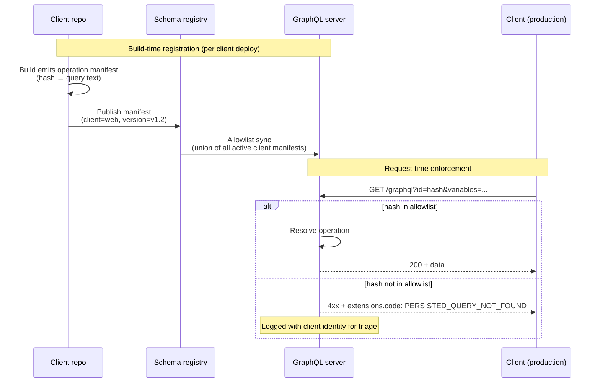
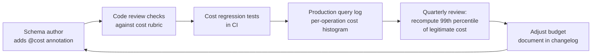
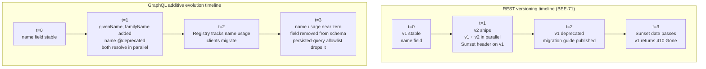

# [BEE-599] GraphQL Operational Patterns

:::info
Three operational patterns that determine whether a GraphQL deployment survives production: persisted-query allowlisting as a security boundary, query complexity governance as an organizational discipline, and additive schema evolution as the GraphQL alternative to REST-style versioning. The closing article in the four-part series on GraphQL's HTTP-ecosystem gap.
:::

## Context

The series has covered three sets of gaps so far. [BEE-4010](graphql-http-caching.md) established the caching mechanism. [BEE-4011](graphql-vs-rest-request-side-http-trade-offs.md) and [BEE-4012](graphql-vs-rest-response-side-http-trade-offs.md) walked through six request-side and response-side dimensions where REST inherits HTTP infrastructure and GraphQL must rebuild it. Each of those articles forward-referenced operational topics that this article picks up.

Three operational patterns close the series:

1. **Persisted-query allowlisting** as a security and DoS boundary. [BEE-4010](graphql-http-caching.md) introduced persisted queries as a *caching* mechanism — GET-addressable URLs the CDN can store. The same mechanism, run with stricter registration discipline, becomes a security mechanism: the server rejects any query whose hash is not in the allowlist, eliminating the attack surface where clients send arbitrary expensive queries. [BEE-4011](graphql-vs-rest-request-side-http-trade-offs.md) flagged this as a forward-reference; this article delivers it.

2. **Query complexity governance.** [BEE-4011](graphql-vs-rest-request-side-http-trade-offs.md) introduced the three layers of complexity defense (depth limit, complexity scoring, per-resolver limits). What was deferred is the *organizational* layer: who picks the budget, how it is reviewed when the schema changes, how cost annotations stay consistent across teams, and how budget violations get triaged in production. The technical layer is not the hard part; the governance is.

3. **Additive schema evolution.** GraphQL was designed around the premise that schemas evolve forever without version numbers. This is a sharp departure from the REST versioning strategies covered in [BEE-4002](api-versioning-strategies.md). The contrast is worth treating in depth: the rules that make additive evolution work (never remove, always deprecate first, nullability invariants), the `@deprecated` directive, federation contracts as consumer-segment-specific schema variants, and what to do when an unavoidable breaking change arrives.

The article is the closing reference for GraphQL operational discipline in this repo. Sections after it are out of scope for the four-article series.

## Principle

Teams running GraphQL in production **MUST** establish three operational disciplines beyond the schema and resolver layer. Persisted-query allowlisting in build-time-registration mode (Apollo's `safelist: true`, the equivalent in GraphQL Yoga and other servers) **SHOULD** be the default for any client surface under the team's control; the round-trip auto-register flow **MUST NOT** be treated as a security mechanism. Query complexity budgets **MUST** be set by measurement of the existing query catalog, reviewed when the schema changes, and enforced at the gateway with a documented exception process. Schema evolution **SHOULD** be additive — fields **MUST** be deprecated with the [`@deprecated`](https://spec.graphql.org/October2021/#sec--deprecated) directive before removal, **MUST** continue to resolve for the deprecation window, and **SHOULD** be removed only after measurable client uptake of the replacement field.

## Persisted-query allowlisting as a security boundary

**Pattern statement.** Maintain a build-time allowlist of every GraphQL operation the client surface is allowed to send. The server rejects any operation whose SHA-256 hash is not in the allowlist. The mechanism is identical to [BEE-4010](graphql-http-caching.md)'s persisted queries; the difference is registration discipline. Only operations registered at build or deploy time are accepted, and the runtime auto-register round-trip is disabled.

**Why it exists.** Two threats get neutralized simultaneously.

The first is **arbitrary-query DoS**. Without an allowlist, the rate-limiting layers from [BEE-4011](graphql-vs-rest-request-side-http-trade-offs.md) (depth limit, complexity scoring) are the entire defense. A sufficiently determined attacker probes the cost-scoring rules and finds a query that just barely passes the budget but consumes maximum origin work. With an allowlist, the only queries the server resolves are ones the client team registered, which are by construction the queries the application actually needs.

The second is **schema-introspection-based reconnaissance**. GraphQL's introspection lets any caller enumerate the entire schema (`__schema`, `__type`). Combined with arbitrary-query execution, this gives an attacker a map of the system. Allowlisting plus disabling introspection in production closes that loop. [BEE-2016](../security-fundamentals/broken-object-level-authorization-bola.md) covers BOLA, the per-object analog of this layered-defense argument; allowlisting operates at the operation-shape layer.

**Implementation depth.**

- **Build-time registration flow.** The client repo emits a hash → query manifest at build time. [GraphQL Code Generator's client-preset](https://the-guild.dev/graphql/codegen/plugins/presets/preset-client) supports this directly via the `persistedDocuments: true` configuration option, producing a `persisted-documents.json` mapping hash to query string. Apollo Client's `@apollo/persisted-query-lists` and Relay's persisted query support emit equivalent manifests. The manifest is uploaded to the GraphQL server's allowlist store before deploy.
- **Server-side enforcement (safelisting).** [Apollo's persisted-queries safelisting documentation](https://www.apollographql.com/docs/graphos/platform/security/persisted-queries) calls the security mode `safelist: true` — the router rejects any incoming operation not registered to the Persisted Query List. The companion `log_unknown: true` setting writes every rejected operation to the log, useful during rollout to confirm all clients are sending registered hashes. Once the rollout stabilizes, `log_unknown` can be turned off to reduce log noise. GraphQL Yoga's persisted-operations plugin ships an equivalent configuration.
- **CI/CD integration.** Hash mismatches between client build and server allowlist must fail the deploy, not the runtime. The standard pattern: client publishes manifest to a registry (GraphOS, WunderGraph Cosmo, Hive, or self-hosted) on every PR build; the server pulls the union of recent client manifests on startup.
- **Disabling auto-register in production.** Auto-register mode (the round-trip flow where the server registers the query on the first miss) is a *caching* convenience, not a security control. It accepts any query the client sends. Production must run with safelisting enabled; auto-register is appropriate only in development.
- **Multi-client manifest union.** Multi-client deployments (web + mobile + partner) require manifest union from all client builds. The server allowlist is `union(web@v1.2, mobile@v1.1, partner@v0.9)`. When a client version is sunset, its manifest entries can be pruned.
- **Disabling introspection in production.** [Apollo Server's `introspection` configuration option](https://www.apollographql.com/docs/apollo-server/api/apollo-server) defaults to `false` automatically when `NODE_ENV=production`, which is the right behavior; the article-level recommendation is to *verify* introspection is disabled in your production deployment rather than assume it. graphql-armor's introspection-disable plugin and equivalent options in other servers cover non-Apollo deployments.



**Production lessons.**

- **The first incident is an unregistered query.** A client team adds a new query in a hot fix and forgets to publish the manifest. Production rejects it. This is the system working correctly, but the fix path must be fast: a one-command manifest upload, not a full deploy cycle.
- **The exception process matters.** Internal admin tools, ad-hoc data exports, support engineers running diagnostic queries — all need to bypass the allowlist. Pattern: a separate authenticated endpoint (`/graphql/admin`) that allows arbitrary queries for users with an admin role, scope-logged.
- **Manifest growth is bounded by client diversity, not user count.** Each client build adds N persisted queries (the operations in that client). The allowlist size scales with `clients × operations_per_client`, not with traffic. A typical web app has 50–200 operations; mobile adds another similar set; the allowlist is well within memory.
- **Observability tie-in.** Reject responses must be logged with operation hash and client version; this is the trail for debugging "my query stopped working after I refactored." [BEE-4012](graphql-vs-rest-response-side-http-trade-offs.md)'s `extensions.code` should carry `PERSISTED_QUERY_NOT_FOUND` on rejection.

## Query complexity governance

**Pattern statement.** Treat query complexity as an organizational discipline, not a server config. The technical defense ([BEE-4011](graphql-vs-rest-request-side-http-trade-offs.md) Layer 2: schema-directive cost annotations, parser-time scoring, per-IP cost-budget enforcement) only works if the cost annotations match real resolver work, the budget reflects measured legitimate traffic, and the policy gets reviewed when the schema or the client surface changes.

**Why it exists.** Three failure modes appear when complexity is treated as a one-time configuration:

- **Cost annotations drift from real resolver work.** A schema field is annotated `@cost(complexity: 1)` when first written; six months later, its resolver fans out to a slow downstream and the real cost is 100. Nothing in the cost-scoring layer catches this. The layer scores against the annotation rather than the resolver's actual work.
- **Budget set once, never re-measured.** The 99th percentile of legitimate query cost shifts as the schema and client behavior evolve. A budget set at deploy-1 admits queries at month-12 that should be rejected, or rejects queries that should be admitted.
- **No exception process for legitimate expensive queries.** Internal dashboards, batch reports, admin tooling — all may legitimately exceed the per-IP budget. Without a documented exception process, teams either suppress the rate limiter selectively (silently weakening it for everyone) or block legitimate work.

**Implementation depth.**

- **Cost-annotation review checklist.** When a schema PR adds or modifies a field with `@cost`, reviewers must check: does the annotation match the real resolver complexity? Is `multipliers` set correctly for list-returning fields? Is the cost in the same scale as adjacent fields? Maintain a living rubric of known-cost ranges (`db.findById = 1`, `db.search = 5`, `external API call = 20`, `ML inference = 100`).
- **Budget tuning as a quarterly exercise.** Every quarter (or after major schema or client release), re-run the cost analyzer over the previous N days of production query logs. Recompute the 99th percentile of legitimate cost-per-window per user/IP. Adjust the budget. Document the change in a changelog so on-call engineers know why thresholds moved.
- **Per-actor budget classes.** A single global budget rarely fits all clients. The standard pattern is budget classes: anonymous IP gets 1,000 cost units per minute; authenticated user gets 10,000; service account gets 100,000; admin token gets unlimited. The class is selected by the gateway before cost evaluation.
- **Exception process.** When an internal team needs a high-cost query (a cron-job report, an admin dashboard refresh), the request goes through a documented path: file a ticket with the query, the expected frequency, and the resolver work it triggers; on approval, the query gets registered as a persisted query with a budget exemption tag; the gateway recognizes the tag and skips the cost limit.
- **Cost-budget violations as alerts, not silent rejections.** A `429` returned because a legitimate user hit the budget should produce a warning-level alert in the team's monitoring channel; a sustained pattern of 429s for the same operation indicates either the budget is too tight or the operation is genuinely too expensive. [BEE-4012](graphql-vs-rest-response-side-http-trade-offs.md)'s observability layer (operation-name tagging) is what makes this triage possible.



**Production lessons.**

- **The cost rubric is the document, not the directives.** Schema authors copy `@cost(complexity: 5)` from an adjacent field without thinking about whether 5 is the right number. A written cost rubric ("database point-read = 1; database scan = 5; external HTTP call = 20; ML inference = 100") gives reviewers a baseline to compare against. Without it, costs converge to whatever the most recent author guessed.
- **Cost regression tests in CI.** Add a test: parse representative production queries against the current schema, sum their costs, and assert each one stays under a threshold. A schema change that triples a query's cost surfaces in CI rather than as a 429 storm in production.
- **The budget class boundary is the auth boundary.** Selecting which budget applies depends on identity, which depends on the auth layer ([BEE-4012](graphql-vs-rest-response-side-http-trade-offs.md)'s authorization granularity discussion). An unauthenticated user cannot have a per-user budget; only a per-IP budget. This couples the rate limiter to the auth layer; teams that build the limiter first and the auth integration second end up with two systems that disagree on identity.
- **GitHub's public model as a worked example.** [GitHub's GraphQL API](https://docs.github.com/en/graphql/overview/rate-limits-and-query-limits-for-the-graphql-api) publishes its cost formula and 5,000-points-per-hour budget. The fact that they can publish it at all is a sign the discipline is mature: the rules are stable enough to document, the budget is large enough to accommodate the legitimate range, and the formula is simple enough to reason about.

## Additive schema evolution

**Pattern statement.** GraphQL schemas evolve forever. Fields are added freely, deprecated when superseded, and removed only after measurable client uptake of the replacement. The schema does not carry a version number; the client's selected fields carry the implicit version. This is the GraphQL alternative to the REST versioning strategies in [BEE-4002](api-versioning-strategies.md), and the contrast matters: REST versioning is about navigating breaking changes safely; GraphQL versioning is about not having breaking changes in the first place.

**Why it exists.** Three properties of GraphQL make additive evolution the natural model:

1. **Clients select what they consume.** A REST endpoint returns a fixed shape; adding a field changes every client's payload. A GraphQL field is invisible to clients that do not select it. Adding a new field is non-breaking by definition.
2. **The server enforces the schema; clients enforce their query against it.** Removing a field that no client selects is non-breaking. The schema registry can answer "is this removal safe?" by checking the operation manifest of every active client.
3. **Federation makes per-team evolution independent.** A subgraph can add fields to a federated type without coordinating with the gateway team or other subgraphs ([BEE-4008](graphql-federation.md) covers federation mechanics).

The contrast with REST: BEE-71 documents four versioning strategies (URL path, custom header, query param, content negotiation) and Stripe's date-based model. All are mechanisms to *manage* breaking changes by giving consumers a stable surface during a transition window. GraphQL flips the question: instead of managing breaking changes, design them out. The cost is discipline (additive only, deprecate before remove) and infrastructure (schema registry, operation manifests). The benefit is no consumer-facing version negotiation, no `Sunset` header, no `/v1/` and `/v2/` running in parallel. The [GraphQL Foundation's best-practices guidance](https://graphql.org/learn/best-practices/) takes this position explicitly.

This is genuinely different. It is not "REST versioning, but better"; it is a different category of solution to the same underlying problem of safe API evolution.

**Implementation depth.**

The additive evolution rules:

| Change | Status | Mechanism |
|---|---|---|
| Add a field | Non-breaking | Just add it |
| Add an enum value | Breaking-ish | Clients with exhaustive switches break; treat as breaking for strongly-typed clients |
| Add an optional argument | Non-breaking | Default value in resolver |
| Add a required argument | Breaking | Always — same problem as REST required-field-add |
| Remove a field | Breaking | Use deprecation cycle (below) |
| Rename a field | Breaking | Add new field, deprecate old, remove on cycle |
| Change a field's type | Breaking | Add new field with new type, deprecate old |
| Change nullability `T!` → `T` | Non-breaking on wire | Strongly-typed clients with non-null assumptions may NPE — treat as breaking for them |
| Change nullability `T` → `T!` | Breaking | Server now refuses to return null; partial-success behavior changes |

The `T!` ↔ `T` rules are the most subtle. The wire format does not change for adding nullability (`T!` → `T`); a client receiving a value still gets a value. But strongly-typed clients (TypeScript, Kotlin, Swift) generate code that assumes non-null and will break at runtime when null arrives. Treat nullability changes as breaking for any consumer with type generation.

**The `@deprecated` directive.** Defined in the [GraphQL specification](https://spec.graphql.org/October2021/#sec--deprecated), `@deprecated` applies to field definitions and enum values, takes a `reason: String` argument (default `"No longer supported"`), and surfaces in introspection through `isDeprecated: Boolean!` and `deprecationReason: String` on `__Field` and `__EnumValue`.

```graphql
type User {
  id: ID!
  name: String! @deprecated(reason: "Use `givenName` and `familyName` instead. Removal scheduled for 2026-12-31.")
  givenName: String!
  familyName: String!
}
```

Schema explorers (Apollo Studio, GraphiQL, Insomnia) render deprecated fields in red. Codegen tools emit deprecation warnings on use.

**Deprecation policy.**

- The `reason` field MUST name the replacement and the planned removal date.
- The deprecation window MUST cover the slowest-updating client. For mobile apps with monthly release cycles and 90-day adoption tails, the window is at least 6 months.
- The schema registry MUST track which clients still select the deprecated field. Removal proceeds only when usage drops below a threshold (commonly 1% of operations).
- For federated graphs, the deprecation lives in the owning subgraph; the router surfaces it to all consumers.

**Federation contracts as consumer segmentation.** Federation contracts ([Apollo GraphOS Contracts Overview](https://www.apollographql.com/docs/graphos/platform/schema-management/delivery/contracts/overview)) let a single supergraph project multiple consumer-specific schema variants. A contract filters the supergraph by `@tag` directive (`@tag(name: "mobile")`, `@tag(name: "partner")`), producing a schema variant that includes only fields tagged for that consumer.

```graphql
type User {
  id: ID! @tag(name: "mobile") @tag(name: "partner")
  name: String! @tag(name: "mobile") @tag(name: "partner")
  internalAuditNotes: String @tag(name: "internal")  # not in mobile or partner schemas
}
```

The mobile contract emits a schema with `id` and `name` only; the partner contract similar; the internal contract includes `internalAuditNotes`. Each consumer sees the schema variant appropriate to it. Each contract variant has its own README, schema reference, and Explorer in GraphOS Studio. Contracts are an alternative to URL-path versioning for large, multi-audience APIs. Instead of `/v1/` and `/v2/`, separate variants of one supergraph serve different schema views of the same underlying graph.

**The unavoidable breaking change escape hatch.** Sometimes additive evolution is impossible. Security forces removal of a field that exposes sensitive data; a regulatory change requires a type change. The escape hatch is the same one REST uses, applied per-operation rather than per-API:

- Mark the operation deprecated on the registry.
- Notify clients via the deprecation channel (changelog, dashboard, email).
- After the deprecation window, the persisted-query allowlist drops the operation and the server rejects it with `OPERATION_DEPRECATED`.

This works because the persisted-query allowlist gives the server precise knowledge of which operations are in flight. REST's URL-pattern versioning is coarser; persisted-query-aware GraphQL deprecation can be per-operation.



**Production lessons.**

- **The `@deprecated` directive without a registry is performative.** Deprecating a field gives schema explorers a warning, but if no system tracks who still uses the field, removal becomes a guessing game. Build (or buy) a schema registry that records every operation hash, the fields it selects, and the client that registered it. Apollo Studio, GraphOS, [WunderGraph Cosmo](https://cosmo-docs.wundergraph.com/cli/subgraph/check), and self-hosted alternatives like Hive all do this. The registry is not optional infrastructure; it is the inverse of REST's `Sunset` header. The Sunset header tells clients "this version is going away"; the registry answers "who is using this field?"
- **Backward-compatibility tests in CI.** When a schema change is proposed, the registry runs every persisted operation (or every operation observed in the last N days) against the proposed schema. Any operation that fails to validate is a breaking change. The tool exists in every federation registry: Apollo's [`rover subgraph check`](https://www.apollographql.com/docs/rover/commands/subgraphs) checks composition + recent client operation impact and integrates as a CI gate (with `--background` flag for async checks and GitHub PR status integration); WunderGraph Cosmo's `wgc subgraph check` covers the same ground. Use it as a CI gate, not an afterthought.
- **Federation contracts replace per-version maintenance.** Teams running multiple consumer versions in REST (`/v1/`, `/v2/`, `/v3/`) typically have parallel codebases for each. Federation contracts let one schema project all variants. The v1 mobile schema is a tagged subset of the same supergraph as the v2 web schema. The cost is up-front discipline in tagging; the benefit is no parallel codebases.
- **Deprecation removal is the hard part, not deprecation itself.** Adding `@deprecated` is easy and gets done. Removing the deprecated field is the discipline. It requires ongoing measurement of usage, follow-up with low-priority clients, and willingness to break a long-tail of stragglers. Without organizational commitment to actually completing removals, the schema accumulates dead fields, and the deprecation directive becomes a wishlist instead of a contract. [Marc-André Giroux's "How Should We Version GraphQL APIs?"](https://productionreadygraphql.com/blog/2019-11-06-how-should-we-version-graphql-apis/) is a thorough practitioner treatment of the deprecation-as-contract discipline.
- **Field renames are the most tempting non-additive change.** A field name that turns out to be confusing is a constant temptation to rename. The additive path (`add givenName`, `deprecate name`, `wait`, `remove name`) is slow and feels bureaucratic. Teams that bypass it for "just this one rename" build the habit of bypassing it for the next one. The discipline is to never bypass; rename always runs through the deprecation cycle.
- **Cross-link to BEE-71.** REST teams reading this section should understand that GraphQL's evolution model relocates versioning concerns from URL-level versioning to field-level deprecation tracking. The questions are still "when can we remove this?" and "who is still using it?"; the mechanisms are different.

## Common Mistakes

**1. Treating the persisted-query auto-register round-trip as a security mechanism.**

The auto-register flow accepts any query the client sends on the first request and persists it for future use. This is a caching convenience; it does not gate which queries the server resolves. Production must enable safelisting (Apollo's `safelist: true`, the equivalent in GraphQL Yoga, etc.) so unregistered hashes are rejected. The first sign this is wrong: a security audit asks "how do you prevent arbitrary queries?" and the answer is "we have persisted queries" without mentioning safelisting.

**2. Disabling introspection without enabling allowlisting.**

A common partial fix: production rejects `__schema` introspection but still accepts any query the client sends. The attacker cannot enumerate the schema directly, but they can probe by sending guessed queries; the auto-register flow accepts them. Both controls are necessary; either alone is leaky. [BEE-499 (BOLA)](../Security Fundamentals/499.md) is the per-object analog of this layered-defense argument.

**3. Setting a query complexity budget once and never re-measuring.**

A budget set at deploy-1 admits queries at month-12 that should be rejected. Schedule a quarterly recomputation of the 99th percentile of legitimate cost-per-window from production logs; document the change in a changelog. The budget is not a constant; it is a calibrated value with a half-life.

**4. Adding `@deprecated` and never removing the field.**

Deprecation is the easy half. Removing the field is the discipline. It requires registry-tracked usage measurement, follow-up with low-priority clients, and willingness to break a long-tail of stragglers. Without organizational commitment to actually completing removals, the schema accumulates dead fields, and the deprecation directive becomes a wishlist instead of a contract.

**5. Renaming a field as "just one quick change" outside the deprecation cycle.**

The additive path (add new, deprecate old, wait, remove old) feels bureaucratic; bypassing it once builds the habit of bypassing it always. Rename always runs through the deprecation cycle. The cost of the discipline is paid once per rename; the cost of bypassing accumulates as silent client breakage.

## Related BEPs

**Persisted-query allowlisting cluster:**

- [BEE-4010](graphql-http-caching.md) GraphQL HTTP-Layer Caching — introduced persisted queries as a caching mechanism; this article uses the same primitive for security
- [BEE-4011](graphql-vs-rest-request-side-http-trade-offs.md) GraphQL vs REST: Request-Side HTTP Trade-offs — Layer 1/2/3 rate-limiting; allowlisting can replace Layers 1 and 2 for controlled-client APIs
- [BEE-4012](graphql-vs-rest-response-side-http-trade-offs.md) GraphQL vs REST: Response-Side HTTP Trade-offs — `extensions.code` conventions; `PERSISTED_QUERY_NOT_FOUND` follows that pattern
- [BEE-2016](../security-fundamentals/broken-object-level-authorization-bola.md) Broken Object Level Authorization (BOLA) — adjacent layered-defense argument
- [BEE-2008](../security-fundamentals/owasp-api-security-top-10.md) OWASP API Security Top 10 — context for API-layer threats

**Query complexity governance cluster:**

- [BEE-4011](graphql-vs-rest-request-side-http-trade-offs.md) GraphQL vs REST: Request-Side HTTP Trade-offs — Layer 2 schema-directive cost annotations and parser-time scoring; this article extends with the organizational layer
- [BEE-12007](../resilience/rate-limiting-and-throttling.md) Rate Limiting and Throttling — token bucket and sliding window algorithms underlying budget enforcement
- [BEE-19030](../distributed-systems/distributed-rate-limiting-algorithms.md) Distributed Rate Limiting Algorithms — distributed budget enforcement concerns

**Schema evolution cluster:**

- [BEE-4002](api-versioning-strategies.md) API Versioning Strategies — REST baseline this section explicitly contrasts with
- [BEE-4008](graphql-federation.md) GraphQL Federation — federation contracts as consumer-segment schema variants
- [BEE-7003](../data-modeling/schema-evolution-and-backward-compatibility.md) Schema Evolution and Backward Compatibility — general schema-evolution principles applicable to GraphQL
- [BEE-4006](api-error-handling-and-problem-details.md) API Error Handling and Problem Details — referenced for error-contract evolution discipline

**Series closure:**

- [BEE-4010](graphql-http-caching.md), [BEE-4011](graphql-vs-rest-request-side-http-trade-offs.md), [BEE-4012](graphql-vs-rest-response-side-http-trade-offs.md) — the three sibling articles in the series this article closes

## References

- [GraphQL Specification (October 2021) — `@deprecated` directive](https://spec.graphql.org/October2021/#sec--deprecated) — applies to field definitions and enum values; takes `reason: String` argument (default `"No longer supported"`); surfaces in introspection via `isDeprecated` and `deprecationReason`.
- [GraphQL over HTTP — Working Draft](https://github.com/graphql/graphql-over-http) — GraphQL Foundation Stage-2 draft; status code mapping for rejection responses.
- [GraphQL — Best Practices (Versioning)](https://graphql.org/learn/best-practices/) — GraphQL Foundation's stated position on schema versioning: continuous evolution via deprecation rather than version-numbered API surfaces.
- [Apollo Server — Automatic Persisted Queries](https://www.apollographql.com/docs/apollo-server/performance/apq) — APQ protocol details: SHA-256 hash, GET URL shape, `PERSISTED_QUERY_NOT_FOUND` registration round-trip.
- [Apollo GraphOS — Safelisting with Persisted Queries](https://www.apollographql.com/docs/graphos/platform/security/persisted-queries) — production safelisting mode (`safelist: true`) rejects operations not in the Persisted Query List; `log_unknown: true` for monitoring during rollout.
- [Apollo Server — `introspection` configuration](https://www.apollographql.com/docs/apollo-server/api/apollo-server) — default `false` when `NODE_ENV=production`; recommended to verify rather than assume.
- [Apollo GraphOS — Contracts Overview](https://www.apollographql.com/docs/graphos/platform/schema-management/delivery/contracts/overview) — federation contracts that filter the supergraph by `@tag` directive into consumer-specific variants; each variant has its own README, schema reference, and Explorer.
- [Apollo Rover — `subgraph check`](https://www.apollographql.com/docs/rover/commands/subgraphs) — CI command for breaking-change detection; checks composition + recent client operation impact; integrates with GitHub PR status checks.
- [WunderGraph Cosmo — `wgc subgraph check`](https://cosmo-docs.wundergraph.com/cli/subgraph/check) — non-Apollo schema-registry alternative for breaking-change detection in federated subgraphs.
- [GraphQL Code Generator — Client Preset](https://the-guild.dev/graphql/codegen/plugins/presets/preset-client) — `persistedDocuments: true` configuration option produces a `persisted-documents.json` mapping hash to query string at build time.
- [graphql-armor (Escape Technologies)](https://github.com/Escape-Technologies/graphql-armor) — MIT-licensed multi-server middleware including introspection-disable, depth limit, complexity scoring, and rate limiting; covers Apollo Server, GraphQL Yoga, and Envelop.
- [Apollo Server — Error Handling](https://www.apollographql.com/docs/apollo-server/data/errors) — default `extensions.code` set including `PERSISTED_QUERY_NOT_FOUND`.
- [GitHub Docs — Rate limits and query limits for the GraphQL API](https://docs.github.com/en/graphql/overview/rate-limits-and-query-limits-for-the-graphql-api) — production reference: 5,000 points per hour per user, 2,000 points per minute secondary limit, public cost calculation formula.
- [Marc-André Giroux — How Should We Version GraphQL APIs?](https://productionreadygraphql.com/blog/2019-11-06-how-should-we-version-graphql-apis/) — practitioner treatment of GraphQL versioning, deprecation policy, and the discipline of completing removals.
