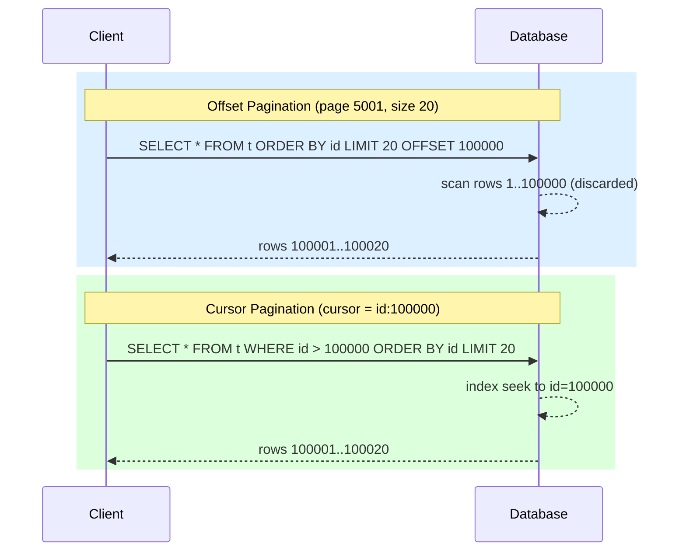

# [BEE-4004] Pagination Patterns

:::info
Choosing the right pagination strategy prevents unbounded result sets, protects database performance, and gives clients a consistent, predictable navigation experience.
:::

## Context

Every list endpoint eventually hits a wall. A table that holds ten records today may hold ten million records next year. Without pagination, a single `GET /orders` request can attempt to load the entire table into memory, saturate the network, and time out — all at once. The problem is not just performance: unbounded result sets are a security concern (data exfiltration), a reliability concern (cascading OOM failures), and a UX concern (clients have no idea how to display or process an arbitrarily large response).

Three major API platforms have published explicit, stable pagination contracts:

- **Slack** moved from simple page numbers to cursor-based pagination to handle real-time channel and user lists without missing or duplicating messages. See [Slack API Pagination](https://docs.slack.dev/apis/web-api/pagination/) and the engineering story at [Evolving API Pagination at Slack](https://slack.engineering/evolving-api-pagination-at-slack/).
- **Stripe** uses cursor pagination with `starting_after` / `ending_before` object IDs, explicitly chosen over offset pagination because "newly created objects won't make you lose your place". See [Stripe Pagination](https://docs.stripe.com/api/pagination).
- **Google** (AIP-158) requires all list RPCs to accept a `page_token` and return a `next_page_token`. Tokens must be opaque, URL-safe strings — never user-parseable. See [Google AIP-158: Pagination](https://google.aip.dev/158).

## Principle

**Paginate every list endpoint. Default to cursor-based pagination for mutable, high-volume collections. Reserve offset pagination for small, stable datasets where random access (jump to page N) is a genuine user need. Always enforce a server-side maximum page size.**

---

## Why Pagination Matters

An unbounded list endpoint is an outage waiting to happen. The failure modes are well-documented:

- A single slow query can hold a database connection open until it times out.
- The JSON serializer allocates memory proportional to the result set; large responses trigger garbage collection pauses.
- Downstream caches and proxies may buffer the entire body before forwarding it.
- Clients that iterate over results in a loop have no natural stopping point if the collection grows.

Pagination imposes a contract: every response has a bounded size, and navigation between pages is explicit. This is foundational to any API that expects production traffic.

---

## Offset-Based Pagination

The simplest model. The client sends a page number (or raw offset) and a page size; the server applies `LIMIT` / `OFFSET` in SQL.

### Request

```http
GET /api/v1/orders?page=3&size=20
```

### Response

```json
{
  "data": [...],
  "pagination": {
    "page": 3,
    "size": 20,
    "total": 487,
    "total_pages": 25
  },
  "_links": {
    "self":  "/api/v1/orders?page=3&size=20",
    "first": "/api/v1/orders?page=1&size=20",
    "prev":  "/api/v1/orders?page=2&size=20",
    "next":  "/api/v1/orders?page=4&size=20",
    "last":  "/api/v1/orders?page=25&size=20"
  }
}
```

### SQL

```sql
SELECT * FROM orders
ORDER BY created_at DESC
LIMIT 20 OFFSET 40;   -- page 3, size 20
```

### Problems with Deep Offset

The database must scan and discard the first N rows before returning results. At `OFFSET 100000` PostgreSQL reads 100,001 rows to return 20. Performance degrades linearly with depth.

```sql
-- This is O(OFFSET + LIMIT) work, not O(LIMIT)
SELECT * FROM orders ORDER BY created_at DESC LIMIT 20 OFFSET 100000;
```

A second problem: if a new order is inserted while the client is paginating, every subsequent page shifts by one row. Items are skipped or duplicated. This is the "phantom read" problem.

---

## Cursor-Based Pagination (Keyset Pagination)

Instead of telling the server "skip N rows", the client tells the server "give me records after this specific item". The server translates the cursor back into a `WHERE` clause on an indexed column.

### Request

```http
GET /api/v1/orders?cursor=eyJpZCI6MTAwfQ&limit=20
```

### Response

```json
{
  "data": [...],
  "pagination": {
    "limit": 20,
    "next_cursor": "eyJpZCI6MTIwfQ",
    "prev_cursor": "eyJpZCI6MTAxfQ",
    "has_more": true
  },
  "_links": {
    "self": "/api/v1/orders?cursor=eyJpZCI6MTAwfQ&limit=20",
    "next": "/api/v1/orders?cursor=eyJpZCI6MTIwfQ&limit=20"
  }
}
```

The cursor `eyJpZCI6MTAwfQ` is a base64-encoded JSON object `{"id":100}`. It is opaque to the client.

### SQL

```sql
-- Equivalent: WHERE id > 100 ORDER BY id ASC LIMIT 20
SELECT * FROM orders
WHERE id > 100          -- decoded from cursor
ORDER BY id ASC
LIMIT 20;
```

The database uses the index on `id` to seek directly to row 100 and reads forward. Performance is O(LIMIT) regardless of how far into the collection the client is.

### Cursor Design

Cursors must be:

- **Opaque** -- clients treat them as black boxes. Never expose raw database IDs or timestamps directly as string cursors; encode them so the internal structure is not visible and can change without breaking clients.
- **URL-safe** -- base64url encoding (RFC 4648 §5) works well.
- **Stateless** -- the cursor must encode everything the server needs to continue; it must not be a server-side session key.
- **Short-lived when appropriate** -- cursors that encode a point-in-time snapshot should carry an expiry so stale navigation fails loudly rather than silently returning wrong results.

---

## Offset vs. Cursor: Comparison

| Dimension | Offset Pagination | Cursor Pagination |
|---|---|---|
| Implementation complexity | Low | Medium |
| Deep page performance | Degrades (O(OFFSET)) | Constant (O(LIMIT)) |
| Consistency under writes | Phantom reads / skips | Stable, no skips |
| Random access (jump to page N) | Yes | No |
| Total count | Easy (COUNT query) | Expensive or approximate |
| Bookmark / share a page URL | Yes (page number is stable) | Cursor may expire |
| Suitable for real-time data | No | Yes |
| Suitable for export / full scan | With care | Yes (follow cursors to end) |

**Rule of thumb:** use cursor pagination unless you need random page access (e.g., a UI with numbered page buttons on a static dataset). For anything that mutates in real time — messages, events, transactions — cursor pagination is the correct choice.

---

## Visual: How Each Strategy Navigates



Both queries return the same 20 rows. The offset query discards 100,000 rows first; the cursor query seeks directly to the right position using the index.

---

## Page Token Pattern (Google-style)

Google's AIP-158 generalises cursor pagination into a "page token" pattern used across all of Google's public APIs. The semantics are the same, but the naming is standardised:

- Request parameter: `page_token` (string, opaque)
- Request parameter: `page_size` (integer)
- Response field: `next_page_token` (string, empty string means end of collection)

```http
GET /v1/projects/123/logs?page_size=50&page_token=ChBzdGFydF90b2tlbl92YWx1ZQ
```

```json
{
  "logs": [...],
  "next_page_token": "ChBuZXh0X3BhZ2VfdG9rZW4"
}
```

When `next_page_token` is absent or empty, the client has reached the end. The client passes the received token verbatim as the `page_token` of the next request. The token format is an implementation detail the server may change at any time.

---

## Response Envelope and Link Headers

### Response Envelope

Embed pagination metadata consistently at the top level of every list response:

```json
{
  "data": [ ... ],
  "pagination": {
    "limit": 20,
    "next_cursor": "eyJpZCI6MTIwfQ",
    "has_more": true
  }
}
```

Avoid putting `total` in every response by default (see "Common Mistakes" below). Offer it only when the client explicitly requests it (e.g., `?include_total=true`).

### Link Headers (RFC 8288)

HTTP's `Link` header ([RFC 8288](https://www.rfc-editor.org/rfc/rfc8288)) allows pagination links to travel outside the response body, which is useful for clients that want to follow links without parsing JSON:

```http
Link: </api/v1/orders?cursor=eyJpZCI6MTIwfQ&limit=20>; rel="next",
      </api/v1/orders?cursor=eyJpZCI6MTAxfQ&limit=20>; rel="prev"
```

GitHub's REST API uses `Link` headers as the canonical pagination mechanism. Including both `Link` headers and body metadata is acceptable and improves interoperability.

---

## Total Count Considerations

Clients often ask "how many results are there?" Total counts are useful for progress indicators and "showing X of Y results" UI text. But they are expensive:

```sql
-- Full table scan; cannot use LIMIT short-circuit
SELECT COUNT(*) FROM orders WHERE user_id = 42;
```

On a large table with a complex `WHERE` clause this can take seconds. Strategies:

1. **Omit by default.** Do not return `total` unless the client explicitly requests it via a query parameter (`?include_total=true`).
2. **Approximate counts.** PostgreSQL's `pg_class.reltuples` provides an estimate without a full scan. Acceptable for showing "about 1.2 million records".
3. **Cache counts.** For high-traffic endpoints, cache the count with a short TTL and invalidate on write.
4. **Return `has_more` instead.** For cursor-based APIs, `has_more: true/false` is usually sufficient. Clients only need to know whether there is a next page, not how many pages remain.

---

## Enforcing Maximum Page Size

Never trust the client's `size` or `limit` parameter without a server-side cap:

```python
MAX_PAGE_SIZE = 100

def get_page_size(requested: int | None) -> int:
    if requested is None:
        return DEFAULT_PAGE_SIZE   # e.g. 20
    return min(requested, MAX_PAGE_SIZE)
```

Return an error (HTTP 400) if the client requests a size above the documented maximum rather than silently capping it. Silent capping confuses clients that expect exactly N records. A 400 response with a clear error message (`"max page size is 100"`) is honest and debuggable.

---

## Common Mistakes

### 1. No pagination on list endpoints

Returning all records from a list endpoint is a latency bomb and a potential data exfiltration vector. Every list endpoint must paginate. If the default page size is large enough that most clients never notice, that is fine — but the ceiling must exist.

### 2. Deep offset pagination in production

`OFFSET 100000` on a 10-million-row table will cause slow queries and lock contention. If a UI needs page numbers, consider materialising a cursor-to-page mapping in a cache layer rather than translating page numbers to raw SQL offsets.

### 3. Exposing internal IDs as cursors

Using `?after_id=12345` leaks the database's auto-increment sequence, lets clients infer record counts, and couples the API contract to the storage schema. Encode cursors with base64url or encrypt them. Treat the cursor as an opaque token even if it is currently nothing more than a wrapped integer.

### 4. Not enforcing max page size

A client sending `?size=1000000` either has a bug or is attempting to extract data in bulk. Without a server-side cap this request will succeed, consuming database, memory, and bandwidth. Set a hard limit and document it in the API reference.

### 5. Total count on every request

Running `SELECT COUNT(*)` on every paginated request doubles the database load for list endpoints. This is rarely justified. Expose total count as an opt-in parameter, use approximate counts where exactness is not critical, or remove total counts entirely in favour of `has_more`.

---

## Related BEPs

- [BEE-4001: REST API Design](./70.md) — Foundational REST conventions this article builds on.
- [BEE-6006: Query Optimization](125.md) — Index strategies that make cursor pagination and keyset queries efficient.
