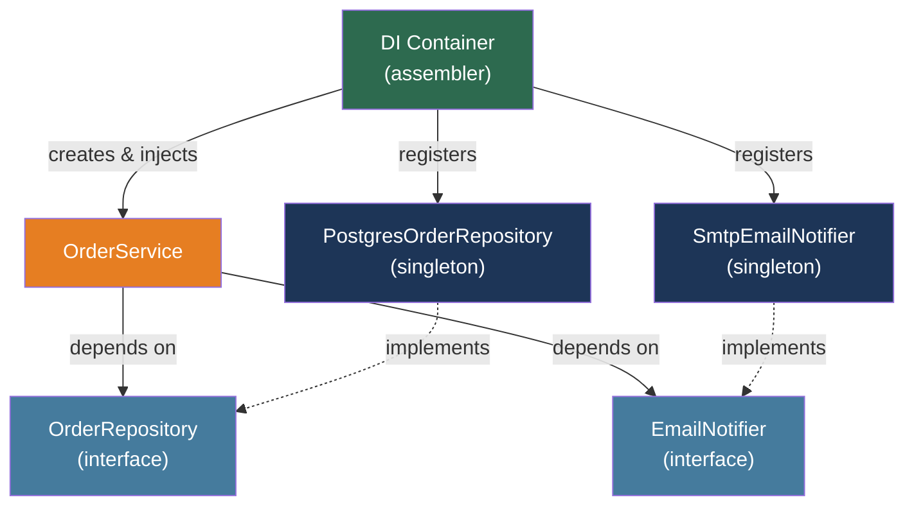

# [BEE-500] Dependency Injection and Inversion of Control

:::info
Dependency Injection is a technique where a component receives its dependencies from the outside rather than creating them itself — making the component testable, configurable, and decoupled from concrete implementations.
:::

## Context

The term "Inversion of Control" appeared in software literature as early as the 1980s, but the problem it solves became acute as object-oriented systems grew in complexity. The pattern describes a reversal of the control flow between a framework and application code: instead of application code calling into library code, the framework calls into application code at defined extension points. Richard Sweet's 1983 Mesa paper on interactive programming expressed this as the Hollywood Principle: "Don't call us, we'll call you."

Martin Fowler formally distinguished Dependency Injection as a specific technique within the broader IoC family in his January 2004 article "Inversion of Control Containers and the Dependency Injection Pattern." At the time, lightweight containers like PicoContainer and Spring were proliferating, each implementing IoC in different ways. Fowler named three variants — constructor injection, setter injection, and interface injection — and contrasted them with the Service Locator pattern. The article gave the community a shared vocabulary and remains the canonical reference for the topic.

The practical problem DI solves is tight coupling. A class that instantiates its own dependencies — `EmailService service = new SmtpEmailService(smtp.example.com, 587)` — is bound to a specific implementation. It cannot be tested without a live SMTP server. It cannot be reconfigured for a different environment without recompilation. It cannot be replaced with a mock or a fake. Dependency Injection breaks the instantiation responsibility out of the consumer class and into an external assembler — the DI container in most frameworks — which constructs and wires the object graph before the application starts serving requests.

The Dependency Inversion Principle (the D in SOLID, articulated by Robert C. Martin in the mid-1990s) provides the design rationale: high-level modules should not depend on low-level modules; both should depend on abstractions. An `OrderService` should depend on an `EmailNotifier` interface, not on `SmtpEmailService`. DI is the mechanism that makes DIP practical at scale.

## Design Thinking

Three questions clarify the DI model:

**Who creates the object?** Without DI, the consumer creates it: `this.db = new PostgresDatabase(connStr)`. With DI, the container creates it and passes it in: the consumer declares `constructor(private db: Database)` and never constructs a `Database` at all.

**Who knows the concrete type?** Without DI, the consumer knows. With DI, the container knows — the consumer depends only on an interface or abstract type. The container holds the mapping from abstractions to concrete implementations.

**When is the object graph built?** A DI container builds the entire graph at startup (or on first request), validates that every declared dependency has a registration, and fails fast if anything is missing. This is the advantage over the Service Locator pattern, which resolves dependencies at the call site and fails at runtime when a registration is missing.

### Injection Types

**Constructor injection** passes all required dependencies through the constructor. It is the recommended default: dependencies are declared explicitly, they are immutable after construction, and a class that requires ten constructor arguments signals that it has too many responsibilities — a violation of the Single Responsibility Principle that is immediately visible in code review.

**Setter/property injection** sets optional dependencies after construction via setters or public properties. Use it only for truly optional dependencies with a sensible default. It allows circular dependencies but sacrifices immutability.

**Field injection** (e.g., `@Autowired` directly on a field in Spring) bypasses the constructor entirely. It hides dependencies from the class's public interface, makes the class non-instantiable without the container, and defeats the compiler's ability to flag missing dependencies. Avoid it in new code.

## Best Practices

### Declare Dependencies at the Constructor

**MUST declare required dependencies as constructor parameters, not as fields assigned inside the body.** Constructor injection makes the dependency graph explicit, enables immutable fields, and allows the class to be instantiated in unit tests without a container:

```java
// PREFERRED: dependencies declared, all required, immutable after construction
@Service
public class OrderService {
    private final OrderRepository repository;
    private final EmailNotifier notifier;

    public OrderService(OrderRepository repository, EmailNotifier notifier) {
        this.repository = repository;
        this.notifier = notifier;
    }
}
```

```java
// AVOID: field injection hides dependencies, requires Spring context to test
@Service
public class OrderService {
    @Autowired private OrderRepository repository;
    @Autowired private EmailNotifier notifier;
}
```

Modern Spring Boot does not require `@Autowired` on single-constructor classes. The annotation is noise when there is only one constructor; the framework injects by convention.

### Depend on Abstractions, Not Concretions

**MUST define dependencies as interfaces or abstract types** whenever there is more than one plausible implementation or when testability matters. A dependency on `EmailNotifier` (interface) allows injection of `SmtpEmailNotifier` in production and `FakeEmailNotifier` in tests. A dependency on `SmtpEmailNotifier` cannot be substituted:

```python
# FastAPI: depend on an abstract Protocol, not a concrete class
from typing import Protocol

class EmailNotifier(Protocol):
    async def send(self, to: str, subject: str, body: str) -> None: ...

async def create_order(
    payload: OrderPayload,
    notifier: EmailNotifier = Depends(get_email_notifier),
    repo: OrderRepository = Depends(get_order_repo),
) -> Order:
    order = await repo.create(payload)
    await notifier.send(order.customer_email, "Order confirmed", ...)
    return order
```

The `get_email_notifier` dependency function can return a real SMTP notifier in production and a no-op fake in tests by overriding the dependency provider.

### Choose Lifetimes Deliberately

**MUST understand the three standard lifetimes** and choose the correct one for each registration. A mistake in lifetime produces subtle bugs — often data leakage between requests or unnecessary allocations:

| Lifetime | Created | Destroyed | Use for |
|----------|---------|-----------|---------|
| **Singleton** | Once at container startup | Container shutdown | Stateless services, connection pools, configuration |
| **Scoped** | Once per request (HTTP) or unit of work | End of scope | Database contexts, unit-of-work objects, per-request caches |
| **Transient** | Every time requested | When scope ends | Lightweight, stateless operations; unique per call |

**The captive dependency problem:** injecting a scoped or transient service into a singleton is a common error. The singleton captures the dependency at construction and holds it for its lifetime — a scoped service effectively becomes a singleton, defeating the purpose of its registration and causing shared state across requests:

```csharp
// WRONG: UserContext is scoped (per-request), but captured by singleton
services.AddSingleton<OrderService>(); // singleton
services.AddScoped<UserContext>();     // scoped — per request

// OrderService.constructor(UserContext ctx) — ctx is now captured forever
// Every request will see the UserContext from the FIRST request
```

ASP.NET Core's container detects this at startup and throws `InvalidOperationException`. Spring detects it at context initialization. NestJS throws `UnknownDependenciesException`. Always verify that a singleton's transitive dependencies are also singletons.

### Avoid the Service Locator Pattern

**MUST NOT use a global registry or container as a call-site resolver** (the Service Locator pattern). Service Locator is superficially similar to DI — both separate configuration from use — but it inverts the visibility: with DI, dependencies are declared in the constructor and visible to any reader of the class. With Service Locator, dependencies are resolved inside the method body and invisible from the outside:

```typescript
// AVOID: Service Locator hides the dependency on EmailNotifier
class OrderService {
    async createOrder(payload: OrderPayload) {
        const notifier = container.resolve<EmailNotifier>('EmailNotifier'); // hidden
        // ...
    }
}

// PREFER: dependency declared, visible, injectable
class OrderService {
    constructor(private notifier: EmailNotifier) {}

    async createOrder(payload: OrderPayload) {
        // notifier is visible in the constructor signature
    }
}
```

Service Locator errors are runtime failures ("no registration found for 'EmailNotifier'"). Constructor injection errors are caught at container startup — before the first request is ever served.

### Treat Over-Injection as a Design Signal

**SHOULD refactor when a constructor receives more than four or five dependencies.** A constructor with eight dependencies is not an injection problem; it is a Single Responsibility Principle violation. The class is doing too many things. Remedies:

- **Extract a domain service:** group cohesive dependencies into a new service class.
- **Introduce a Facade:** create an aggregating service that provides a simpler interface to a cluster of collaborators.
- **Re-examine the abstraction:** two separately injected repositories that always appear together may belong behind a single higher-level repository.

Resist the temptation to pass the entire container into a class ("container injection") as a workaround for too many dependencies. This degrades back to Service Locator.

### Circular Dependencies Signal a Design Problem

**SHOULD NOT introduce circular dependencies.** A → B → A (A depends on B, B depends on A) indicates that the abstraction boundary is wrong. Containers handle this differently: Spring resolves constructor-injection circular dependencies with an exception at startup; NestJS requires `forwardRef()` as a workaround; Go's Wire tool detects cycles at code generation time as a compile error. The right fix is to refactor: extract a third class C that both A and B depend on, or invert one of the dependencies so the flow is acyclic.

## Visual



## Implementation Notes

### Spring Boot (Java/Kotlin)

Spring's container (ApplicationContext) scans for `@Component`, `@Service`, `@Repository`, and `@Controller` annotations and registers them as beans. Constructor injection requires no annotation on single-constructor classes:

```java
@Service
public class OrderService {
    private final OrderRepository repo;
    private final EmailNotifier notifier;

    // No @Autowired needed — Spring injects the single constructor
    public OrderService(OrderRepository repo, EmailNotifier notifier) {
        this.repo = repo;
        this.notifier = notifier;
    }
}
```

Lifecycle: `@Scope("singleton")` (default), `@Scope("prototype")` (transient), `@Scope("request")` (HTTP request scope for web apps). Spring Boot detects circular constructor-injection dependencies at context startup and throws `BeanCurrentlyInCreationException`.

### ASP.NET Core (C#)

Services are registered in `Program.cs` and injected via constructors. The built-in container supports three lifetimes:

```csharp
builder.Services.AddSingleton<IConnectionPool, NpgsqlConnectionPool>();
builder.Services.AddScoped<IOrderRepository, PostgresOrderRepository>();
builder.Services.AddTransient<IEmailNotifier, SmtpEmailNotifier>();

// Usage via constructor injection
public class OrderController(IOrderRepository repo, IEmailNotifier notifier)
{
    // Primary constructor syntax (C# 12+); repo and notifier are injected
}
```

ASP.NET Core validates the dependency graph at startup when `ValidateOnBuild = true` (default in development). Captive dependency violations throw at startup rather than at request time.

### NestJS (TypeScript)

NestJS uses TypeScript decorators and reflection metadata. Providers are registered per-module:

```typescript
@Injectable()
export class OrderService {
    constructor(
        private readonly repo: OrderRepository,
        private readonly notifier: EmailNotifier,
    ) {}
}

@Module({
    providers: [
        OrderService,
        { provide: EmailNotifier, useClass: SmtpEmailNotifier },
        { provide: OrderRepository, useClass: PostgresOrderRepository },
    ],
})
export class OrderModule {}
```

Injection scope: `DEFAULT` (singleton per module), `REQUEST` (per HTTP request), `TRANSIENT` (new instance per injection). Circular dependencies require `forwardRef(() => DependencyClass)` as a workaround, but are always a design smell.

### FastAPI (Python)

FastAPI uses `Depends()` for a functional DI system — no class decorator required:

```python
from fastapi import Depends

def get_db() -> Generator[Session, None, None]:
    db = SessionLocal()
    try:
        yield db
    finally:
        db.close()

def get_order_repo(db: Session = Depends(get_db)) -> OrderRepository:
    return PostgresOrderRepository(db)

@router.post("/orders")
async def create_order(
    payload: OrderPayload,
    repo: OrderRepository = Depends(get_order_repo),
):
    return await repo.create(payload)
```

Dependencies can be overridden in tests via `app.dependency_overrides`:

```python
app.dependency_overrides[get_order_repo] = lambda: FakeOrderRepository()
```

### Wire (Go)

Go has no runtime reflection-based DI. Google's Wire generates dependency injection code at compile time:

```go
// Providers declare how to construct each dependency
func NewOrderRepository(db *sql.DB) *PostgresOrderRepository { ... }
func NewEmailNotifier(cfg Config) *SmtpEmailNotifier { ... }
func NewOrderService(repo *PostgresOrderRepository, n *SmtpEmailNotifier) *OrderService { ... }

// Wire injector — Wire generates the wiring code from this declaration
//go:build wireinject
func InitializeOrderService(cfg Config, db *sql.DB) (*OrderService, error) {
    wire.Build(NewOrderRepository, NewEmailNotifier, NewOrderService)
    return nil, nil
}
```

`wire gen` produces a `wire_gen.go` file that calls the providers in the correct order. Circular dependencies are detected as compile errors. No runtime overhead; no reflection.

## Related BEEs

- [BEE-5004](hexagonal-architecture.md) -- Hexagonal Architecture: ports and adapters depend on DI to inject the correct adapter for each port at runtime
- [BEE-5002](domain-driven-design-essentials.md) -- Domain-Driven Design Essentials: DI enables the repository pattern by injecting the correct storage implementation for a domain aggregate
- [BEE-15005](../testing/test-doubles-mocks-stubs-fakes.md) -- Test Doubles: Mocks, Stubs, Fakes: DI is the prerequisite for test doubles — a class that constructs its own dependencies cannot have them replaced by fakes
- [BEE-5003](cqrs.md) -- CQRS: command and query handlers are commonly registered as scoped services in a DI container, with separate handler instances per request

## References

- [Martin Fowler. Inversion of Control Containers and the Dependency Injection Pattern — martinfowler.com, January 2004](https://martinfowler.com/articles/injection.html)
- [Martin Fowler. Inversion of Control — martinfowler.com, June 2005](https://martinfowler.com/bliki/InversionOfControl.html)
- [Martin Fowler. DIP in the Wild — martinfowler.com, May 2013](https://martinfowler.com/articles/dipInTheWild.html)
- [Mark Seemann. Service Locator is an Anti-Pattern — blog.ploeh.dk, February 2010](https://blog.ploeh.dk/2010/02/03/ServiceLocatorisanAnti-Pattern/)
- [Spring Framework. Dependencies — docs.spring.io](https://docs.spring.io/spring-framework/reference/core/beans/dependencies/factory-collaborators.html)
- [Spring Boot. Using Spring Beans and Dependency Injection — docs.spring.io](https://docs.spring.io/spring-boot/reference/using/spring-beans-and-dependency-injection.html)
- [Microsoft. Dependency injection in ASP.NET Core — learn.microsoft.com](https://learn.microsoft.com/en-us/aspnet/core/fundamentals/dependency-injection)
- [Microsoft. Service lifetimes — learn.microsoft.com](https://learn.microsoft.com/en-us/dotnet/core/extensions/dependency-injection/service-lifetimes)
- [NestJS. Providers — docs.nestjs.com](https://docs.nestjs.com/providers)
- [NestJS. Injection scopes — docs.nestjs.com](https://docs.nestjs.com/fundamentals/injection-scopes)
- [FastAPI. Dependencies — fastapi.tiangolo.com](https://fastapi.tiangolo.com/tutorial/dependencies/)
- [Google Wire. Compile-time Dependency Injection for Go — go.dev](https://go.dev/blog/wire)
- [Fava et al. Cataloging Dependency Injection Anti-Patterns in Software Systems — arXiv:2109.04256, 2021](https://arxiv.org/abs/2109.04256)
