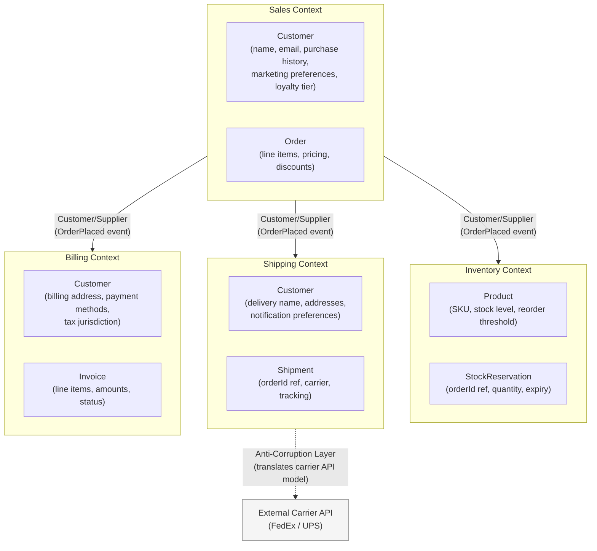

# [BEE-5002] Domain-Driven Design Essentials

:::info
Bounded contexts, ubiquitous language, and strategic DDD patterns for drawing service and module boundaries.
:::

## Context

Most systems start with a single model of the business domain. As the system grows, that single model becomes a liability: different teams use the same word to mean different things, a "Customer" in the billing team's code is not the same as a "Customer" in the shipping team's code, and every change ripples unpredictably across the codebase.

Domain-Driven Design (DDD), introduced by Eric Evans in his 2003 book and extended by Vaughn Vernon's "Implementing Domain-Driven Design" (2013), provides a vocabulary and set of patterns for managing this complexity. It has two layers:

- **Strategic DDD** -- how to carve a large system into coherent, independently modelable pieces (bounded contexts, context maps, ubiquitous language). This is the high-value layer for teams at the 1--3 year mark.
- **Tactical DDD** -- how to model the internals of each piece (entities, value objects, aggregates, domain events, repositories). Useful, but secondary.

This article focuses primarily on strategic DDD, which directly informs how to draw boundaries between modules and services (see [BEE-1001](../auth/authentication-vs-authorization.md)0).

## Principle

### Ubiquitous Language

The first practice of DDD is deceptively simple: every team working on a bounded context agrees on a shared vocabulary and uses it everywhere -- in conversation, in documentation, in code, in tests, and in database schema. This shared vocabulary is the **ubiquitous language**.

Without ubiquitous language, a developer and a domain expert talking about the same system are actually talking about different things. The developer says "user"; the business says "customer", "member", "subscriber", and "account holder" -- each with subtly different meaning in context. Code that does not reflect the business vocabulary forces every reader to translate, and translations introduce bugs.

Ubiquitous language is always scoped to a bounded context. The same word may have a different meaning in a different context -- and that is fine.

### Bounded Contexts

A **bounded context** is an explicit boundary within which a particular domain model applies. Inside the boundary, every term has a single, precise meaning. Outside the boundary, the same term may mean something different.

Martin Fowler describes bounded contexts as the primary tool for handling large models: rather than one unified model for the entire business, each context has a model that is correct for its specific purpose. The boundaries are typically drawn around:

- Organizational team ownership (Conway's Law)
- Language shifts (when the business words change, a new context begins)
- Data ownership and lifecycle (entities that are created, modified, and deleted by one team)
- Rate of change (a frequently changing subdomain should not be entangled with a stable one)

Bounded contexts are the primary unit of deployment boundary thinking. A microservice (or a module in a modular monolith) SHOULD correspond to one bounded context.

### The "Customer" Problem: One Concept, Multiple Models

A canonical example of why bounded contexts matter is the concept of "Customer":

- In the **Sales context**, a Customer has a name, email address, phone number, purchase history, loyalty tier, and marketing preferences. The Sales team cares about customer acquisition, lifetime value, and win/loss reasons.
- In the **Shipping context**, a Customer has a delivery name, a set of delivery addresses, and notification preferences for delivery updates. The Shipping team cares about successfully delivering packages to the right location.
- In the **Billing context**, a Customer has a billing address, payment methods on file, invoice history, and tax jurisdiction. The Billing team cares about collecting money and issuing receipts.

These are three different models of the same real-world entity. If you build one unified `Customer` model to serve all three contexts, it becomes a bloated object with dozens of fields, most of which are irrelevant to any given operation. Worse, a change made for the Billing team's requirements may inadvertently break the Sales team's assumptions.

The DDD answer: let each bounded context own its own `Customer` model, scoped to its own needs. An integration layer (see Context Mapping below) handles translation when contexts need to communicate.

### Context Mapping

A **context map** documents the relationships between bounded contexts. Key relationship patterns:

| Pattern | Meaning |
|---|---|
| **Shared Kernel** | Two contexts share a small, explicitly agreed subset of the domain model. Changes require both teams to agree. Use sparingly. |
| **Customer/Supplier** | One context (supplier/upstream) produces data consumed by another (customer/downstream). The upstream team publishes a stable interface; the downstream team adapts to it. |
| **Conformist** | The downstream team adopts the upstream model as-is, without translation. Acceptable when the upstream is a third-party system or a well-established platform team. |
| **Anti-Corruption Layer (ACL)** | The downstream team builds a translation layer that converts the upstream model into its own model. This protects the downstream context from upstream changes and prevents a poorly modeled upstream from "infecting" the downstream. |
| **Published Language** | A well-documented shared data format (e.g., a canonical event schema) that any context can produce or consume. Common in event-driven architectures. |

The Anti-Corruption Layer is particularly important when integrating with legacy systems or third-party APIs. Rather than letting the external model's concepts bleed into your domain model, the ACL translates at the boundary.

### Tactical Patterns (Overview)

The following tactical patterns apply within a single bounded context.

**Entities** are objects with a distinct identity that persists over time and through state changes. An `Order` with `id: 42` is the same `Order` even after its status changes from `PENDING` to `SHIPPED`. Identity is the defining characteristic.

**Value Objects** are objects defined entirely by their attributes, with no identity of their own. A `Money` value of `USD 42.00` is interchangeable with any other `Money` value of `USD 42.00`. Value objects SHOULD be immutable. Examples: `Money`, `Address`, `DateRange`, `EmailAddress`.

**Aggregates** are clusters of entities and value objects that are treated as a single unit for data changes. One entity within the aggregate is the **aggregate root** -- the only object that external code may hold a reference to. The aggregate root enforces all invariants for the cluster.

Key aggregate design rules (from Vaughn Vernon's "Effective Aggregate Design"):
- Reference other aggregates by identity only, not by object reference
- Transactions MUST NOT span aggregate boundaries
- Keep aggregates small -- a large aggregate is usually a sign of a missing bounded context boundary
- Design aggregates around true consistency requirements, not object graph convenience

**Domain Events** represent something meaningful that happened in the domain. `OrderPlaced`, `PaymentReceived`, `ItemShipped` are domain events. They are named in the past tense. Domain events are the primary mechanism for communication between aggregates and between bounded contexts without creating direct dependencies.

**Repositories** provide a collection-like interface for loading and persisting aggregates. The repository interface belongs in the domain layer; the implementation belongs in the infrastructure layer. Domain code depends only on the interface, not on any specific database technology. This is the same dependency inversion principle that makes the domain model testable without a real database.

**Domain Services** encapsulate domain logic that does not naturally belong to a single entity or value object. A `PricingService` that calculates order totals based on product prices, applicable discounts, and tax rules is a domain service. Domain services operate on domain objects and speak the ubiquitous language.

**Application Services** orchestrate use cases. They receive a command (e.g., `PlaceOrderCommand`), load the relevant aggregates via repositories, delegate to domain objects and domain services, persist the result, and publish domain events. Application services are thin -- they contain no domain logic themselves.

### Strategic vs. Tactical: What to Prioritize

For most teams, strategic DDD (bounded contexts and ubiquitous language) delivers 80% of the value. Tactical patterns (aggregates, domain events) add precision but also add complexity. Do not apply tactical DDD to subdomains that do not warrant it.

DDD literature distinguishes three types of subdomain:

| Subdomain type | Definition | DDD investment |
|---|---|---|
| **Core domain** | The part of the system that differentiates the business. This is where you compete. | Full DDD treatment |
| **Supporting subdomain** | Necessary but not differentiating. Custom-built but not the core. | Selective tactical patterns |
| **Generic subdomain** | Commodity functionality. Buy or use open-source. | Minimal or none |

Apply full DDD only where the domain is complex and the business cares deeply about correctness.

## Visual

Bounded context map for an e-commerce platform:

The same real-world "Customer" appears in three contexts (Sales, Shipping, Billing) with a different model in each. The `OrderPlaced` domain event is the Published Language that crosses context boundaries -- it carries only the data each downstream context needs, not the full Sales model.

## Example

**Tracing an order through bounded contexts:**

1. A user places an order. In the **Sales context**, an `Order` aggregate is created with line items, applied discounts, and the customer's loyalty tier. The `Order` aggregate root validates that the order total is within fraud limits. An `OrderPlaced` domain event is published.

2. The **Inventory context** receives `OrderPlaced`. It has no concept of "loyalty tier" or "discount" -- it cares only about `productId` and `quantity`. It creates a `StockReservation` aggregate and decrements available stock. If stock is insufficient, it publishes `ReservationFailed`.

3. The **Shipping context** receives `OrderPlaced`. It creates a `Shipment` aggregate using the delivery address from its own `Customer` model (which it may have synced from Sales via a separate integration, or fetched on demand). It calls the external carrier API through an Anti-Corruption Layer that translates the carrier's `consignment` model into the Shipping context's `Shipment` model.

4. The **Billing context** receives `OrderPlaced`. It creates an `Invoice` using the billing address and payment method from its own `Customer` record. It has no knowledge of the carrier, the stock level, or the loyalty tier.

Each context uses the same `orderId` as a correlation key but maintains its own model. No context holds a direct reference to another context's aggregates.

## Common Mistakes

1. **One model to rule them all.** Building a single `Customer`, `Product`, or `Order` object shared across the entire codebase. This object grows without bound, becomes impossible to understand, and creates tight coupling between teams. Bounded contexts exist precisely to avoid this.

2. **Anemic domain model.** Entities that contain only fields and getters/setters, with all logic in service classes. This is procedural code wearing an object-oriented costume. An `Order` that knows how to apply a discount, validate its own state, and calculate its total is a rich domain model. An `Order` that is just a data container, with an `OrderService` that does all the work, is anemic. Anemic models defeat the purpose of DDD.

3. **Aggregates referencing other aggregates by object.** When `Order` holds a direct reference to a `Customer` object (rather than a `customerId`), loading an order loads a customer, which may load addresses, which may load... The aggregate boundary is meant to enforce transactional and consistency scope. Reference other aggregates by identity only.

4. **Skipping ubiquitous language.** When developers use technical terms (`UserRecord`, `DataObject`, `Manager`, `Processor`) and domain experts use business terms (`Member`, `Policy`, `Claim`, `Underwriter`), the gap between the code and the business widens every sprint. Ubiquitous language is not a nicety; it is the primary tool for making the codebase readable to people who understand the business.

5. **DDD everywhere.** Applying full DDD tactical patterns (aggregates, domain events, repositories) to CRUD screens, configuration management, and audit logs is over-engineering. DDD is the right tool for complex domains with rich business rules. For a simple user settings screen, a plain table and a REST endpoint is the right tool.

## Related BEPs

- [BEE-5001](monolith-vs-microservices-vs-modular-monolith.md) -- Architecture Patterns: bounded contexts directly inform where to draw module and service boundaries in a monolith or microservices architecture
- [BEE-5003](cqrs.md) -- CQRS: a natural companion to DDD; domain events enable the read model in CQRS
- [BEE-7001](../data-modeling/entity-relationship-modeling.md) -- Data Modeling: how bounded context ownership maps to database schema design

## References

- Evans, E. 2003. "Domain-Driven Design: Tackling Complexity in the Heart of Software." Addison-Wesley.
- Vernon, V. 2013. "Implementing Domain-Driven Design." Addison-Wesley. https://www.amazon.com/Implementing-Domain-Driven-Design-Vaughn-Vernon/dp/0321834577
- Fowler, M. 2014. "BoundedContext." https://martinfowler.com/bliki/BoundedContext.html
- Fowler, M. 2015. "DDD_Aggregate." https://martinfowler.com/bliki/DDD_Aggregate.html
- Fowler, M. 2006. "UbiquitousLanguage." https://martinfowler.com/bliki/UbiquitousLanguage.html
- Vernon, V. 2011. "Effective Aggregate Design" (Parts I--III). https://www.dddcommunity.org/library/vernon_2011/
- Evans, E. 2015. "Domain-Driven Design Reference." https://www.domainlanguage.com/wp-content/uploads/2016/05/DDD_Reference_2015-03.pdf
