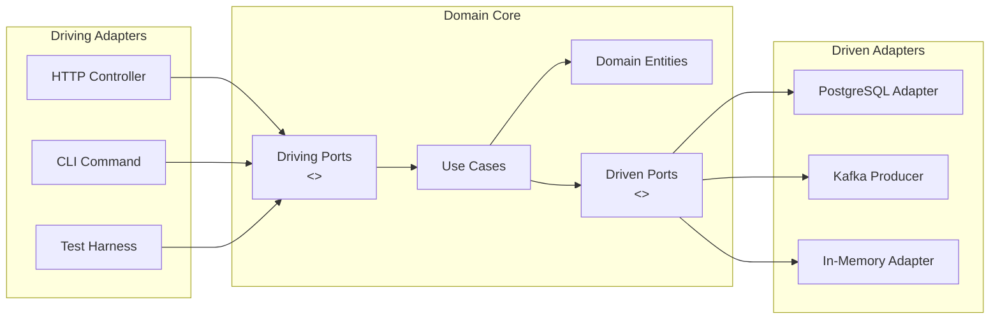

# [BEE-103] Hexagonal Architecture

:::info
Ports and Adapters -- dependency inversion for testable, swappable infrastructure.
:::

## Context

Backend systems accumulate coupling between business logic and infrastructure over time. A service that started with a single PostgreSQL database ends up with SQL queries scattered through domain code. Switching to a different data store, adding a GraphQL layer alongside REST, or running fast unit tests without spinning up a real database all become harder than they should be.

Hexagonal Architecture -- also called the **Ports and Adapters** pattern -- was defined by Alistair Cockburn in 2005 as a structural approach to eliminate this coupling. The pattern was later popularized in large-scale systems; Netflix adopted it explicitly to swap data sources without touching business logic, achieving migrations (JSON API to GraphQL) in hours rather than weeks.

The core insight: **the application exists to implement business rules**. Everything else -- HTTP, databases, message queues, CLI -- is infrastructure. Hexagonal Architecture makes the boundary between the two explicit and enforced.

## Principle

**The domain core depends on nothing. Infrastructure depends on the domain.**

This is dependency inversion applied architecturally. The domain defines abstract interfaces (ports) for everything it needs from the outside world. Infrastructure provides concrete implementations (adapters) of those interfaces. The domain never imports a database library, an HTTP client, or a message queue SDK.

### Structure

```
         [ Driving Adapters ]         [ Driven Adapters ]
         HTTP Controller              PostgreSQL Repository
         CLI Command           ←→     Redis Cache
         Message Consumer      CORE   External API Client
         Test Harness                 In-Memory Repository (test)
                 ↓                           ↑
         [ Driving Ports ]           [ Driven Ports ]
         (input interfaces)          (output interfaces)
```

- **Domain Core** -- business logic, domain entities, use cases. Has zero infrastructure imports.
- **Ports** -- interfaces defined by the domain that describe what the core needs (driven ports) or how the core is invoked (driving ports).
- **Adapters** -- concrete implementations that translate between the domain's language and a specific technology.

### Driving (Primary) Adapters

Driving adapters call into the domain. They translate external input into domain operations.

- HTTP controllers (REST, GraphQL)
- CLI command handlers
- Message queue consumers
- Scheduled job runners
- Test harnesses

### Driven (Secondary) Adapters

Driven adapters are called by the domain. They fulfill the domain's output needs.

- Database repositories (PostgreSQL, MongoDB)
- External API clients (payment gateways, third-party services)
- Message producers (Kafka, SQS)
- Email / notification senders
- In-memory stores for testing

## Diagram



All arrows inside the domain core point inward. Adapters on both sides implement or call interfaces defined by the domain, never the reverse.

## Example: Order Service

### Domain defines the port (interface)

```typescript
// domain/ports/OrderRepository.ts
// Pure interface -- no imports from any DB library

export interface OrderRepository {
  findById(id: OrderId): Promise<Order | null>;
  save(order: Order): Promise<void>;
  findPendingOrders(): Promise<Order[]>;
}
```

```typescript
// domain/usecases/PlaceOrder.ts
// Depends only on the interface, never on PostgreSQL or any adapter

import { OrderRepository } from '../ports/OrderRepository';
import { Order } from '../entities/Order';

export class PlaceOrder {
  constructor(private readonly orders: OrderRepository) {}

  async execute(customerId: string, items: OrderItem[]): Promise<Order> {
    const order = Order.create(customerId, items);
    order.validate(); // pure domain logic
    await this.orders.save(order);
    return order;
  }
}
```

### Production adapter: PostgreSQL

```typescript
// infrastructure/adapters/PostgresOrderRepository.ts
import { Pool } from 'pg';
import { OrderRepository } from '../../domain/ports/OrderRepository';
import { Order } from '../../domain/entities/Order';

export class PostgresOrderRepository implements OrderRepository {
  constructor(private readonly pool: Pool) {}

  async findById(id: OrderId): Promise<Order | null> {
    const result = await this.pool.query(
      'SELECT * FROM orders WHERE id = $1',
      [id.value]
    );
    return result.rows[0] ? Order.fromRow(result.rows[0]) : null;
  }

  async save(order: Order): Promise<void> {
    await this.pool.query(
      'INSERT INTO orders (id, customer_id, status, items) VALUES ($1, $2, $3, $4) ON CONFLICT (id) DO UPDATE ...',
      [order.id.value, order.customerId, order.status, JSON.stringify(order.items)]
    );
  }

  async findPendingOrders(): Promise<Order[]> {
    const result = await this.pool.query(
      "SELECT * FROM orders WHERE status = 'PENDING'"
    );
    return result.rows.map(Order.fromRow);
  }
}
```

### Test adapter: in-memory store

```typescript
// infrastructure/adapters/InMemoryOrderRepository.ts
import { OrderRepository } from '../../domain/ports/OrderRepository';
import { Order } from '../../domain/entities/Order';

export class InMemoryOrderRepository implements OrderRepository {
  private readonly store = new Map<string, Order>();

  async findById(id: OrderId): Promise<Order | null> {
    return this.store.get(id.value) ?? null;
  }

  async save(order: Order): Promise<void> {
    this.store.set(order.id.value, order);
  }

  async findPendingOrders(): Promise<Order[]> {
    return [...this.store.values()].filter(o => o.status === 'PENDING');
  }
}
```

### The same domain use case works with both

```typescript
// Unit test -- no database, no network, runs in milliseconds
describe('PlaceOrder', () => {
  it('saves a valid order', async () => {
    const repo = new InMemoryOrderRepository();
    const useCase = new PlaceOrder(repo);

    const order = await useCase.execute('customer-1', [
      { productId: 'prod-1', quantity: 2 }
    ]);

    expect(order.status).toBe('PENDING');
    expect(await repo.findById(order.id)).not.toBeNull();
  });
});

// Integration test -- swap in the real adapter
describe('PlaceOrder (integration)', () => {
  it('persists to PostgreSQL', async () => {
    const repo = new PostgresOrderRepository(testPool);
    const useCase = new PlaceOrder(repo);
    // identical test body -- same use case, different adapter
  });
});
```

The domain code is identical in both tests. Swapping adapters is a one-line dependency injection change.

## Common Mistakes

### 1. Domain depending on infrastructure

The most common violation: importing a database library or HTTP client directly in domain code.

```typescript
// WRONG -- domain imports a DB library
import { DataSource } from 'typeorm';

export class PlaceOrder {
  constructor(private readonly dataSource: DataSource) {} // infrastructure leaking in
}
```

```typescript
// CORRECT -- domain depends only on the interface it defined
export class PlaceOrder {
  constructor(private readonly orders: OrderRepository) {} // port defined by the domain
}
```

### 2. Leaking infrastructure concerns into ports

Ports must speak the domain's language. SQL types, HTTP status codes, ORM entities -- none of these belong in a port interface.

```typescript
// WRONG -- port uses SQL/ORM types
export interface OrderRepository {
  findById(id: string): Promise<TypeORMOrder>; // TypeORMOrder is infrastructure
  query(sql: string): Promise<any>;            // raw SQL in an interface
}

// CORRECT -- port uses domain types only
export interface OrderRepository {
  findById(id: OrderId): Promise<Order | null>;
}
```

### 3. Too many ports (over-abstracting simple operations)

Not every external dependency needs its own port. Creating a port for `Math.random()` or trivial value lookups adds ceremony without benefit. Ports are valuable when the technology behind them is likely to change, when testability requires a swap, or when multiple adapters will exist.

### 4. Adapters containing business logic

Adapters translate -- they do not decide. Business rules that end up in an HTTP controller or a database adapter cannot be tested without infrastructure and cannot be reused.

```typescript
// WRONG -- business logic in adapter
export class HttpOrderController {
  async placeOrder(req: Request): Promise<Response> {
    const items = req.body.items;
    if (items.length === 0) throw new Error('No items'); // domain rule in adapter
    const order = await this.orderRepo.save(new Order(items));
    // ...
  }
}

// CORRECT -- adapter delegates immediately to use case
export class HttpOrderController {
  async placeOrder(req: Request): Promise<Response> {
    const result = await this.placeOrder.execute(req.body.customerId, req.body.items);
    return { status: 201, body: result.toDTO() };
  }
}
```

### 5. Confusing hexagonal with layered architecture

Layered architecture (presentation → business → data) still allows upward dependencies and does not enforce that infrastructure imports flow toward the domain. Hexagonal Architecture is specifically about **dependency direction**: all infrastructure depends on the domain, never the other way around. The hexagon is not another name for "three layers."

## Relationship to Other Patterns

Hexagonal Architecture belongs to a family of patterns that share the same dependency rule: domain in the center, infrastructure on the outside.

- **Clean Architecture** (Robert C. Martin) -- formalizes the same idea with concentric rings (Entities, Use Cases, Interface Adapters, Frameworks & Drivers). The Dependency Rule is identical.
- **Onion Architecture** (Jeffrey Palermo) -- similar concentric model with explicit layers for domain model, domain services, application services, and infrastructure.
- **DDD** (see [BEE-5002](domain-driven-design-essentials.md)) -- hexagonal architecture is a natural structural complement to DDD. Domain aggregates, entities, and value objects live in the core; repositories are driven ports.
- **CQRS** (see [BEE-5002](domain-driven-design-essentials.md)) -- command and query handlers are use cases in the domain core; read model adapters and write adapters are driven adapters.

The key difference between these patterns and classic layered architecture: **the infrastructure layer has no special privilege**. It sits on the outside and depends inward, regardless of whether it is a database, a web server, or an event bus.

## References

- [Hexagonal Architecture -- Alistair Cockburn (original 2005 article)](https://alistair.cockburn.us/hexagonal-architecture/)
- [Ready for Changes with Hexagonal Architecture -- Netflix TechBlog](https://netflixtechblog.com/ready-for-changes-with-hexagonal-architecture-b315ec967749)
- [Hexagonal Architecture (software) -- Wikipedia](https://en.wikipedia.org/wiki/Hexagonal_architecture_(software))
- [AWS Prescriptive Guidance -- Hexagonal Architecture Pattern](https://docs.aws.amazon.com/prescriptive-guidance/latest/cloud-design-patterns/hexagonal-architecture.html)
- [BEE-5001](monolith-vs-microservices-vs-modular-monolith.md): Architecture Patterns Overview
- [BEE-5002](domain-driven-design-essentials.md): Domain-Driven Design
- [BEE-5002](domain-driven-design-essentials.md): CQRS
- [BEE-15002](../testing/integration-testing-for-backend-services.md): Test Doubles
