# [BEE-5007] Serverless Architecture Patterns

:::info
Serverless architecture shifts operational responsibility for provisioning, scaling, and infrastructure management to the cloud provider. Developers deploy code in response to discrete events; the platform handles everything else — including scaling to zero when idle.
:::

## Context

Traditional server deployment requires engineers to provision capacity, configure auto-scaling, manage operating system patches, and plan for peak load. Even containerized services require a running process between requests. This baseline operational cost accumulates across hundreds of microservices.

Two distinct serverless models exist. **Function-as-a-Service (FaaS)** — AWS Lambda (2014), Google Cloud Functions (2016), Azure Functions (2016) — runs individual functions in ephemeral execution environments triggered by events. **Backend-as-a-Service (BaaS)** — Firebase, DynamoDB, Auth0 — replaces entire server components with fully managed APIs consumed directly by clients.

FaaS gained traction for event-driven backends: an S3 upload triggers an image resizer; an SQS message triggers an order processor; an HTTP request through API Gateway triggers a REST handler. The billing model (pay per 100ms of execution, not per idle server) made sporadic workloads economically attractive. AWS Lambda's free tier covers 1 million requests and 400,000 GB-seconds per month.

The serverless model carries a foundational constraint: the **cold start problem**. When a function has not been invoked recently — or when concurrency spikes beyond the pool of warm instances — the platform must provision a new execution environment: download the code package, start a microVM (AWS uses Firecracker), initialize the language runtime, and execute initialization code. This adds latency ranging from under 1 ms (Go, Rust) to 4–7 seconds (JVM without optimization). Martin Fowler's 2018 analysis on martinfowler.com identified cold start latency and vendor lock-in as the two primary constraints on serverless adoption.

## Design Thinking

### FaaS Execution Model

Each function invocation runs in an isolated, stateless, ephemeral execution environment. The environment may be reused for subsequent invocations on the same instance ("warm start") or discarded after a period of inactivity. Functions must not store state in local memory between invocations — any persistent state goes to external storage: DynamoDB, S3, Redis, a relational database.

The handler signature is standardized per provider but follows the same pattern:

```python
# AWS Lambda handler — called once per invocation
def lambda_handler(event: dict, context) -> dict:
    # event: varies by trigger (API Gateway, SQS, S3, DynamoDB Streams, etc.)
    # context: invocation metadata (function_name, aws_request_id, get_remaining_time_in_millis)
    return {"statusCode": 200, "body": "ok"}
```

Initialization code outside the handler (database connections, SDK clients, cached configuration) runs once per execution environment and is reused across warm invocations — a critical optimization pattern.

```python
import boto3

# Module-level initialization: runs once per cold start, reused on warm invocations
dynamodb = boto3.resource("dynamodb")
table = dynamodb.Table("orders")

def lambda_handler(event, context):
    # dynamodb and table are already initialized — no per-invocation overhead
    response = table.get_item(Key={"order_id": event["pathParameters"]["id"]})
    return {"statusCode": 200, "body": json.dumps(response.get("Item"))}
```

### Key Patterns

**HTTP API (API Gateway + Lambda)**: API Gateway routes HTTP requests to Lambda. The default 29-second API Gateway timeout limits Lambda execution to ~28 seconds for synchronous responses. Suitable for CRUD operations, lightweight compute, and event fan-out endpoints.

**Fan-out / Fan-in (SNS + SQS + Lambda)**: A single SNS topic publishes to multiple SQS queues, each triggering a specialized Lambda function for parallel processing. A fan-in Lambda aggregates results from intermediate storage (S3, DynamoDB). This replaces a single monolithic batch job with parallel, independently scalable workers.

**Workflow orchestration (Step Functions)**: AWS Step Functions coordinates sequences of Lambda invocations with branching, retries, and error handling defined in a state machine. Suitable for long-running business processes (order fulfillment, data pipelines) where 15-minute per-function limits would otherwise apply.

**Event routing (EventBridge)**: EventBridge routes events from AWS services, third-party SaaS, and custom sources to targets (Lambda, SQS, Step Functions) based on content-based rules. Decouples event producers from consumers without SNS/SQS configuration.

### Cold Start Mitigation

| Strategy | Mechanism | Tradeoff |
|---|---|---|
| **Language choice** | Go/Rust: <1 ms; Node.js/Python: 200 ms; Java: 4–7 s cold | Runtime ecosystem constraints |
| **SnapStart (Lambda Java/Python/.NET)** | Snapshot post-init state; restore on invocation. Java 21: 4–7 s → 90–140 ms | Requires stateless initialization; PRNG re-seeding needed |
| **Provisioned Concurrency** | Pre-initializes N environments; eliminates cold starts for provisioned capacity | Cost per pre-warmed instance-hour |
| **Minimum Instances (GCP)** | Keeps N Cloud Run instances alive; idle instances billed at reduced rate | Minimum idle cost |
| **Package size reduction** | Smaller packages download faster; tree-shake dependencies, use layers | Build complexity |

## Visual

```mermaid
flowchart TD
    subgraph "Synchronous Pattern"
        CLIENT["Client"]:::user
        APIGW["API Gateway\n(HTTP trigger)"]:::gateway
        FN1["Lambda\n(handler)"]:::fn
        DB["DynamoDB /\nRDS Proxy"]:::store
        CLIENT -->|"HTTP request"| APIGW
        APIGW -->|"event"| FN1
        FN1 -->|"read / write"| DB
        FN1 -->|"HTTP response"| APIGW
    end

    subgraph "Async Fan-Out Pattern"
        SRC["Event Source\n(S3 / API / Scheduler)"]:::user
        SNS["SNS Topic"]:::gateway
        SQS1["SQS Queue A"]:::queue
        SQS2["SQS Queue B"]:::queue
        FN2["Lambda Worker A"]:::fn
        FN3["Lambda Worker B"]:::fn
        AGG["Aggregator Lambda\n(fan-in)"]:::fn
        S3["S3 / DynamoDB\n(intermediate results)"]:::store
        SRC -->|"publish"| SNS
        SNS -->|"fan-out"| SQS1
        SNS -->|"fan-out"| SQS2
        SQS1 -->|"trigger"| FN2
        SQS2 -->|"trigger"| FN3
        FN2 -->|"write result"| S3
        FN3 -->|"write result"| S3
        S3 -->|"trigger"| AGG
    end

    style CLIENT fill:#3498db,color:#fff
    style APIGW fill:#8e44ad,color:#fff
    style FN1 fill:#e67e22,color:#fff
    style DB fill:#27ae60,color:#fff
    style SRC fill:#3498db,color:#fff
    style SNS fill:#8e44ad,color:#fff
    style SQS1 fill:#8e44ad,color:#fff
    style SQS2 fill:#8e44ad,color:#fff
    style FN2 fill:#e67e22,color:#fff
    style FN3 fill:#e67e22,color:#fff
    style AGG fill:#e67e22,color:#fff
    style S3 fill:#27ae60,color:#fff
```



## Example

**SQS-triggered Lambda with idempotency and dead-letter handling:**

```python
import json
import os
import boto3
from aws_lambda_powertools import Logger, Tracer
from aws_lambda_powertools.utilities.idempotency import (
    DynamoDBPersistenceLayer, idempotent_function, IdempotencyConfig
)

logger = Logger()
tracer = Tracer()

# Module-level: initialized once per cold start, reused across warm invocations
dynamodb = boto3.resource("dynamodb")
persistence_layer = DynamoDBPersistenceLayer(table_name=os.environ["IDEMPOTENCY_TABLE"])
idempotency_config = IdempotencyConfig(event_key_jmespath="messageId")

@tracer.capture_lambda_handler
@logger.inject_lambda_context
def lambda_handler(event: dict, context) -> dict:
    processed = []
    failed = []

    for record in event["Records"]:
        message_id = record["messageId"]
        try:
            body = json.loads(record["body"])
            process_order(body, message_id)
            processed.append(message_id)
        except Exception as exc:
            logger.error("Failed to process record", message_id=message_id, error=str(exc))
            # Returning this record in batchItemFailures sends it back to SQS
            # without failing the entire batch — unprocessed messages go to DLQ
            failed.append({"itemIdentifier": message_id})

    return {"batchItemFailures": failed}

@idempotent_function(
    data_keyword_argument="order",
    config=idempotency_config,
    persistence_store=persistence_layer,
)
def process_order(order: dict, message_id: str) -> None:
    # Idempotency layer prevents duplicate processing if Lambda retries the message
    logger.info("Processing order", order_id=order["id"])
    # ... business logic ...
```

**Provisioned concurrency configuration (AWS SAM template):**

```yaml
# template.yaml — SAM template for a latency-sensitive API Lambda
Resources:
  OrderHandler:
    Type: AWS::Serverless::Function
    Properties:
      Handler: handler.lambda_handler
      Runtime: python3.12
      MemorySize: 512           # 512 MB memory → proportional CPU allocation
      Timeout: 29               # API Gateway hard limit is 29s
      AutoPublishAlias: live    # Creates a versioned alias for provisioned concurrency
      ProvisionedConcurrencyConfig:
        ProvisionedConcurrentExecutions: 10   # Keep 10 environments pre-initialized
      Environment:
        Variables:
          IDEMPOTENCY_TABLE: !Ref IdempotencyTable
      Events:
        Api:
          Type: Api
          Properties:
            Path: /orders/{id}
            Method: GET
```

**Step Functions state machine for order fulfillment (excerpt):**

```json
{
  "Comment": "Order fulfillment workflow — coordinates validate, charge, ship",
  "StartAt": "ValidateOrder",
  "States": {
    "ValidateOrder": {
      "Type": "Task",
      "Resource": "arn:aws:lambda:us-east-1:123456789012:function:validate-order",
      "Retry": [{"ErrorEquals": ["Lambda.ServiceException"], "MaxAttempts": 3, "BackoffRate": 2}],
      "Catch": [{"ErrorEquals": ["ValidationError"], "Next": "OrderRejected"}],
      "Next": "ChargePayment"
    },
    "ChargePayment": {
      "Type": "Task",
      "Resource": "arn:aws:lambda:us-east-1:123456789012:function:charge-payment",
      "Catch": [{"ErrorEquals": ["PaymentDeclined"], "Next": "CancelOrder"}],
      "Next": "ShipOrder"
    },
    "ShipOrder": {
      "Type": "Task",
      "Resource": "arn:aws:lambda:us-east-1:123456789012:function:ship-order",
      "End": true
    },
    "OrderRejected": {"Type": "Fail", "Error": "ValidationError"},
    "CancelOrder": {"Type": "Task", "Resource": "arn:aws:lambda:us-east-1:123456789012:function:cancel-order", "End": true}
  }
}
```

## Implementation Notes

**When serverless fits and when it does not**: Serverless excels for event-driven processing (file uploads, queue consumers, webhooks), sporadic workloads with unpredictable traffic, and glue code between managed services. It is a poor fit for: latency-sensitive paths where cold starts are unacceptable and provisioned concurrency cost exceeds a running container; long-running jobs exceeding the 15-minute Lambda limit; workloads requiring persistent TCP connections (WebSocket servers, streaming); and high-sustained-throughput services where per-invocation billing exceeds a fixed-price container.

**Statelessness discipline**: Functions that store state in local variables between invocations appear to work during warm invocations but silently corrupt state when scaled across multiple instances. All shared state must go to external storage. This is the single most common serverless bug in teams migrating from stateful servers.

**Observability requires instrumentation**: Distributed tracing across async chains (API Gateway → Lambda → SQS → Lambda → DynamoDB) does not happen automatically. AWS X-Ray, OpenTelemetry, or provider-specific APM tools require explicit instrumentation. AWS Lambda Powertools (Python, Java, TypeScript) provides structured logging, X-Ray tracing, and metrics with minimal boilerplate.

**Local testing strategy**: AWS SAM CLI (`sam local invoke`, `sam local start-api`) emulates the Lambda runtime locally but does not emulate API Gateway authorizers, IAM policies, or service integrations. LocalStack provides a fuller local emulation of AWS services for integration tests. Unit tests that mock the event and context objects test business logic without requiring any AWS infrastructure.

**Cost model awareness**: Serverless billing is favorable for workloads averaging under ~20% utilization. Above that threshold, a continuously running container (ECS Fargate, App Runner) typically costs less. High-memory functions (1 GB+) at sustained throughput can exceed the cost of a dedicated instance. Run cost projections before committing to serverless for high-traffic services.

## Related BEEs

- [BEE-13006](../performance-scalability/asynchronous-processing-and-work-queues.md) -- Asynchronous Processing and Work Queues: the SQS-triggered Lambda pattern is a serverless implementation of the worker queue model
- [BEE-8004](../transactions/saga-pattern.md) -- Saga Pattern: Step Functions state machines implement the saga pattern for long-running distributed transactions
- [BEE-8005](../transactions/idempotency-and-exactly-once-semantics.md) -- Idempotency and Exactly-Once Semantics: Lambda retries on failure make idempotent handlers mandatory
- [BEE-12001](../resilience/circuit-breaker-pattern.md) -- Circuit Breaker Pattern: downstream dependencies called from Lambda still require circuit breakers; the serverless boundary does not eliminate cascading failure risk
- [BEE-19056](../distributed-systems/opentelemetry-instrumentation.md) -- OpenTelemetry Instrumentation: distributed tracing across Lambda invocation chains requires explicit trace context propagation

## References

- [Serverless Architectures — Martin Fowler (2018)](https://martinfowler.com/articles/serverless.html)
- [AWS Lambda Developer Guide — AWS Documentation](https://docs.aws.amazon.com/lambda/latest/dg/welcome.html)
- [AWS Lambda SnapStart — AWS Documentation](https://docs.aws.amazon.com/lambda/latest/dg/snapstart.html)
- [AWS Lambda Provisioned Concurrency — AWS Documentation](https://docs.aws.amazon.com/lambda/latest/dg/provisioned-concurrency.html)
- [Cloud Functions 2nd Generation Overview — Google Cloud](https://cloud.google.com/functions/docs/2nd-gen/overview)
- [Azure Functions Premium Plan — Microsoft Learn](https://learn.microsoft.com/en-us/azure/azure-functions/functions-premium-plan)
- [CNCF Serverless Working Group — GitHub](https://github.com/cncf/wg-serverless)
- [Lambda Cold Start Benchmarks — maxday.github.io/lambda-perf](https://maxday.github.io/lambda-perf/)
