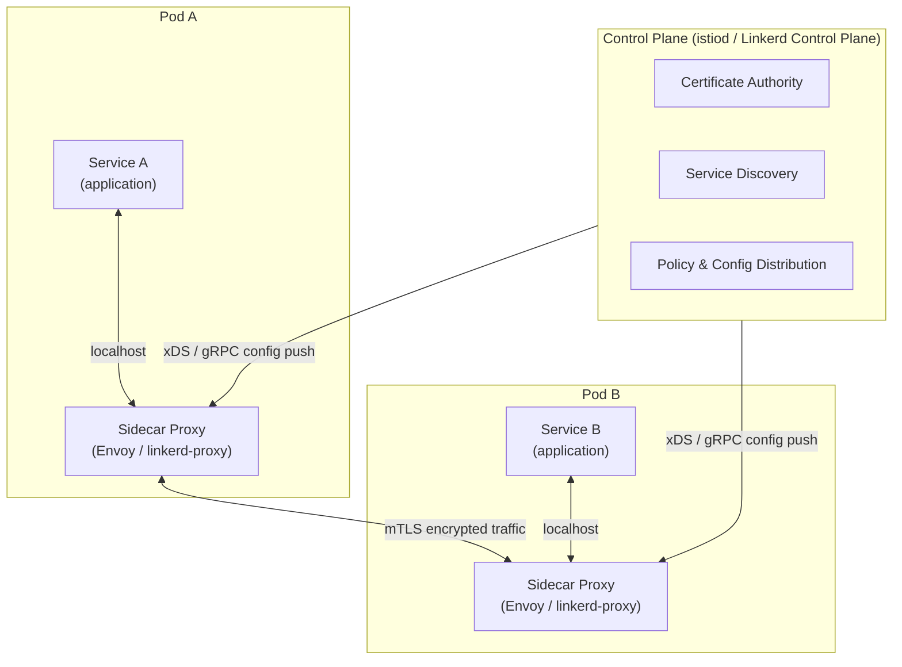

# [BEE-5006] Sidecar and Service Mesh Concepts

:::info
Cross-cutting concerns without polluting application code.
:::

## Context

As distributed systems grow from a handful of services to dozens or hundreds, a new class of problems emerges: every service needs retries, timeouts, circuit breaking, mutual TLS, distributed tracing, and load balancing. Implementing all of that inside each service — in every language your teams use — creates duplicated effort, inconsistent behavior, and a tight coupling between business logic and infrastructure concerns.

The **sidecar pattern** and **service mesh** are two related solutions to this problem. They move cross-cutting network concerns out of application code and into a dedicated infrastructure layer.

## Principle

Deploy a co-located proxy process (sidecar) alongside each service instance to handle network cross-cutting concerns, and use a centralized control plane to configure all sidecars uniformly. Keep application code focused solely on business logic.

## The Sidecar Pattern

A sidecar is a separate process or container deployed alongside the main application container, sharing its network namespace and lifecycle. The term comes from a motorcycle sidecar: the main application is the motorcycle, the sidecar rides beside it and extends its capabilities without modifying it.

Key properties:
- **Co-location**: The sidecar runs in the same pod (Kubernetes) or on the same host, so network calls between them stay local.
- **Transparent interception**: All inbound and outbound traffic passes through the sidecar via iptables rules or equivalent mechanisms. The application is unaware.
- **Language independence**: One sidecar implementation serves services written in Go, Java, Python, Node.js — no per-language library needed.
- **Lifecycle coupling**: The sidecar starts and stops with the application it serves.

Microsoft's Azure Architecture Center describes the pattern as: *"Deploy application components into a separate process or container to provide isolation and encapsulation."* ([Sidecar pattern – Azure Architecture Center](https://learn.microsoft.com/en-us/azure/architecture/patterns/sidecar))

## What is a Service Mesh?

A service mesh is a dedicated infrastructure layer for service-to-service communication. The CNCF defines it as the solution to: *"How do I observe, control, or secure communication between services?"* It intercepts traffic going into and out of containers and enforces policy uniformly across all services. ([CNCF Service Mesh Glossary](https://glossary.cncf.io/service-mesh/))

A service mesh is composed of two logical planes:

### Data Plane

The data plane is the set of sidecar proxies running next to every service instance. Each proxy:
- Intercepts all inbound and outbound traffic for its application
- Enforces routing rules, retries, timeouts, and circuit breaking
- Terminates and originates mTLS connections
- Emits metrics, logs, and traces

Istio uses Envoy as its data plane proxy — an extended, high-performance proxy written in C++. Linkerd uses its own Rust-based micro-proxy, purpose-built to be lightweight. ([Istio Architecture](https://istio.io/latest/docs/ops/deployment/architecture/), [Linkerd Overview](https://linkerd.io/2-edge/overview/))

### Control Plane

The control plane manages and configures all sidecar proxies. It does not sit in the data path. Its responsibilities:
- **Service discovery**: Maintains the registry of available service endpoints
- **Configuration distribution**: Converts high-level policies into proxy-specific configuration and pushes updates to all sidecars
- **Certificate management**: Acts as a Certificate Authority, issuing and rotating mTLS certificates
- **Policy enforcement**: Distributes authorization and traffic management rules

In Istio, the entire control plane is a single binary called **istiod**. In Linkerd, these functions are split across the Destination, Identity, and Proxy Injector components.

## Service Mesh Architecture



Traffic flow: Service A makes an HTTP call to Service B. The iptables rules in Pod A redirect the outbound packet to the local sidecar proxy. The sidecar applies load balancing, adds retry logic, encrypts with mTLS, and forwards to Pod B's sidecar. The Pod B sidecar terminates mTLS, applies inbound policy, and delivers the request to Service B on localhost.

## What a Service Mesh Provides

| Capability | Mechanism |
|---|---|
| Mutual TLS (mTLS) | Sidecars handle certificate exchange; apps need no TLS code |
| Load balancing | Data plane distributes traffic across healthy endpoints |
| Retries and timeouts | Configured in mesh policy, applied by sidecar automatically |
| Circuit breaking | Sidecar tracks failure rates and opens circuits per policy |
| Traffic management | Weighted routing, canary deployments, traffic mirroring |
| Distributed tracing | Sidecar injects and propagates trace headers |
| Metrics | RED metrics (Rate, Error, Duration) emitted per-service automatically |

## Before and After: The Concrete Difference

### Without a service mesh — each service owns its own cross-cutting logic

```python
# order_service.py — business logic buried under infrastructure concerns
import httpx
from tenacity import retry, stop_after_attempt, wait_exponential
from circuitbreaker import circuit
import ssl

# mTLS setup — every service must manage its own certificates
ssl_ctx = ssl.create_default_context(ssl.Purpose.CLIENT_AUTH)
ssl_ctx.load_cert_chain("certs/order-service.crt", "certs/order-service.key")
ssl_ctx.load_verify_locations("certs/ca.crt")

@circuit(failure_threshold=5, recovery_timeout=30)
@retry(stop=stop_after_attempt(3), wait=wait_exponential(multiplier=1, min=1, max=4))
def get_inventory(product_id: str) -> dict:
    # Tracing headers manually propagated
    response = httpx.get(
        f"https://inventory-service/products/{product_id}",
        verify=ssl_ctx,
        headers={"x-b3-traceid": current_trace_id(), "x-b3-spanid": new_span_id()},
        timeout=2.0,
    )
    response.raise_for_status()
    return response.json()
```

Every service — in every language — reimplements this. When retry policy changes, you update every service.

### With a service mesh — application code is clean

```python
# order_service.py — only business logic remains
import httpx

def get_inventory(product_id: str) -> dict:
    # Plain HTTP; sidecar handles mTLS, retries, circuit breaking, and tracing
    response = httpx.get(f"http://inventory-service/products/{product_id}")
    response.raise_for_status()
    return response.json()
```

```yaml
# mesh policy — applied to all instances uniformly via control plane
apiVersion: networking.istio.io/v1alpha3
kind: VirtualService
metadata:
  name: inventory-service
spec:
  hosts:
    - inventory-service
  http:
    - retries:
        attempts: 3
        perTryTimeout: 2s
        retryOn: 5xx,connect-failure
      timeout: 10s
```

The retry policy is now a single YAML declaration. Changing it once propagates to all services instantly.

## Sidecarless / Proxyless Approaches

The traditional sidecar model carries real resource cost. Newer approaches address this:

- **Istio Ambient Mesh**: Replaces per-pod Envoy sidecars with node-level **ztunnels** (Layer 4) and optional per-namespace **waypoints** (Layer 7). Research shows Ambient Mesh adds only ~8% latency at 3,200 RPS versus 166% for the full sidecar model.
- **eBPF-based meshes** (Cilium): Move data plane logic into the Linux kernel using eBPF programs, eliminating the proxy process entirely.
- **gRPC proxyless**: gRPC's xDS support lets services communicate directly with the control plane, removing the sidecar hop for gRPC-native workloads.

These are production options as of 2024–2025 but add operational complexity. Evaluate against your team's familiarity.

## Resource Overhead: The Real Numbers

Based on Istio 1.24 benchmarks and independent research:

| Metric | Typical Sidecar (Envoy/Istio) | Linkerd Micro-proxy | Istio Ambient (ztunnel) |
|---|---|---|---|
| Memory per pod | 50–200 MB | 20–100 MB | Shared node-level |
| CPU at 1,000 RPS | ~0.20 vCPU | Lower | Much lower |
| Added latency | 2–5 ms per hop | ~1 ms | ~0.5 ms |

At 100 pods, sidecars alone may consume 2–20 GB of RAM cluster-wide. At 1,000 pods, that is 20–200 GB. Factor this into capacity planning before adopting.

([Istio Performance and Scalability](https://istio.io/latest/docs/ops/deployment/performance-and-scalability/))

## When You Need a Service Mesh

A service mesh starts paying dividends when:

- You operate **20+ services** across multiple teams with inconsistent cross-cutting implementations.
- You have **strict zero-trust security requirements**: mTLS everywhere, automated certificate rotation, per-service authorization policies.
- You need **fine-grained traffic control**: canary deployments, traffic mirroring, weighted routing between versions.
- You require **uniform observability** without instrumenting every service individually.
- Your org is moving to Kubernetes at scale and needs a platform-level reliability layer.

## When You Do Not Need a Service Mesh

Do not adopt a service mesh prematurely when:

- You have **3–10 services** — the operational overhead (learning curve, YAML sprawl, debugging complexity) exceeds the benefit.
- Your team has **no prior Kubernetes/Envoy operational experience** — a misconfigured mesh can silently drop traffic or break mTLS negotiation.
- Your **performance budget is tight** — the added latency and sidecar memory tax may not be acceptable.
- A **simpler alternative exists**: a well-configured API gateway, a shared library, or a reverse proxy (see [BEE-3](../bee-overall/glossary.md)5) may solve the problem at a fraction of the cost.

## Common Mistakes

**1. Adopting a service mesh with only 3–5 services.**
The mesh adds an entirely new operational surface (control plane, certificate authority, proxy config). With few services and a simple topology, the overhead — in engineering time and compute cost — is almost never justified.

**2. Ignoring sidecar resource overhead.**
Each sidecar is a full proxy process. At 50–200 MB per pod for Envoy-based sidecars, a 200-pod cluster needs gigabytes of RAM that produce no business value. Always benchmark overhead against your cluster's capacity and cost model.

**3. Treating the mesh as a security silver bullet.**
mTLS proves that Service A is talking to Service B. It does not prove that the request is authorized. You still need application-level authorization (RBAC, JWT validation, business rules). [BEE-3004](../networking-fundamentals/tls-ssl-handshake.md) covers mTLS; do not conflate transport security with application security.

**4. Underestimating latency added by the sidecar.**
Every service call passes through two proxies (client sidecar + server sidecar). At 2–5 ms per hop, a request chain with 5 hops adds 10–25 ms of pure proxy overhead. For latency-sensitive paths, profile before and after.

**5. Complex mesh configuration without adequate observability.**
VirtualServices, DestinationRules, and AuthorizationPolicies interact. A misconfiguration can silently affect traffic. Before rolling out advanced mesh features, ensure you have distributed tracing (BEE-14002) and metrics dashboards in place so misconfigurations surface quickly.

## Related BEPs

- [BEE-3004 — Mutual TLS (mTLS)](53.md): The security foundation the sidecar enforces
- [BEE-3006 — Reverse Proxy Patterns](55.md): Simpler alternative for smaller deployments
- [BEE-5001 — Microservices Architecture](100.md): The context in which service meshes become necessary
- [BEE-12001 — Circuit Breaker Pattern](260.md): Reliability pattern the mesh automates
- [BEE-14002 — Distributed Tracing](321.md): Observability that sidecars enable automatically

## References

- [CNCF Service Mesh Glossary](https://glossary.cncf.io/service-mesh/)
- [Istio Architecture](https://istio.io/latest/docs/ops/deployment/architecture/)
- [Istio Sidecar or Ambient?](https://istio.io/latest/docs/overview/dataplane-modes/)
- [Istio Performance and Scalability](https://istio.io/latest/docs/ops/deployment/performance-and-scalability/)
- [Linkerd Overview](https://linkerd.io/2-edge/overview/)
- [Sidecar Pattern – Azure Architecture Center](https://learn.microsoft.com/en-us/azure/architecture/patterns/sidecar)
- [Dissecting Overheads of Service Mesh Sidecars (SoCC 2023)](https://dl.acm.org/doi/10.1145/3620678.3624652)
