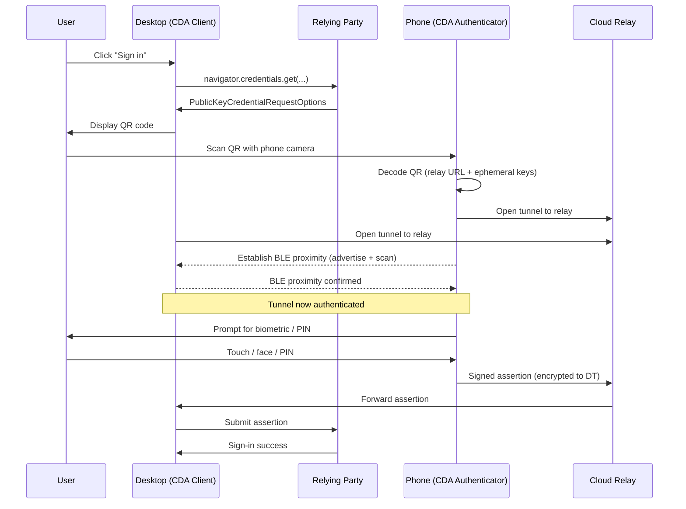

# [BEE-1009] Cross-Device Authentication (Hybrid Transport)

:::info
Hybrid transport lets a passkey on one device authenticate a sign-in on another. The desktop displays a QR code, the phone scans it, and a Bluetooth proximity check anchors the ceremony so a remote attacker cannot intercept it.
:::

## Context

A user wants to sign in to a relying party on a desktop they have never used before. They have a passkey on their phone but no passkey on this desktop. The pre-passkey solutions for this case all have known weaknesses:

- **TOTP / authenticator apps**: phishable. The user can be tricked into typing the code on a phishing site.
- **SMS one-time passwords**: phishable, plus vulnerable to SIM-swap attacks.
- **Push notifications to a mobile app**: defeats phishing only when the mobile app independently verifies the request origin, which most do not.

The FIDO Alliance answer is **Cross-Device Authentication (CDA)**, defined as the property where "a passkey from one device... [can] be used to sign in on another device" ([passkeys.dev terms](https://passkeys.dev/docs/reference/terms/)). The mechanism is **hybrid transport**: a Bluetooth Low Energy (BLE) proximity check combined with a cloud relay, specified in CTAP 2.2 §11.5.

## Principle

Hybrid transport **MUST** use BLE for proximity verification, not pure cloud relay. The desktop **MUST** display a QR code that encodes the relay endpoint and connection material; the phone **MUST** validate proximity over BLE before authorising the ceremony. Relying parties **MUST NOT** need to know hybrid is in use — the protocol is transparent at the WebAuthn API layer. Relying parties **SHOULD** offer hybrid by default and provide a non-passkey fallback (email magic link) for users without phones.

## The QR Dance

The end-to-end flow:

The CDA Client is "the device where the relying party is being actively accessed" — the desktop in this scenario. The CDA Authenticator is "the device generating the FIDO assertion" — the phone (passkeys.dev).

## Why BLE, Why Not Pure Cloud

The BLE proximity check is the anti-phishing anchor. Without it, a remote attacker who tricks the user into scanning a QR could complete the ceremony from anywhere on the internet. With it, the phone refuses to sign unless it can confirm via BLE that it is physically near a device matching the QR's connection material.

CTAP 2.2 §11.5 frames this as: physical proximity establishes a "trusted interaction" that prevents an attacker from "tricking a user's phone into authenticating to a malicious website if that phone requires Bluetooth proximity to the legitimate platform."

The cloud relay carries the encrypted protocol messages. Anyone on the relay path sees ciphertext; only the desktop and phone can decrypt. The relay is "intermediary services... when devices lack direct BLE connectivity," but BLE is still required for the proximity check itself.

## Limitations

Hybrid transport requires both devices to have working Bluetooth. It also requires recent operating system support:

- Android 9 (API level 28) or higher for the authenticator side ([Google Identity environments](https://developers.google.com/identity/passkeys/supported-environments)).
- Chrome on all platforms supports the CDA Client side.
- iOS 16+ for Chrome iOS as a passkey environment; iCloud Keychain handles the equivalent flow on Safari.

Failure modes:

- **Bluetooth disabled or unavailable**: ceremony fails before the proximity check; the user must enable Bluetooth or use a fallback path.
- **No relay reachability**: corporate networks that block the relay endpoints break hybrid transport for users on those networks.
- **Older OS versions**: ceremonies fail with no cross-device option; the user falls back to typing a password or using email magic link.

End-to-end ceremonies typically take a handful of seconds, dominated by the time the user takes to scan and approve.

## Comparison with Older Cross-Device Patterns

| Pattern | Phishing-resistant | Requires app install | Requires network | Requires proximity |
|---------|-------------------:|----------------------:|------------------:|-------------------:|
| Hybrid transport (passkey on phone) | yes | no (built into OS) | yes (relay) | yes (BLE) |
| Push notification (proprietary app) | depends on app | yes | yes | no |
| TOTP code (authenticator app) | no | yes | no | no |
| SMS OTP | no | no | yes (cellular) | no |
| Email magic link | no | no | yes | no |

The "requires proximity" column is the differentiator. Without proximity, a remote attacker who has fooled the user can complete the ceremony from anywhere. With proximity, the attack requires the attacker to also be in the same room.

## When to Offer Hybrid

Hybrid transport requires zero relying-party-side configuration. The relying party calls `navigator.credentials.get` exactly as in BEE-1007 and BEE-1008; the browser surfaces hybrid as one of the available authenticator options when no local passkey is available.

The relying party should:

- Always offer the conditional UI flow ([BEE-1008](passkeys-discoverable-credentials.md)) — that is the discovery path for users with a local synced passkey.
- Allow the explicit "use a passkey from another device" path so users without a local passkey can invoke hybrid manually.
- Provide an email-magic-link fallback for users in environments where hybrid is unavailable (Bluetooth disabled, blocked relay).
- After a successful hybrid sign-in, prompt the user to register a passkey on the desktop so future sign-ins on this device are local.

## Common Mistakes

- **Building a custom QR-based "scan to login" instead of using hybrid transport.** Custom QR flows lack the BLE proximity check and are phishable. Use the platform's hybrid transport via WebAuthn; do not roll your own.
- **Assuming hybrid replaces the need for desktop passkey enrollment.** Hybrid is the bootstrap for first-time sign-in on a new desktop. After bootstrap, prompt the user to register a desktop-local passkey so subsequent sign-ins skip the QR step.
- **Treating the absence of hybrid as a fatal error.** Bluetooth-disabled environments exist. Provide a fallback path; do not lock users out.
- **Surfacing hybrid options when a local passkey is available.** Conditional UI handles the local-passkey case. Showing both at once confuses users who do not understand the distinction.

## Related BEEs

- [BEE-1007](webauthn-fundamentals.md) WebAuthn Fundamentals -- the API the hybrid transport sits behind.
- [BEE-1008](passkeys-discoverable-credentials.md) Passkeys: Discoverable Credentials and UX Patterns -- hybrid is one of the fallback flows referenced there.
- [BEE-1011](migrating-from-passwords-to-passkeys.md) Migrating from Passwords to Passkeys -- hybrid is part of the recovery story for users without local passkeys.

## References

- FIDO Alliance. 2023. "Client to Authenticator Protocol (CTAP) 2.2", §11.5 Hybrid Transports. https://fidoalliance.org/specs/fido-v2.2-rd-20230321/fido-client-to-authenticator-protocol-v2.2-rd-20230321.html
- FIDO Alliance / passkeys.dev. "Cross-Device Authentication (CDA)" terminology. https://passkeys.dev/docs/reference/terms/
- Google Identity. "Passkey supported environments". https://developers.google.com/identity/passkeys/supported-environments
