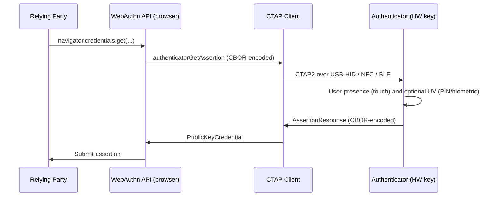

# [BEE-1010] FIDO2 Hardware Security Keys

:::info
Hardware security keys (YubiKey, SoloKey, Feitian, Token2) are roaming WebAuthn authenticators that hold credentials on dedicated tamper-resistant chips. Synced platform passkeys handle the consumer case; hardware keys are the answer where attestation, FIPS validation, or non-syncing storage matters.
:::

## Context

Synced platform passkeys ([BEE-1008](passkeys-discoverable-credentials.md)) cover the consumer authentication case well. They sync, they recover, they live behind biometrics on devices users already own. The cases they do not cover:

- **Regulated environments** that mandate FIPS-validated hardware (federal contractors, financial services, healthcare under specific HIPAA configurations).
- **Privileged accounts** where the relying party wants attestation enforcement — only credentials produced on an approved hardware model count.
- **Environments where sync providers are not trusted** — the user, the organization, or both prefer that the credential never leaves the chip on which it was generated.
- **Shared-workstation scenarios** where the user does not have a personal device but has a personal hardware key.

For these cases, the answer is a **roaming authenticator**: a dedicated hardware device speaking the FIDO2 [Client to Authenticator Protocol (CTAP) 2.1](https://fidoalliance.org/specs/fido-v2.1-ps-20210615/fido-client-to-authenticator-protocol-v2.1-ps-20210615.html) over USB, NFC, or BLE. This article covers where hardware keys fit alongside the passkey-default world established in BEE-1007 and BEE-1008.

## Principle

Relying parties **MAY** require a hardware authenticator via `attestation: "direct"` plus an AAGUID allowlist. Enterprises **SHOULD** enforce attestation for privileged accounts. Hardware keys for compliance-mandated flows **MUST** be issued via a managed enrollment process, not user-initiated, so attestation guarantees survive the registration ceremony. Relying parties **MUST NOT** conflate user presence (UP) with user verification (UV) — the protocol signals them as separate flags for a reason.

## The CTAP2 Protocol Layer

WebAuthn is the JavaScript API the relying party calls. CTAP2 is the wire protocol the client speaks to the authenticator. Three transports are defined per CTAP 2.1:

> "Both CTAP1 and CTAP2 share the same underlying transports: USB Human Interface Device (USB HID), Near Field Communication (NFC), and Bluetooth Smart / Bluetooth Low Energy Technology (BLE)."

The layered model:

CTAP2 messages use canonical CBOR encoding (per CTAP 2.1). Browsers and OS-level WebAuthn providers translate between the JSON-shaped WebAuthn API and the CBOR-shaped CTAP messages. Relying-party code never touches CTAP directly.

## Discoverable vs Non-Discoverable on Hardware Keys

A discoverable credential ([BEE-1008](passkeys-discoverable-credentials.md)) requires the authenticator to store the user handle and display name alongside the private key. Hardware keys have finite on-device storage, so the number of discoverable credentials per key is bounded. CTAP 2.1 acknowledges this constraint:

> "If authenticator does not have enough internal storage to persist the new credential, return CTAP2_ERR_KEY_STORE_FULL."

When a hardware key is full, registration fails with that error. The relying party should surface a helpful message ("Your security key has run out of space; remove an unused credential or use a key with more storage").

Non-discoverable credentials, by contrast, are unlimited in number. The credential ID itself encodes the encrypted private key (wrapped with a key-encryption-key stored on the device), so the device's persistent storage only holds the wrapping key. The credentials themselves travel with the credential ID. Non-discoverable credentials require the relying party to supply `allowCredentials` at authentication time (the credential ID is the lookup material).

For consumer flows where username-less sign-in is the goal, a hardware key with a synced passkey alternative makes sense. For compliance flows where storage is reset per user, non-discoverable credentials avoid the storage limit entirely.

## When to Require a Hardware Key

| Scenario | Require hardware? | Rationale |
|----------|-------------------:|-----------|
| Consumer authentication | no | Synced passkeys deliver phishing-resistance with no hardware procurement burden. |
| Privileged admin accounts (cloud root, prod database, KMS admin) | yes | Attestation enforcement gates the credential on approved hardware. |
| Code signing / CA root keys | yes | The private key must never be extractable; tamper-resistant hardware is the guarantee. |
| Compliance-mandated environments (FIPS, AAL3) | yes | NIST SP 800-63B §4.3.2: "Multi-factor authenticators used at AAL3 SHALL be hardware cryptographic modules validated at FIPS 140 Level 2 or higher overall with at least FIPS 140 Level 3 physical security." |
| High-value consumer accounts (finance, healthcare) | depends | Some users want hardware as a choice; relying party may offer it as an opt-in stronger tier. |

## Enterprise-Managed Keys

For compliance flows, the relying party (or its IT department) manages the keys directly. The pattern:

1. **Procurement**: IT purchases hardware keys from approved vendors. AAGUIDs of approved models go on an allowlist.
2. **Enrollment ceremony**: IT runs a managed enrollment session (in-person or via a verified video call) where the user's identity is verified out-of-band and the key is registered to the user's account. Registration uses `attestation: "direct"`; the relying party validates the attestation statement against the FIDO Metadata Service and confirms the AAGUID is on the allowlist.
3. **AAL3 evidence**: the attestation statement plus the FIPS validation level of the device gives the relying party documented evidence the credential meets AAL3 requirements (per NIST SP 800-63B §5.1.9.1, the device "tamper-resistant hardware to encapsulate one or more secret keys unique to the authenticator").
4. **Replacement**: when a key is lost, the user goes through the same managed enrollment with a replacement key; the lost key's credential is revoked from the relying party's database.

This works because attestation is end-to-end: only credentials produced on an allowlisted device pass registration, and only the user holding the device can later authenticate.

## User Presence vs User Verification

CTAP 2.1 distinguishes two flags in the `authenticatorData`:

- **User Presence (UP)** — the user "interacts with the authenticator in some fashion" (CTAP 2.1). For a hardware key this is the touch on the contact pad. UP proves a human is there; it does not prove which human.
- **User Verification (UV)** — the user authenticated to the device itself, "fingerprint-based built-in user verification method" or PIN entry. UV proves a specific human.

Both are independently signalled. The relying party reads the UP and UV bits from `authenticatorData.flags` and applies its own policy:

| Operation | Required UP | Required UV |
|-----------|-------------|-------------|
| Low-value sign-in | yes | preferred |
| Step-up auth (settings change, password reset) | yes | required |
| High-value transaction (large transfer) | yes | required |
| Headless server-to-server auth | n/a | n/a (hardware keys are user-driven) |

Relying parties **MUST NOT** treat UP as if it were UV. A keypress alone does not identify the user — it confirms presence. UV adds the user's identity factor (PIN or biometric) to the protocol-level signal.

## Common Mistakes

- **Requiring attestation on consumer flows.** Consumer authenticators usually return `attestation: "none"`; requiring `"direct"` blocks legitimate users with synced passkeys.
- **Allowing user-self-enrolled hardware keys for compliance flows.** The whole point of attestation is that the relying party knows where the credential came from. User-self-enrollment defeats the audit trail.
- **Treating UP as UV.** UP signals "someone touched it"; UV signals "PIN or biometric verified". They are different facts. Relying parties that conflate them fail to enforce step-up auth correctly.
- **Not handling the storage limit.** Discoverable-credential registration on a full hardware key returns `CTAP2_ERR_KEY_STORE_FULL`. The relying party should surface a remediation message, not a generic "registration failed".
- **Skipping U2F deprecation.** Older deployments built on FIDO U2F (the predecessor protocol) need a migration path to CTAP2; do not assume legacy U2F-only keys cover the same compliance requirements.

## Related BEEs

- [BEE-1007](webauthn-fundamentals.md) WebAuthn Fundamentals -- attestation conveyance preference background.
- [BEE-1008](passkeys-discoverable-credentials.md) Passkeys: Discoverable Credentials and UX Patterns -- contrast with synced platform passkeys.
- [BEE-2003](../security-fundamentals/secrets-management.md) Secrets Management -- hardware keys are an enterprise secrets-management primitive for code-signing and KMS-admin scenarios.
- [BEE-1011](migrating-from-passwords-to-passkeys.md) Migrating from Passwords to Passkeys -- hardware keys are an option in the recovery story for high-value accounts.

## References

- FIDO Alliance. 2021. "Client to Authenticator Protocol (CTAP) 2.1". https://fidoalliance.org/specs/fido-v2.1-ps-20210615/fido-client-to-authenticator-protocol-v2.1-ps-20210615.html
- Yubico. "WebAuthn developer guide". https://developers.yubico.com/WebAuthn/
- NIST. 2017 (revised). "SP 800-63B Digital Identity Guidelines: Authentication and Lifecycle Management". https://pages.nist.gov/800-63-3/sp800-63b.html
- NIST SP 800-63B §4.3 Authenticator Assurance Level 3. https://pages.nist.gov/800-63-3/sp800-63b.html#aal3
- NIST SP 800-63B §5.2.4 Attestation. https://pages.nist.gov/800-63-3/sp800-63b.html#attestation
