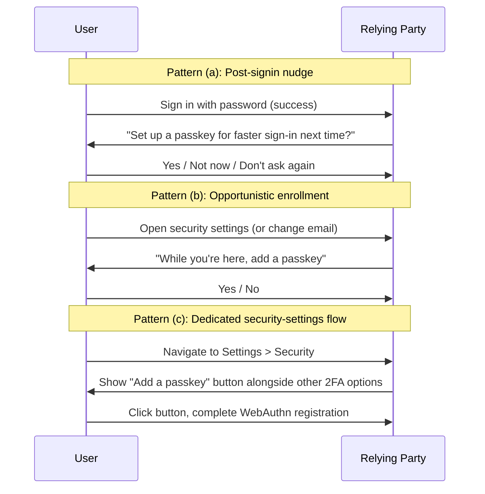

# [BEE-1011] Migrating from Passwords to Passkeys

:::info
A relying party with millions of password users does not flip a switch to passkeys. The rollout is staged: passkeys ship as additive credentials, recovery flows are audited because the threat model shifts, and password retirement is the optional last stage some sites never reach.
:::

## Context

[BEE-1007](webauthn-fundamentals.md) covers the credential model. [BEE-1008](passkeys-discoverable-credentials.md) covers passkey UX. [BEE-1009](cross-device-authentication.md) covers what to do when a passkey is on the wrong device. This article ties them into the operational question: how does an existing site with millions of password accounts adopt passkeys without breaking sign-in for anyone?

The Google Identity passkey guide makes the high-level recommendation explicit: "We recommend keeping the existing authentication method for the time being" because "users may inhabit incompatible environments, the ecosystem continues evolving, and users need time to adapt" ([Google Identity passkey developer guides](https://developers.google.com/identity/passkeys/developer-guides)). GitHub's public-beta rollout took the same approach: passkeys shipped behind a Feature Preview opt-in while passwords stayed available for everyone ([GitHub blog, July 2023](https://github.blog/2023-07-12-introducing-passwordless-authentication-on-github-com/)).

This article walks the rollout playbook and the threat-model audit that goes with it.

## Principle

Relying parties **MUST** treat passkeys as additive credentials, not replacements, for at least the first phase of rollout. Relying parties **SHOULD** prompt enrollment after a successful sign-in (post-signin nudge) rather than at first registration. Relying parties **MUST** audit every recovery channel against the new threat model — once passwords are not the weakest link, the SMS reset path is. Relying parties **MAY** retire passwords for opted-in accounts after extended successful passkey usage, but **MUST NOT** force retirement.

## Coexistence: Additive Credentials

The first phase: a user has a password; we add a passkey; both work. The relying party's database needs a credential model that accommodates this:

```sql
CREATE TABLE credentials (
  id           UUID PRIMARY KEY,
  user_id      UUID NOT NULL REFERENCES users(id),
  type         TEXT NOT NULL CHECK (type IN ('password', 'webauthn')),
  -- type='password' fields:
  password_hash TEXT,
  -- type='webauthn' fields:
  credential_id BYTEA,
  public_key    BYTEA,
  sign_count    BIGINT,
  aaguid        UUID,
  transports    TEXT[],
  created_at    TIMESTAMPTZ NOT NULL,
  last_used_at  TIMESTAMPTZ
);
```

A user can have one row of `type = 'password'` and zero or more rows of `type = 'webauthn'`. The sign-in form supports both: the username field carries `autocomplete="username webauthn"` for conditional UI ([BEE-1008](passkeys-discoverable-credentials.md)), and the password field is shown for users without a registered passkey.

GitHub's coexistence approach noted that "passkeys on GitHub.com require user verification, meaning they count as two factors in one." A relying party that previously required password + 2FA can collapse the requirement to passkey-only when the passkey carries UV — the device's biometric or PIN supplies the second factor at the protocol layer.

## Enrollment Flow Design

Three patterns worth considering, in increasing intrusiveness:



Pattern **(a)** captures the most volume but trades intrusiveness for conversion. Pattern **(b)** catches users in flow-states where they have already proven identity. Pattern **(c)** is what GitHub started with: opt-in via Settings > Feature Preview, lower volume but lower noise. A site can run all three; they are not mutually exclusive.

Include a "Not now / Don't ask again" path on the nudge. A user nudged on every sign-in eventually treats the prompt as banner-blindness; a user who can dismiss it quietly will say yes when they are ready.

## Account Recovery

Passkeys live on devices the relying party does not control. A user who loses their phone may lose their passkey (mitigated by sync, but sync is the user's choice, not the relying party's). Recovery channels need rethinking against the new threat model:

| Recovery channel | Pre-passkey weakness | Post-passkey weakness |
|------------------|----------------------|------------------------|
| Email magic-link | Phishable (user clicks link in email on a phishing page) | Unchanged — but now the **front door** for an attacker who cannot break the passkey |
| SMS reset | SIM-swap attacks bypass everything | Same; now **higher-value target** because passwords are no longer the weakest path |
| Backup codes printed at enrollment | User might lose them | User must actually store them somewhere safe; the gap shows up at recovery time |
| Trusted contact / social recovery | Complex; rarely deployed | Same complexity, but worth re-evaluating |
| Re-enrollment via a second registered passkey | n/a | **Best option** — requires the user has registered ≥2 devices |

The rule: every recovery channel that bypasses the passkey is a new attack surface. Relying parties **SHOULD** require a registered second passkey (on another device or a hardware key) before fully retiring lower-strength recovery channels.

GitHub's lesson, quoted from the rollout post: "synced passkeys prevent account lockouts from device loss; cross-device authentication maintains phishing resistance through physical proximity requirements" — sync is the first line of recovery; cross-device authentication ([BEE-1009](cross-device-authentication.md)) is the second.

## Threat Model Shifts

Pre-passkey, the password is the weakest link. Post-passkey, attackers pivot to whatever recovery flow now bypasses the passkey. Audit each channel:

- **SMS reset**: SIM-swap attacks have always defeated SMS-based 2FA. Once SMS reset bypasses a passkey, the attacker's reward grows. Consider gating SMS reset behind multi-step verification or removing it for passkey-enabled accounts.
- **Support-driven manual reset**: a phone call to support has historically been the social-engineering escape hatch. Tighten the verification process; require the user to demonstrate possession of something the attacker cannot easily get.
- **Email magic-link**: still phishable. Consider requiring the magic link to be opened on a device with a registered passkey (verifiable via WebAuthn assertion in the magic-link landing page).
- **Account-export and credential-export flows**: ensure these themselves require a passkey assertion.

The shift is structural: stop asking "is this credential strong enough?" and start asking "is this recovery flow strong enough?".

## Telemetry: Knowing It's Working

Signals to instrument:

- **Passkey enrollment rate**: per signin, per active user, per cohort. Useful only as a baseline — high enrollment without high usage means users are not actually signing in with their passkeys.
- **Conditional UI fill rate**: of sessions where the username field showed conditional UI, what fraction of users picked a passkey vs typed a password. Low fill rate suggests users do not understand the autofill UX.
- **Sign-in success rate by credential type**: passkey sign-in success vs password sign-in success. A gap means the passkey flow has a UX bug.
- **Recovery channel usage**: rising SMS reset volume after passkey rollout is a warning sign; either users are losing passkeys faster than expected, or attackers are pivoting.
- **Time-to-sign-in by credential type**: passkey should be faster than password; if it is not, something is wrong.

GitHub's blog did not publish quantitative adoption numbers, but the metric framework above is the operational baseline a rollout team needs.

## Rollout Sequencing

A staged rollout:

1. **Internal dogfood.** Employees only. Conditional UI on. Full instrumentation. Resolve the obvious bugs before public eyes see them.
2. **Opt-in beta.** Feature flag. Public users who toggle the setting. GitHub started here, and the post-mortem signal is feedback volume — public beta surfaces edge cases internal dogfood does not.
3. **Default for new users.** All newly-registered accounts get a passkey enrollment prompt. Conversion telemetry tells you whether the prompt UX works.
4. **Opt-in for existing users.** Post-signin nudge for the existing base. Most volume gets captured here; expect the highest support load.
5. **Gradual password-form deprecation.** For accounts with a registered passkey, hide the password field by default. Offer "delete password" in security settings.
6. **(Optional, long-term) Password retirement.** Delete password credentials for accounts with a verified passkey for ≥N months. Most consumer relying parties never reach this stage; the optionality is the point.

## Common Mistakes

- **Replacing passwords with passkeys overnight.** Breaks users mid-flow with no warning. Stage the rollout; keep passwords available during phases 1-4 at minimum.
- **Not auditing recovery flows.** The threat model shifted; SMS reset is now the front door. Update your audit before you ship the rollout's user-facing announcement.
- **Treating passkey enrollment rate alone as the success metric.** A high enrollment rate with a low actual passkey sign-in rate means users do not understand the flow. Track usage, not just enrollment.
- **Forgetting account export.** Some users will switch sync providers (iCloud Keychain → 1Password, or vice versa). Have a credential-rotation flow ready: the user authenticates with the old passkey, then registers a new one on the new provider.
- **Forcing password retirement.** Even users who love passkeys may want a password as a recovery option. Forced retirement strands the unprepared.

## Related BEEs

- [BEE-1007](webauthn-fundamentals.md) WebAuthn Fundamentals -- credential model background.
- [BEE-1008](passkeys-discoverable-credentials.md) Passkeys: Discoverable Credentials and UX Patterns -- enrollment-flow design uses these passkey concepts.
- [BEE-1009](cross-device-authentication.md) Cross-Device Authentication -- recovery via cross-device when a local passkey is missing.
- [BEE-1010](fido2-hardware-security-keys.md) FIDO2 Hardware Security Keys -- option for the "second device" recovery story for high-value accounts.
- [BEE-1004](session-management.md) Session Management -- sessions issued after passkey sign-in still apply.

## References

- Google Identity. "Passkey developer guides". https://developers.google.com/identity/passkeys/developer-guides
- GitHub Blog. 2023-07-12. "Introducing passwordless authentication on GitHub.com". https://github.blog/2023-07-12-introducing-passwordless-authentication-on-github-com/
- FIDO Alliance / Passkey Central. "How passkeys work". https://www.passkeycentral.org/introduction-to-passkeys/how-passkeys-work
- W3C. 2024. "Web Authentication: An API for accessing Public Key Credentials -- Level 3". https://www.w3.org/TR/webauthn-3/
