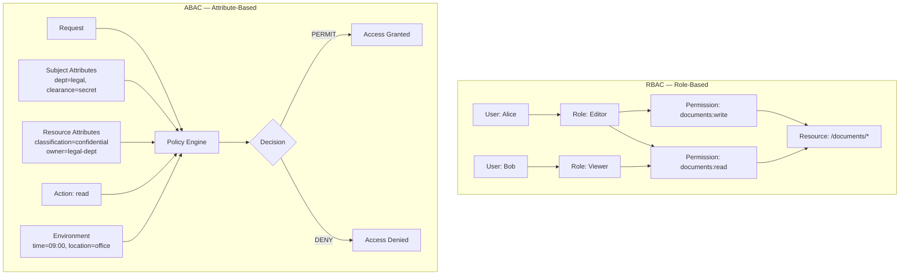

# [BEE-1005] RBAC vs ABAC Access Control Models

:::info
Role-Based Access Control assigns permissions through roles; Attribute-Based Access Control evaluates policies against subject, resource, action, and environment attributes. Choosing the wrong model — or enforcing it in the wrong place — is one of the most reliable ways to build an authorization system that cannot be audited, scaled, or changed.
:::

## Context

Authorization is more than a valid token. Once identity is established (BEE-1001), the system must decide whether the verified principal is permitted to perform the requested action on the requested resource. Two foundational models govern how that decision is encoded:

**Role-Based Access Control (RBAC)** was formalized by Ferraiolo and Kuhn (1992) and standardized as ANSI INCITS 359-2004 (revised 2012). RBAC groups permissions into roles and assigns roles to users. A user inherits all permissions of every role they hold. The model is explicit: users, roles, permissions, operations, and objects are defined entities with well-specified relationships.

**Attribute-Based Access Control (ABAC)** is defined in NIST SP 800-162 as "a logical access control methodology where authorization to perform a set of operations is determined by evaluating attributes associated with the subject, object, requested operations, and, in some cases, environment conditions against policy, rules, or relationships." ABAC makes no structural assumption about roles — it evaluates any combination of attributes at decision time.

Both models address the same fundamental problem: how to represent the rule "principal P may perform action A on resource R under circumstances C." They differ in where that rule lives, how it is expressed, and how it scales.

## Principle

**P1 — Map Users to Roles to Permissions; never skip the role layer in RBAC.** The indirection through roles is not bureaucracy — it is the mechanism that makes RBAC auditable. Removing a permission from a role updates all users who hold that role atomically. Direct user-to-permission mappings eliminate this property and recreate the chaos that RBAC was designed to solve.

**P2 — In ABAC, define policies that evaluate attributes, not identities.** An ABAC policy expresses a rule in terms of attributes: "a user with department=legal may read documents with classification=confidential during business hours." No specific user or role is named. This decoupling is ABAC's primary strength: the policy survives organizational restructuring.

**P3 — Enforce authorization at a single, well-defined layer.** The OWASP Authorization Cheat Sheet is explicit: "Access control checks must be performed server-side, at the gateway, or using serverless function." Every request to a protected resource must be evaluated, regardless of source (AJAX, background job, internal service). Client-side checks are UI affordances, not security controls.

**P4 — Apply the Principle of Least Privilege in both models.** Assign users the minimum roles that cover their job function (RBAC) or write policies that grant access to the minimum attribute combinations required (ABAC). Audit for privilege creep regularly. Least privilege applies horizontally (across users at the same level) and vertically (across hierarchical levels).

**P5 — Use role hierarchies before adding roles.** RBAC supports inheritance: a `senior-editor` role can inherit all permissions of `editor` and add more. Before creating a new role, check whether an existing role extended with one additional permission satisfies the requirement. Hierarchies reduce role count and keep the permission matrix comprehensible.

**P6 — Externalize policy evaluation.** Authorization logic hardcoded in application handlers cannot be audited consistently, is omitted from new code paths, and cannot be updated without a deployment. Whether the implementation uses RBAC role checks or an ABAC policy engine (OPA, Cedar, Casbin), the evaluation call must pass through a single interface.

## Visual

The following diagrams show the structural difference between the two models for the same document management scenario.



In RBAC, the permission is pre-computed and stored as a role assignment. In ABAC, the permission is computed at request time by evaluating attributes against policy. RBAC answers "what is this role allowed to do?" ABAC answers "given everything we know about this request right now, is this operation permitted?"

## Example

The same document management system — documents have a classification level, users have a department and clearance — implemented in both models.

### RBAC implementation

Define roles that correspond to job functions:

```
Roles:
  legal-viewer   → [documents:read]                            (classification ≤ internal)
  legal-editor   → [documents:read, documents:write]           (classification ≤ confidential)
  legal-admin    → [documents:read, documents:write,
                    documents:delete, documents:share]
  
  # legal-editor inherits legal-viewer via role hierarchy
  legal-editor → inherits legal-viewer

User assignments:
  Alice → [legal-editor]
  Bob   → [legal-viewer]
  Carol → [legal-admin]
```

Permission check at request time:

```
function authorize_rbac(user, action, resource):
    roles = role_store.get_roles(user.id)                   # ["legal-editor"]
    permissions = expand_permissions(roles)                 # ["documents:read", "documents:write"]
    required = derive_required_permission(action, resource) # "documents:write"
    return required in permissions
```

### ABAC implementation

The same scenario expressed as attribute-based policies:

```
# Policy 1: Legal department members can read confidential documents
# during business hours from approved locations
Policy read-legal-confidential:
    effect: PERMIT
    condition:
        subject.department == "legal"
        AND subject.clearance IN ["confidential", "secret"]
        AND resource.classification == "confidential"
        AND action == "read"
        AND environment.time BETWEEN 08:00 AND 18:00

# Policy 2: Legal editors can write confidential documents
Policy write-legal-confidential:
    effect: PERMIT
    condition:
        subject.department == "legal"
        AND subject.job_level >= 3
        AND resource.classification == "confidential"
        AND resource.owner_department == "legal"
        AND action IN ["write", "update"]

# Default: deny all unmatched requests
Default: DENY
```

Policy engine call:

```
function authorize_abac(request):
    context = {
        subject:     { department: user.dept, clearance: user.clearance,
                       job_level: user.level },
        resource:    { classification: doc.classification,
                       owner_department: doc.owner_dept },
        action:      request.method_to_action(),
        environment: { time: now(), location: request.origin_region }
    }
    return policy_engine.evaluate(context)   # PERMIT or DENY
```

### Comparison for the same operation

Alice (legal-editor, clearance=confidential) requests to write document D (classification=confidential, owner=legal):

| Step | RBAC | ABAC |
|---|---|---|
| What is checked | Does Alice's role set include `documents:write`? | Do Alice's attributes + D's attributes satisfy a PERMIT policy for `write`? |
| Time-of-day restriction | Not expressible without adding a separate layer | Native: add `AND environment.time BETWEEN 08:00 AND 18:00` to policy |
| Adding a new employee | Assign them to `legal-editor` | No change; their attributes qualify automatically |
| Revoking after hours | Requires session invalidation or token expiry | Policy evaluated at runtime; restriction is immediate |

## When to Choose RBAC vs ABAC vs Hybrid

| Criterion | Lean RBAC | Lean ABAC |
|---|---|---|
| Team size and tenure | Stable team, well-understood job functions | Dynamic team, frequent role changes |
| Permission variability | Permissions map cleanly to job functions | Permissions depend on data classification, context, or time |
| Regulatory requirement | Audit trail based on role assignments | Fine-grained attribute audit log required |
| Operational complexity | Simple to operate and debug | Team has capacity to maintain a policy engine |
| Multi-tenancy | Single-organization deployment | Cross-organization or multi-tenant SaaS |

**Hybrid approach:** Start with RBAC for coarse-grained access (this user can access the Documents module) and layer ABAC for fine-grained decisions within that module (which specific documents, under what conditions). The role check at the gateway filters 99% of unauthorized requests cheaply; the attribute check at the service layer enforces the nuanced policy without exposing the policy engine to every request.

## Permission Enforcement Points

Authorization must be enforced at every layer that accesses protected data, not only at the perimeter.

```
Inbound Request
      │
      ▼
┌─────────────────────────────────────────────────────────┐
│ API Gateway / Reverse Proxy                             │
│ Coarse check: is this route/scope permitted for role?   │
│ Rejects obviously unauthorized requests early.          │
└─────────────────────┬───────────────────────────────────┘
                      │
                      ▼
┌─────────────────────────────────────────────────────────┐
│ Middleware / Interceptor                                │
│ Context check: inject principal, attach tenant,         │
│ validate token scopes against requested endpoint.       │
└─────────────────────┬───────────────────────────────────┘
                      │
                      ▼
┌─────────────────────────────────────────────────────────┐
│ Service / Domain Layer                                  │
│ Fine-grained check: can this principal perform          │
│ this action on this specific resource instance?         │
│ This is where ABAC attribute evaluation belongs.        │
└─────────────────────────────────────────────────────────┘
```

The gateway check is cheap and coarse. The service-layer check has access to the full resource context and applies the specific policy. Both checks are necessary: skipping the gateway check means the service absorbs all traffic; skipping the service-layer check means the gateway's coarse rules are the only defense.

## Common Mistakes

**1. Creating a role per user.**

When every user gets a unique role, RBAC provides no benefit over an ACL and eliminates the auditing advantage of role-based grouping. If you find yourself naming roles after people (`alice-editor`, `bob-viewer`), the system is not using RBAC — it is simulating per-user permissions with extra steps. Group users by job function, not by identity.

**2. Hardcoding permission checks throughout the codebase.**

```
# Anti-pattern — scattered, unauditable, inconsistent
if user.role == "admin":
    allow_delete()

if "legal" in user.groups and doc.classification != "top-secret":
    allow_read()
```

These checks cannot be found by a security audit without searching every file, are silently omitted from new endpoints, and cannot be updated without touching application code. All authorization decisions MUST go through a single interface — a policy module, a middleware function, or an external engine call.

**3. Not considering role hierarchy.**

Adding a `senior-editor` role that duplicates all `editor` permissions plus one extra creates two roles that must stay synchronized. Any permission added to `editor` must be manually added to `senior-editor`. Use hierarchical RBAC: `senior-editor inherits editor`. Permission changes propagate automatically, and the role graph reflects the actual organizational structure.

**4. Over-engineering with ABAC when RBAC suffices.**

ABAC requires a policy language, a policy engine, attribute stores for subjects and resources, and runtime evaluation. For a system with five user types and permissions that map cleanly to job functions, this infrastructure is cost without benefit. Apply ABAC where the policy genuinely requires attribute combinations that cannot be expressed as roles — not as a default starting point.

## Related BEPs

- [BEE-1001: Authentication vs Authorization](authentication-vs-authorization.md) — the pipeline that precedes any permission model
- [BEE-1003: OAuth 2.0 and OpenID Connect](oauth-openid-connect.md) — how scopes relate to coarse-grained RBAC at the protocol level
- [BEE-5002: API Gateway Patterns](../architecture-patterns/domain-driven-design-essentials.md) — enforcement points in a gateway-first architecture

## References

- Ferraiolo, D. and Kuhn, R., "Role-Based Access Controls" (1992). Proceedings of the 15th National Computer Security Conference. https://csrc.nist.gov/projects/role-based-access-control
- Sandhu, R., Ferraiolo, D., and Kuhn, R., "The NIST Model for Role-Based Access Control: Towards a Unified Standard" (2000). https://csrc.nist.gov/projects/role-based-access-control
- ANSI INCITS 359-2004 (revised as INCITS 359-2012), "Information Technology — Role Based Access Control." https://standards.incits.org/apps/group_public/project/details.php?project_id=506
- Hu, V. et al., "Guide to Attribute Based Access Control (ABAC) Definition and Considerations" NIST SP 800-162 (2014, updated 2019). https://csrc.nist.gov/pubs/sp/800/162/upd2/final
- OWASP, "Authorization Cheat Sheet" (2024). https://cheatsheetseries.owasp.org/cheatsheets/Authorization_Cheat_Sheet.html
- OWASP, "Access Control Cheat Sheet" (2024). https://cheatsheetseries.owasp.org/cheatsheets/Access_Control_Cheat_Sheet.html
