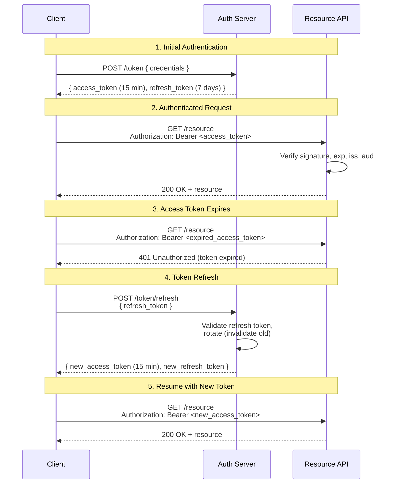

# [BEE-11] Token-Based Authentication

:::info
Token-based authentication replaces server-side session state with self-contained or server-verifiable credentials that travel with every request, enabling stateless, horizontally scalable services.
:::

## Context

Traditional session-based authentication stores authentication state on the server: a session ID in a cookie maps to a server-side record holding the user's identity. This works for single-server deployments but creates friction at scale — every node in a cluster needs access to the same session store, adding latency and an operational dependency.

Token-based authentication shifts the state into the token itself (or into a small lookup by token ID). The server issues a signed token at login; the client presents that token on every subsequent request. The server verifies the token's integrity rather than looking up a shared store. No session affinity, no shared cache required.

RFC 6750 ("The OAuth 2.0 Authorization Framework: Bearer Token Usage") defines the HTTP mechanics for token transmission. RFC 7519 defines JWT (JSON Web Token), the dominant format for structured, self-contained tokens. The OWASP JWT Security Cheat Sheet consolidates practitioner guidance on safe token handling.

Two token formats are in common use:

| Property | JWT (self-contained) | Opaque token |
|---|---|---|
| Content | Signed JSON claims readable by any party holding the key | Random string; meaning lives only in server store |
| Verification | Validate signature + claims locally — no server round-trip | Must call token-introspection or lookup endpoint |
| Revocation | Difficult: valid until expiry unless denylist used | Trivial: delete from store |
| Payload exposure | Claims are base64-encoded, NOT encrypted | Nothing exposed client-side |
| Typical use | Short-lived access tokens between services | Longer-lived tokens where instant revocation is needed |

Neither format is universally superior. The choice depends on revocation requirements, trust boundaries, and operational constraints.

## Principle

**P1 — Tokens MUST be signed.** An unsigned JWT (algorithm `none`) MUST be rejected. Servers MUST verify the token signature against a known key before trusting any claim. (RFC 7519 §6; OWASP JWT Cheat Sheet)

**P2 — Access tokens MUST be short-lived.** Access tokens SHOULD have a lifetime of 15 minutes or less. Short expiry limits the damage window of a leaked token without requiring revocation infrastructure. (OWASP JWT Cheat Sheet §Token Lifetime)

**P3 — Refresh tokens MUST be used to extend sessions, not longer-lived access tokens.** When the access token expires, the client uses a separate, longer-lived refresh token to obtain a new access token. Refresh tokens SHOULD be single-use (rotation) and MUST be stored securely server-side so they can be revoked. (RFC 6749 §1.5)

**P4 — Token storage on the client MUST be chosen with the threat model in mind.** Tokens stored in `localStorage` or `sessionStorage` are readable by any JavaScript running on the page, making them vulnerable to XSS. Tokens stored in `httpOnly`, `Secure`, `SameSite=Strict` cookies are not readable by JavaScript. For browser clients, `httpOnly` cookies are the RECOMMENDED storage location for refresh tokens. (OWASP JWT Cheat Sheet §Token Storage)

**P5 — Servers MUST validate all relevant claims on every request.** Validation MUST include: signature verification, expiration (`exp`), not-before (`nbf`) if present, issuer (`iss`), and audience (`aud`). Partial validation is not validation. (RFC 7519 §7.2)

**P6 — JWT payloads MUST NOT contain sensitive data.** The payload is base64url-encoded, not encrypted. Anyone who obtains the token can decode and read all claims without a key. Sensitive data (PII, secrets, permissions beyond coarse role) MUST NOT be placed in a JWT unless the token is also encrypted (JWE).

**P7 — Tokens SHOULD be transmitted via the `Authorization: Bearer` header.** Avoid embedding tokens in URL query parameters; URLs are logged in proxies, browsers, and server access logs, exposing the token. (RFC 6750 §2)

## Visual

The following diagram shows the full token lifecycle: initial authentication, token usage, expiry, and refresh.



## Example

### JWT structure

A JWT consists of three base64url-encoded parts separated by dots:

```
eyJhbGciOiJSUzI1NiIsInR5cCI6IkpXVCJ9   <- header
.
eyJpc3MiOiJodHRwczovL2F1dGguZXhhbXBsZS5jb20iLCAic3ViIjoiN...  <- payload
.
SflKxwRJSMeKKF2QT4fwpMeJf36POk6yJV_adQssw5c   <- signature
```

**Header** (decoded):

```json
{
  "alg": "RS256",
  "typ": "JWT"
}
```

- `alg`: Signing algorithm. Use `RS256` (asymmetric) or `ES256` for production. Never accept `none`.
- `typ`: Token type. Always `JWT` for standard tokens.

**Payload** (decoded):

```json
{
  "iss": "https://auth.example.com",
  "sub": "user-7f3a9b",
  "aud": "https://api.example.com",
  "exp": 1712530800,
  "iat": 1712530200,
  "nbf": 1712530200,
  "jti": "a1b2c3d4-e5f6-7890-abcd-ef1234567890",
  "role": "editor"
}
```

| Claim | Meaning | Validation required |
|---|---|---|
| `iss` (issuer) | Who issued this token | MUST match expected issuer |
| `sub` (subject) | Who the token represents (user ID) | Use as principal identity |
| `aud` (audience) | Who this token is intended for | MUST match this service's identifier |
| `exp` (expiration) | Unix timestamp after which token is invalid | MUST reject if `now > exp` |
| `iat` (issued at) | Unix timestamp when token was issued | Used for auditing; check for clock skew |
| `nbf` (not before) | Unix timestamp before which token is invalid | MUST reject if `now < nbf` |
| `jti` (JWT ID) | Unique token identifier | Use for one-time-use or denylist checks |
| `role` | Application-defined claim | Not an RFC claim; handle as needed |

**Signature**: The server signs `base64url(header) + "." + base64url(payload)` with its private key. The recipient verifies with the corresponding public key. Any tampering with header or payload invalidates the signature.

### Refresh token rotation

When the client exchanges a refresh token, the server SHOULD immediately invalidate the old refresh token and issue a new one. If an attacker steals a refresh token and uses it first, the legitimate client's next refresh attempt will fail (the token is already used), alerting the system to a potential compromise.

## Common Mistakes

**1. Storing sensitive data in JWT payload.**

The payload is base64url-encoded, which is trivially reversible — it is not encryption. Any party who intercepts or retrieves the token can read all claims. Do not place passwords, PII, secrets, or fine-grained permission data in a JWT payload unless the token is additionally encrypted (JWE, RFC 7516).

**2. Not validating the token signature on every request.**

Skipping signature verification (or accepting `alg: none`) means any attacker can forge a token with arbitrary claims. Signature verification is not optional — it is the security boundary. Validate the signature before reading any claim.

**3. Using long-lived access tokens instead of a short access + refresh pair.**

A 24-hour access token that is leaked is usable for 24 hours with no recourse (short of deploying a denylist). A 15-minute access token limits the damage window to 15 minutes. Use short-lived access tokens and a separate refresh flow.

**4. Storing tokens in localStorage.**

`localStorage` is accessible to all JavaScript on the page. A single XSS vulnerability gives an attacker access to every stored token. Use `httpOnly` cookies for refresh tokens in browser clients. Access tokens can be held in memory (JavaScript variable) for the lifetime of the page without being persisted to any storage API.

**5. Not checking `aud` (audience).**

An access token issued for `api-a.example.com` presented to `api-b.example.com` should be rejected. If the audience claim is not validated, tokens issued for one service are accepted by another, breaking the isolation that tokens are supposed to provide.

## Related BEPs

- [BEE-10: Authentication vs Authorization](10.md) — the conceptual boundary between identity and permission
- [BEE-11: OAuth 2.0 and OpenID Connect](11.md) — token issuance and delegation flows
- [BEE-13: Session Management](13.md) — server-side sessions as an alternative to tokens
- [BEE-30: OWASP Top 10 Mapping](30.md) — security vulnerability context
- [BEE-31: Cryptographic Primitives](31.md) — signing algorithms and key management basics

## References

- Jones, M. et al., "JSON Web Token (JWT)" RFC 7519 (2015). https://datatracker.ietf.org/doc/html/rfc7519
- Jones, M. and Hardt, D., "The OAuth 2.0 Authorization Framework: Bearer Token Usage" RFC 6750 (2012). https://datatracker.ietf.org/doc/html/rfc6750
- Jones, M. et al., "JSON Web Algorithms (JWA)" RFC 7518 (2015). https://datatracker.ietf.org/doc/html/rfc7518
- Jones, M., "JSON Web Encryption (JWE)" RFC 7516 (2015). https://datatracker.ietf.org/doc/html/rfc7516
- OWASP, "JSON Web Token Security Cheat Sheet" (2024). https://cheatsheetseries.owasp.org/cheatsheets/JSON_Web_Token_for_Java_Cheat_Sheet.html
- OWASP, "Authentication Cheat Sheet" (2024). https://cheatsheetseries.owasp.org/cheatsheets/Authentication_Cheat_Sheet.html
- Auth0, "The Refresh Token Rotation" (developer documentation). https://auth0.com/docs/secure/tokens/refresh-tokens/refresh-token-rotation
- Hardt, D. (ed.), "The OAuth 2.0 Authorization Framework" RFC 6749, §1.5 (2012). https://datatracker.ietf.org/doc/html/rfc6749#section-1.5
