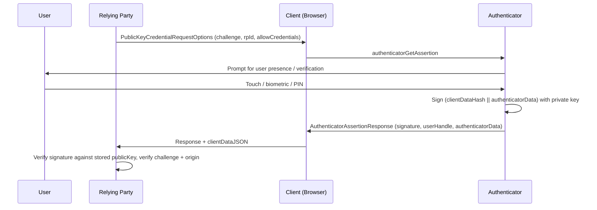

# [BEE-1007] WebAuthn Fundamentals

:::info
WebAuthn is the W3C public-key authentication API. It replaces shared-secret passwords with origin-bound public/private keypairs and turns phishing into a cryptographic impossibility instead of a user-training problem.
:::

## Context

[BEE-1002](token-based-authentication.md) and [BEE-1003](oauth-openid-connect.md) cover the credential models that dominated backend authentication for two decades: passwords issued through forms, then exchanged for bearer tokens or OIDC ID tokens. The model has a structural weakness the industry never closed. Passwords are shared secrets. Anything the user can type into the legitimate site, the user can also type into a phishing site. Credential stuffing, breach reuse, and SIM-swapped 2FA all exploit the same property: the secret has no binding to the origin that issued it.

[Web Authentication Level 3](https://www.w3.org/TR/webauthn-3/) replaces the shared secret with a public/private keypair where the authenticator (a device the user controls) holds the private key and the relying party (the server) holds only the public key. The private key never leaves the authenticator. The signature the authenticator produces is bound to the origin requesting it. A phishing site cannot extract the key, and the authenticator refuses to sign for the wrong origin. The FIDO Alliance puts this property as: "there is no way for the user to inadvertently type it on an attacker's site" because the credential is "only presented to the site it was registered with" ([Passkey Central](https://www.passkeycentral.org/introduction-to-passkeys/how-passkeys-work)).

This article covers the foundation. The rest of the series ([BEE-1008](passkeys-discoverable-credentials.md), [BEE-1009](cross-device-authentication.md), [BEE-1010](fido2-hardware-security-keys.md), [BEE-1011](migrating-from-passwords-to-passkeys.md)) builds on the model defined here.

## Principle

Relying parties **MUST** verify the challenge they issued and the origin contained in `clientDataJSON` on every WebAuthn response. Relying parties **MUST** store the credential ID verbatim and the public key in a form they can verify against. Relying parties **SHOULD** require user verification for high-value operations and **MAY** require attestation for regulated or enterprise scenarios. The relying party **MUST NOT** treat the WebAuthn response as user identity proof on its own — it proves the user holds a credential previously bound to an account, not which human is present.

## The Three-Party Model

WebAuthn ceremonies involve three parties (W3C WebAuthn L3 §4 Terminology):

- **Relying party (RP).** The web application requiring authentication. Identified by an `rpId`, typically the registrable domain (`example.com`). The RP holds the public keys.
- **Client.** The user agent (browser, OS-level WebAuthn provider) mediating between the user and the authenticator. The client constructs `clientDataJSON` containing the origin, challenge, and ceremony type.
- **Authenticator.** The cryptographic entity holding the private key. Either a **platform authenticator** built into the user's device (Touch ID, Windows Hello) or a **roaming authenticator** accessed over USB, BLE, or NFC (YubiKey, SoloKey) — see W3C §1.2.1 and §1.

A few terms recur throughout the rest of the series:

| Term | Definition |
|------|------------|
| `rpId` | The relying party identifier, typically the registrable domain. Credentials are scoped to it. |
| Credential ID | A "probabilistically-unique byte sequence" (W3C §4) of at most 1023 bytes identifying one credential. Opaque to the RP — store and return it verbatim. |
| User handle | An opaque per-user identifier the RP supplies at registration. Returned in the authentication response, lets the RP look up the account without the user typing a username. |
| AAGUID | Authenticator Attestation GUID. Identifies the authenticator model (W3C §6.5.1), constant across credentials from the same model. Used for enterprise allowlists. |

## Registration Ceremony

Registration creates a new credential and returns the public key to the RP. From W3C §1.3.1, the flow is:

```mermaid
sequenceDiagram
    participant U as User
    participant RP as Relying Party
    participant C as Client (Browser)
    participant A as Authenticator

    RP->>C: PublicKeyCredentialCreationOptions (challenge, rpId, user, pubKeyCredParams)
    C->>A: authenticatorMakeCredential
    A->>U: Prompt for user presence / verification
    U->>A: Touch / biometric / PIN
    A->>A: Generate keypair, store private key
    A->>C: AuthenticatorAttestationResponse (credentialId, publicKey, attestationObject)
    C->>RP: Response + clientDataJSON
    RP->>RP: Verify challenge, origin, attestation; store (credentialId, publicKey)
```

The RP-side options the call is built around look like this:

```json
{
  "challenge": "<random bytes, base64url>",
  "rp": { "id": "example.com", "name": "Example" },
  "user": {
    "id": "<opaque user handle, base64url>",
    "name": "alice@example.com",
    "displayName": "Alice"
  },
  "pubKeyCredParams": [{ "type": "public-key", "alg": -7 }],
  "authenticatorSelection": { "userVerification": "preferred" },
  "attestation": "none"
}
```

`alg: -7` is ES256 (ECDSA over P-256 with SHA-256). The RP **MUST** verify the returned `clientDataJSON.challenge` matches the one it issued, the `clientDataJSON.origin` matches its expected origin, and (when attestation is requested) the attestation statement validates against trusted roots.

## Authentication Ceremony

Authentication proves the user controls the previously-registered private key. From W3C §1.3.3:



The RP request shape:

```json
{
  "challenge": "<random bytes, base64url>",
  "rpId": "example.com",
  "allowCredentials": [
    { "type": "public-key", "id": "<credentialId, base64url>" }
  ],
  "userVerification": "preferred"
}
```

The signature is computed over the concatenation of `authenticatorData` and `SHA-256(clientDataJSON)`. The RP recomputes that hash, verifies the signature against the stored public key, and confirms the challenge and origin in `clientDataJSON`. The signature counter in `authenticatorData` (when non-zero) provides clone-detection: a counter that goes backwards relative to the stored value indicates the credential may have been duplicated.

## Why Phishing-Resistance Comes for Free

The phishing-resistance is structural, not procedural. Two mechanisms enforce it:

- **Origin in `clientDataJSON`.** The client (the browser, not the page) writes the verified origin into `clientDataJSON` before passing it to the authenticator. A phishing page on `example-attacker.com` cannot lie about its origin — the browser supplies the truth.
- **`rpId` binding at the authenticator.** The authenticator stores the `rpId` alongside the credential at registration. At authentication, the client sends the current page's `rpId`, and the authenticator refuses to sign if it does not match.

Even if a user is tricked into visiting `example-attacker.com` and the page proxies the WebAuthn ceremony, the authenticator sees the wrong `rpId` and the signature never happens. Compare with TOTP or SMS codes, where the user can be social-engineered into typing the code on a phishing page.

## Attestation

The registration response can include an **attestation statement** that proves which authenticator model produced the credential (W3C §6.5). Attestation answers questions like "is this a real YubiKey 5 NFC?" or "was this credential generated on an Apple device?" — useful when the RP needs to enforce a hardware allowlist.

The RP signals its preference via the `attestation` field in `PublicKeyCredentialCreationOptions` (W3C §5.4.7). The values:

| Value | Meaning |
|-------|---------|
| `"none"` | No attestation. Most consumer-facing RPs use this — attestation has privacy implications and isn't needed for standard sign-in. |
| `"indirect"` | The client may anonymise attestation data using its own roots. |
| `"direct"` | The unmodified attestation statement reaches the RP. Used when the RP intends to verify the authenticator model. |
| `"enterprise"` | Enterprise-specific attestation chains. Used when the RP and the user's organization have a pre-arranged trust relationship. |

Attestation statement formats include `packed` (W3C §8.2), `fido-u2f` (§8.6, legacy U2F-style), and `none` (§8.7, the placeholder when attestation is not requested). The AAGUID embedded in the attested credential data identifies the authenticator model and supports allowlist enforcement.

For consumer applications, request `"none"`. For enterprise deployments where IT issues hardware keys to employees and needs to verify model authenticity, request `"direct"` and validate the attestation statement against the FIDO Metadata Service.

## Common Mistakes

- **Storing the credential ID hashed.** Credential IDs are opaque, not secrets. The RP must store and return them verbatim — hashing breaks the lookup that drives the authentication ceremony.
- **Reusing challenges.** Each ceremony **MUST** use a fresh, single-use challenge. Reuse defeats the anti-replay property of the protocol.
- **Treating user verification (UV) as identity proof.** The UV flag in `authenticatorData` proves a local human did something (PIN, biometric). It does not prove which human. The RP knows the credential was exercised; the human's identity is bound to the account associated with that credential at registration.
- **Treating attestation as authentication.** Attestation says what the authenticator is. It does not say who the user is. Mixing the two leads to allowlists that lock users out when their device firmware updates the AAGUID.
- **Skipping origin verification.** If the RP does not verify `clientDataJSON.origin`, a malicious extension or a misconfigured proxy can replay a credential against the wrong site.

## Related BEEs

- [BEE-1001](authentication-vs-authorization.md) Authentication vs Authorization -- WebAuthn is authentication; authorization happens after.
- [BEE-1002](token-based-authentication.md) Token-Based Authentication -- the session token issued after a successful WebAuthn ceremony follows the same lifecycle covered there.
- [BEE-1008](passkeys-discoverable-credentials.md) Passkeys: Discoverable Credentials and UX Patterns -- passkeys are a specific deployment of WebAuthn discoverable credentials.
- [BEE-1011](migrating-from-passwords-to-passkeys.md) Migrating from Passwords to Passkeys -- rollout playbook anchored on this credential model.
- [BEE-2005](../security-fundamentals/cryptographic-basics-for-engineers.md) Cryptographic Basics for Engineers -- public-key cryptography background.

## References

- W3C. 2024. "Web Authentication: An API for accessing Public Key Credentials -- Level 3". https://www.w3.org/TR/webauthn-3/
- W3C WebAuthn L3 §1 Introduction (parties, ceremonies overview). https://www.w3.org/TR/webauthn-3/#sctn-intro
- W3C WebAuthn L3 §4 Terminology (relying party, authenticator, credential ID, user handle). https://www.w3.org/TR/webauthn-3/#sctn-terminology
- W3C WebAuthn L3 §5.4.7 AttestationConveyancePreference. https://www.w3.org/TR/webauthn-3/#enum-attestation-convey
- W3C WebAuthn L3 §6.5 Attestation. https://www.w3.org/TR/webauthn-3/#sctn-attestation
- W3C WebAuthn L3 §8 Defined Attestation Statement Formats. https://www.w3.org/TR/webauthn-3/#sctn-defined-attestation-formats
- FIDO Alliance / Passkey Central. "How passkeys work". https://www.passkeycentral.org/introduction-to-passkeys/how-passkeys-work
