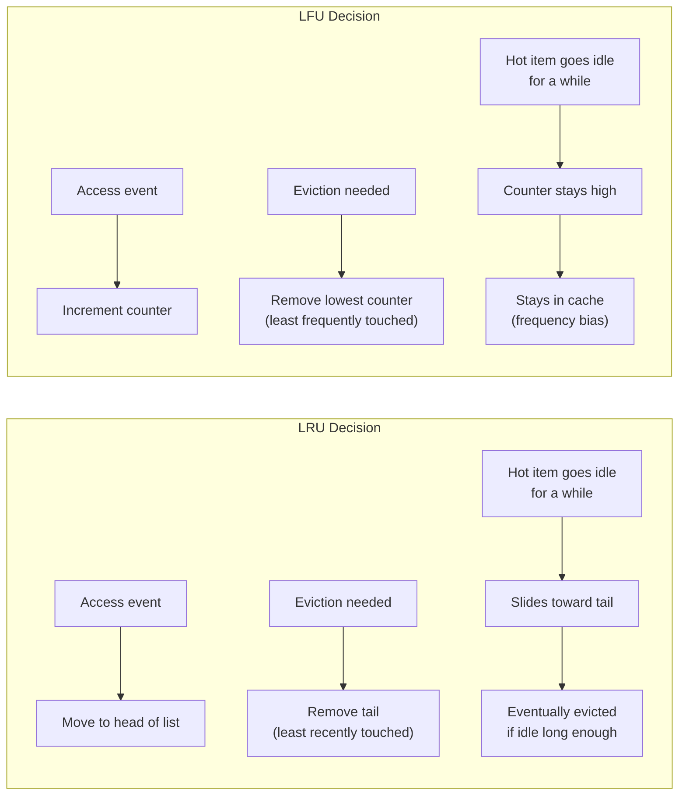
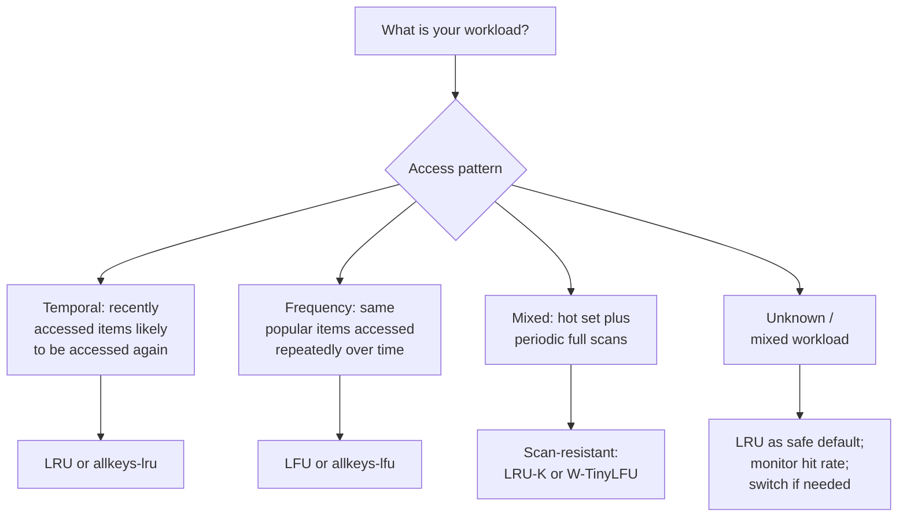

# [BEE-9003] Cache Eviction Policies

:::info
LRU, LFU, FIFO, and adaptive policies decide what a cache discards when memory runs out. This article covers how each policy works and how to pick the right one for a given workload.
:::

## Context

A cache is a finite resource. RAM costs money and has a hard upper bound; disk-backed caches trade latency for capacity but still have limits. When a cache fills up, every new entry requires discarding an existing one. The question is: which entry?

The wrong answer silently destroys the value of your cache. Evict a hot item and the next request misses, hits the database, and re-populates the cache. The policy then evicts that same item again moments later, repeating the cycle. Under pathological access patterns, a misbehaving eviction policy can produce a **hit ratio close to zero** even with a large cache.

The right answer depends entirely on your workload. There is no universally optimal policy. Pick a policy mismatched to the access pattern and the cache evicts hot entries while retaining cold ones; the sections below show how each policy fails and where.

:::warning No eviction policy is not an option
If you configure no eviction policy and no memory limit, a long-running process will grow its cache without bound and eventually crash with an OOM error. Always set an explicit memory limit and a matching eviction policy.
:::

## Visual

The two dominant strategies, recency and frequency, side by side:



LRU responds to **recency**: an item that stops being accessed slides toward the tail and is eventually evicted. LFU responds to **cumulative frequency**: an item that was popular in the past can keep a high counter and resist eviction long after it stops being accessed. The Core Policies section below covers how real LFU implementations counter that frequency bias.

## Core Policies

### LRU -- Least Recently Used

LRU evicts the entry that was accessed least recently. The rationale is **temporal locality**: if you haven't touched something in a while, you probably won't need it soon.

**How it works:** Maintain a linked list ordered by access time. On every read or write, move the accessed entry to the head. When eviction is needed, remove from the tail.

```
Cache state (head = most recent, tail = least recent):
[D] -> [C] -> [B] -> [A]   (capacity: 4)

Access E (new entry, cache full):
  Evict A (tail, least recently used)
  Insert E at head

New state: [E] -> [D] -> [C] -> [B]
```

**Characteristics:**
- O(1) access and eviction with a hash map + doubly-linked list
- Adapts quickly to shifts in access patterns
- Vulnerable to **scan pollution**: a full table scan reads millions of keys sequentially, flushing hot items from the cache even though none of the scanned keys will be accessed again

**Best for:** General-purpose caching, workloads with temporal locality, user session data, recently viewed content.

### LFU -- Least Frequently Used

LFU evicts the entry with the lowest access count. The rationale is **frequency locality**: popular items get accessed often and should stay; rare items should be first to go.

**How it works:** Track a hit counter per entry. On eviction, remove the entry with the minimum counter. When counters are equal, use recency as a tiebreaker.

```
Cache state (showing [key: count]):
[A:5] [B:3] [C:2] [D:1]   (capacity: 4)

Access E (new entry, E:1, cache full):
  Evict D (lowest count)
  Insert E with count=1

New state: [A:5] [B:3] [C:2] [E:1]
```

**Characteristics:**
- Retains consistently popular items even through brief periods of inactivity
- **Slow to adapt**: an item that was popular six months ago retains a high count and resists eviction even when no longer accessed (frequency bias)
- **Mitigated with decay in practice**: production implementations counter frequency bias by periodically decaying the counter; Redis's `lfu-decay-time` (default 1 minute) controls how long a counter can sit idle before it starts shrinking, so an old high count does not block eviction indefinitely
- New items start with count=1 and are immediately vulnerable, even if they are about to become very popular
- Higher implementation complexity; naive implementation is O(log n) unless optimized

**Best for:** Stable workload distributions, media streaming (popular videos stay cached), public API responses where the same content is requested by many users.

### FIFO -- First In, First Out

FIFO evicts the entry that has been in the cache the longest, regardless of how often or recently it was accessed. The rationale is simplicity: oldest entry leaves first.

**How it works:** Maintain a queue. Insertions go to the tail. Evictions come from the head.

```
Cache state (left = oldest):
[A] -> [B] -> [C] -> [D]   (capacity: 4)

Access E (new entry, cache full):
  Evict A (oldest, regardless of access count)
  Insert E at tail

New state: [B] -> [C] -> [D] -> [E]

Note: A may have been accessed 100 times. FIFO does not care.
```

**Characteristics:**
- Extremely simple to implement; minimal overhead
- **No access pattern awareness**: a heavily-accessed item is evicted simply because it was inserted first
- Known to produce **Belady's anomaly** in some configurations: adding more cache capacity can make hit rate worse
- Historically uncommon in general-purpose application caches, though FIFO queues have had a research and production revival as building blocks of newer designs; see S3-FIFO and SIEVE under Advanced Policies below

**Best for:** Message queues, log buffers, situations where data genuinely has a time-based lifecycle and older entries are less valuable by definition.

### Random Eviction

Evict a randomly selected entry. No tracking of access patterns.

**Characteristics:**
- Near-zero overhead
- Pure random eviction is a weak baseline: Dan Luu's CPU-cache simulations ([Caches: LRU vs. random](https://danluu.com/2choices-eviction/)) found that plain random and FIFO are both strictly worse than LRU
- **2-random** (sample two entries at random, evict the less recently used of the two) is the competitive variant: the same simulations show it matching or beating LRU at larger cache sizes
- Non-deterministic: behavior is hard to reason about and test
- Redis's `allkeys-random` policy implements plain uniform random eviction, not the 2-random variant; it accepts a lower hit rate than LRU on skewed workloads in exchange for simplicity (the docs recommend it only when keys are accessed with roughly equal frequency)

**Best for:** Embedded systems with severe memory constraints, situations where implementation simplicity outweighs a few percentage points of hit rate.

### TTL-Based Expiry

Entries expire after a configured time-to-live, regardless of access frequency or recency. TTL expiry is a validity policy: entries leave because their data may be stale, while eviction removes entries under capacity pressure.

In practice, TTL and eviction work together: TTL entries are cleared when they expire (freeing space), and the eviction policy handles capacity pressure among unexpired entries.

:::tip Eviction vs. invalidation
TTL-based expiry is a form of cache invalidation (see [BEE-9002](cache-invalidation-strategies.md)), not eviction. Eviction is driven by memory pressure; invalidation is driven by data staleness. The two operate independently.
:::

## Advanced Policies

Plain LRU, LFU, and FIFO all have known failure modes. Two designs outside this list shaped what follows: CLOCK, an efficient LRU approximation long used in OS page replacement, is the ancestor of the FIFO-queue designs below (S3-FIFO and SIEVE); ARC (Adaptive Replacement Cache, used in ZFS), which blends recency and frequency signals adaptively, prefigures the adaptive recency-plus-frequency approach W-TinyLFU takes.

### LRU-K

LRU-K evicts the entry whose K-th most recent access is furthest in the past. LRU is equivalent to LRU-1. LRU-2 and LRU-3 are common choices.

The idea is to require an entry to have been accessed at least K times before it is considered "hot" enough to resist eviction. A single access (e.g., a scan) does not promote an entry; K accesses are required.

This directly addresses scan pollution. A sequential table scan accesses each key exactly once; with K=2, none of those entries are promoted and they are evicted first when the cache fills up.

### W-TinyLFU (Caffeine)

W-TinyLFU is the eviction policy used by [Caffeine](https://github.com/ben-manes/caffeine), a high-performance Java caching library. Ristretto (Go) takes a related but distinct approach: it uses the TinyLFU admission filter to decide what enters the cache, then evicts with sampled LFU rather than the full windowed scheme described below. Both consistently outperform plain LRU and LFU on diverse workloads.

**Architecture:**

The cache is split into two regions:

1. **Window cache** (~1% of capacity): New entries enter here. Acts like LRU. Gives new entries a chance to build up frequency before being promoted or rejected.
2. **Main cache** (~99% of capacity): Entries that have proven their value. Split further into a "protected" LRU segment and a "probationary" LRU segment.

**Admission filter (TinyLFU):** When an entry would be promoted from the window to the main cache, it must compete against the entry being evicted from the main cache. A compact frequency sketch (Count-Min Sketch) tracks approximate access counts. The incoming entry wins only if its frequency is higher. This prevents cache pollution by low-frequency entries.

**Adaptive sizing:** The relative sizes of the window and main regions are adjusted dynamically using a hill-climbing algorithm. If the workload is recency-biased (like a scan), the window grows. If it is frequency-biased (like a stable popularity distribution), the main region grows.

The result: W-TinyLFU gets high hit rates on both frequency-biased and recency-biased workloads, including mixed workloads where neither pure LRU nor pure LFU would excel. See [Caffeine's efficiency benchmarks](https://github.com/ben-manes/caffeine/wiki/Efficiency) for comparisons across multiple trace datasets.

### S3-FIFO

Yang et al. showed that FIFO queues, arranged carefully, can beat LRU rather than just approximate it ("FIFO Queues are All You Need for Cache Eviction," SOSP 2023). S3-FIFO has since been adopted at Google and Redpanda.

S3-FIFO splits the cache into three FIFO queues: a small queue (about 10% of capacity) that filters new entries, a main queue (about 90%) that holds entries that proved themselves, and a ghost queue that keeps only the keys, not the values, of recently evicted entries. A new entry enters the small queue. If it is accessed again before it would be evicted from there, it is promoted to the main queue; otherwise it is evicted and its key moves to the ghost queue. An entry that is accessed again while its key is still in the ghost queue skips the small queue entirely and goes straight to the main queue.

Across the paper's 6,594 traces from 14 datasets, at the larger of the two reported cache sizes (10% of each trace's objects), S3-FIFO was the most efficient algorithm on 10 of the 14 datasets, ahead of all compared algorithms including LRU and ARC; at the smaller cache size (0.1%) it was best on 7 of the 14. S3-FIFO also reached roughly six times the throughput of an optimized LRU implementation at 16 threads, because a hit only updates a small per-object counter, while LRU must move the object to the head of its list (with the associated locking) on every access.

### SIEVE

SIEVE ("SIEVE is Simpler than LRU: an Efficient Turn-Key Eviction Algorithm for Web Caches," Zhang et al., NSDI 2024) goes further: one FIFO queue, one bit per entry, and a single moving pointer called the hand.

Every entry keeps a visited bit, set on a cache hit. New entries enter at the head, and the hand starts at the tail. To evict, SIEVE inspects the entry under the hand: if its visited bit is set, SIEVE clears the bit, leaves the entry in place, and advances the hand toward the head. It repeats this until it finds an entry with an unset visited bit, and evicts that entry wherever it happens to sit in the queue. CLOCK (in its queue form, FIFO-Reinsertion) moves each surviving entry back to the head and always evicts at the tail; SIEVE leaves survivors in place and lets the hand drift toward the head, which is how SIEVE beats CLOCK on miss ratio without LRU's per-access list surgery.

## Example

Cache capacity: 4. Access sequence: `A, B, C, D, A, E`.

We trace the state after each access, marking evictions.

```
Step 1: Access A  (miss, insert)
  LRU:  [A]
  LFU:  [A:1]
  FIFO: [A]

Step 2: Access B  (miss, insert)
  LRU:  [B, A]
  LFU:  [A:1, B:1]
  FIFO: [A, B]

Step 3: Access C  (miss, insert)
  LRU:  [C, B, A]
  LFU:  [A:1, B:1, C:1]
  FIFO: [A, B, C]

Step 4: Access D  (miss, insert, cache now full)
  LRU:  [D, C, B, A]
  LFU:  [A:1, B:1, C:1, D:1]
  FIFO: [A, B, C, D]

Step 5: Access A  (hit, A is already cached)
  LRU:  A moves to head: [A, D, C, B]   (A count: touched most recently)
  LFU:  A count increments: [A:2, B:1, C:1, D:1]
  FIFO: [A, B, C, D]   (FIFO does not track access; no change to order)

Step 6: Access E  (miss, insert, must evict)
  LRU:  Evict B (least recently used). Insert E.
        Result: [E, A, D, C]

  LFU:  Evict B, C, or D (all count=1; recency breaks the tie).
        B was last touched at step 2, C at step 3, D at step 4, so B is
        the least recently touched of the three. Evict B. Insert E.
        Result: [E:1, A:2, C:1, D:1]

  FIFO: Evict A (oldest entry). Insert E.
        Result: [B, C, D, E]
        Note: A was accessed in step 5 but FIFO evicts it anyway.
```

**Outcome summary:**

| Policy | Evicted at step 6 | Why |
|--------|------------------|-----|
| LRU    | B                | B was not accessed after step 2 |
| LFU    | B                | B was accessed only once, tied with C and D, but least recently touched |
| FIFO   | A                | A was inserted first, regardless of its step-5 hit |

FIFO's eviction of A is the most obviously wrong outcome: A was accessed just one step prior, yet it is the first to go because insertion order is all that matters to FIFO.

In this trace, LRU and LFU agree: both evict B. LRU evicts B because it is the least recently used entry. LFU evicts B because it ties with C and D on access count, and the recency tiebreaker favors keeping the more recently touched C and D. The two policies would diverge on a longer trace where a low-count entry has been touched more recently than a high-count entry that has since gone idle: LFU would keep the idle high-count entry, LRU would not.

## Redis Eviction Policies

Redis exposes a set of named eviction policies configured via `maxmemory-policy` in `redis.conf` or at runtime:

```
CONFIG SET maxmemory 2gb
CONFIG SET maxmemory-policy allkeys-lru
```

The full list from the [official Redis eviction documentation](https://redis.io/docs/latest/develop/reference/eviction/):

| Policy | Eviction target | Algorithm |
|--------|----------------|-----------|
| `noeviction` | None: returns error on writes when full | None |
| `allkeys-lru` | All keys | LRU |
| `volatile-lru` | Keys with TTL set | LRU |
| `allkeys-lfu` | All keys | LFU |
| `volatile-lfu` | Keys with TTL set | LFU |
| `allkeys-lrm` | All keys | LRM (least recently modified; Redis 8.6+) |
| `volatile-lrm` | Keys with TTL set | LRM (Redis 8.6+) |
| `allkeys-random` | All keys | Random |
| `volatile-random` | Keys with TTL set | Random |
| `volatile-ttl` | Keys with TTL set | Evict soonest-expiring first |

**Key distinctions:**

- `allkeys-*` policies apply to every key in the database, including keys with no TTL.
- `volatile-*` policies apply only to keys that have an expiration set. They behave like `noeviction` when no such keys exist: nothing is evicted and new writes fail once the memory limit is reached.
- `*-lrm` policies (Redis 8.6 and later) evict by last write time instead of last read time, useful when you want to evict stale data that has not been updated recently, regardless of how often it is read (reads alone do not keep a key alive under LRM).
- `noeviction` is appropriate only when you would rather receive an error than lose data (e.g., a primary data store, not a cache).

**What the Redis docs recommend:**

The [official Redis eviction documentation](https://redis.io/docs/latest/develop/reference/eviction/) gives a rule of thumb rather than a single fixed recommendation. It suggests `allkeys-lru` when a subset of keys is accessed far more often than the rest, citing the Pareto principle, and calls it a good default when you have no reason to prefer another policy. It suggests `allkeys-lrm` when you want to keep frequently-read data cached while evicting data that has not been modified recently, `allkeys-random` when keys are accessed with roughly equal frequency, and `volatile-ttl` when your application can identify good eviction candidates in advance and assign them short TTLs. The docs carry no equivalent rule of thumb for `allkeys-lfu`; Redis's separate [LFU vs. LRU blog post](https://redis.io/blog/lfu-vs-lru-how-to-choose-the-right-cache-eviction-policy/) instead frames LFU as often suited to workloads with stable, predictable data access patterns.

Note that Redis implements LRU, LRM, and LFU as **approximations**, not exact algorithms. For LRU, Redis samples a configurable number of random keys (`maxmemory-samples`, default 5) and evicts the least recently used among them; LRM samples the same way and evicts the least recently modified. This avoids the overhead of maintaining a full sorted list while producing results close to the exact algorithm in practice. The `allkeys-lfu` policy tracks access frequency using a logarithmic counter with decay to prevent stale high counts from blocking eviction indefinitely.

## Choosing the Right Policy



| Workload type | Recommended policy | Reason |
|--------------|-------------------|--------|
| General web app, user sessions | LRU | Recent activity predicts future activity |
| Stable popular content (video, news) | LFU | Consistently popular items should stay |
| Database query results (varied queries) | LRU | Query recency correlates with reuse |
| Scan-heavy analytics | LRU-K or W-TinyLFU | Prevents scan pollution |
| Mixed / adaptive | W-TinyLFU (Caffeine) | Adaptive; best average-case hit rate |
| Redis with TTL-only keys | volatile-lru | Evict only TTL keys, preserve non-expiring data |
| Redis as primary store (no cache) | noeviction | Do not silently lose data |

## Best Practices

- **MUST** set `maxmemory` and `maxmemory-policy` explicitly when using Redis as a cache. Redis defaults to `noeviction`, which returns write errors once memory fills up; relying on the default in production is a silent failure waiting to happen.
- **MUST** set a maximum size on every in-process cache, not only external ones. A cache with no size limit and no eviction grows unbounded; JVM heap exhaustion, Node.js heap overflow, and Linux OOM kills are the common symptoms. Use an explicit bound such as Caffeine's `maximumSize` or Guava Cache's `maximumWeight`.
- **SHOULD** profile the working set size before sizing the cache. If the cache holds 10,000 entries but the active working set is 500,000, the eviction rate will be high enough that the cache adds little value. Evictions in small numbers are not a problem; they are how caches work. To tell a sizing problem from a policy problem, compare the measured hit rate against the expected share of accesses your hot set should account for, and check `evicted_keys` (Redis `INFO stats`) or the equivalent metric in your cache library: a high eviction rate relative to hit rate points at sizing, not policy.
- **SHOULD** use LRU-K, W-TinyLFU, or a separate cache pool for scan-heavy workloads. A full table scan, a batch ETL job, or a nightly report that reads millions of unique rows in sequence pollutes an LRU cache: each scanned key replaces a hot entry, and the hit rate crashes until the cache re-warms.
- **SHOULD** export and monitor eviction rate in production. `evicted_keys` (Redis `INFO stats`) or the equivalent counter in your cache library tells you when the cache is under memory pressure; alert when the eviction rate rises alongside a falling hit rate.

## Related Topics

- [BEE-9001](caching-fundamentals-and-cache-hierarchy.md) -- Caching Fundamentals: cache patterns (cache-aside, write-through, write-behind) and when to add a cache layer.
- [BEE-9002](cache-invalidation-strategies.md) -- Cache Invalidation Strategies: TTL, event-driven invalidation, and write-through. Invalidation is driven by data staleness; eviction is driven by memory pressure. They interact but are separate concerns.
- [BEE-9004](distributed-caching.md) -- Distributed Caching: how eviction policies behave in clustered and sharded caches, and the implications of consistent hashing on per-node capacity.

## References

- [Key eviction -- Redis documentation](https://redis.io/docs/latest/develop/reference/eviction/)
- [LFU vs. LRU: How to choose the right cache eviction policy -- Redis Blog](https://redis.io/blog/lfu-vs-lru-how-to-choose-the-right-cache-eviction-policy/)
- [Cache eviction strategies -- Redis Blog](https://redis.io/blog/cache-eviction-strategies/)
- [Cache replacement policies -- Wikipedia](https://en.wikipedia.org/wiki/Cache_replacement_policies)
- [The LRU-K Page Replacement Algorithm for Database Disk Buffering -- O'Neil, O'Neil, and Weikum, SIGMOD 1993](https://dl.acm.org/doi/10.1145/170035.170081)
- [TinyLFU: A Highly Efficient Cache Admission Policy -- Einziger et al., ACM TOS 2017](https://dl.acm.org/doi/10.1145/3149371)
- [Caffeine -- Efficiency benchmarks (GitHub Wiki)](https://github.com/ben-manes/caffeine/wiki/Efficiency)
- [Design of a Modern Cache -- High Scalability](https://highscalability.com/design-of-a-modern-cache/)
- [Caches: LRU vs. random -- Dan Luu](https://danluu.com/2choices-eviction/)
- [It's Time to Revisit LRU vs. FIFO -- Eytan et al., HotStorage 2020 (USENIX)](https://www.usenix.org/system/files/hotstorage20_paper_eytan.pdf)
- [FIFO Queues are All You Need for Cache Eviction -- Yang et al., SOSP 2023](https://dl.acm.org/doi/10.1145/3600006.3613147)
- [SIEVE is Simpler than LRU: an Efficient Turn-Key Eviction Algorithm for Web Caches -- Zhang et al., NSDI 2024](https://www.usenix.org/conference/nsdi24/presentation/zhang-yazhuo)
