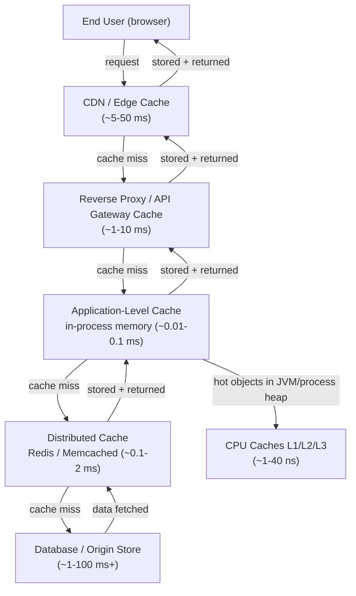

# [BEE-9001] Caching Fundamentals and Cache Hierarchy

:::info
CPU cache, application cache, CDN cache -- understanding the full stack of caching layers and the patterns that connect them.
:::

## Why Caching Matters

Every time your application fetches data, it pays a cost: network round-trips, disk I/O, CPU for query execution, and the infrastructure that handles all of it. Caching reduces that cost by keeping a copy of data closer to where it is needed.

The three primary motivations are:

- **Latency reduction** -- A Redis lookup takes ~0.1 ms. A database query under load can take 10-100 ms. A CDN edge node can serve a response in single-digit milliseconds vs. 100-300 ms from the origin. Every layer you avoid saves real time for real users.
- **Load reduction** -- A popular product page queried 10,000 times per minute hits your database 10,000 times without a cache. With a cache hit ratio of 99%, that drops to 100 database calls. Your database can handle the remaining load without scaling.
- **Cost savings** -- Fewer database queries, fewer compute cycles, cheaper bandwidth. At scale, a well-tuned cache can reduce infrastructure spend significantly.

## Cache Hierarchy

Modern systems have multiple caching layers. Data moves from slower, larger, cheaper storage toward faster, smaller, more expensive storage as it gets closer to the CPU or the end user.



| Layer | Technology | Typical Latency | Typical Capacity |
|---|---|---|---|
| CPU L1 cache | Hardware | ~1 ns | 32-512 KB |
| CPU L2 cache | Hardware | ~4 ns | 256 KB - 4 MB |
| CPU L3 cache | Hardware | ~10-40 ns | 4-64 MB |
| In-process memory | JVM heap, Node.js V8 heap | ~0.01-0.1 ms | MBs (limited by process) |
| Distributed cache | Redis, Memcached | ~0.1-2 ms | GBs |
| Reverse proxy / CDN PoP | Nginx, Varnish, Cloudflare | ~1-50 ms | GBs-TBs |
| Origin / database | PostgreSQL, MySQL, S3 | ~1-100+ ms | TBs+ |

The closer the cache is to the reader, the faster the response -- and the smaller the cache. The hierarchy forces you to be selective about what lives where.

## Caching Patterns

### Cache-Aside (Lazy Loading)

The application owns the cache interaction. The cache is populated on demand, only when data is actually requested.

**Read path:**

```
function get(key):
    value = cache.get(key)
    if value is null:                      // cache miss
        value = database.query(key)
        cache.set(key, value, ttl=300)     // populate cache with TTL
    return value
```

**Write path:**

```
function set(key, newValue):
    database.update(key, newValue)         // write to source of truth first
    cache.delete(key)                      // invalidate stale cache entry
    // next read will re-populate from DB
```

Characteristics:
- Cache is only populated with data that is actually read. No wasted memory on cold data.
- First request after a miss is slow (cold start). Can be mitigated with cache warming.
- The application code must handle both hit and miss paths.
- If you update the DB without invalidating the cache, you get stale reads until TTL expires.

Use when: read-heavy workloads, data that is read far more than it is written, acceptable tolerance for brief stale reads.

### Read-Through

The cache layer sits between the application and the database. On a miss, the cache itself fetches the data from the database, stores it, and returns it. The application always talks to the cache.

```
function get(key):
    // Application calls cache only.
    // Cache handles miss internally: fetches from DB, stores, returns.
    return cache.get(key)   // cache manages DB fetch transparently
```

Characteristics:
- Application code is simpler -- no explicit miss-handling logic.
- First miss is still slow; the cache does the heavy lifting, not the app.
- Often provided by caching libraries or frameworks (e.g., Spring Cache, NCache).

Use when: you want to keep caching logic out of business code; the caching layer supports read-through natively.

### Write-Through

Every write goes to the cache and the database synchronously before the write is acknowledged to the caller.

```
function set(key, newValue):
    cache.set(key, newValue)           // write to cache
    database.update(key, newValue)     // write to DB (same transaction or two-phase)
    return success
```

Characteristics:
- Cache is always consistent with the database. Reads after writes never see stale data.
- Write latency increases -- you pay for two writes on every mutation.
- Can populate the cache with data that is never read again (write without subsequent reads).
- Combine with TTL to prevent stale data from cold-written keys.

Use when: read-after-write consistency is critical; write volume is manageable; data written is likely to be read again soon.

### Write-Behind (Write-Back)

Writes go to the cache immediately and are acknowledged. The cache asynchronously flushes changes to the database in the background.

```
function set(key, newValue):
    cache.set(key, newValue)               // write to cache, acknowledge immediately
    queue.enqueue(WriteJob(key, newValue)) // async flush to DB
    return success  // caller gets ACK before DB is updated

// Background worker:
function flushWorker():
    while true:
        job = queue.dequeue()
        database.update(job.key, job.value)
```

Characteristics:
- Very low write latency for the caller.
- Risk of data loss if the cache crashes before the flush completes.
- Increased complexity: you need a reliable flush pipeline and failure recovery.
- Writes can be batched or coalesced, reducing total DB write load.

Use when: write throughput is the primary constraint; eventual persistence is acceptable; you have infrastructure to guarantee flush reliability (persistent queue, WAL-backed cache).

### Pattern Comparison

| Pattern | Read Consistency | Write Latency | Write Complexity | Risk |
|---|---|---|---|---|
| Cache-Aside | Eventual (TTL) | Low | Moderate | Stale on write |
| Read-Through | Eventual (TTL) | Low | Low | Cold start |
| Write-Through | Strong | High | Moderate | Cache bloat |
| Write-Behind | Eventual | Very Low | High | Data loss on crash |

## Cache Warming

After a deployment, cache flush, or cold start, all cache entries are missing. Every request is a miss, and the origin absorbs the full load. This is a **cold cache** problem.

Cache warming is the process of pre-populating the cache before production traffic hits it:

- **Proactive warming**: Before deploying, run a script that fetches and caches high-traffic keys (e.g., top 1000 product pages, homepage data).
- **Request replay**: Replay recent production traffic against the new cache to simulate real usage patterns.
- **Gradual rollout**: Route a small percentage of traffic to the new cache first, let it warm up, then shift the rest.

Without cache warming, your origin can experience a **thundering herd** -- a spike of simultaneous misses overwhelming the database immediately after a deploy.

## Cache Hit Ratio

Cache hit ratio is the primary health metric for any cache:

```
hit ratio = cache hits / (cache hits + cache misses) * 100%
```

A ratio of 95% means 95 out of 100 requests are served from cache. The remaining 5% go to the origin.

Guidelines:
- **> 95%** -- Healthy for read-heavy static content.
- **80-95%** -- Acceptable for mixed workloads with moderate write rates.
- **< 80%** -- Investigate: TTLs may be too short, key space may be too large, or the data access pattern is not cacheable.

Always measure hit ratio before and after changing caching configuration. A change that feels like an optimization (e.g., adding more cache capacity) can sometimes lower hit ratio by diluting hot data across more nodes.

## When NOT to Cache

Caching is a trade-off. There are cases where the cost outweighs the benefit:

1. **Frequently changing data** -- If data changes faster than your TTL, you will serve stale results. A stock ticker updating every second with a 60-second TTL is actively misleading.
2. **Low read-to-write ratio** -- If every row is written once and read once, caching adds overhead with no benefit. Session tokens with single-use semantics are an example.
3. **Highly personalized data** -- Data unique to each user (e.g., a user's shopping cart with applied discounts) may not benefit from shared caching infrastructure. Cache key design becomes complex and memory wasteful.
4. **Security-sensitive data** -- Cached data can be read by any process with cache access. Avoid caching authorization tokens, raw credentials, or PII unless the cache is properly access-controlled and encrypted.
5. **Cache as primary store** -- A cache is not a database. If your cache is cleared (planned eviction, OOM, crash), all data must be recoverable from the source of truth. Never cache data that has no durable backing store.

## Common Mistakes

1. **Caching without measuring hit ratio.** You cannot know if your cache is helping without instrumenting it. Add cache hit/miss counters before deploying any caching layer.
2. **No TTL (stale data forever).** Without a TTL, cached entries live until eviction. If the source data changes, the cache will serve stale results indefinitely. Always set a TTL appropriate to the data's change frequency.
3. **Caching everything.** Memory is finite. Caching rarely-accessed data wastes capacity that could hold hot data, reducing overall hit ratio. Profile your access patterns before deciding what to cache.
4. **Ignoring cache consistency with the source of truth.** If you update the database without invalidating or updating the cache, reads will return stale data. Design your write path to manage cache state explicitly (see write patterns above and [BEE-20](20.md)1).
5. **Treating the cache as the only data store.** Caches are ephemeral by default. Redis can be restarted, Memcached has no persistence, CDN caches are purged on deploy. Every cached value must be reconstructible from a durable source.

## Related BEPs

- [BEE-9002](cache-invalidation-strategies.md) -- Cache Invalidation Strategies: how to keep the cache consistent with the source of truth.
- [BEE-9003](cache-eviction-policies.md) -- Cache Eviction Policies: LRU, LFU, TTL, and how eviction affects hit ratio.
- [BEE-9004](distributed-caching.md) -- Distributed Caching: consistent hashing, sharding, and replication in multi-node caches.
- [BEE-9006](http-caching-and-conditional-requests.md) -- HTTP Caching: Cache-Control headers, ETags, conditional requests, and CDN semantics.

## References

- [Caching Strategies and How to Choose the Right One -- CodeAhoy](https://codeahoy.com/2017/08/11/caching-strategies-and-how-to-choose-the-right-one/)
- [Caching Patterns -- Database Caching Strategies Using Redis (AWS)](https://docs.aws.amazon.com/whitepapers/latest/database-caching-strategies-using-redis/caching-patterns.html)
- [ElastiCache Best Practices and Caching Strategies (AWS)](https://docs.aws.amazon.com/AmazonElastiCache/latest/dg/BestPractices.html)
- [Cache-Aside Pattern -- Azure Architecture Center (Microsoft)](https://learn.microsoft.com/en-us/azure/architecture/patterns/cache-aside)
- [What is a Cache Hit Ratio? -- Cloudflare](https://www.cloudflare.com/learning/cdn/what-is-a-cache-hit-ratio/)
- [What Is Cache Warming? -- IOriver](https://www.ioriver.io/terms/cache-warming)
