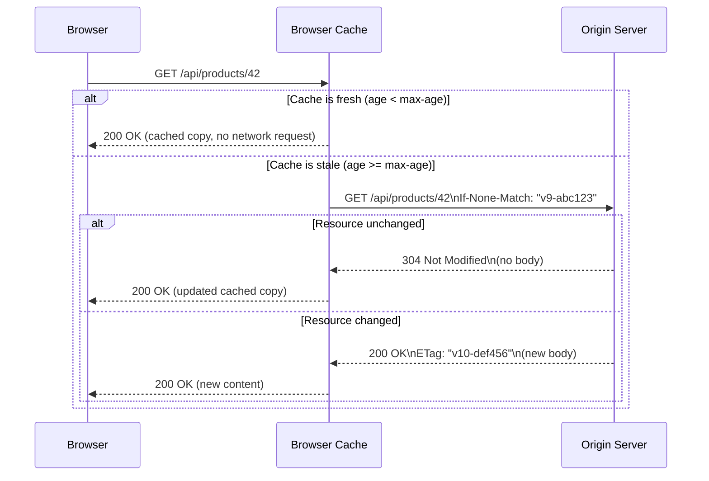

# [BEE-9006] HTTP Caching and Conditional Requests

:::info
Cache-Control directives govern how long a response may be stored and by whom. Conditional requests let clients revalidate stale entries cheaply, often receiving a 304 Not Modified with no body. Getting both right is the single highest-leverage performance improvement available at the HTTP layer.
:::

## Context

Every HTTP response travels over a network. The same resource may be requested thousands of times per minute from the same user, from the same CDN edge node, or from the same reverse proxy. The HTTP caching specification (RFC 9111, which obsoletes RFC 7234) exists to eliminate redundant transfers.

Two mechanisms work together:

- **Cache-Control** -- the server declares the caching policy: how long the response stays fresh, who may cache it, and what validators to use for revalidation.
- **Conditional requests** -- once a cached response becomes stale, the client asks the server "did this change?" rather than re-fetching the full body. If unchanged, the server replies with 304 Not Modified and zero body bytes.

Understanding the distinction between these two mechanisms -- and between the cache layers they interact with -- prevents the common mistakes that either serve stale content indefinitely or defeat caching entirely.

### Cache Layers

```
Browser Cache (private)
     |
     v
CDN / Reverse Proxy (shared)
     |
     v
Origin Server
```

- **Private cache** -- browser-local; stores personalized responses. Only the owning user sees it.
- **Shared cache** -- CDN or reverse proxy; stores responses for all users. Must not store private content.
- **Managed cache** -- explicitly operated (CDN dashboard, service workers); can go beyond standard HTTP semantics.

## Principle

**Use Cache-Control to match the caching policy to the mutability and sensitivity of each response; use ETags and Last-Modified to enable free revalidation when responses do expire.** Never force clients to re-download content that has not changed.

## Cache-Control Directives

### Freshness Directives

| Directive | Applies to | Meaning |
|---|---|---|
| `max-age=N` | Response | Fresh for N seconds after the response was generated. |
| `s-maxage=N` | Response | Like `max-age` but for shared caches only; overrides `max-age` for CDNs. |
| `stale-while-revalidate=N` | Response | Serve stale for up to N extra seconds while revalidating in the background. |
| `stale-if-error=N` | Response | Serve stale for up to N seconds when the origin returns a 5xx or is unreachable. |

### Storage Directives

| Directive | Meaning |
|---|---|
| `no-store` | Do not store the response anywhere -- not in any cache, private or shared. Use for sensitive data. |
| `no-cache` | Store the response, but always revalidate with the origin before reuse (even if still fresh by age). This is NOT "no caching". |
| `private` | May only be stored in a private (browser) cache -- not by CDNs or proxies. |
| `public` | May be stored by any cache, including shared caches, even if the response contains an `Authorization` header. |
| `immutable` | The resource will never change for the lifetime of `max-age`. Browsers skip revalidation on reload. |
| `must-revalidate` | Do not serve a stale response -- if it cannot be revalidated, the cache must return 504. |

### Common Mistake: `no-cache` vs `no-store`

```http
# WRONG: you wanted to prevent caching of a login token
Cache-Control: no-cache
# This stores the response and just requires revalidation. The token is still in the cache.

# CORRECT: for truly sensitive data that must not be stored
Cache-Control: no-store
```

`no-cache` means "validate before reuse." `no-store` means "do not keep a copy."

## Concrete Examples

### 1. Static Asset with Content Hash in URL (maximum cache efficiency)

```http
# Request
GET /static/bundle.a3f8b2c1.js HTTP/1.1
Host: example.com

# Response
HTTP/1.1 200 OK
Cache-Control: public, max-age=31536000, immutable
Content-Type: application/javascript
ETag: "a3f8b2c1"
Last-Modified: Mon, 31 Mar 2026 10:00:00 GMT
Content-Length: 84231
```

The URL changes when the file changes (content hash), so the browser and CDN may cache it for one year. `immutable` tells the browser to skip revalidation on reload -- the file literally cannot change at this URL.

### 2. API Response (private, short-lived, must revalidate)

```http
# Request
GET /api/user/profile HTTP/1.1
Host: example.com
Authorization: Bearer eyJ...

# Response
HTTP/1.1 200 OK
Cache-Control: private, max-age=60, must-revalidate
ETag: "user-42-v7"
Content-Type: application/json
Content-Length: 312

{"id": 42, "name": "Alice", ...}
```

`private` prevents CDN storage. `max-age=60` allows the browser to serve the cached response for 60 seconds without hitting the server. `must-revalidate` ensures the browser never serves a stale copy if it cannot reach the origin.

### 3. Sensitive Data (no caching at all)

```http
# Request
POST /auth/token HTTP/1.1
Host: example.com

# Response
HTTP/1.1 200 OK
Cache-Control: no-store
Content-Type: application/json

{"access_token": "secret", "expires_in": 3600}
```

Access tokens must not be stored in any cache. `no-store` is the only correct directive here.

## Conditional Requests

When a cached response expires, re-fetching the full body is wasteful if the content has not changed. Conditional request headers let the client ask the server to confirm whether the content is still the same.

### ETags and If-None-Match (preferred)

An ETag is an opaque string that identifies a specific version of a resource -- typically a hash of the response body or a database row version.

**First request (cache miss):**

```http
GET /api/products/42 HTTP/1.1
Host: example.com

HTTP/1.1 200 OK
Cache-Control: private, max-age=60
ETag: "v9-abc123"
Content-Type: application/json
Content-Length: 450

{"id": 42, "name": "Widget", ...}
```

**Revalidation request (60 seconds later, after max-age expires):**

```http
GET /api/products/42 HTTP/1.1
Host: example.com
If-None-Match: "v9-abc123"

# Resource unchanged:
HTTP/1.1 304 Not Modified
Cache-Control: private, max-age=60
ETag: "v9-abc123"
# No body -- 0 bytes transferred for the payload

# Resource changed:
HTTP/1.1 200 OK
Cache-Control: private, max-age=60
ETag: "v10-def456"
Content-Type: application/json
Content-Length: 460

{"id": 42, "name": "Widget Pro", ...}
```

The 304 response carries no body -- only headers. The browser uses its cached copy and refreshes the expiry. The bandwidth saving is proportional to the response body size.

### Last-Modified and If-Modified-Since (legacy fallback)

```http
# First response
HTTP/1.1 200 OK
Last-Modified: Mon, 07 Apr 2026 08:00:00 GMT
Cache-Control: max-age=3600

# Revalidation
GET /page.html HTTP/1.1
If-Modified-Since: Mon, 07 Apr 2026 08:00:00 GMT

HTTP/1.1 304 Not Modified
```

`Last-Modified` is less precise (one-second granularity) and can be wrong for dynamically generated responses where the timestamp changes even if the content does not. Prefer ETags. When both are available, the server should honor `If-None-Match` and treat `If-Modified-Since` as a secondary check.

### Conditional Request Flow



## The Vary Header

The `Vary` header tells caches that the response depends on certain request headers. A CDN stores separate copies of the same URL for each distinct combination of those header values.

```http
HTTP/1.1 200 OK
Cache-Control: public, max-age=3600
Vary: Accept-Language

# French user sees a French version cached separately from the English version
```

Without `Vary: Accept-Language`, a CDN might cache the French response and serve it to English-speaking users.

```http
# Multi-dimension variation
Vary: Accept-Language, Accept-Encoding
```

**Warning:** `Vary: User-Agent` creates an explosion of cache variants (one per browser version) and should never be used. If content genuinely varies by user agent, use separate URLs or a different approach.

### Vary and CDN Behavior

| Request | Accept-Language | Cache key | Stored separately |
|---|---|---|---|
| GET /home | en-US | /home + en-US | Yes |
| GET /home | zh-TW | /home + zh-TW | Yes |
| GET /home | en-US | /home + en-US | Hits first entry |

## CDN Caching vs Browser Caching

| Property | Browser Cache | CDN / Shared Cache |
|---|---|---|
| Scope | Single user | All users |
| Controlled by | `private` / `public` | `s-maxage`, `public` |
| Can store `Authorization` responses | Yes | Only with `public` directive |
| Invalidation | User can clear manually | CDN purge API or `surrogate-key` |
| Respects `Vary` | Yes | Yes (may have implementation limits) |

For API responses that differ per user: use `private, max-age=N`. For shared resources (public pages, static assets): use `public, s-maxage=N` or just `max-age=N`.

The `s-maxage` directive is ignored by browsers but overrides `max-age` for CDNs:

```http
# Browser caches for 60s, CDN caches for 1 hour
Cache-Control: max-age=60, s-maxage=3600
```

## Cache Busting

When a mutable URL has a long `max-age`, you cannot push an update -- caches will serve the old content until it expires. **Cache busting** makes old content unreachable by changing the URL.

### Content Hash in Filename (recommended)

```html
<!-- Build tool outputs a hash in the filename -->
<script src="/static/bundle.a3f8b2c1.js"></script>
<link rel="stylesheet" href="/static/styles.f7d3a1e9.css">
```

```http
HTTP/1.1 200 OK
Cache-Control: public, max-age=31536000, immutable
```

When the content changes, the hash changes, the filename changes, and the browser fetches the new file at its new URL. The old URL simply stops being referenced.

### Query String Versioning (fragile -- avoid for CDN assets)

```html
<!-- Query string changes break some CDN caches -->
<script src="/static/bundle.js?v=42"></script>
```

Query string parameters are part of the cache key for most CDNs, so this technique does work -- but file name hashing is more reliable, avoids proxy ambiguity, and is the default output of every major build tool (Vite, webpack, esbuild).

### Never set long `max-age` on mutable URLs

```http
# WRONG: HTML files change on every deploy
GET /index.html HTTP/1.1

HTTP/1.1 200 OK
Cache-Control: public, max-age=86400   # users see stale HTML for a day

# CORRECT
HTTP/1.1 200 OK
Cache-Control: no-cache                # always revalidate; 304 if unchanged
ETag: "deploy-20260407"
```

Use `no-cache` (not `no-store`) for HTML entry points so they are revalidated on every navigation but still benefit from 304 responses.

## API Response Caching Considerations

REST APIs can use HTTP caching, but with care:

1. **Use ETags for GET responses.** Generate an ETag from the response body hash or the resource's `updated_at` timestamp. This enables free 304 revalidation for repeated reads.

2. **Set appropriate `max-age` for read-heavy, slow-changing data.** A product catalog that changes hourly can safely use `max-age=300` (5 minutes).

3. **Use `private` for user-specific data.** Any response that includes user-specific content must not be stored in a shared cache.

4. **Avoid caching POST/PUT/PATCH responses.** These are non-idempotent. The browser does not cache them, and CDNs should not either.

5. **Invalidate downstream CDN cache on write.** When a resource changes, issue a CDN purge for its URL so the shared cache does not serve stale data.

```http
# Read endpoint: cacheable with revalidation
GET /api/catalog/products/42 HTTP/1.1

HTTP/1.1 200 OK
Cache-Control: public, max-age=300, stale-while-revalidate=60
ETag: "product-42-v9"
```

## Common Mistakes

### 1. Using `no-cache` when you mean `no-store`

`no-cache` stores the response and requires revalidation. It does not prevent caching. For sensitive data (tokens, PII), always use `no-store`.

### 2. Missing `Vary` header on content-negotiated responses

If your server returns different content based on `Accept-Language` but omits `Vary: Accept-Language`, a CDN will cache one version and serve it to all users regardless of their language preference. Every dimension of response variation must appear in `Vary`.

### 3. Not using ETags for API responses

Without an ETag, a stale cached response forces a full re-download. Adding an ETag to `GET /api/resource/:id` costs nothing at the server and can eliminate entire response bodies for unchanged resources -- especially valuable for large payloads.

### 4. Cache-busting by query string instead of content hash

Query string cache-busting works in most browsers but can fail silently with some CDN configurations, HTTP/1.0 proxies, and certain Vary header interactions. Content hash in the filename is unambiguous and is the default for all modern build tools.

### 5. Setting long `max-age` on mutable URLs

If `/index.html` or `/api/config` carries `max-age=86400`, a deploy that changes the content will go unseen by cached clients for up to a day. Either use content hashes (for static assets) or use `no-cache` with an ETag (for mutable documents).

## Related BEPs

- [BEE-3003: HTTP Fundamentals](../networking-fundamentals/http-versions.md) -- request/response model, status codes, and headers
- [BEE-9001: Caching Fundamentals and Cache Hierarchy](../caching/caching-fundamentals-and-cache-hierarchy.md) -- TTL, eviction, and consistency concepts that underpin this article
- [BEE-13005: CDN Architecture](../performance-scalability/content-delivery-and-edge-computing.md) -- how CDN nodes consume and propagate `Cache-Control` directives

## References

- [RFC 9111: HTTP Caching](https://www.rfc-editor.org/rfc/rfc9111.html) -- authoritative specification (obsoletes RFC 7234)
- [HTTP caching -- MDN Web Docs](https://developer.mozilla.org/en-US/docs/Web/HTTP/Guides/Caching) -- comprehensive guide with examples
- [HTTP conditional requests -- MDN Web Docs](https://developer.mozilla.org/en-US/docs/Web/HTTP/Guides/Conditional_requests) -- ETag, Last-Modified, and 304 flow
- [Cache-Control header -- MDN Web Docs](https://developer.mozilla.org/en-US/docs/Web/HTTP/Reference/Headers/Cache-Control) -- directive reference
