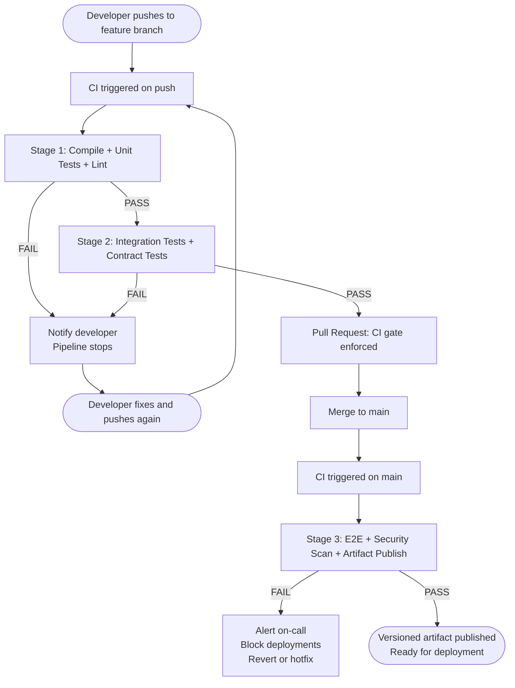

# [BEE-16001] Continuous Integration Principles

:::info
Integrate code frequently, verify every change with automated builds and tests, and treat a broken build as the team's highest-priority problem.
:::

## Context

Software teams that work on long-lived feature branches accumulate divergence. The longer a branch lives, the more it drifts from the mainline. When the branch is finally merged, the team faces an "integration hell" period — merge conflicts, broken tests, and regressions that are expensive to diagnose because the blast radius of the change is enormous.

Continuous Integration (CI) is the practice of eliminating that problem entirely by integrating code changes frequently — at least daily — against a shared mainline, and verifying each integration with an automated build and test suite.

Martin Fowler's canonical definition:

> "Continuous Integration is a software development practice where each member of a team merges their changes into a codebase together with their colleagues' changes at least daily, and each of these integrations is verified by an automated build (including test) to detect integration errors as quickly as possible."
>
> — [Continuous Integration, martinfowler.com](https://martinfowler.com/articles/continuousIntegration.html)

## Principles

### 1. Integrate Frequently — At Least Daily

Each developer merges to the mainline at minimum once per day. Integration frequency is a forcing function for keeping changes small and reviewable. Small changes are easier to understand, easier to review, and easier to revert if something goes wrong.

A pull request that touches 50 lines is reviewed in minutes. A pull request that touches 5,000 lines sits in the queue for days, accumulates more drift, and eventually merges with fingers crossed.

### 2. Prefer Trunk-Based Development

[Trunk-based development](https://trunkbaseddevelopment.com/) is the branching model most compatible with CI. Developers work on short-lived feature branches (ideally less than 2 days) and merge back to the trunk (main) frequently. Long-lived feature branches are a CI antipattern — they defer integration and defeat the purpose of the practice.

Rules for short-lived branches:

- A feature branch should be owned by one developer (or a pair).
- It should not live longer than 2 days before merging.
- It must pass CI before merging to main.
- Delete it immediately after merge.

If a feature is too large to integrate in 2 days, use feature flags to ship the code dark while the feature is incomplete.

### 3. Every Commit Triggers a Build

The CI system must run automatically on every push — including pushes to feature branches. Running CI only on main defeats the purpose: by the time code reaches main, the developer has already moved on and context-switching back to fix a failure is expensive.

The pipeline runs on every push. Developers get feedback before they create a pull request.

### 4. Builds Must Be Fast — Under 10 Minutes

A build that takes 30 minutes is not a CI build. Developers will stop waiting for it, push ahead, and ignore failures. The feedback is worthless if it arrives too late.

Target: the primary pipeline (compile + unit tests + lint) must complete in under 10 minutes. Integration tests and heavier checks can run in a downstream stage after the fast stage passes.

Tactics for keeping builds fast:

- Cache dependencies aggressively (node_modules, Maven local repo, pip cache).
- Parallelize test execution across multiple runners.
- Split tests by execution time — keep the fastest tests in stage 1.
- Defer slow tests (end-to-end, performance) to a nightly or post-merge pipeline.

### 5. Green Build Discipline — Stop the Line

A broken build is not a background problem. It blocks every developer who wants to merge. The team that broke the build is responsible for fixing it before doing anything else.

Rules:

- A red main branch build must be fixed or reverted within 15 minutes.
- No new work merges to main while the build is red.
- Flaky tests are not "just flaky" — they erode trust in the pipeline and must be fixed or quarantined immediately.

This discipline is borrowed from lean manufacturing's "stop the line" principle: a quality problem at any station halts the entire line until resolved.

### 6. Build Stages — Fast First, Slow Later

Structure the pipeline so the fastest, most valuable checks run first. Fail fast on the cheapest signals before spending time on expensive ones.

```
Stage 1 (< 5 min):   Compile / type-check → Unit tests → Lint / static analysis
Stage 2 (< 15 min):  Integration tests → Contract tests
Stage 3 (on merge):  End-to-end tests → Security scan → Artifact publish
```

If stage 1 fails, stages 2 and 3 do not run. This saves compute and returns feedback faster.

### 7. Artifact Versioning — Every Build Produces a Traceable Artifact

Every successful pipeline run on main must produce a versioned, immutable artifact. The artifact version must be traceable back to the exact commit that produced it.

A common scheme:

```
{service}-{semver}-{git-sha}-{build-number}
example: payments-api-1.4.2-a3f9c21-build.847
```

Without artifact versioning, you cannot reproduce a deployment, roll back reliably, or audit what code is running in production.

### 8. Require CI Pass Before Merge

Branch protection rules must enforce that the CI pipeline passes before a pull request can be merged. This is a non-negotiable gate.

Do not allow force merges that bypass CI. The only exception is an emergency rollback using a known-good artifact — never a bypass to merge untested code.

## CI Pipeline: Reference Architecture



## Worked Example

### Good path: short-lived branch, fast feedback

1. Developer creates a feature branch on Monday morning.
2. Writes code and pushes 3 commits throughout the day.
3. CI runs on each push, completes in 8 minutes.
4. All green. Developer opens a pull request Monday afternoon.
5. Code review completes in 1 hour. CI re-runs on the PR head — still green.
6. PR merges to main. CI runs on main, artifact published within 12 minutes.
7. Total time from first commit to deployable artifact: less than 1 working day.

### Antipattern: 2-week feature branch

1. Developer creates a branch on Monday. Does not merge until two weeks later.
2. Main branch has received 40 other commits in that time.
3. Developer merges — 23 merge conflicts, resolves them hastily.
4. CI fails: 12 unit tests broken, 3 integration tests broken.
5. Developer spends 2 days debugging. Some failures are not related to their feature at all — they were introduced by other merges two weeks ago but are only visible now.
6. Team's confidence in the build degrades. The cycle repeats.

The root cause is not the developer — it is the delayed integration. The 2-week branch is the antipattern.

## Common Mistakes

| Mistake | Why It Hurts | Fix |
|---|---|---|
| CI builds taking > 15 minutes | Developers stop waiting; failures are ignored | Parallelize, cache, move slow tests to stage 2 |
| Ignoring broken builds ("it's just flaky") | Erodes trust; real failures get missed | Fix or quarantine flaky tests within 24 hours |
| Running CI only on main, not on feature branches | Feedback arrives after merge; expensive to fix | Trigger CI on every push to every branch |
| No artifact versioning | Cannot reproduce or roll back deployments | Tag every main-branch artifact with commit SHA |
| Long-lived feature branches (> 1 week) | Accumulated drift → integration hell | Enforce short-lived branches + feature flags |
| Skipping CI gate on merge | One bad merge breaks everyone | Branch protection: require CI pass, no bypass |

## Related BEPs

- [BEE-15001](../testing/testing-pyramid.md) — Testing strategy and how tests integrate into the CI pipeline
- [BEE-16002](deployment-strategies.md) — Deployment strategies that consume CI-produced artifacts
- [BEE-16006](pipeline-design.md) — CI/CD pipeline design and infrastructure

## References

- [Continuous Integration — Martin Fowler](https://martinfowler.com/articles/continuousIntegration.html)
- [Trunk Based Development — trunkbaseddevelopment.com](https://trunkbaseddevelopment.com/)
- [Short-Lived Feature Branches — trunkbaseddevelopment.com](https://trunkbaseddevelopment.com/short-lived-feature-branches/)
- [Trunk-based Development — Atlassian](https://www.atlassian.com/continuous-delivery/continuous-integration/trunk-based-development)
- [CI/CD Pipeline Best Practices — GitScrum Docs](https://docs.gitscrum.com/en/best-practices/ci-cd-pipeline-best-practices/)
