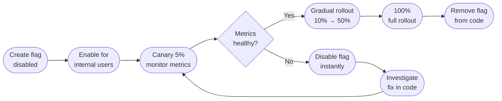

# [BEE-16004] Feature Flags

:::info
Feature flags decouple code deployment from feature release, letting you ship code to production without exposing it to users — and enabling instant rollback without a redeploy.
:::

## Context

The traditional model ties a feature's release directly to its deployment: you deploy, users see it. This creates pressure to batch features together, delays releases while testing is incomplete, and forces a full redeploy to undo a bad release.

Feature flags — also called feature toggles — break that coupling. Code ships to production behind a conditional gate. The gate is opened separately, and independently of the deployment. This means you can deploy on Friday and release on Tuesday. You can expose a feature to 1% of users, watch the metrics, and roll back by flipping a flag — not by pushing a hotfix.

**References:**
- Pete Hodgson / Martin Fowler, [Feature Toggles (aka Feature Flags)](https://martinfowler.com/articles/feature-toggles.html)
- Martin Fowler, [Feature Flag](https://martinfowler.com/bliki/FeatureFlag.html)
- LaunchDarkly, [What Are Feature Flags?](https://launchdarkly.com/blog/what-are-feature-flags/)
- Octopus Deploy, [4 Types of Feature Flags](https://octopus.com/devops/feature-flags/)

## Principle

**Separate deployment from release. Use feature flags to control what users see, not when code ships.** Keep flags short-lived: create them with a purpose, remove them when that purpose is fulfilled.

## The Four Categories of Feature Flags

Not all flags are the same. Confusing the categories leads to flags that are never removed or flags used for the wrong purpose.

### 1. Release Toggles

Release toggles hide in-progress or not-yet-stable features from users. They are the most common type and the most prone to accumulating as technical debt.

- **Lifespan:** Short — days to weeks. Remove immediately after full rollout.
- **Who controls it:** Engineering and release management.
- **Example:** A rewritten checkout flow is deployed but hidden. The flag is enabled for employees first, then 5% of users, then rolled out progressively to 100%.

### 2. Experiment Toggles (A/B Flags)

Experiment toggles split users into cohorts and route each cohort through a different code path. The goal is measurement, not risk reduction.

- **Lifespan:** Medium — duration of the experiment, then removed.
- **Who controls it:** Product and data teams.
- **Example:** 50% of users see a "Buy Now" button, 50% see "Add to Cart". Conversion is compared. Winning variant becomes the permanent behavior; flag is removed.

### 3. Ops Toggles (Kill Switches)

Ops toggles control operational behavior. They exist so that engineering can degrade gracefully or disable a subsystem during an incident — instantly, without a deploy.

- **Lifespan:** Long — these are permanent or semi-permanent operational controls.
- **Who controls it:** SRE / on-call engineers.
- **Example:** A recommendation engine adds latency to the homepage. Ops toggle disables it during a traffic spike, reverting to a static list.

Kill switches are the most critical type of flag. Every feature that could degrade availability should have one.

### 4. Permission Toggles

Permission toggles control access to features based on user identity, plan tier, or role. Unlike A/B flags, the cohort is explicit and intentional.

- **Lifespan:** Long — typically permanent as long as the access model exists.
- **Who controls it:** Product and business operations.
- **Example:** An analytics dashboard is visible only to users on an enterprise plan. The toggle checks the user's plan at runtime.


## Feature Flag Lifecycle

Every flag should have a defined lifecycle. Flags with no end state become permanent clutter.



### Stages

| Stage | Action | Gate |
|---|---|---|
| Created | Flag exists, disabled by default | Code deployed and verified in staging |
| Internal | Enabled for employees / internal accounts | No production user impact |
| Canary | 5% of production traffic | Error rate, P99 latency within baseline |
| Gradual rollout | 10% → 25% → 50% | Metrics checked at each stage |
| Full rollout | 100% | Feature considered stable |
| Removed | Flag deleted from config and code | Dead code paths cleaned up |

**The remove stage is mandatory.** A flag that reaches 100% and is never removed becomes dead weight — it adds a branch that is always taken, confuses new engineers, and contributes to combinatorial explosion when multiple stale flags interact.


## Worked Example: Launching a New Checkout Flow

**Scenario:** A rewritten checkout flow is ready for production. The team wants a safe, incremental release with instant rollback capability.

**Setup:**

```
flag: checkout_v2_enabled
default: false
```

**Step 1 — Deploy**

The new checkout code ships behind the flag. All production traffic still hits the old flow (`checkout_v2_enabled = false`).

**Step 2 — Internal preview**

Enable for all employees. Run manual QA, verify analytics events fire correctly.

**Step 3 — Canary 5%**

Set `checkout_v2_enabled = true` for 5% of users (random segment). Monitor for 30 minutes:
- Cart conversion rate vs. baseline
- Checkout error rate
- P99 latency on order submission endpoint

**Step 4 — Metrics degrade**

At 5%, P99 order submission latency increases by 40%. Set `checkout_v2_enabled = false` immediately — all traffic returns to the old checkout with zero redeploy. The team investigates the latency regression, fixes it, and re-enters the canary stage.

**Step 5 — Progressive rollout**

After the fix: canary 5% passes → expand to 10% → 25% → 50% → 100%. Each stage holds for 30 minutes with automated metric gates.

**Step 6 — Remove the flag**

Once at 100% for 48 hours with no incidents: delete the flag configuration, remove the `if (checkout_v2_enabled)` conditional from the code, delete the old checkout code path. The new checkout is now the only checkout.


## Progressive Rollout Percentages

A standard progressive rollout schedule for most services:

```
Internal users → 1% → 5% → 10% → 25% → 50% → 100%
```

Each stage has a hold period (typically 15–60 minutes for synchronous services, longer for async or low-traffic services) and automated promotion gates:

- Error rate: new path <= baseline
- P99 latency: new path <= baseline × 1.1
- Business metric (conversion, throughput): no regression

Do not advance stages manually by checking dashboards. Define the promotion criteria before the rollout starts, then automate the check.


## Kill Switches

A kill switch is an ops toggle specifically designed for instant disablement of a feature that could threaten availability.

**When to create a kill switch:**

- Any feature that calls an external dependency (payment provider, ML inference endpoint, third-party API)
- Any feature that adds non-trivial CPU or memory overhead
- Any feature that fans out into high-cardinality database queries
- Any feature launching to a large user base for the first time

**How kill switches work:**

Kill switches are evaluated at request time, not at deployment time. When the switch is flipped, the next request sees the change. There is no deploy, no restart, and no minutes of propagation delay.

```
request arrives
  → flag evaluation (in-memory or low-latency remote store)
  → if kill_switch_enabled: execute feature
  → else: fallback behavior
  → response
```

Kill switches complement graceful degradation (see [BEE-12005](#)) — the flag disables the feature, the fallback behavior keeps the service responding.


## Flag Evaluation: Server-Side vs. Client-Side

| | Server-side | Client-side |
|---|---|---|
| Evaluation location | Backend service, at request time | Browser or mobile app, at startup |
| Latency | Negligible — in-process or local cache | Adds a network call if fetched at startup |
| Security | Flag logic is not exposed to the client | Users can inspect and potentially manipulate flags |
| Targeting | Full request context available (user ID, account, IP) | Limited to what the client knows |
| Use for | Release toggles, kill switches, ops toggles | Experiment toggles for UI, client feature rollouts |

For backend services, always evaluate flags server-side. Client-side evaluation is appropriate for pure UI experiments where the server does not need to know which variant was shown.


## Common Mistakes

**1. Never removing old flags.**

The most common failure mode. A service accumulates 50 flags over two years; nobody knows which are safe to remove. The codebase has dozens of dead branches that all evaluate to true. Add flag removal to the definition of done for every release toggle: the work is not finished until the flag and the dead code path are deleted.

**2. Using flags for permanent configuration.**

A feature flag is not a config value. If a behavior will always vary by environment (dev vs. production), use environment configuration. If a behavior is controlled by billing plan and will never be removed, it may be a permission toggle — but document it explicitly and treat it like a long-lived service. Do not accumulate business logic inside feature flag conditions.

**3. Testing only the flag-on path.**

When `flag = true` is enabled in production, `flag = false` is also production code — it serves the users who haven't been exposed yet, and it is the rollback path. Both branches must be covered by tests. A failing flag-off path discovered during a rollback is the worst possible time to find it.

**4. No flag naming convention.**

Without naming conventions, flags become unmanageable at scale. A consistent convention communicates intent and lifespan at a glance:

```
[service]_[feature]_[type]

checkout_v2_release         # release toggle — remove after rollout
homepage_rec_killswitch     # ops toggle — permanent kill switch
pricing_experiment_cta_ab   # experiment toggle — remove after analysis
```

**5. Flag dependencies.**

Flag A requires Flag B to be enabled. Flag B requires Flag C. This creates combinatorial complexity: `2^3 = 8` states, most of which are never tested. If a feature requires another feature, promote both to production together or design around the dependency. Never create a flag that has a hard runtime dependency on another flag's state.


## Related BEPs

- [BEE-12005: Graceful Degradation](#) — Kill switches enable instant degradation; graceful degradation defines the fallback behavior when a feature is disabled
- [BEE-15006: Testing in Production](#) — Feature flags are one mechanism for safe production testing; progressive rollout relies on production observability
- [BEE-16002: Canary Deployment](#) — Canary deployment routes traffic by instance percentage; feature flags route by user segment or percentage within a single deployment
