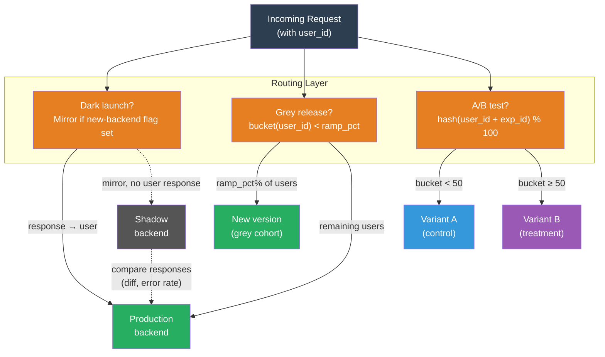

# [BEE-16007] Grey and Dark Releases, and A/B Testing

:::info
Dark launches, grey releases, and A/B tests are three production-testing patterns that share the same substrate — routing a fraction of real traffic to a different code path — but serve different goals: validating new systems under load without user impact, progressively rolling out changes with automatic rollback gates, and measuring whether a change improves user behavior.
:::

## Context

The insight behind all three patterns is the same: staging environments cannot reproduce production. Real traffic has a distribution of user types, session states, third-party latency, and edge-case inputs that no synthetic load generator faithfully replicates. The only way to know how a new system behaves under real conditions is to route real production traffic to it — the question is how much risk the user is exposed to while you learn.

Facebook popularized the **dark launch** (also called shadow testing or traffic mirroring) as a technique for validating new backends at scale before enabling them for users. The pattern — deploy the new code, mirror production traffic to it, compare outputs without ever returning the shadow response — lets engineers stress-test a new system under production load while users continue receiving the old, known-good response. The new code is "dark" because users cannot see or interact with its output.

Gradually routing real users to a new version — a **grey release** or canary deployment — converts deployment risk into a measurable signal. Jez Humble and David Farley's "Continuous Delivery" (Addison-Wesley, 2010) formalized the principle: release incrementally, automate rollback gates on observable signals (error rate, latency, business KPIs), and the blast radius of any bad release is bounded to the cohort currently on the new version.

**A/B testing** (online controlled experimentation) adds a measurement objective on top of the traffic split. Diane Tang, Aniket Agarwal, Deirdre O'Brien, and Micha Meyer at Google described the infrastructure challenges of running experiments at scale in "Overlapping Experiment Infrastructure: More, Better, Faster Experimentation" (KDD, 2010). The paper's central insight is that running many experiments simultaneously requires two properties: experiment orthogonality (different experiments do not interfere with each other's measurements) and user-consistent assignment (a given user must always see the same variant, or the experiment's metrics are contaminated). The second property — user consistency — is what distinguishes A/B testing from a simple traffic percentage split, and its absence is the most common implementation mistake.

## Design Thinking

All three patterns route a fraction of production traffic to a different code path. What differs is the routing unit, whether the user sees the result, and what is being measured:

| Pattern | Routing unit | User sees result? | Primary goal |
|---|---|---|---|
| Dark launch | Request (mirrored) | No | Load and correctness validation |
| Grey release | Request or user cohort | Yes | Stability-gated progressive rollout |
| A/B test | User (consistent) | Yes | Behavioral measurement |

**The confidence ladder.** The three patterns naturally sequence into a risk reduction pipeline: dark launch first (validate that the new code handles production load without errors), then grey release (expose a small user cohort, watch for regressions, ramp up), then A/B test (once stable, measure whether the new experience produces better outcomes). Each stage uses the previous stage's signal as a prerequisite: do not grey-release a system that failed shadow response comparison; do not A/B test a release that triggers rollback gates.

**Why load-balancer percentage splits break A/B metrics.** A load balancer routing 50% of requests to service A and 50% to service B routes per-request, not per-user. A single user making multiple requests in a session will see service A on some requests and service B on others. Their behavioral signal — did they convert, how long did they stay, did they click — reflects a blend of both variants. Aggregating this contaminated signal across millions of users does not produce a valid measurement of the difference between A and B. User-consistent bucket assignment (`bucket = hash(user_id + experiment_id) % 100`) solves this: the same user always hits the same variant because the hash is deterministic and requires no external state store.

## Visual



## Best Practices

### Dark Launch

**MUST NOT let the shadow path trigger irreversible side effects.** If the new backend sends emails, charges payment methods, decrements inventory, or enqueues messages, those side effects affect real users even though no response is returned. Shadow paths MUST be read-only, or side-effecting calls MUST be stubbed in shadow mode. A common approach: pass a `X-Shadow-Request: true` header and have downstream services return mock 200 responses without executing writes.

**Compare shadow responses structurally, not byte-for-byte.** JSON field order, timestamps, and floating-point precision legitimately differ between implementations. Compare semantically equivalent fields and monitor error rates and latency distributions. A shadow error rate meaningfully above zero, or a p99 latency significantly higher than production, is a signal to investigate before proceeding.

**Cap shadow traffic to protect the new backend.** A new system has not been capacity-planned for 100% of production traffic. SHOULD rate-limit shadow mirroring to 10–20% of actual traffic when first validating a new backend, increasing only after confirming the system handles the load.

### Grey Release

**Define rollback gates before the first ramp step, not after.** A grey release without pre-defined gates will default to human judgment under pressure — "the error rate looks a little high, but let's wait and see." Define thresholds before starting: if the new version's error rate exceeds baseline by more than N% for M consecutive minutes, or p99 latency increases by more than X ms, automatically roll back. Argo Rollouts and Flagger both support metric-driven automatic rollback as first-class primitives.

**Ramp in steps with a bake period at each step.** Start at 1–5% of traffic. After the error rate and latency are stable for a defined bake period (30 minutes minimum, one deployment cycle if the release affects scheduled jobs), promote to the next step. Typical ramp schedule: 1% → 5% → 20% → 50% → 100%.

**SHOULD route by user cohort, not by request, for stateful experiences.** A user who sees version A on one page load and version B on the next may experience broken state (a shopping cart that doesn't recognize their session, a UI that resets progress). Request-level routing is acceptable for stateless API endpoints; user-level routing is required for session-sensitive surfaces.

### A/B Testing

**MUST use deterministic hash-based bucket assignment.** The assignment `bucket = hash(user_id + experiment_id) % 100` is deterministic (same user, same experiment → same bucket every time), requires no external state, scales to any traffic volume, and isolates experiments from each other (different `experiment_id` values produce independent bucket distributions). MUST NOT use random-per-request assignment (produces mixed variants for the same user) or session-cookie-only assignment (breaks across devices and browser restarts).

**MUST NOT stop an experiment early because results look good.** Checking results repeatedly and stopping when significance is reached (called "peeking") inflates the false positive rate. The p-value threshold was designed for a single check at a pre-specified sample size. Either: (a) determine the required sample size before starting (based on minimum detectable effect and desired power) and wait until it is reached; or (b) use a sequential testing method (SPRT, always-valid inference) that mathematically accounts for multiple looks.

**Run experiments for at least one full usage cycle.** The **novelty effect** causes users to engage more with any new UI element simply because it is unfamiliar. An experiment that runs for two days in the first week after launch will show inflated engagement for the treatment variant. Experiments SHOULD run for at least 7–14 days to capture the full weekly usage cycle and allow the novelty effect to decay.

**Isolate concurrent experiments.** Two experiments running on the same user population simultaneously will interact: an experiment on checkout flow and an experiment on the product page share users, and users in both experiments produce metrics that reflect the combination of both treatments. Use orthogonal bucketing (different `experiment_id` seeds produce independent bucket assignments) and restrict each experiment to a disjoint user subset when interaction effects are a concern.

## Example

**Deterministic user bucket assignment:**

```python
import hashlib

def get_experiment_bucket(user_id: str, experiment_id: str, num_buckets: int = 100) -> int:
    """
    Returns a stable bucket [0, num_buckets) for the given user and experiment.
    The same user always lands in the same bucket for the same experiment,
    but different experiments produce independent distributions.
    """
    key = f"{user_id}:{experiment_id}"
    digest = hashlib.sha256(key.encode()).hexdigest()
    return int(digest[:8], 16) % num_buckets

def assign_variant(user_id: str, experiment_id: str, treatment_pct: int = 50) -> str:
    bucket = get_experiment_bucket(user_id, experiment_id)
    return "treatment" if bucket < treatment_pct else "control"

# Same user always gets the same variant for the same experiment
assert assign_variant("user-42", "checkout-redesign") == assign_variant("user-42", "checkout-redesign")

# Different experiments assign independently
v1 = assign_variant("user-42", "checkout-redesign")
v2 = assign_variant("user-42", "homepage-hero")
# v1 and v2 may differ — that's correct; they are independent experiments
```

**Grey release traffic split (Argo Rollouts canary spec):**

```yaml
apiVersion: argoproj.io/v1alpha1
kind: Rollout
metadata:
  name: payment-service
spec:
  strategy:
    canary:
      steps:
        - setWeight: 1       # 1% of traffic to new version
        - pause: {duration: 30m}   # bake period: 30 minutes
        - setWeight: 5
        - pause: {duration: 30m}
        - setWeight: 20
        - pause: {duration: 1h}    # longer bake at 20%
        - setWeight: 50
        - pause: {duration: 1h}
        # 100% promotion happens automatically after final bake
      analysis:
        templates:
          - templateName: error-rate-check
        startingStep: 1    # start analysis from step 1
        args:
          - name: service-name
            value: payment-service
---
apiVersion: argoproj.io/v1alpha1
kind: AnalysisTemplate
metadata:
  name: error-rate-check
spec:
  metrics:
    - name: error-rate
      interval: 5m
      failureLimit: 2      # abort after 2 consecutive failures
      provider:
        prometheus:
          address: http://prometheus:9090
          query: |
            sum(rate(http_requests_total{job="{{args.service-name}}",status=~"5.."}[5m]))
            /
            sum(rate(http_requests_total{job="{{args.service-name}}"}[5m]))
      successCondition: result[0] < 0.005   # abort if error rate > 0.5%
```

**Dark launch: shadow traffic with side-effect guard:**

```python
import threading

def handle_request(request, shadow_enabled: bool = False):
    """
    Serve the production response while optionally mirroring to shadow.
    The shadow call is fire-and-forget and never affects the user response.
    """
    # Always return the production response to the user
    production_response = production_backend.call(request)

    if shadow_enabled:
        # Fire the shadow call in a background thread
        # Never await it; never return its result
        def shadow_call():
            try:
                shadow_response = shadow_backend.call(
                    request,
                    headers={"X-Shadow-Request": "true"}  # suppresses side effects
                )
                # Compare responses for regression detection
                compare_responses(production_response, shadow_response)
            except Exception:
                shadow_error_counter.inc()  # count, don't raise

        threading.Thread(target=shadow_call, daemon=True).start()

    return production_response
```

## Related BEEs

- [BEE-16002](deployment-strategies.md) -- Deployment Strategies: covers blue-green, rolling, and canary at the infrastructure level; this article focuses on the user-consistency requirement and measurement layer that sits above the deployment mechanism
- [BEE-16004](feature-flags.md) -- Feature Flags: experiment flags are one of four flag types; the bucket assignment and routing mechanics described here are what make experiment flags produce valid measurements
- [BEE-12006](../resilience/chaos-engineering-principles.md) -- Chaos Engineering: chaos engineering and dark launches both use production traffic to validate system behavior; chaos introduces deliberate failure, dark launches introduce new code paths under real load
- [BEE-12007](../resilience/rate-limiting-and-throttling.md) -- Rate Limiting and Throttling: shadow traffic mirroring should be rate-limited to avoid overwhelming a new backend that has not yet been capacity-planned for full production load

## References

- [Overlapping Experiment Infrastructure: More, Better, Faster Experimentation -- Tang, Agarwal, O'Brien, Meyer, KDD 2010](https://dl.acm.org/doi/10.1145/1835804.1835810)
- [Continuous Delivery -- Jez Humble and David Farley, Addison-Wesley, 2010](https://continuousdelivery.com/)
- [The Billion Versions of Facebook You've Never Seen -- LaunchDarkly Blog](https://launchdarkly.com/blog/the-billion-versions-of-facebook-youve-never-seen/)
- [What is a Dark Launch? -- Google Cloud CRE Life Lessons](https://cloud.google.com/blog/products/gcp/cre-life-lessons-what-is-a-dark-launch-and-what-does-it-do-for-me)
- [Argo Rollouts Progressive Delivery -- Argo Project](https://argoproj.github.io/rollouts/)
- [A/B Test Bucketing Using Hashing -- Depop Engineering](https://engineering.depop.com/a-b-test-bucketing-using-hashing-475c4ce5d07)
