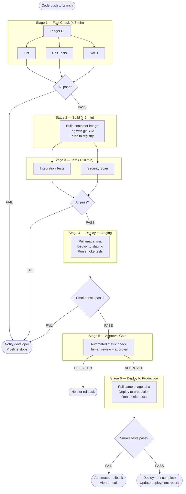

# [BEE-16006] Pipeline Design

:::info
Design your pipeline for fast feedback first: parallelize independent stages, build the artifact once, promote it through environments, and gate production behind human approval.
:::

## Context

A CI/CD pipeline is the automated assembly line that turns a code push into a production deployment. Most teams have a pipeline. Far fewer have a *well-designed* pipeline. The common failure modes are familiar: a 40-minute build that developers stop watching, a "passing" artifact in staging that was rebuilt from scratch before deploying to production, secrets hardcoded in YAML, and no idea whether pipeline reliability is improving or degrading.

The design of the pipeline has a direct, measurable effect on developer productivity. A poorly-structured pipeline means slow feedback, undiscoverable failures, and eroded trust in automation. A well-structured pipeline is one of the highest-leverage investments a team can make.

**References:**
- [Codefresh: CI/CD Process Flow, Stages, and Critical Best Practices](https://codefresh.io/learn/ci-cd-pipelines/ci-cd-process-flow-stages-and-critical-best-practices/)
- [Harness: Best Practices for Awesome CI/CD](https://www.harness.io/blog/best-practices-for-awesome-ci-cd)
- [Octopus Deploy: Fast Track Code Promotion in Your CI/CD Pipeline](https://octopus.com/blog/fast-tracking-code-promotion-in-your-ci-cd-pipeline)
- [Splunk: The Complete Guide to CI/CD Pipeline Monitoring](https://www.splunk.com/en_us/blog/learn/monitoring-ci-cd.html)
- [Buildkite: Monorepo CI Best Practices](https://buildkite.com/resources/blog/monorepo-ci-best-practices/)

## Principles

### 1. Pipeline as Code

The pipeline definition lives in version control alongside the application code. There is no "configure the pipeline in the UI" — everything is in a YAML or equivalent file that is reviewed, versioned, and rolled back like any other code.

Benefits:
- Pipeline changes are reviewed in pull requests before they take effect.
- Any developer can understand and reproduce the pipeline locally.
- Pipeline history is auditable through `git log`.
- Onboarding a new service means copying and adapting an existing pipeline file.

Common CI systems and their pipeline-as-code mechanisms: GitHub Actions (`.github/workflows/*.yml`), GitLab CI (`.gitlab-ci.yml`), Jenkins (`Jenkinsfile`), CircleCI (`.circleci/config.yml`).

### 2. Stage Ordering: Fast Feedback First

Structure stages so the fastest, cheapest, highest-signal checks run first. A failure in an early stage stops the pipeline and returns feedback without spending time on later, slower stages.

The canonical ordering:

```
Stage 1 — Fast Check   (target: < 3 min):
  lint + unit tests + type-check  [run in parallel]

Stage 2 — Build        (target: < 2 min):
  build container image, tag with git SHA, push to registry

Stage 3 — Test         (target: < 10 min):
  integration tests + SAST security scan  [run in parallel]

Stage 4 — Deploy to Staging:
  push image to staging, run smoke tests

Stage 5 — Approval Gate:
  human review + automated metric check

Stage 6 — Deploy to Production:
  push same image to production, run smoke tests
```

If stage 1 fails — a lint error or a failing unit test — the pipeline stops. No compute is wasted building an image that will never deploy. No developer waits 30 minutes to learn their code does not compile.

### 3. Parallelize Independent Stages

Within a stage, run independent jobs concurrently. Lint does not depend on unit tests. SAST does not depend on integration tests. Running them in sequence wastes wall-clock time; running them in parallel cuts the stage duration to the duration of the slowest job.

Most CI systems support this natively:

```yaml
# GitHub Actions example — lint and unit tests run in parallel
jobs:
  lint:
    runs-on: ubuntu-latest
    steps: [...]

  unit-test:
    runs-on: ubuntu-latest
    steps: [...]

  build:
    needs: [lint, unit-test]   # waits for both; fails if either fails
    runs-on: ubuntu-latest
    steps: [...]
```

The `needs` directive establishes the dependency graph. Jobs without a `needs` constraint run in parallel automatically.

### 4. Artifact Promotion: Build Once, Deploy Everywhere

Build the deployment artifact exactly once — during stage 2 — and promote that same immutable artifact through every subsequent environment. Never rebuild the artifact for staging or production.

The "build once" rule enforces that what was tested is what gets deployed. When you rebuild from source for each environment, subtle differences (dependency version resolution, environment variables at build time, compiler flags) can cause "works in staging, breaks in production" failures that are genuinely difficult to diagnose.

Artifact tagging: tag every artifact with the full git SHA that produced it.

```
payments-api:a3f9c21
payments-api:a3f9c21-build.847
```

The git SHA tag makes every deployment fully traceable. Given a container running in production, you can recover the exact source commit, the pipeline run that built it, and every test result associated with it.

Promotion flow:

```
Build  →  push to registry as :sha
Staging deploy  →  pull :sha, run smoke tests
Approval gate
Production deploy  →  pull the same :sha (not rebuilt)
```

### 5. Approval Gate Between Staging and Production

Human approval should sit between staging and production. The gate exists to:

- Give engineers time to verify smoke test results, dashboards, and recent error rates.
- Enforce compliance requirements that require a named human to authorize production changes.
- Create a deliberate pause point so multiple changes can be batched or held during incidents.

Automated gates can supplement human approval: require that the staging deployment has been stable for N minutes, that error rates are below threshold, and that no active incidents are in progress. But human approval should not be bypassed unless you have a documented emergency runbook for it.

### 6. Pipeline Caching

Caching eliminates redundant work across pipeline runs. Three caching layers matter most:

**Dependency cache** — cache `node_modules`, Maven local repository, pip cache, or Go module cache keyed on the dependency manifest hash (e.g., `package-lock.json`, `go.sum`). A cache hit on dependencies typically saves 1–3 minutes per run.

**Build output cache** — cache compiled artifacts, transpiled outputs, and generated code keyed on source file hashes. Tools like Bazel and Nx have native support for this; other systems can implement it with cache keys derived from a hash of the relevant source paths.

**Layer cache (Docker)** — order Dockerfile instructions from least-changing to most-changing. Copy dependency manifests and run install before copying source code. This ensures that the expensive dependency install layer is cached on most builds and only invalidated when dependencies actually change.

```dockerfile
# Good layer order: dependencies change less often than source
COPY package.json package-lock.json ./
RUN npm ci
COPY src/ ./src/
```

```dockerfile
# Bad layer order: any source change invalidates npm ci
COPY . .
RUN npm ci
```

Target: dependency cache hit rate above 80%.

### 7. Secret Injection — Never in Pipeline Code

Pipeline YAML files live in version control. A secret hardcoded in a YAML file is a leaked secret.

The correct approach is injection at runtime from a secret management system:

```yaml
# GitHub Actions — inject from GitHub Secrets
steps:
  - name: Deploy
    env:
      DATABASE_URL: ${{ secrets.DATABASE_URL }}
      API_KEY: ${{ secrets.DEPLOY_API_KEY }}
    run: ./deploy.sh
```

Secrets management systems: GitHub Secrets, GitLab CI/CD Variables (masked), HashiCorp Vault, AWS Secrets Manager, GCP Secret Manager.

Rules:
- Secrets are never in YAML, Dockerfiles, or build scripts.
- Secrets are scoped to the minimum required environments (a staging secret should not be usable in production jobs).
- Rotate secrets that have been accidentally committed immediately; treat the old value as compromised.
- Add secret scanning (e.g., truffleHog, gitleaks) as a pipeline stage to catch accidental commits.

### 8. Pipeline Observability

You cannot improve a pipeline you cannot measure. Track these metrics:

| Metric | What it tells you | Target |
|---|---|---|
| Pipeline duration (P50, P95) | How long developers wait for feedback | P50 < 10 min |
| Stage-level duration | Where the bottleneck is | Identify outliers |
| Failure rate by stage | Which stage is most unreliable | < 5% on main |
| Flaky test rate | Tests that fail non-deterministically | < 1% of test runs |
| Queue time | Time waiting for a runner | < 1 min P95 |
| Cache hit rate | Whether caching is effective | > 80% |
| Mean time to recovery (MTTR) | How fast broken builds are fixed | < 15 min |

Build a dashboard. Review it monthly. Set alerts on regressions. A pipeline that was 8 minutes last quarter and is now 18 minutes is a problem, but only visible if you are tracking it.

Flaky tests deserve special attention. A test that fails 5% of the time without code changes erodes trust in the entire pipeline. Teams start re-running failed pipelines instead of investigating. Real failures get merged. Treat a flaky test as a bug: fix it within 24 hours or quarantine it (skip with a tracked issue).

### 9. Monorepo Pipeline Considerations

In a monorepo, a naive pipeline triggers a full rebuild of every service on every commit. This is expensive and slow. A commit that only changes `services/payments` should not trigger a rebuild of `services/identity` or `services/notifications`.

Solutions:

**Path-based triggers** — configure pipeline triggers to fire only when files in specific directories change.

```yaml
# GitHub Actions — only run payments pipeline on relevant changes
on:
  push:
    paths:
      - 'services/payments/**'
      - 'shared/lib/common/**'  # shared dep — also triggers payments
```

**Affected project detection** — tools like Nx, Turborepo, and Bazel understand the dependency graph. When `shared/lib/common` changes, they automatically identify all services that depend on it and include them in the build.

**Shared library handling** — when a shared library changes, every service that depends on it must rebuild. Path filtering alone is not enough; you need dependency graph awareness to catch transitive changes.

The goal: each service pipeline runs only when relevant code changes, while shared library changes propagate to all dependents automatically.


## Full Pipeline: Reference Architecture




## Worked Example: Backend Service Pipeline

A payments API service. Target: staging in under 10 minutes, production after human approval.

**Stage 1 — Fast Check (~2 min)**

Lint (`golangci-lint`) and unit tests (`go test ./...`) run in parallel on separate runners. 847 unit tests. If either fails, the developer gets a Slack notification within 2 minutes of their push.

**Stage 2 — Build (~1 min)**

```bash
docker build -t payments-api:a3f9c21 .
docker push registry.example.com/payments-api:a3f9c21
```

Image tagged with full git SHA. Layer cache hit on `go.sum` download (86% hit rate last 30 days). Build completes in 58 seconds.

**Stage 3 — Test (~5 min)**

Integration tests run against a real PostgreSQL container and a real Redis instance (Docker Compose in the CI environment). SAST scan (Semgrep, custom rules for this service) runs in parallel. Both must pass.

**Stage 4 — Deploy to Staging (~1 min)**

The exact same image `:a3f9c21` is deployed to the staging Kubernetes namespace. A smoke test suite (12 health and critical-path checks) runs. Pass.

**Total to staging: 9 minutes.** (2 + 1 + 5 + 1)

**Stage 5 — Approval Gate**

Automated checks: staging has been stable for 10+ minutes, error rate < 0.1%, no active incidents. Engineer reviews the diff, approves.

**Stage 6 — Deploy to Production (~1 min)**

The same `:a3f9c21` image is pulled and deployed to the production Kubernetes namespace. Smoke tests pass. Deployment complete.


## Common Mistakes

**1. Sequential stages that should be parallel**

Running lint, then unit tests, then type-check in sequence wastes time. If lint takes 90 seconds and unit tests take 90 seconds, sequential execution takes 3 minutes. Parallel execution takes 90 seconds — the time of the slowest job. This mistake alone can double or triple pipeline duration.

**2. Building the artifact multiple times**

```bash
# Wrong: rebuild for each environment
deploy-staging:   docker build && docker push :staging-latest && kubectl apply
deploy-prod:      docker build && docker push :prod-latest && kubectl apply
```

Rebuilding is not a promotion — it is a new artifact. If a dependency resolves differently, if a file changed between builds, if a build argument differs, staging and production are running different code. Build once, tag with SHA, promote the tag.

**3. No caching**

Every pipeline run downloads 800 MB of npm packages from scratch. A run that should take 3 minutes takes 12. Teams work around it by ignoring failures and re-running. Caching is not an optimization; at scale it is a reliability requirement. Uncached pipelines collapse under load when the package registry is slow.

**4. Secrets in pipeline code**

```yaml
# This pattern exists in real repositories
steps:
  - run: ./deploy.sh --api-key=prod-key-abc123-supersecret
```

This secret is now in version control history permanently (even after deletion). It is in CI logs. It is readable by every developer with repository access. Inject secrets from the secrets manager at runtime. Add secret scanning to every pipeline.

**5. No pipeline metrics**

Teams with no pipeline metrics don't know their P50 build time until a developer complains it's slow. By then it has been slow for months. They don't know their flaky test rate until someone manually counts re-run attempts. They cannot make the case for infrastructure investment because they have no baseline. Instrument the pipeline from day one. The data is cheap to collect and expensive to reconstruct.


## Related BEPs

- [BEE-15001](../testing/testing-pyramid.md) — Testing strategy; which test types belong in which pipeline stage
- [BEE-16001](continuous-integration-principles.md) — CI principles; the upstream practices that make pipeline design work
- [BEE-16002](deployment-strategies.md) — Deployment strategies; what happens after the pipeline promotes an artifact
- [BEE-16005](container-fundamentals.md) — Container as artifact; how images are built, tagged, and stored
