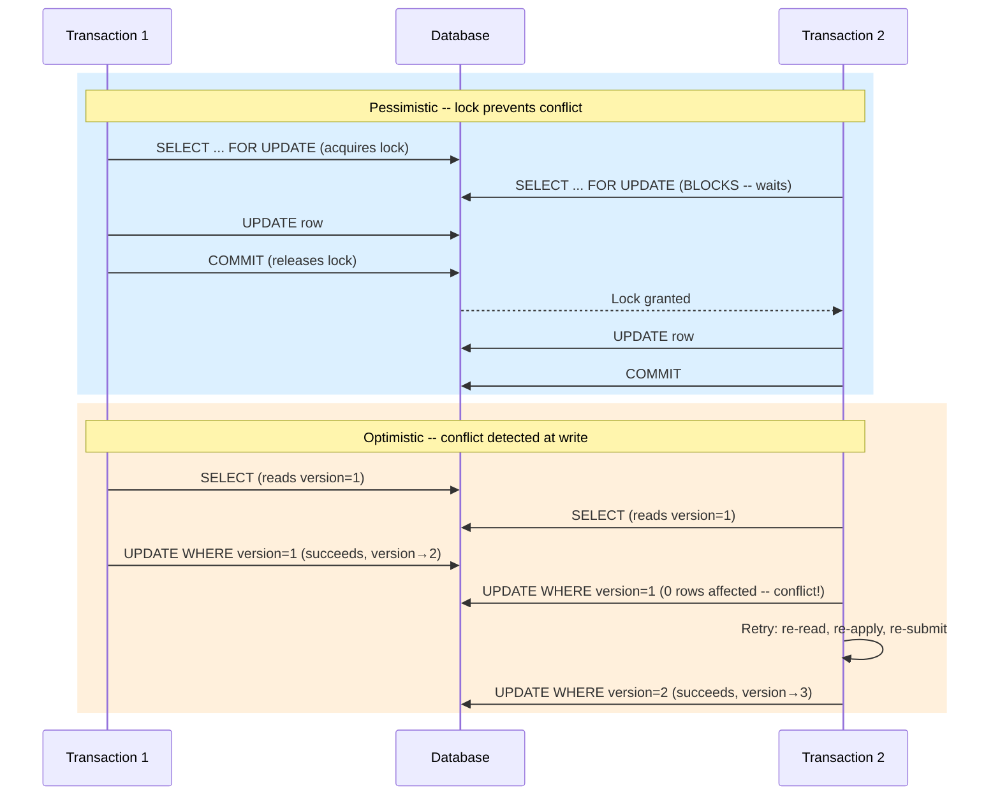

# [BEE-245] Optimistic vs Pessimistic Concurrency Control

:::info
Choose between conflict prevention (pessimistic) and conflict detection (optimistic) based on your contention profile.
:::

## Context

When multiple transactions or requests operate on the same data simultaneously, you must decide how to handle conflicts. The two fundamental strategies are pessimistic concurrency control -- which prevents conflicts by acquiring locks before operating -- and optimistic concurrency control -- which detects conflicts after the fact and retries or aborts.

Choosing the wrong strategy creates real problems: pessimistic locking in low-contention systems kills throughput; optimistic locking in high-contention systems creates endless retry storms.

**References:**
- [Optimistic concurrency control - Wikipedia](https://en.wikipedia.org/wiki/Optimistic_concurrency_control)
- [Optimistic and pessimistic locking in SQL - learning-notes](https://learning-notes.mistermicheels.com/data/sql/optimistic-pessimistic-locking-sql/)
- [Optimistic Concurrency in an HTTP API with ETags - CodeOpinion](https://codeopinion.com/optimistic-concurrency-in-an-http-api-with-etags-hypermedia/)
- [ETags and Optimistic Concurrency Control - fideloper.com](https://fideloper.com/etags-and-optimistic-concurrency-control)
- [PostgreSQL Explicit Locking](https://www.postgresql.org/docs/current/explicit-locking.html)

## Principle

**Match your concurrency strategy to your contention profile.** Use pessimistic locking when conflicts are likely and transactions are short. Use optimistic locking when conflicts are rare and you can tolerate occasional retries.

## How Each Strategy Works

### Pessimistic Concurrency Control

Lock first, then operate. The transaction acquires an exclusive lock on the rows it needs before reading or modifying them. No other writer can touch those rows until the lock is released.

The canonical SQL mechanism is `SELECT FOR UPDATE`:

```sql
BEGIN;

-- Acquire an exclusive row lock immediately
SELECT balance
FROM accounts
WHERE id = 42
FOR UPDATE;

-- Safe to modify -- no other transaction can touch this row
UPDATE accounts
SET balance = balance - 100
WHERE id = 42;

COMMIT;
```

The row stays locked from the `SELECT FOR UPDATE` until the `COMMIT` or `ROLLBACK`. Any other transaction that tries to `SELECT ... FOR UPDATE` or `UPDATE` the same row will block until this transaction finishes.

**Variants:**
- `FOR UPDATE` -- exclusive lock; blocks readers that also use `FOR UPDATE`
- `FOR SHARE` -- shared lock; multiple readers can hold it, but writers block
- `FOR NO KEY UPDATE` (PostgreSQL) -- exclusive but allows concurrent FK inserts; prefer this unless you are modifying the primary key

### Optimistic Concurrency Control

Operate first, check for conflicts at commit time. No lock is acquired. Instead, each row carries a `version` (integer counter) or `updated_at` (timestamp). Before writing, the transaction verifies that the version it read has not changed.

**Schema:**
```sql
CREATE TABLE documents (
  id          BIGSERIAL PRIMARY KEY,
  content     TEXT,
  version     INTEGER NOT NULL DEFAULT 1,
  updated_at  TIMESTAMPTZ NOT NULL DEFAULT now()
);
```

**Read:**
```sql
SELECT id, content, version
FROM documents
WHERE id = 7;
-- Returns: id=7, content="hello", version=3
```

**Write with version check:**
```sql
UPDATE documents
SET content   = 'hello world',
    version   = version + 1,
    updated_at = now()
WHERE id      = 7
  AND version = 3;   -- <-- the version we read
```

Check the affected row count. If it is 0, someone else updated the row between your read and your write -- a conflict occurred. Your application must then decide: retry, merge, or abort.

## Flow Comparison



## Worked Example: Two Users Editing a Document

Both User A and User B open document #7 (version 3).

### Pessimistic approach

```sql
-- User A's session
BEGIN;
SELECT id, content, version FROM documents WHERE id = 7 FOR UPDATE;
-- User B tries the same query -- BLOCKED until User A commits

-- User A makes edits, saves
UPDATE documents SET content = 'A edits', version = 4 WHERE id = 7;
COMMIT;

-- User B is now unblocked, reads current state (version 4)
UPDATE documents SET content = 'B edits', version = 5 WHERE id = 7;
COMMIT;
```

User B waits. No data is lost. But if User A takes a long time editing, B is stuck.

### Optimistic approach

```sql
-- User A reads version 3, User B also reads version 3 (no lock, both proceed)

-- User A saves first
UPDATE documents
SET content = 'A edits', version = 4, updated_at = now()
WHERE id = 7 AND version = 3;
-- Affected rows: 1 -- success

-- User B tries to save with version 3
UPDATE documents
SET content = 'B edits', version = 4, updated_at = now()
WHERE id = 7 AND version = 3;
-- Affected rows: 0 -- CONFLICT

-- Application re-reads current state (version 4, content = 'A edits')
-- Presents diff to User B or merges automatically, then retries:
UPDATE documents
SET content = 'A+B merged edits', version = 5, updated_at = now()
WHERE id = 7 AND version = 4;
-- Affected rows: 1 -- success
```

Neither user is blocked. If conflicts are rare, this is much more efficient.

## ETag-Based Optimistic Concurrency in HTTP APIs

The same pattern maps directly onto HTTP using `ETag` and `If-Match` headers.

**Server returns the version as an ETag on GET:**
```http
GET /documents/7 HTTP/1.1

HTTP/1.1 200 OK
ETag: "3"
Content-Type: application/json

{"id": 7, "content": "hello"}
```

**Client sends ETag back on PUT:**
```http
PUT /documents/7 HTTP/1.1
If-Match: "3"
Content-Type: application/json

{"content": "hello world"}
```

**Server response when version matches:**
```http
HTTP/1.1 200 OK
ETag: "4"
```

**Server response when version has changed (someone else updated first):**
```http
HTTP/1.1 412 Precondition Failed
```

The client must then re-fetch (`GET`), re-apply the change, and re-submit. This is identical to the database optimistic retry loop -- just expressed in HTTP semantics.

## Compare-and-Swap (CAS) as the Underlying Primitive

Both the version column pattern and ETag pattern are applications of **compare-and-swap**:

> CAS(location, expected_value, new_value): update `location` to `new_value` only if it currently holds `expected_value`.

The SQL form is `WHERE version = :expected`. At the hardware level, this is how CPU atomic instructions work. Many distributed systems (Redis `SET NX`, DynamoDB conditional writes, S3 `If-Match` conditional PUT) expose the same primitive at their API layer.

## When to Use Each

| Dimension | Pessimistic | Optimistic |
|---|---|---|
| Contention level | High -- conflicts are the norm | Low -- conflicts are rare |
| Transaction duration | Short -- lock is held briefly | Long reads are fine -- no lock held |
| Retry complexity | None -- blocked transaction retries automatically | Required -- application must detect and retry |
| Throughput impact | Lower -- readers/writers queue behind lock | Higher -- no blocking under low contention |
| Deadlock risk | Yes -- must use lock ordering or timeouts | No -- no locks to deadlock |
| Suitable workloads | Financial transfers, inventory decrement, seat booking | Document editing, user profile updates, configuration changes |

**Rule of thumb:** If more than roughly 20% of transactions would conflict under optimistic control, switch to pessimistic. If your transactions are long-running (user holds lock while editing), prefer optimistic.

## Conflict Resolution on Optimistic Failure

When an optimistic update returns 0 affected rows, the application has three options:

1. **Retry** -- Re-read the current state, re-apply the same change, re-submit. Works when the change is idempotent or commutative (e.g., incrementing a counter).
2. **Merge** -- Re-read, compute a three-way merge (original + A's change + B's change), submit the merged result. Used in collaborative editing.
3. **Abort and notify** -- Tell the user their change conflicted and ask them to start over. Simplest to implement; acceptable when conflicts are very rare.

Always implement a retry limit. Unlimited retries under sustained high contention can loop forever.

## Common Mistakes

### 1. Pessimistic lock without a timeout

A transaction that holds a lock and then hangs (network issue, slow application logic) will block all other writers indefinitely. Always set a lock timeout:

```sql
-- PostgreSQL: fail immediately if lock is not available
SELECT ... FOR UPDATE NOWAIT;

-- PostgreSQL: wait at most 5 seconds
SET lock_timeout = '5s';
SELECT ... FOR UPDATE;
```

### 2. Optimistic locking without retry logic

Detecting a conflict and then throwing an unhandled error (or returning 412 to the client with no guidance) is not a concurrency strategy -- it just moves the problem to the caller. Always define what happens after a conflict.

### 3. Using optimistic locking under high contention

In a hot row scenario (e.g., a global counter hit by thousands of requests per second), most transactions will fail and retry. Each retry requires a round-trip. The net result is worse throughput than pessimistic locking. Measure your conflict rate before choosing.

### 4. Forgetting to increment the version on every write

If any code path updates the row without incrementing `version`, that write becomes invisible to the optimistic check. Use a database trigger or ORM lifecycle hook to enforce version increment on every `UPDATE`, or rely on `updated_at` + sub-second precision timestamps (but be aware of clock skew).

```sql
-- Safe: always enforced at DB level
CREATE OR REPLACE FUNCTION increment_version()
RETURNS TRIGGER AS $$
BEGIN
  NEW.version := OLD.version + 1;
  RETURN NEW;
END;
$$ LANGUAGE plpgsql;

CREATE TRIGGER trg_version
BEFORE UPDATE ON documents
FOR EACH ROW EXECUTE FUNCTION increment_version();
```

### 5. SELECT FOR UPDATE without an index (table lock instead of row lock)

`SELECT FOR UPDATE` locks at the granularity of the rows it scans. If the `WHERE` clause cannot use an index, the database scans the entire table and may escalate to a table-level lock, blocking all concurrent writers:

```sql
-- DANGEROUS if there is no index on status
SELECT * FROM orders WHERE status = 'pending' FOR UPDATE;

-- Fix: add index
CREATE INDEX idx_orders_status ON orders(status);
```

Always verify with `EXPLAIN` that your locked query uses an index seek, not a sequential scan.

## Related BEPs

- [BEE-8002](../transactions/isolation-levels-and-their-anomalies.md) -- Transaction Isolation Levels: the isolation level determines what data a transaction can see; pessimistic locks add explicit writer serialization on top of isolation.
- [BEE-11002](race-conditions-and-data-races.md) -- Race Conditions: both concurrency strategies are tools for eliminating race conditions on shared data.
- [BEE-11002](race-conditions-and-data-races.md) -- Locks and Deadlocks: deadlock analysis, lock ordering, and detection strategies that apply when using pessimistic control.
- [BEE-4002](../api-design/api-versioning-strategies.md) -- API Idempotency: retry logic on optimistic conflict requires idempotent operations to avoid double-application of changes.
