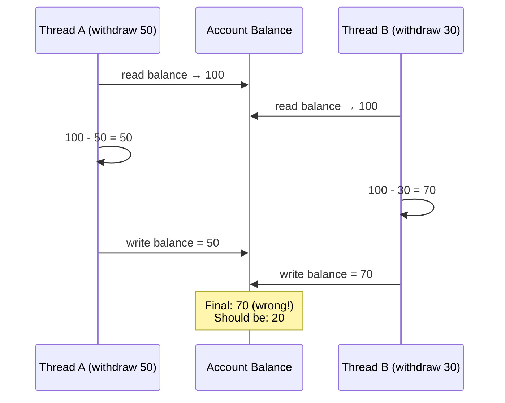

# [BEE-11002] Race Conditions and Data Races

:::info
Race conditions and data races are distinct bugs. Conflating them leads to incomplete fixes. Understand both to write correct concurrent code.
:::

## Context

Concurrent systems -- whether using threads, goroutines, async/await, or distributed processes -- are vulnerable to timing-dependent bugs. Two terms appear constantly: **race condition** and **data race**. They are related but not interchangeable. Engineers who treat them as synonyms often fix one while leaving the other in place.

This article defines both precisely, explains how they differ, covers the TOCTOU subclass, and walks through detection tools and prevention strategies.

## Definitions

### Race Condition

A **race condition** is a logic bug where the correctness of a program depends on the relative timing or ordering of concurrent operations. The program produces different (and potentially wrong) outcomes depending on which thread or process executes first.

Race conditions are **semantic bugs** -- the program may be syntactically valid and use synchronized memory access, yet still produce incorrect results because the logical sequence of operations is not atomic.

### Data Race

A **data race** is a **memory safety bug** where two or more threads concurrently access the same memory location, at least one access is a write, and there is no synchronization mechanism (lock, atomic, barrier) coordinating them.

Data races are formally undefined behavior (UB) in C, C++, and other languages. In Go, the memory model treats unsynchronized concurrent writes as data races that the race detector can catch. Even in languages that define data race behavior (e.g., Java), the results are unpredictable in practice.

### How They Differ

| | Race Condition | Data Race |
|---|---|---|
| Nature | Logic bug | Memory safety bug |
| Requires shared memory? | No (can occur across processes, I/O, DB) | Yes (requires shared mutable state) |
| Requires missing sync? | No (can happen even with locks) | Yes (by definition: no synchronization) |
| Detectable by race detector? | Not necessarily | Yes (Go `-race`, TSan) |
| Example | Check-then-act on a file | Two goroutines writing to the same map |

You can have **a race condition without a data race** (e.g., two processes both check a database row, then each decides to insert -- fully serialized reads, but the logic is racy). You can have **a data race without a race condition** (e.g., two threads race to write the same value -- a data race by definition, but no observable logic error).

## Principle

**Every shared mutable state access must be explicitly synchronized, and every check-then-act sequence on shared state must be treated as a single atomic operation.**

## The TOCTOU Pattern

**Time-of-Check to Time-of-Use (TOCTOU)** is the canonical race condition subclass. It occurs whenever code:

1. Checks a condition (the "check")
2. Acts based on that condition (the "use")
3. The condition can change between step 1 and step 2

The check and use are not atomic, so another thread or process can invalidate the check before the use executes.

**File system example:**

```
if os.path.exists("/tmp/lockfile"):   # check
    # attacker creates /tmp/lockfile here
    open("/tmp/lockfile", "r")        # use -- file now exists, behavior changed
```

**Database example:**

```sql
-- Thread A                          -- Thread B
SELECT balance FROM accounts         SELECT balance FROM accounts
  WHERE id = 1;  -- returns 100        WHERE id = 1;  -- returns 100

-- Thread A acts on 100              -- Thread B acts on 100
UPDATE accounts SET balance = 50     UPDATE accounts SET balance = 70
  WHERE id = 1;                        WHERE id = 1;
-- Final balance: 70, not 20. Lost update.
```

TOCTOU applies equally to file system operations, database reads, in-memory state, and authentication checks.

## Classic Example: Bank Account Withdrawal

### The Bug

```
function withdraw(account, amount):
    balance = account.read_balance()   # read
    if balance >= amount:              # check
        # <-- another thread can withdraw here
        account.write_balance(balance - amount)  # use
```

If two threads call `withdraw` concurrently on the same account with balance 100, both can read 100, both pass the check, and both write back a reduced balance -- producing a final state that is incorrect.

### Race Condition Diagram



Thread B's write overwrites Thread A's write. The 50-unit withdrawal by Thread A is lost entirely.

### Fix 1: Mutex

Wrap the entire read-check-write sequence under a single lock. The lock makes the sequence atomic with respect to other threads holding the same lock.

```python
def withdraw(account, amount, lock):
    with lock:
        balance = account.read_balance()
        if balance >= amount:
            account.write_balance(balance - amount)
            return True
        return False
```

The critical section is the full read-check-write. Locking only the write is insufficient -- the race is between the read and the write.

### Fix 2: Atomic Compare-and-Swap (CAS)

For simple numeric state, hardware-level CAS allows lock-free updates. CAS atomically checks that the current value matches an expected value before writing.

```go
// Go example using sync/atomic
func withdraw(balance *int64, amount int64) bool {
    for {
        current := atomic.LoadInt64(balance)
        if current < amount {
            return false
        }
        next := current - amount
        if atomic.CompareAndSwapInt64(balance, current, next) {
            return true
        }
        // CAS failed: another thread changed balance, retry
    }
}
```

CAS loops are effective but must be used carefully. They can spin under high contention, and multi-variable atomicity still requires locks.

### Fix 3: Database-Level Locking (SELECT FOR UPDATE)

For database-backed state, push the atomicity into the database transaction. `SELECT FOR UPDATE` acquires a row-level lock that prevents other transactions from reading or modifying the row until the current transaction commits.

```sql
BEGIN;
SELECT balance FROM accounts
  WHERE id = $1
  FOR UPDATE;           -- row lock acquired here

-- application checks balance >= amount
UPDATE accounts
  SET balance = balance - $2
  WHERE id = $1;

COMMIT;                 -- lock released
```

This is the correct approach for financial or inventory state stored in a relational database. See [BEE-8002](../transactions/isolation-levels-and-their-anomalies.md) for isolation levels and [BEE-11006](optimistic-vs-pessimistic-concurrency-control.md) for optimistic vs. pessimistic strategies.

## Detection Tools

### Go Race Detector (`-race`)

The Go toolchain includes a built-in race detector backed by ThreadSanitizer. Enable it with the `-race` flag:

```bash
go test -race ./...
go run -race main.go
go build -race -o myapp
```

The detector instruments every memory access at compile time and tracks access history at runtime. When it detects two unsynchronized concurrent accesses where at least one is a write, it prints a detailed report including goroutine stack traces.

- **Performance cost**: 2-20x slower, 5-10x more memory.
- **Limitation**: Only finds races that execute at runtime. Use with workload that exercises concurrent paths.
- **CI recommendation**: Run `go test -race` in CI on every pull request.

Reference: [go.dev/doc/articles/race_detector](https://go.dev/doc/articles/race_detector)

### ThreadSanitizer (TSan)

TSan is the underlying engine also available for C, C++, and Rust programs. Enable via Clang or GCC:

```bash
clang -fsanitize=thread -g -O1 -o myprogram myprogram.c
./myprogram
```

TSan uses a hybrid happens-before and lockset algorithm. Typical overhead: 5-15x slowdown, 5-10x memory increase.

Reference: [clang.llvm.org/docs/ThreadSanitizer.html](https://clang.llvm.org/docs/ThreadSanitizer.html)

### Helgrind (Valgrind)

Helgrind is a Valgrind tool for detecting POSIX pthread API misuse and data races in C/C++ programs:

```bash
valgrind --tool=helgrind ./myprogram
```

Helgrind is slower than TSan (20-50x) but does not require recompilation when source is unavailable.

## Prevention Strategies

**1. Immutability** -- Prefer immutable data structures. Data that cannot be written cannot be raced. Pass copies rather than references where practical.

**2. Confinement** -- Ensure each piece of data has a single owner at any given time. In Go, this is "do not communicate by sharing memory; share memory by communicating" -- use channels to pass ownership between goroutines.

**3. Synchronization** -- Use mutexes, read-write locks, or semaphores to protect critical sections. The critical section must encompass the entire logical operation (read + check + write), not just the write.

**4. Atomic operations** -- Use `sync/atomic` (Go), `std::atomic` (C++), or `java.util.concurrent.atomic` for single-variable read-modify-write. Do not attempt multi-variable atomicity without a lock.

**5. Database transactions** -- For state in a database, use transactions with appropriate isolation levels. `SELECT FOR UPDATE` for pessimistic locking, optimistic concurrency control (version columns) for lower-contention scenarios.

**6. Race detection in CI** -- Run race-enabled tests on every CI build. A race found in CI is orders of magnitude cheaper to fix than one found in production.

## Common Mistakes

**1. Thinking single-threaded code is immune.**
JavaScript and Python async/await code is single-threaded but still exhibits race conditions. Two coroutines can interleave at any `await` point. TOCTOU bugs occur whenever there is an await between the check and the use.

**2. Read-modify-write without atomicity.**
`counter++` in most languages compiles to three operations: load, increment, store. Without atomicity, concurrent increments produce lost updates. Always use atomic primitives or locks for shared counters.

**3. Double-checked locking done wrong.**
A common pattern for lazy initialization acquires a lock, checks again, then initializes. This is safe only if the write to the initialized flag is visible to all threads before the initialized object is accessed. In Java, the field must be `volatile`. In C++, use `std::atomic` with appropriate memory ordering. Naive double-checked locking without these constraints is a data race.

**4. Assuming hash maps are thread-safe.**
Go's `map`, Java's `HashMap`, Python's `dict` -- none are safe for concurrent writes. Use `sync.Map` (Go), `ConcurrentHashMap` (Java), or explicit locking. A concurrent map write is a data race, not merely a logic bug.

**5. Not running race detection in CI.**
Race conditions are timing-dependent and often silent under normal load. Without `-race` or TSan in CI, data races accumulate invisibly until they cause production corruption.

## Related BEPs

- [BEE-11001](threads-vs-processes-vs-coroutines.md) -- Concurrency models: threads, goroutines, async/await
- [BEE-11002](race-conditions-and-data-races.md) -- Locks and synchronization primitives
- [BEE-11006](optimistic-vs-pessimistic-concurrency-control.md) -- Optimistic vs. pessimistic concurrency control
- [BEE-8002](../transactions/isolation-levels-and-their-anomalies.md) -- Isolation levels: how databases prevent race conditions at the storage layer

## References

- [Race Condition vs. Data Race -- Embedded in Academia](https://blog.regehr.org/archives/490)
- [Go Data Race Detector](https://go.dev/doc/articles/race_detector)
- [ThreadSanitizer -- Clang documentation](https://clang.llvm.org/docs/ThreadSanitizer.html)
- [Race condition -- Wikipedia](https://en.wikipedia.org/wiki/Race_condition)
- [Understanding TOCTOU: The Race Condition Hiding in Your Code](https://dev.to/codewithveek/understanding-toctou-the-race-condition-hiding-in-your-code-43nh)
