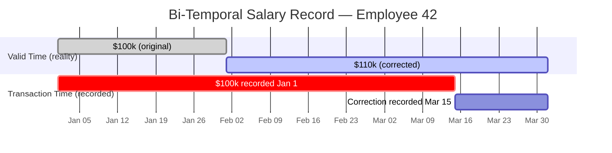

# [BEE-7005] Designing for Time-Series and Audit Data

:::info
Record history by appending, never overwriting. Use bi-temporal modeling when you need both "what was true" and "what did we know." Store all timestamps in UTC, partition by time for performance, and enforce retention policies before storage becomes unbounded.
:::

## Context

Most systems need some form of historical record: who changed a salary, when a configuration was last modified, what state an order was in at a given moment. The instinct is to solve this with a simple `updated_at` column and let the database row reflect "current state." That approach destroys history silently — the moment you run `UPDATE employees SET salary = 120000`, the previous salary is gone.

This matters for three distinct reasons. First, auditing and compliance: regulators and auditors require a demonstrable chain of custody for data changes. Second, debugging: "the system was behaving strangely on Tuesday" cannot be investigated without knowing what state the data was in on Tuesday. Third, correctness: billing, payroll, and financial calculations often depend on knowing what a value was at a specific historical moment, not just what it is now.

Time-series data introduces a different but related challenge. Sensor readings, metrics, and event logs are fundamentally append-only by nature — every measurement is a new fact, not a replacement for an old one. These workloads are high-volume, insert-heavy, and almost always queried with time-range filters. The schema and storage strategy must be designed around those access patterns from the start.

**References:**
- [Bitemporal History — Martin Fowler](https://martinfowler.com/articles/bitemporal-history.html)
- [Temporal Patterns — Martin Fowler](https://martinfowler.com/eaaDev/timeNarrative.html)
- [Event Sourcing Pattern — Microsoft Azure Architecture Center](https://learn.microsoft.com/en-us/azure/architecture/patterns/event-sourcing)
- [Database Design for Audit Logging — Red Gate](https://www.red-gate.com/blog/database-design-for-audit-logging/)
- [PostgreSQL Table Partitioning — Official Documentation](https://www.postgresql.org/docs/current/ddl-partitioning.html)

## Principle

**Represent history as data, not as overwrites. Append new facts; never mutate the past.**

In practice this means:

1. Use append-only versioned rows (with `valid_from` / `valid_to`) for any data that must be queried at a point in time.
2. Never hard-delete auditable records; use soft delete (`deleted_at`) or move to an archive table.
3. Store every timestamp as UTC; apply timezone conversion only at display time.
4. Apply bi-temporal modeling when correction history matters: track both when something was true in reality (valid time) and when your system recorded it (transaction time).
5. Treat event sourcing as a temporal pattern: every state change is a new event record, and current state is a derived projection.
6. Partition time-series tables by time and define a retention policy; unbounded growth is not a valid design.
7. Index time range columns explicitly; point-in-time and range queries will not be fast without them.

---

## Temporal Data Fundamentals

### Append-Only Versioning

The core technique for preserving history is to insert a new row for every change rather than updating the existing row. Each row carries a `valid_from` timestamp (when the fact became true) and a `valid_to` timestamp (when it was superseded, or `NULL` for the current row).

```sql
-- Schema: employee salary history
CREATE TABLE employee_salary_history (
  id            BIGSERIAL PRIMARY KEY,
  employee_id   BIGINT        NOT NULL,
  amount        NUMERIC(12,2) NOT NULL,
  currency      CHAR(3)       NOT NULL DEFAULT 'USD',
  valid_from    TIMESTAMPTZ   NOT NULL,
  valid_to      TIMESTAMPTZ,              -- NULL = currently active
  recorded_at   TIMESTAMPTZ   NOT NULL DEFAULT now(),
  recorded_by   TEXT          NOT NULL
);

-- Unique constraint: only one active row per employee at a time
CREATE UNIQUE INDEX uq_salary_current
  ON employee_salary_history (employee_id)
  WHERE valid_to IS NULL;
```

To apply a salary change, close the previous row and insert a new one — never `UPDATE` the amount directly:

```sql
BEGIN;

-- Close the current row
UPDATE employee_salary_history
   SET valid_to = '2025-03-01T00:00:00Z'
 WHERE employee_id = 42
   AND valid_to IS NULL;

-- Insert the new version
INSERT INTO employee_salary_history
       (employee_id, amount, currency, valid_from, valid_to, recorded_by)
VALUES (42, 105000.00, 'USD', '2025-03-01T00:00:00Z', NULL, 'hr-system');

COMMIT;
```

**Query: what was the salary on a specific date?**

```sql
SELECT amount, currency, valid_from
  FROM employee_salary_history
 WHERE employee_id = 42
   AND valid_from  <= '2025-02-15T00:00:00Z'
   AND (valid_to IS NULL OR valid_to > '2025-02-15T00:00:00Z');
```

### Soft Deletes

Hard deletes permanently destroy the record. For any entity that is part of an audit trail, use soft deletes instead:

```sql
ALTER TABLE employees ADD COLUMN deleted_at TIMESTAMPTZ;

-- "Delete"
UPDATE employees
   SET deleted_at = now()
 WHERE id = 42;

-- Active records only
SELECT * FROM employees WHERE deleted_at IS NULL;

-- Full history including deleted
SELECT * FROM employees;
```

A separate `employees_audit` table that logs every change (including the final deletion) is the complement to soft deletes. Soft deletes let you filter active records; the audit log tells you who deleted it and when.

---

## Bi-Temporal Modeling

### Two Dimensions of Time

Martin Fowler's bi-temporal model tracks two independent time axes:

- **Valid time** — when the fact was true in reality (the business timeline).
- **Transaction time** — when the fact was recorded in the database (the system timeline).

The distinction matters when corrections are necessary. Suppose payroll runs on February 28 using a salary of $100,000. On March 15, HR discovers the salary should have been $110,000 effective February 1. The system needs to record:

1. The original entry (as-recorded): $100,000 from Jan 1, known by the system on Jan 1.
2. The correction: $110,000 valid from Feb 1, recorded on March 15.

Without transaction time, you cannot reconstruct what the system knew on February 28 when it ran payroll. That information is required for replication, audits, and dispute resolution.



### Bi-Temporal Schema

```sql
CREATE TABLE employee_salary_bitemporal (
  id              BIGSERIAL PRIMARY KEY,
  employee_id     BIGINT        NOT NULL,
  amount          NUMERIC(12,2) NOT NULL,
  currency        CHAR(3)       NOT NULL DEFAULT 'USD',

  -- Valid time: when the fact is true in the real world
  valid_from      TIMESTAMPTZ   NOT NULL,
  valid_to        TIMESTAMPTZ,              -- NULL = currently valid

  -- Transaction time: when we recorded this in the DB
  recorded_at     TIMESTAMPTZ   NOT NULL DEFAULT now(),
  superseded_at   TIMESTAMPTZ,              -- NULL = still our belief
  recorded_by     TEXT          NOT NULL
);
```

**Query: what salary did we believe was in effect on Feb 28, as of Mar 14 (before the correction)?**

```sql
SELECT amount, valid_from, valid_to
  FROM employee_salary_bitemporal
 WHERE employee_id   = 42
   -- Valid time: Feb 28 falls within the valid window
   AND valid_from   <= '2025-02-28T00:00:00Z'
   AND (valid_to IS NULL OR valid_to > '2025-02-28T00:00:00Z')
   -- Transaction time: query as of Mar 14 (pre-correction)
   AND recorded_at  <= '2025-03-14T23:59:59Z'
   AND (superseded_at IS NULL OR superseded_at > '2025-03-14T23:59:59Z');
```

**Query: what is the currently known salary as of Feb 1?**

```sql
SELECT amount, valid_from, valid_to
  FROM employee_salary_bitemporal
 WHERE employee_id   = 42
   AND valid_from   <= '2025-02-01T00:00:00Z'
   AND (valid_to IS NULL OR valid_to > '2025-02-01T00:00:00Z')
   AND superseded_at IS NULL;   -- latest recorded belief
```

---

## Audit Trails

### Minimum Audit Record

Every auditable event should capture at minimum:

| Field | Purpose |
|-------|---------|
| `entity_type` | Which table / domain object changed |
| `entity_id` | Primary key of the changed entity |
| `event_type` | `INSERT`, `UPDATE`, `DELETE`, or a domain verb |
| `changed_by` | User or service account that made the change |
| `changed_at` | UTC timestamp of the change |
| `before_state` | JSONB snapshot of the row before the change |
| `after_state` | JSONB snapshot of the row after the change |

```sql
CREATE TABLE audit_log (
  id           BIGSERIAL    PRIMARY KEY,
  entity_type  TEXT         NOT NULL,
  entity_id    TEXT         NOT NULL,
  event_type   TEXT         NOT NULL,
  changed_by   TEXT         NOT NULL,
  changed_at   TIMESTAMPTZ  NOT NULL DEFAULT now(),
  before_state JSONB,
  after_state  JSONB
);

-- Partition by month for high-volume systems
CREATE INDEX idx_audit_entity ON audit_log (entity_type, entity_id, changed_at DESC);
CREATE INDEX idx_audit_time   ON audit_log (changed_at DESC);
```

### Enforcing Immutability

The audit log must be append-only. Application-level conventions are insufficient — database-level enforcement is required:

```sql
-- Revoke UPDATE and DELETE from the application role
REVOKE UPDATE, DELETE ON audit_log FROM app_user;

-- Optional: row-level trigger to block any modification
CREATE OR REPLACE FUNCTION prevent_audit_modification()
RETURNS TRIGGER AS $$
BEGIN
  RAISE EXCEPTION 'audit_log rows are immutable';
END;
$$ LANGUAGE plpgsql;

CREATE TRIGGER trg_audit_immutable
  BEFORE UPDATE OR DELETE ON audit_log
  FOR EACH ROW EXECUTE FUNCTION prevent_audit_modification();
```

---

## Event Sourcing as a Temporal Pattern

Event sourcing records every state change as an immutable event. The current state is never stored directly; it is derived by replaying the event stream from the beginning (or from a snapshot). This is the most complete form of temporal data — nothing is ever lost.

```sql
-- Event store table
CREATE TABLE order_events (
  event_id      BIGSERIAL    PRIMARY KEY,
  order_id      UUID         NOT NULL,
  event_type    TEXT         NOT NULL,   -- 'OrderPlaced', 'ItemAdded', 'OrderShipped'
  payload       JSONB        NOT NULL,
  occurred_at   TIMESTAMPTZ  NOT NULL DEFAULT now(),
  sequence_num  BIGINT       NOT NULL    -- monotonically increasing per order_id
);

CREATE UNIQUE INDEX uq_order_seq ON order_events (order_id, sequence_num);
CREATE INDEX idx_order_events_order ON order_events (order_id, sequence_num);
```

The projection (current state) is maintained in a separate table updated by a consumer of the event stream. The event store itself is never modified.

Event sourcing is suited to domains where history is the primary artifact (financial ledgers, compliance systems, CQRS-based microservices). It adds significant complexity — full replay time, snapshot management, projection consistency — and should not be adopted lightly. See [BEE-10004](../messaging/event-sourcing.md).

---

## Time-Series Data Characteristics

Time-series data (metrics, sensor readings, logs) differs from general relational data in three ways:

1. **Insert-only by nature.** Readings are never updated; they are immutable facts about a moment in time.
2. **Time is the primary query dimension.** Almost every query filters or groups by a time range.
3. **High volume with predictable retention.** Data accumulates continuously and typically has a defined useful lifespan.

### Partitioning by Time

Range partitioning on the timestamp column is the standard approach for time-series tables:

```sql
-- Parent table
CREATE TABLE metrics (
  id          BIGSERIAL,
  service     TEXT        NOT NULL,
  metric_name TEXT        NOT NULL,
  value       DOUBLE PRECISION NOT NULL,
  recorded_at TIMESTAMPTZ NOT NULL
) PARTITION BY RANGE (recorded_at);

-- Monthly partitions
CREATE TABLE metrics_2025_01
  PARTITION OF metrics
  FOR VALUES FROM ('2025-01-01') TO ('2025-02-01');

CREATE TABLE metrics_2025_02
  PARTITION OF metrics
  FOR VALUES FROM ('2025-02-01') TO ('2025-03-01');
```

Partition granularity should match query patterns and retention windows:
- Daily partitions: very high write volume (>10M rows/day), or sub-day retention windows.
- Weekly partitions: moderate volume, convenient for rolling 30/90-day windows.
- Monthly partitions: lower volume, long retention (1–3 years).

PostgreSQL's partition pruning will skip irrelevant partitions entirely when a `WHERE` clause filters on the partition key. This is only effective if queries always include the timestamp column in the filter.

Use `pg_partman` or equivalent tooling to create future partitions automatically and to drop expired partitions as part of retention enforcement.

### Indexes for Time-Series

```sql
-- Covering index for the most common query pattern
CREATE INDEX idx_metrics_service_time
  ON metrics (service, metric_name, recorded_at DESC)
  INCLUDE (value);

-- For aggregation queries without a service filter
CREATE INDEX idx_metrics_time
  ON metrics (recorded_at DESC);
```

Without explicit indexes on the time column, range scans over large partitions will be sequential. See [BEE-6002](../data-storage/indexing-deep-dive.md).

---

## Retention Policies

Unbounded retention is a design defect. Every temporal or time-series table must have an explicit retention policy defined at design time:

| Data Type | Typical Retention | Mechanism |
|-----------|------------------|-----------|
| Audit logs (compliance) | 7 years | Archive to cold storage; do not delete |
| Audit logs (operational) | 90 days | Drop old partitions |
| Time-series metrics | 30–90 days hot, 1 year cold | Partition drop + object storage tiering |
| Soft-deleted records | 30 days | Scheduled hard-delete job |
| Event store | Indefinite (+ snapshots) | Snapshot and compact; never truncate |

Implement retention enforcement as a scheduled database job, not application logic — application logic can be skipped during deployments or outages.

```sql
-- Drop partitions older than 90 days (run via pg_cron or external scheduler)
DO $$
DECLARE
  partition_name TEXT;
BEGIN
  FOR partition_name IN
    SELECT child.relname
      FROM pg_inherits
      JOIN pg_class parent ON pg_inherits.inhparent = parent.oid
      JOIN pg_class child  ON pg_inherits.inhrelid  = child.oid
     WHERE parent.relname = 'metrics'
       AND child.relname  < 'metrics_' || to_char(now() - interval '90 days', 'YYYY_MM')
  LOOP
    EXECUTE format('DROP TABLE %I', partition_name);
  END LOOP;
END;
$$;
```

---

## Common Mistakes

**1. Using UPDATE instead of append for historical data**

Running `UPDATE employees SET salary = 120000 WHERE id = 42` destroys the previous salary permanently. There is no way to answer "what was Alice's salary in January?" after the fact. Use versioned rows with `valid_from`/`valid_to` from the initial schema design. Retrofitting temporal history into a system that was designed with mutable rows is expensive.

**2. Hard deleting auditable records**

`DELETE FROM orders WHERE id = 99` removes all evidence that the order ever existed. If a customer disputes a charge or a regulator requests transaction history, the data is gone. Use soft deletes and a separate audit log. Grant `DELETE` permission to application roles only on tables where hard deletion is explicitly justified.

**3. No timezone handling — naive timestamps**

Storing timestamps as `TIMESTAMP WITHOUT TIME ZONE` (or as a string in local time) makes historical queries ambiguous across daylight-saving transitions and timezone boundaries. Store all timestamps as `TIMESTAMPTZ` (UTC-normalizing) and apply display timezone conversion only at the presentation layer. This is especially critical for `valid_from`/`valid_to` columns where off-by-one-hour errors produce incorrect point-in-time queries.

**4. Unbounded retention**

Adding `recorded_at TIMESTAMPTZ DEFAULT now()` to every table without a corresponding retention policy means storage grows forever. A metrics table ingesting 10,000 rows per second accumulates 864M rows per day. Define the retention window during schema design, not after the database disk alarm fires.

**5. No indexes on time range columns**

Temporal queries are almost always range queries: `WHERE recorded_at BETWEEN '2025-01-01' AND '2025-01-31'`. Without an index on the time column, every query is a sequential scan. For partitioned tables, ensure the index is defined on each partition (or defined on the parent, which PostgreSQL propagates automatically). See [BEE-6002](../data-storage/indexing-deep-dive.md).

---

## Related BEPs

- [BEE-6002](../data-storage/indexing-deep-dive.md) — Indexing Strategy: indexing for time range queries and covering indexes
- [BEE-6004](../data-storage/partitioning-and-sharding.md) — Partitioning by Time: detailed guidance on partition granularity and management
- [BEE-10004](../messaging/event-sourcing.md) — Event Sourcing: full event sourcing architecture and projection patterns
